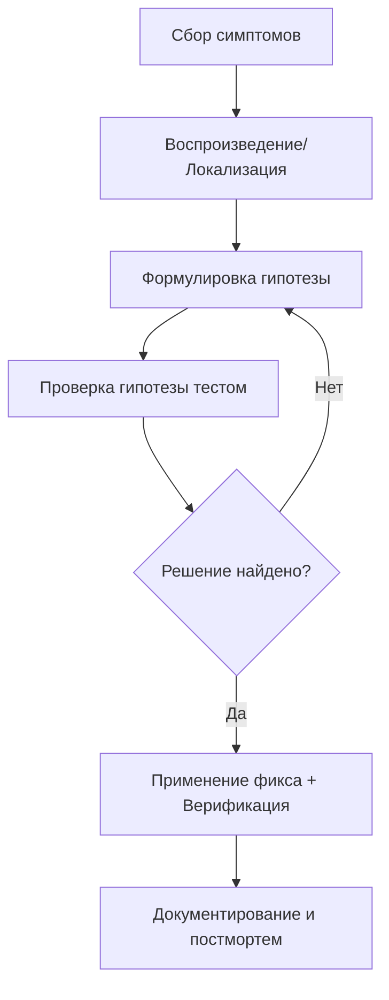
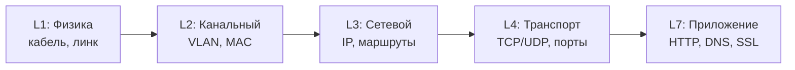
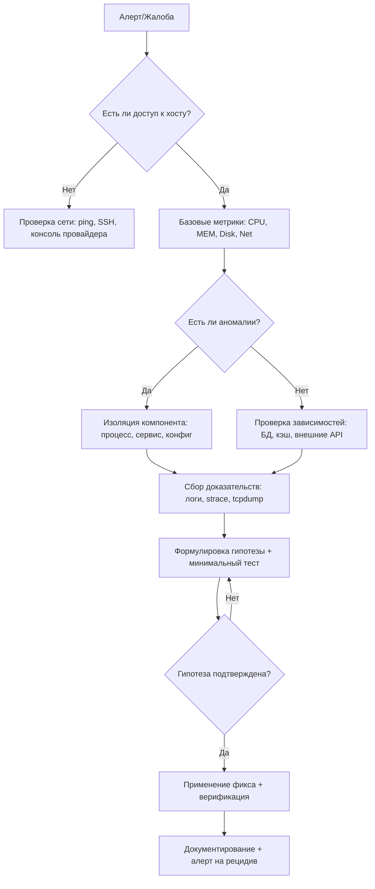

## Введение

Troubleshooting (диагностика и устранение неисправностей) — это не просто набор команд, а **систематический процесс** поиска первопричины (root cause) проблемы в ИТ-инфраструктуре. Для DevOps-инженера владение методологией критично: в production-среде время на восстановление сервиса (MTTR) напрямую влияет на бизнес-показатели.

> [!INFO] Связь с предыдущей темой Эффективный troubleshooting невозможен без понимания [[Synced/DevOps/Сетевое и системное администрирование/0. Введение и методология/1. Принцип работы ОС.md | принципов работы ОС]], так как именно ядро и системные вызовы часто являются источником неочевидных проблем.

## 1. Фундаментальные принципы диагностики

### Правило «Не навреди»

Первое действие при инциденте — **не усугубить**. Избегайте:

- Перезагрузки продакшн-системы без сбора дампов/логов.
- Массового изменения конфигураций «наугад».
- Удаления файлов «для освобождения места» без анализа.

### Цикл научного подхода к troubleshooting



### Ключевые вопросы перед началом (5W1H)

| Вопрос                       | Цель                                                                |
| ---------------------------- | ------------------------------------------------------------------- |
| **What** (Что сломалось?)    | Точное описание симптома: ошибка 502, таймаут, высокая загрузка CPU |
| **When** (Когда началось?)   | Корреляция с деплоем, изменением конфигурации, пиком нагрузки       |
| **Where** (Где проявляется?) | Один хост, кластер, регион, конкретный микросервис                  |
| **Who** (Кого затрагивает?)  | Все пользователи, только API, внутренний сервис                     |
| **Why** (Почему это важно?)  | Приоритизация: SLO нарушен, финансовые потери, безопасность         |
| **How** (Как воспроизвести?) | Шаги для стабильного воспроизведения в тестовой среде               |

> [!TIP] Золотое правило **«Сначала собери данные, потом делай изменения»**. Скриншоты, логи, метрики до фикса — основа для постмортема и предотвращения рецидивов.

## 2. Стратегии поиска неисправностей

### Подход по модели OSI (для сетевых проблем)

Движение снизу-вверх или сверху-вниз в зависимости от симптомов:



- **Bottom-up**: Если нет связи вообще → начинаем с `ip link`, `ping`.
- **Top-down**: Если приложение возвращает ошибку → начинаем с логов приложения, затем `curl -v`, затем сеть.

### Divide and Conquer (Разделяй и властвуй)

Бинарный поиск проблемного компонента в цепочке:


1. Проверка с конца: работает ли DB? (`telnet db-host 5432`)
2. Если DB ок → проверяем App (`curl localhost:8080/health`)
3. Если App ок → проверяем Proxy, затем LB.

### Change-based troubleshooting

>[!QUOTE] «90% инцидентов происходят после изменений»

1. `git log` / CI-CD history: что деплоили?
2. `rpm -qa --last` / `apt history`: какие пакеты обновлялись?
3. `grep "CRON" /var/log/syslog`: не сработал ли фоновый джоб?
4. `kubectl get events --sort-by=.lastTimestamp`: изменения в кластере?

## 3. Практический фреймворк: USE и RED

### USE-метод (для ресурсов)

Для каждого ресурса проверяем три метрики [[Synced/DevOps/Мониторинг, логирование и трассировка (Observability)/0. Концепции и теория Observability/2. Метрики мониторинга.md | ключевые метрики мониторинга]]:

|Ресурс|Utilization (Загрузка)|Saturation (Очереди)|Errors (Ошибки)|
|---|---|---|---|
|CPU|`top`, `mpstat`|`vmstat` (r, b колонки)|`dmesg` (I/O errors)|
|Memory|`free -h`, `htop`|`vmstat` (si/so swap)|OOM killer в `journalctl`|
|Disk I/O|`iostat -x`|`iostat` (await, svctm)|`smartctl -a`, `dmesg`|
|Network|`sar -n DEV`|`netstat -s` (retrans)|`ip -s link` (drop/err)|

### RED-метод (для сервисов)

|Метрика|Описание|Инструменты|
|---|---|---|
|**Rate** (Запросов в секунду)|Нагрузка на сервис|Prometheus `rate(http_requests_total[5m])`, access-логи|
|**Errors** (Доля ошибок)|% ответов 5xx, таймауты|Grafana дашборд, `grep " 5[0-9][0-9] " access.log`|
|**Duration** (Время ответа)|Латентность, перцентили|`curl -w`, APM-инструменты, Jaeger [[Synced/DevOps/Мониторинг, логирование и трассировка (Observability)/4. Трассировка и APM/1. OpenTelemetry (OTel).md|

## 4. Инструментарий DevOps-инженера

### Быстрый чеклист диагностики хоста

```bash
# 1. Общая картина
uptime; dmesg -T | tail -20; systemctl --failed

# 2. Ресурсы (USE)
htop; free -h; df -h; iostat -x 1 3

# 3. Сеть (RED + OSI L3-L4)
ss -tulpn; ping -c3 gateway; traceroute -n external.host; tcpdump -ni any port 443 -c 20

# 4. Логи (ищем ошибки за последние 15 минут)
journalctl -p err..alert -S "15 min ago" --no-pager
tail -100 /var/log/app/error.log | grep -i exception

# 5. Процессы (кто ест ресурсы)
ps aux --sort=-%mem | head -10; lsof -p <PID> | grep -E 'REG|IPv'
```

### Глубокая диагностика

| Симптом         | Инструмент                                      | Что ищем                                      | Ссылка на тему                                                                                                                                                                  |
| --------------- | ----------------------------------------------- | --------------------------------------------- | ------------------------------------------------------------------------------------------------------------------------------------------------------------------------------- |
| Высокий CPU     | `perf top`, `strace -cp <PID>`                  | Горячие функции, блокирующие syscalls         | [[Synced/DevOps/Сетевое и системное администрирование/1. Операционные системы/1. Linux/11. Процессы и ресурсы/7. Отладка.md\|Отладка]]                                          |
| Медленный диск  | `iotop`, `blktrace`, `fatrace`                  | Процессы с высоким I/O wait, паттерны доступа | [[Synced/DevOps/Сетевое и системное администрирование/1. Операционные системы/1. Linux/9. Файловые системы и диски/6. Проверка и восстановление.md\|Проверка и восстановление]] |
| Утечка памяти   | `valgrind`, `cat /proc/<PID>/smaps`             | Рост RSS, fragmentation, memory leaks         | [[Synced/DevOps/Сетевое и системное администрирование/1. Операционные системы/1. Linux/11. Процессы и ресурсы/5. OOM Killer.md\|OOM Killer]]                                    |
| Сетевые потери  | `tcpdump`, `ss -tin`, `mtr`                     | Retransmissions, window size, packet loss     | [[Synced/DevOps/Сетевое и системное администрирование/2. Сети/6. Диагностика и анализ трафика.md\|Диагностика и анализ трафика]]                                                |
| Блокировки в БД | `pg_stat_activity`, `SHOW ENGINE INNODB STATUS` | Long queries, lock waits, deadlocks           | [[Synced/DevOps/Базы данных и хранилища/1. Реляционные СУБД (OLTP)/1. PostgreSQL/7. Мониторинг.md\|Мониторинг]]                                                                 |

> [!WARNING] Опасные команды Избегайте `kill -9` без анализа, `rm -rf /tmp/*` на продакшне, `echo 1 > /proc/sys/vm/drop_caches` без понимания последствий. Всегда тестируйте деструктивные действия в staging.


## 5. Документирование и постмортем

### Шаблон быстрой заметки при инциденте

```markdown
## Инцидент #YYYY-MM-DD-XXX
- **Время начала**: 
- **Симптомы**: 
- **Затронутые сервисы**: 
- **Действия до эскалации**: 
- **Скриншоты/логи**: (ссылки на Grafana, Kibana, paste.bin)
- **Гипотезы**: 
- **Применённый фикс**: 
- **Время восстановления**: 
```

### Postmortem (Blameless)

> [!INFO] Культура без обвинений Цель постмортема — не найти виноватого, а улучшить систему. Фокус на process gaps, а не human error.

Структура отчета:

1. **Executive Summary**: Что случилось, влияние на бизнес.
2. **Timeline**: Детальная хронология с метками времени.
3. **Root Cause**: Техническая первопричина (не симптом!).
4. **Contributing Factors**: Почему сработало/не сработало: мониторинг, алерты, runbooks.
5. **Action Items**: Конкретные задачи с владельцами и дедлайнами (Fix, Detect, Prevent).

> [!LINK] Связь с практиками Интеграция с [[Synced/DevOps/CI-CD, артефакты, тестирование и DevSecOps/5. DevSecOps и безопасность цепочки поставок/11. Реагирование на инциденты/1. Жизненный цикл инцидента.md | жизненным циклом инцидента]] и [[Synced/DevOps/Мониторинг, логирование и трассировка (Observability)/2. Управление инцидентами и алертинг/5. Best practices алертинга.md | best practices алертинга]].

## 6. Чеклист быстрого реагирования (Runbook)



---
## Контрольные вопросы для самопроверки

1. В чем разница между симптомом и первопричиной (root cause)? Приведите пример.
2. Почему подход «изменить всё подряд, пока не заработает» опасен в production?
3. Как USE-метод помогает сузить круг поиска при высокой загрузке сервера?
4. Какие три вопроса вы зададите разработчику перед началом расследования «упавшего» микросервиса?
5. Зачем нужен blameless postmortem и какие разделы обязательно должны в него входить?
6. Как отличить проблему на уровне приложения (L7) от проблемы на уровне сети (L3-L4) при таймаутах HTTP-запросов? 

---

#devops #sysadmin #troubleshooting #methodology #incident-response #root-cause-analysis #use-method #red-method #observability #runbook #postmortem #debugging #linux #monitoring