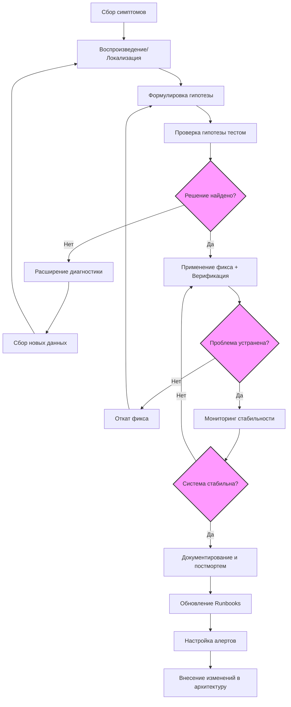
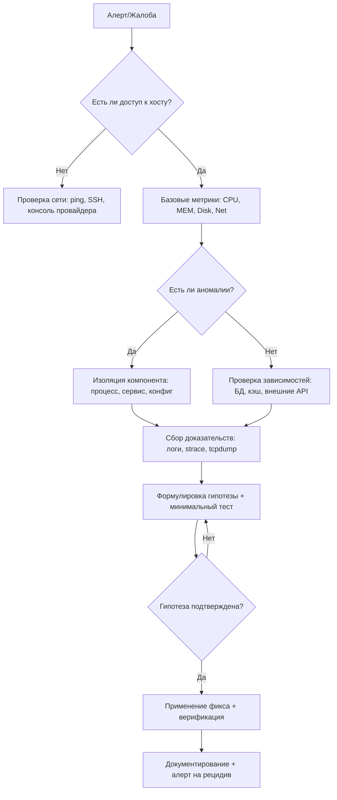

## Введение

Troubleshooting (диагностика и устранение неисправностей) — это не просто набор команд, а **систематический процесс** поиска первопричины (root cause) проблемы в ИТ-инфраструктуре. Для DevOps-инженера владение методологией критично: в production-среде время на восстановление сервиса (MTTR) напрямую влияет на бизнес-показатели.

> [!INFO] Связь с предыдущей темой Эффективный troubleshooting невозможен без понимания [[Synced/DevOps/Сетевое и системное администрирование/0. Введение и методология/1. Принцип работы ОС.md | принципов работы ОС]], так как именно ядро и системные вызовы часто являются источником неочевидных проблем.

## 1. Фундаментальные принципы диагностики

### Правило «Не навреди»

Первое действие при инциденте — **не усугубить**. Избегайте:

- Перезагрузки продакшн-системы без сбора дампов/логов.
- Массового изменения конфигураций «наугад».
- Удаления файлов «для освобождения места» без анализа.

### Цикл научного подхода к troubleshooting



### Ключевые вопросы перед началом (5W1H)

| Вопрос                       | Цель                                                                |
| ---------------------------- | ------------------------------------------------------------------- |
| **What** (Что сломалось?)    | Точное описание симптома: ошибка 502, таймаут, высокая загрузка CPU |
| **When** (Когда началось?)   | Корреляция с деплоем, изменением конфигурации, пиком нагрузки       |
| **Where** (Где проявляется?) | Один хост, кластер, регион, конкретный микросервис                  |
| **Who** (Кого затрагивает?)  | Все пользователи, только API, внутренний сервис                     |
| **Why** (Почему это важно?)  | Приоритизация: SLO нарушен, финансовые потери, безопасность         |
| **How** (Как воспроизвести?) | Шаги для стабильного воспроизведения в тестовой среде               |

> [!TIP] Золотое правило **«Сначала собери данные, потом делай изменения»**. Скриншоты, логи, метрики до фикса — основа для постмортема и предотвращения рецидивов.

## 2. Стратегии поиска неисправностей

### Подход по модели OSI (для сетевых проблем)

Выбор направления зависит от **характера симптомов**:

| Если симптомы...                                         | Стратегия              | Первая команда                                              |
| -------------------------------------------------------- | ---------------------- | ----------------------------------------------------------- |
| **Нет связи вообще** (ping не идет, интерфейс down)      | **Bottom-up** (с L1)   | `ip link`, `ethtool eth0`, `dmesg \| grep -i nic`           |
| **Приложение отвечает ошибкой** (HTTP 500, 503, таймаут) | **Top-down** (с L7)    | `journalctl -u nginx -f`, `curl -v http://localhost/health` |
| **Связь есть, но медленно**                              | **Middle-out** (L4-L7) | `ss -t -i` (смотрим TCP-ретрансмиты), `traceroute`, `mtr`   |

**Ключевой нюанс:** Если вы поднялись до L7 и видите ошибку SSL — не спускайтесь вниз до L1, проверьте сначала сертификаты (`openssl s_client -connect host:443`). Двигайтесь **логически**, а не механически.

### Divide and Conquer (Разделяй и властвуй)

Этот метод работает, когда у вас есть **явная цепочка компонентов**. Алгоритм:

1. **Разделите путь на две половины.** Например, для цепочки `Клиент → LB → App → DB` первая точка — **App**.
2. **Проверьте App локально** (с хоста): `curl 127.0.0.1:8080/health`.
    - Если отвечает — проблема слева (LB или сеть до App).
    - Если не отвечает — проблема справа (App или DB).
3. **Сужайте диапазон:** Если проблема слева — проверьте LB, затем сеть между LB и App. Если справа — сначала проверьте DB (`psql -h db -c "SELECT 1"`), затем конфигурацию App.
    

**Практический нюанс:** Для каждого компонента определите **health-check endpoint** или команду для проверки "жив ли компонент". Без этого Divide and Conquer превращается в гадание.

Бинарный поиск проблемного компонента в цепочке:


1. Проверка с конца: работает ли DB? (`telnet db-host 5432`)
2. Если DB ок → проверяем App (`curl localhost:8080/health`)
3. Если App ок → проверяем Proxy, затем LB.

### Change-based troubleshooting

>[!QUOTE] «90% инцидентов происходят после изменений»

Кто последний вносил изменения? Это самый эффективный метод, если система работала и вдруг перестала.

Что проверять в порядке приоритета:

1. **Деплой кода** (самая частая причина):
2. **Обновление пакетов ОС** (может обновить библиотеку или ядро):
3. **Фоновые задачи (cron)**:
4. **Изменения в Kubernetes** (если контейнеры):
5. **Изменения конфигурации сетевых устройств** (firewall, балансировщик) — проверяйте через управляющую консоль.

>[!WARNING] Если ни одно изменение не найдено — переходите к **нагрузочным факторам** (пик трафика, утечка памяти, исчерпание дескрипторов). Иногда проблема — не изменение, а достижение предела.


## 3. Практический фреймворк: USE и RED

### USE-метод: Диагностика "железных" проблем

Алгоритм: **Utilization → Saturation → Errors**. Сначала смотрим, не перегружен ли ресурс, затем не стоит ли очередь, затем ищем ошибки.

| Ресурс       | Utilization (Загрузка)                                                              | Saturation (Насыщение/Очереди)                                                                                              | Errors (Ошибки)                                                                                          | Критические пороги                                                                          |                                                                                                                   |                                                                                                                                                    |
| ------------ | ----------------------------------------------------------------------------------- | --------------------------------------------------------------------------------------------------------------------------- | -------------------------------------------------------------------------------------------------------- | ------------------------------------------------------------------------------------------- | ----------------------------------------------------------------------------------------------------------------- | -------------------------------------------------------------------------------------------------------------------------------------------------- |
| **CPU**      | `mpstat -P ALL 1` (столбец `%idle`)  <br>`top` (столбец `%wa` — процессор ждет I/O) | `vmstat 1` (колонка `r` — процессы в очереди на CPU, колонка `b` — в блокированном состоянии)                               | `dmesg -T \| grep -i "cpu\|hardware"`  <br>`grep "segfault" /var/log/syslog`                             | **%idle < 10%**  <br>Если `%wa` > 10% — это часто диск или сеть, а не CPU.                  | **r > количество ядер × 2** — процессы голодают.                                                                  | Temperature alerts (если есть датчики), MCE errors (Machine Check Exception) — сигнал о проблемах с железом                                        |
| **Memory**   | `free -h`  <br>`cat /proc/meminfo \| grep MemAvailable`                             | `vmstat 1` (колонки `si`/`so` — swap in/out)  <br>`sar -r` (отчет по памяти)                                                | `journalctl -k \| grep -i "out of memory\|oom"`  <br>`dmesg \| grep "Memory cgroup out of memory"`       | **Использование > 90%** (если без Swap).  <br>**MemAvailable < 10%** — риск OOM.            | **si/so > 0** (особенно если активны постоянно) — память переполнена и система тормозит на диск.                  | OOM Killer убивает процесс — проверять `dmesg` и `oom_score_adj`.                                                                                  |
| **Disk I/O** | `iostat -x 1` (колонка `%util` — время занятости диска)                             | `iostat -x 1` (колонка `avgqu-sz` — длина очереди запросов)  <br>`await` — среднее время выполнения запроса                 | `dmesg \| grep -i "I/O error\|read error\|write error"`  <br>`smartctl -a /dev/sda` (SMART атрибуты)     | **%util > 80%** — диск близок к пределу, но допустимо для HDD.  <br>Для SSD критично > 90%. | **avgqu-sz > 10** — высокая конкуренция.  <br>**await > 20 мс** для HDD (не критично), > 5 мс для SSD — проблема. | SMART атрибуты: `Reallocated_Sector_Ct` (переназначенные сектора), `Pending_Sector` (проблемные сектора) — предвестники смерти диска.              |
| **Network**  | `sar -n DEV 1` (колонка `rxKB/s` и `txKB/s` — скорость передачи)                    | `netstat -s` (колонка `segments retransmitted` — ретрансмиты)  <br>`ss -i` (показывает `rtt`, `retrans` для каждого сокета) | `ip -s link show eth0` (колонки `RX errors` и `TX errors`)  <br>`dmesg \| grep -i "link\|nic\|ethernet"` | **Скорость > 80% от пропускной способности интерфейса** (например, 800 Мбит/с на 1GbE).     | **Ретрансмиты > 0.1% от отправленных пакетов** (часто проблема с конкуренцией или полной очередью).               | `dropped` (пакеты отброшены из-за переполнения буфера), `overruns` (ошибки кольцевого буфера драйвера) — признак перегруженного сетевого адаптера. |

### RED-метод: Диагностика сервисов (бизнес-логика)

Этот метод ориентирован на **пользовательский опыт**. Приложения могут иметь 100% CPU (плохо для USE), но при этом отвечать на запросы быстро и без ошибок — тогда RED "зеленый", и проблема не в ресурсах.

|Метрика|Как мерить|Инструменты|Критические пороги|Действие при нарушении|
|---|---|---|---|---|
|**Rate** (Запросы/с)|Количество HTTP-запросов, gRPC-вызовов, очередей сообщений в секунду. Нужен **абсолютный** и **относительный** рост (внезапный всплеск или падение).|**Prometheus:** `rate(http_requests_total[5m])`  <br>**APM:** NewRelic, Datadog.  <br>**Логи:** `grep -c "GET" access.log`|**Резкое падение Rate** → сервис упал или сеть не доступна.  <br>**Резкий рост Rate** → DDoS или внезапный интерес (если > 200% от среднего).|Падение: проверка `kubectl get pods`.  <br>Рост: проверить лимиты ресурсов, масштабирование, или включить rate-limiting.|
|**Errors** (% ошибок)|Процент ответов с кодом 5xx, таймаутов, исключений в коде.|**Prometheus:** `rate(http_requests_total{status=~"5.."}[5m]) / rate(http_requests_total[5m])`  <br>**Grafana:** дашборд с панелью Errors.  <br>**Логи:** `grep " 500 " access.log \| wc -l`|> 1% для критичных сервисов.  <br>> 5% — инцидент уровня P2/P1.|Смотреть логи ошибок, трейсы в Jaeger. Часто проблема в зависимости (БД, внешнее API).|
|**Duration** (Латентность)|P50, P95, P99 времени ответа. **P95** обычно критичен для пользователей (5% самых медленных запросов).|**Prometheus:** `histogram_quantile(0.95, rate(http_request_duration_seconds_bucket[5m]))`  <br>`curl -w "time_total: %{time_total}\n"`  <br>**APM:** трейсы, спаны.|P95 > 300 мс для веб-API (рекомендация).  <br>P95 > 1 секунды — почти всегда проблема.|Смотреть трейсы: где узкое место? Если БД — проверить медленные запросы (pg_stat_statements). Если код — профилировать.|

### Как применять совместно (USE + RED)

1. **Начните с RED:** Если пользователи жалуются на медлительность или ошибки — ошибка не обязательно на стороне ресурсов.
2. **При аномалиях RED переходите к USE:** Если ошибок много или латентность высокая, посмотрите на CPU и Memory (USE). Если ресурсы перегружены → масштабирование или оптимизация кода.
3. **Если USE показывает проблемы, но RED зеленый** — это предупредительный сигнал (инфраструктура "на пределе", но приложение еще держится). У вас есть время на проактивное действие.

**Пример:** У вас `%util` диска = 95%, `avgqu-sz` = 20. `Errors` в RED = 0.2%, но `Duration` P99 = 1.2 секунды (выше нормы в 4 раза). Диагноз: диск тормозит приложение. Действие: замена HDD на SSD или кэширование.

## 4. Инструментарий DevOps-инженера

### Быстрый чеклист диагностики хоста

```bash
# 1. Общая картина
uptime; dmesg -T | tail -20; systemctl --failed

# 2. Ресурсы (USE)
htop; free -h; df -h; iostat -x 1 3

# 3. Сеть (RED + OSI L3-L4)
ss -tulpn; ping -c3 gateway; traceroute -n external.host; tcpdump -ni any port 443 -c 20

# 4. Логи (ищем ошибки за последние 15 минут)
journalctl -p err..alert -S "15 min ago" --no-pager
tail -100 /var/log/app/error.log | grep -i exception

# 5. Процессы (кто ест ресурсы)
ps aux --sort=-%mem | head -10; lsof -p <PID> | grep -E 'REG|IPv'
```

### Глубокая диагностика

| Симптом         | Инструмент                                      | Что ищем                                      | Ссылка на тему                                                                                                                                                                  |
| --------------- | ----------------------------------------------- | --------------------------------------------- | ------------------------------------------------------------------------------------------------------------------------------------------------------------------------------- |
| Высокий CPU     | `perf top`, `strace -cp <PID>`                  | Горячие функции, блокирующие syscalls         | [[Synced/DevOps/Сетевое и системное администрирование/1. Операционные системы/1. Linux/11. Процессы и ресурсы/7. Отладка.md\|Отладка]]                                          |
| Медленный диск  | `iotop`, `blktrace`, `fatrace`                  | Процессы с высоким I/O wait, паттерны доступа | [[Synced/DevOps/Сетевое и системное администрирование/1. Операционные системы/1. Linux/9. Файловые системы и диски/6. Проверка и восстановление.md\|Проверка и восстановление]] |
| Утечка памяти   | `valgrind`, `cat /proc/<PID>/smaps`             | Рост RSS, fragmentation, memory leaks         | [[Synced/DevOps/Сетевое и системное администрирование/1. Операционные системы/1. Linux/11. Процессы и ресурсы/5. OOM Killer.md\|OOM Killer]]                                    |
| Сетевые потери  | `tcpdump`, `ss -tin`, `mtr`                     | Retransmissions, window size, packet loss     | [[Synced/DevOps/Сетевое и системное администрирование/2. Сети/6. Диагностика и анализ трафика.md\|Диагностика и анализ трафика]]                                                |
| Блокировки в БД | `pg_stat_activity`, `SHOW ENGINE INNODB STATUS` | Long queries, lock waits, deadlocks           | [[Synced/DevOps/Базы данных и хранилища/1. Реляционные СУБД (OLTP)/1. PostgreSQL/7. Мониторинг.md\|Мониторинг]]                                                                 |

> [!WARNING] Опасные команды Избегайте `kill -9` без анализа, `rm -rf /tmp/*` на продакшне, `echo 1 > /proc/sys/vm/drop_caches` без понимания последствий. Всегда тестируйте деструктивные действия в staging.


## 5. Документирование и постмортем

### Шаблон быстрой заметки при инциденте

```markdown
## Инцидент #YYYY-MM-DD-XXX
- **Время начала**: 
- **Симптомы**: 
- **Затронутые сервисы**: 
- **Действия до эскалации**: 
- **Скриншоты/логи**: (ссылки на Grafana, Kibana, paste.bin)
- **Гипотезы**: 
- **Применённый фикс**: 
- **Время восстановления**: 
```

### Postmortem (Blameless)

> [!INFO] Культура без обвинений Цель постмортема — не найти виноватого, а улучшить систему. Фокус на process gaps, а не human error.

Структура отчета:

1. **Executive Summary**: Что случилось, влияние на бизнес.
2. **Timeline**: Детальная хронология с метками времени.
3. **Root Cause**: Техническая первопричина (не симптом!).
4. **Contributing Factors**: Почему сработало/не сработало: мониторинг, алерты, runbooks.
5. **Action Items**: Конкретные задачи с владельцами и дедлайнами (Fix, Detect, Prevent).

> [!LINK] Связь с практиками Интеграция с [[Synced/DevOps/CI-CD, артефакты, тестирование и DevSecOps/5. DevSecOps и безопасность цепочки поставок/11. Реагирование на инциденты/1. Жизненный цикл инцидента.md | жизненным циклом инцидента]] и [[Synced/DevOps/Мониторинг, логирование и трассировка (Observability)/2. Управление инцидентами и алертинг/5. Best practices алертинга.md | best practices алертинга]].

## 6. Чеклист быстрого реагирования (Runbook)



---
## Контрольные вопросы для самопроверки

1. В чем разница между симптомом и первопричиной (root cause)? Приведите пример.
2. Почему подход «изменить всё подряд, пока не заработает» опасен в production?
3. Как USE-метод помогает сузить круг поиска при высокой загрузке сервера?
4. Какие три вопроса вы зададите разработчику перед началом расследования «упавшего» микросервиса?
5. Зачем нужен blameless postmortem и какие разделы обязательно должны в него входить?
6. Как отличить проблему на уровне приложения (L7) от проблемы на уровне сети (L3-L4) при таймаутах HTTP-запросов? 

---

#devops #sysadmin #troubleshooting #methodology #incident-response #root-cause-analysis #use-method #red-method #observability #runbook #postmortem #debugging #linux #monitoring