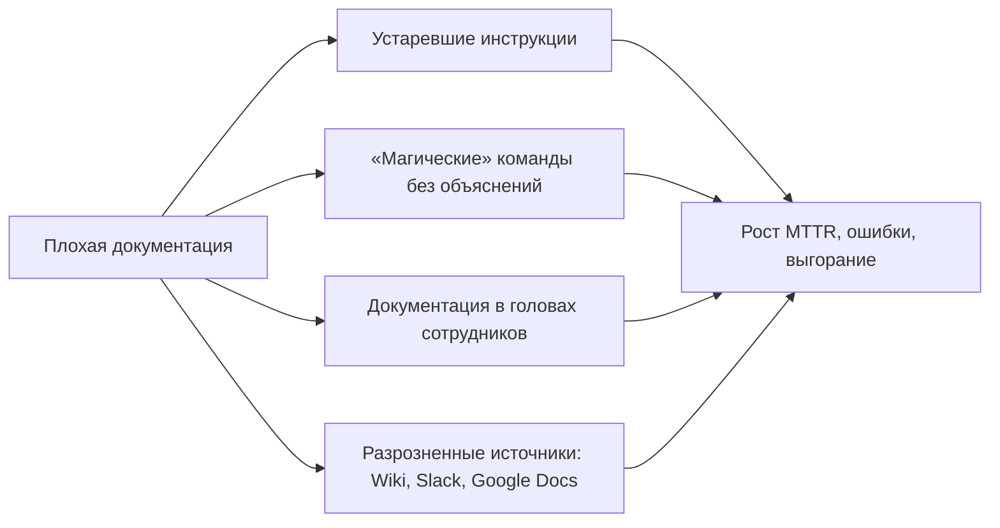
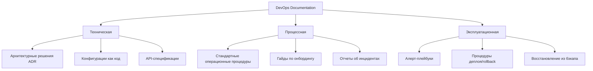
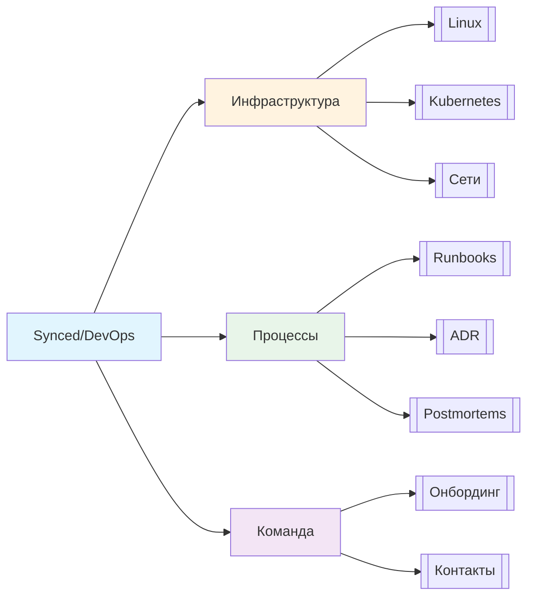

## Введение

Документирование — это **инфраструктура знаний**, которая превращает индивидуальный опыт в коллективный актив команды. В DevOps-практике качественная документация напрямую влияет на скорость онбординга новых сотрудников, время восстановления после инцидентов (MTTR) и предотвращение повторения ошибок.

> [!INFO] Связь с предыдущими темами Эффективное документирование инцидентов основано на [[Synced/DevOps/Сетевое и системное администрирование/0. Введение и методология/2. Методология Troubleshooting.md | методологии troubleshooting]], а техническая точность требует понимания [[Synced/DevOps/Сетевое и системное администрирование/0. Введение и методология/1. Принцип работы ОС.md | принципов работы ОС]].

## 1. Почему документирование критично для DevOps

### Бизнес-ценность документации

|Аспект|Влияние на DevOps-процессы|
|---|---|
|**Onboarding**|Сокращение времени ввода нового инженера в проект с 3 месяцев до 2 недель|
|**Bus Factor**|Снижение рисков при уходе ключевых специалистов|
|**Incident Response**|Runbooks ускоряют восстановление сервиса на 40-60%|
|**Compliance**|Аудит, сертификация, требования регуляторов (152-ФЗ, PCI-DSS)|
|**Knowledge Sharing**|Предотвращение дублирования решений и «изобретения велосипедов»|

### Антипаттерны документирования



> [!WARNING] Красные флаги
> - «Работает на моей машине» без описания окружения
> - Скрипты без комментариев и примеров использования
> - Пароли/секреты в текстовых файлах (даже в «приватных» заметках)

## 2. Типы документации в DevOps-цикле

Эта документация описывает **систему** и ее компоненты. Целевая аудитория — разработчики, архитекторы, инженеры по эксплуатации, которые будут модифицировать или поддерживать систему.
### Классификация по аудитории и цели



### Пример структуры заметки в Obsidian для технической темы

```markdown
---
title: "Настройка Nginx как reverse proxy"
tags: [nginx, proxy, web-server, config]
related: 
  - [[Synced/DevOps/Балансировка, проксирование и веб-сервера/1. Классические веб-серверы и обратные прокси/1. Nginx/2. Конфигурация.md | Конфигурация Nginx]]
  - [[Synced/DevOps/Балансировка, проксирование и веб-сервера/0. Теория и фундаментальные концепции/1. Прямой vs Обратный прокси.md | Теория проксирования]]
created: 2026-06-23
updated: 2026-06-23
---

## Цель
Краткое описание задачи...

## Предварительные требования
- [[Synced/DevOps/Сетевое и системное администрирование/1. Операционные системы/1. Linux/7. Управление пакетами/1. Debian, Ubuntu/1. apt.md | Установка пакетов в Debian]]
- Доступ к серверу по SSH

## Пошаговая инструкция
...

## Верификация
...

## Troubleshooting
...
```

>[!TIP] Obsidian-специфика Используйте **frontmatter** (блок YAML в начале файла) для метаданных: теги, связанные заметки, даты. Это упрощает поиск через граф и плагины вроде Dataview.

## 3. Документирование инфраструктуры как кода (IaC Docs)

### Принципы «документация в коде»

1. **README.md в каждом репозитории**: назначение, переменные, примеры использования.
2. **Комментарии в Terraform/Ansible**: объяснение «почему», а не «что» (код показывает что).
3. **Autogenerated docs**: инструменты вроде `terraform-docs`, `ansible-doc`.

```markdown
# modules/vpc/README.md
## VPC Module
Создает изолированную сеть с public/private подсетями.

### Inputs
| Name | Description | Type | Default |
|------|-------------|------|---------|
| `cidr_block` | CIDR для VPC | `string` | `"10.0.0.0/16"` |
| `enable_dns` | Включить DNS hostnames | `bool` | `true` |

### Outputs
| Name | Description |
|------|-------------|
| `vpc_id` | ID созданной VPC |
| `private_subnets` | Список ID private подсетей |

### Пример использования
`hcl
module "prod_vpc" {
  source = "./modules/vpc"
  cidr_block = "10.1.0.0/16"
  enable_dns = true
}
`
```
> [!LINK] Связь с IaC Детальные практики документирования Terraform — в [[Synced/DevOps/IaC/2. HashiCorp Terraform (Продвинутые практики)/6. Best practices.md | Best practices Terraform]], Ansible — в [[Synced/DevOps/IaC/6. Ansible (Продвинутые практики)/1. Роли и Коллекции.md | Роли и Коллекции Ansible]].

## 4. Runbooks и Playbooks для инцидентов

### Шаблон эффективного runbook

```markdown
## Алерт: High CPU Usage (>90% 5min)

### 🎯 Цель
Определить причину высокой загрузки CPU и восстановить нормальную работу.

### 🔍 Диагностика
```bash
# 1. Быстрая оценка
top -bn1 | head -20
# 2. Детализация по процессам
pidstat -p ALL 1 5
# 3. Проверка I/O wait
iostat -x 1 3
```

### Возможные причины и решения

| Причина             | Признаки                     | Действие                                                                                                                    |
| ------------------- | ---------------------------- | --------------------------------------------------------------------------------------------------------------------------- |
| Утечка в приложении | Рост RSS одного процесса     | [[Synced/DevOps/Сетевое и системное администрирование/1. Операционные системы/1. Linux/11. Процессы и ресурсы/7. Отладка.md |
| Бэкап/крон          | Высокий iowait, cron-логи    | Сдвинуть расписание, оптимизировать задачу                                                                                  |
| DDoS/сканирование   | Много соединений в `ss -ant` | Включить rate-limiting, заблокировать IP                                                                                    |
### Эскалация

Если не решено за 15 минут → уведомить команду через @on-call в Slack.

### Пост-действия

- Обновить мониторинг, если причина не детектировалась
- Добавить новый сценарий в этот runbook

```markdown
> [!INFO] Живые документы
> Runbooks должны **эволюционировать**: после каждого инцидента добавляйте новые сценарии и уточнения. Используйте Obsidian-плагины вроде **Templater** для стандартизации.

---

## 5. Архитектурные решения (ADR — Architecture Decision Records)

### Зачем нужны ADR
Фиксация контекста, вариантов и последствий технических решений, чтобы через 6 месяцев не задаваться вопросом «почему мы выбрали именно это?».

### Шаблон ADR в Markdown
```markdown
# ADR-001: Выбор системы оркестрации контейнеров

## Статус
Accepted

## Контекст
Требуется платформа для запуска 50+ микросервисов с автоскейлингом и self-healing.

## Рассмотренные варианты
1. **Kubernetes** — де-факто стандарт, богатая экосистема, но высокий порог входа.
2. **Docker Swarm** — проще в настройке, но ограниченная функциональность.
3. **Nomad** — гибкий, но меньшее сообщество и интеграции.

## Решение
Выбран Kubernetes через kubeadm + GitOps (ArgoCD).

## Последствия
### Положительные
- Стандартизация деплоя через Helm-чарты
- Интеграция с [[Synced/DevOps/GitOps/2. ArgoCD/1. Архитектура и основы/1. Компоненты.md | ArgoCD]] для автоматизации

### Отрицательные
- Требует выделенной команды платформы
- Сложнее отладка для разработчиков

## Ссылки
- [[Synced/DevOps/Контейнеризация и оркестрация/3. Kubernetes (Архитектура и основные компоненты)/1. Control Plane (Мастер-узлы)/1. kube-apiserver.md | kube-apiserver]]
- [[Synced/DevOps/GitOps/0. Теория и принципы GitOps/7. GitOps vs Traditional CI-CD.md | GitOps vs CI/CD]]
```

## 5. Документирование в Obsidian: лучшие практики

### Организация графа знаний




### Правила создания ссылок

| Ситуация                           | Формат ссылки         | Пример                                                                           |
| ---------------------------------- | --------------------- | -------------------------------------------------------------------------------- |
| Ссылка на тему в том же подразделе | Относительный путь    | `[[3. Документирование.md]]`                                                     |
| Ссылка на тему в другом разделе    | Полный путь от Synced | `[[Synced/DevOps/IaC/1. HashiCorp Terraform (Основы)/5. Управление состоянием.md |
| Ссылка на конкретный раздел        | С якорем `#`          | `[[Synced/.../file.md#заголовок                                                  |
| Ссылка на внешний ресурс           | Markdown-синтаксис    | `[Terraform Docs](https://...)`                                                  |

>[!WARNING] Избегайте битых ссылок Obsidian показывает несуществующие ссылки серым цветом. Периодически запускайте проверку через **Graph View** или плагин **Link Checker**.

### Теги и поиск

- Используйте **иерархические теги**: `#devops/linux/kernel`, `#incident/cpu-high`
- Комбинируйте теги с поиском: `tag:#runbook tag:#nginx`
- Создавайте **MOC-заметки** (Map of Content) для навигации по разделам:

```markdown
# MOC: Сетевое администрирование
## Основы
- [[1. Принцип работы ОС.md]]
- [[2. Методология Troubleshooting.md]]
## Сети
- [[Synced/DevOps/Сетевое и системное администрирование/2. Сети/1. Сетевые основы и модели/1. Модель OSI.md | Модель OSI]]
```

## 6. Автоматизация документирования

### Генерация документации из кода

| Инструмент                   | Назначение                     | Пример использования                                                                                                                                                                                         |
| ---------------------------- | ------------------------------ | ------------------------------------------------------------------------------------------------------------------------------------------------------------------------------------------------------------ |
| `terraform-docs`             | Генерация README из TF-файлов  | `terraform-docs markdown table ./module > README.md`                                                                                                                                                         |
| `ansible-doc`                | Документирование ролей/модулей | `ansible-doc -t module copy`                                                                                                                                                                                 |
| `pdoc` / `Sphinx`            | Docs из Python-кода            | Документирование кастомных экспортеров [[Synced/DevOps/Мониторинг, логирование и трассировка (Observability)/1. Сбор и хранение метрик/4. Сборщики метрик/5. Написание кастомных экспортеров (Python, Go).md |
| `mkdocs` + `mkdocs-material` | Статический сайт из Markdown   | Публикация внутренней вики                                                                                                                                                                                   |
### Интеграция с CI/CD

```yml
# .gitlab-ci.yml пример
docs:
  stage: test
  script:
    - terraform-docs markdown ./infra > docs/terraform.md
    - markdownlint docs/**/*.md
  artifacts:
    paths:
      - docs/
```

>[!LINK] Связь с CI/CD Интеграция проверок документации в пайплайны — часть [[Synced/DevOps/CI-CD, артефакты, тестирование и DevSecOps/7. Сборка и публикация артефактов/1. Docker build в CI.md | процессов сборки]].

---
## Контрольные вопросы для самопроверки

1. В чем разница между технической документацией и runbook? Приведите пример каждого.
2. Почему «документация в коде» предпочтительнее отдельных Wiki-страниц для IaC?
3. Как структура тегов в Obsidian помогает в поиске информации во время инцидента?
4. Какие три элемента обязательно должны быть в ADR, чтобы решение было понятным через полгода?
5. Как автоматизировать обновление документации при изменении Terraform-модулей?
6. Почему важно указывать в runbook не только команды, но и признаки каждой возможной причины проблемы?

---

#devops #documentation #obsidian #runbooks #adr #knowledge-management #iac-docs #troubleshooting #onboarding #best-practices #markdown #gitops