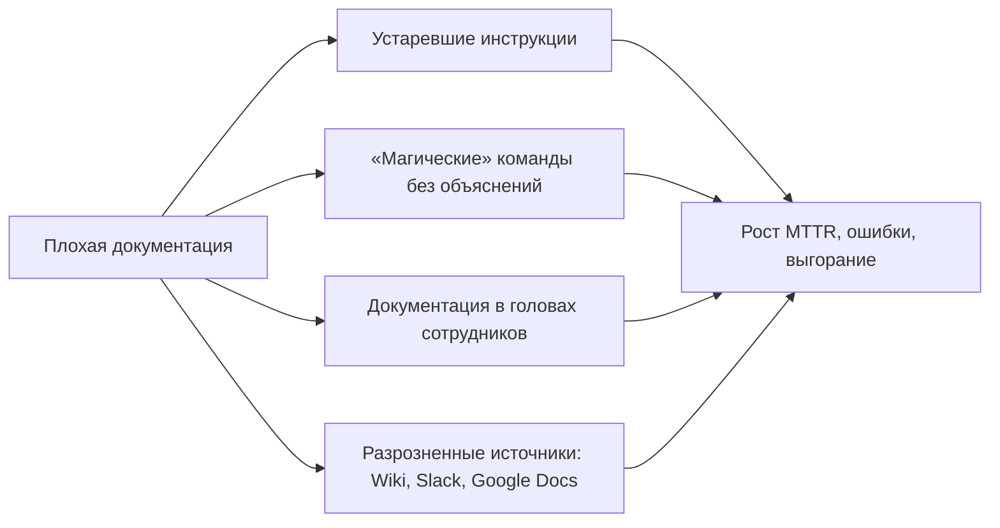
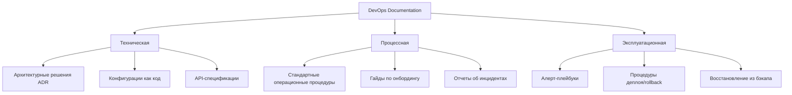

## Введение

Документирование — это **инфраструктура знаний**, которая превращает индивидуальный опыт в коллективный актив команды. В DevOps-практике качественная документация напрямую влияет на скорость онбординга новых сотрудников, время восстановления после инцидентов (MTTR) и предотвращение повторения ошибок.

> [!INFO] Связь с предыдущими темами Эффективное документирование инцидентов основано на [[Synced/DevOps/Сетевое и системное администрирование/0. Введение и методология/2. Методология Troubleshooting.md | методологии troubleshooting]], а техническая точность требует понимания [[Synced/DevOps/Сетевое и системное администрирование/0. Введение и методология/1. Принцип работы ОС.md | принципов работы ОС]].

## 1. Почему документирование критично для DevOps

### Бизнес-ценность документации

|Аспект|Влияние на DevOps-процессы|
|---|---|
|**Onboarding**|Сокращение времени ввода нового инженера в проект с 3 месяцев до 2 недель|
|**Bus Factor**|Снижение рисков при уходе ключевых специалистов|
|**Incident Response**|Runbooks ускоряют восстановление сервиса на 40-60%|
|**Compliance**|Аудит, сертификация, требования регуляторов (152-ФЗ, PCI-DSS)|
|**Knowledge Sharing**|Предотвращение дублирования решений и «изобретения велосипедов»|

### Антипаттерны документирования



> [!WARNING] Красные флаги
> - «Работает на моей машине» без описания окружения
> - Скрипты без комментариев и примеров использования
> - Пароли/секреты в текстовых файлах (даже в «приватных» заметках)

## 2. Типы документации в DevOps-цикле

Эта документация описывает **систему** и ее компоненты. Целевая аудитория — разработчики, архитекторы, инженеры по эксплуатации, которые будут модифицировать или поддерживать систему.

### Классификация по аудитории и цели



|Тип|Формат|Пример содержимого|Критерий актуальности|Инструменты хранения|
|---|---|---|---|---|
|**Архитектурные решения (ADR)**|Markdown (шаблон: Context → Decision → Consequences)|_"Решение: использовать PostgreSQL для хранения заказов вместо MongoDB, т.к. нужны транзакции ACID"_|Обновляется при каждом архитектурном изменении. Хранится в репозитории с кодом.|Git (рядом с кодом), Confluence.|
|**Конфигурация как код (IaC)**|Terraform, Ansible, Helm-чарты, Dockerfile.|_`main.tf` с описанием VPC, subnets, security groups._|Версионируется в Git. Актуален, если применяется в кластере (drift detection).|Git-репозиторий (+ CI/CD пайплайн для применения).|
|**API-спецификации**|OpenAPI (Swagger), gRPC (proto-файлы), AsyncAPI.|_OpenAPI-документ с эндпоинтами `/users`, `/orders`, схемами запросов/ответов._|Актуален, если соответствует фактическому поведению API (авто-генерация из кода).|Git, SwaggerHub, внутренний портал разработчика (Backstage).|
|**Схемы инфраструктуры**|Диаграммы (C4 Model, ArchiMate).|_Диаграмма контейнеров: "Frontend → API Gateway → Auth Service → User DB"._|Обновляется при изменении архитектуры.|[Draw.io](https://draw.io/), Miro (хранить рядом с ADR в Git).|

> [!WARNING] Техническая документация **живет в репозитории**, а не в Google Docs. Это гарантирует, что она обновляется вместе с кодом и проходит code review.

## Процессная документация — «Как мы работаем»

Эта документация описывает **процессы**, а не систему. Аудитория — все члены команды, включая новых сотрудников, менеджеров, смежные команды.

| Тип                                          | Формат                                      | Пример содержимого                                                                                                | Критерий актуальности                                                                     | Инструменты хранения                                      |
| -------------------------------------------- | ------------------------------------------- | ----------------------------------------------------------------------------------------------------------------- | ----------------------------------------------------------------------------------------- | --------------------------------------------------------- |
| **Стандартные операционные процедуры (SOP)** | Пошаговые инструкции (Markdown, видео).     | _"Как запросить доступ к БД через внутренний портал Self-Service"_                                                | Пересматривается при изменении инфраструктуры или политик безопасности.                   | Confluence, внутренний Wiki.                              |
| **Гайды по онбордингу**                      | Чек-листы + ссылки на ресурсы.              | _"День 1: доступы к VPN, GitHub, Jira. День 2: настройка локального окружения. День 3: первый деплой в staging."_ | Обновляется при изменении инструментов (например, переход с Jenkins на GitLab CI).        | Confluence, Notion, специальный репозиторий `onboarding`. |
| **Отчеты об инцидентах (Postmortem)**        | Шаблон: Timeline, Root Cause, Action Items. | _"Инцидент #42: падение payment-service из-за утечки памяти в Java-приложении."_                                  | Публикуется сразу после инцидента (в течение 48 часов).                                   | Git (репозиторий `postmortems`), Confluence.              |
| **Политики и комплаенс**                     | Документы с обязательными требованиями.     | _"Политика управления секретами: все пароли хранить в Vault, ротация каждые 90 дней."_                            | Пересматривается ежеквартально или при изменении регуляторных требований (GDPR, PCI DSS). | Confluence, внутренний портал.                            |

## Эксплуатационная документация (Runbooks) — «Что делать, если...»

Это документация **для инцидентов и рутинных операций**. Она должна быть максимально конкретной и доступной в условиях стресса (читается по диагонали, с подсветкой команд).

|Тип|Формат|Пример содержимого|Критерий актуальности|Инструменты хранения|
|---|---|---|---|---|
|**Алерт-плейбуки**|Markdown с четким разделом: Symptom → Diagnosis → Resolution.|_"Алерт: HighErrorRate на payment-service. Шаг 1: проверь реплику БД. Шаг 2: если лаг > 60 сек, выполни kill query."_|Обновляется при изменении сервиса или добавлении новых метрик.|Git (репозиторий `runbooks`), интегрированный с Alertmanager (ссылка в алерте).|
|**Процедуры деплоя и rollback**|Пошаговые инструкции (или CI/CD-автоматизация).|_"Деплой: `kubectl apply -f manifests/`. Rollback: `kubectl rollout undo deployment/payment`."_|Обновляется при изменении процесса релизов.|Git (в том же репозитории, что и IaC).|
|**Восстановление из бэкапа**|Четкая последовательность команд и порядка.|_"1. Остановить сервис. 2. Восстановить дамп: `pg_restore -d payment_db /backups/latest.dump`. 3. Проверить целостность данных."_|Проверяется в рамках регулярных учений (disaster recovery drills).|Git, Confluence (с доступом даже при падении основной инфраструктуры).|
|**Матрица эскалации**|Таблица: проблема → ответственный → контакт (телефон, PagerDuty).|_"Сбой БД → тимлид DBA → @db_lead (если не отвечает 5 мин → SRE on-call)."_|Обновляется при ротации персонала.|PagerDuty (встроенные escalation policies), отдельный документ в Confluence.|

## Дополнительная категория: «Документация для AI и автоматизации»

В современных пайплайнах появляется еще один тип — документация, которую **читают не люди**, а инструменты.

| Тип                                               | Формат                                       | Пример                                                                                                    | Назначение                                                 |
| ------------------------------------------------- | -------------------------------------------- | --------------------------------------------------------------------------------------------------------- | ---------------------------------------------------------- |
| **Промпты для AI-ассистентов**                    | Markdown с инструкциями для ChatGPT/Copilot. | _"При запросе 'как настроить мониторинг' — дай ответ с примером Prometheus-алерта и ссылкой на runbook."_ | Ускорение ответа на повторяющиеся вопросы.                 |
| **Спецификации для автоматического тестирования** | Gherkin (BDD), Postman Collections.          | _"Feature: Payment. Scenario: успешная оплата через Stripe."_                                             | Автоматическая проверка документации на соответствие коду. |
| **OpenAPI для генерации клиентов**                | OpenAPI 3.0 JSON/YAML.                       | _Автоматически генерирует SDK для frontend и backend._                                                    | Синхронизация контрактов между командами.                  |

## Практические принципы поддержки документации

1. **Принцип "Документация как часть определения готовности" (DoD):** Ни один тикет не считается закрытым, если не обновлена документация (техническая, процессная или runbook).
    
2. **Принцип "Живая документация":** Если документацию нужно обновлять вручную отдельным шагом — она устареет через месяц. Интегрируйте генерацию в CI/CD:
    - Авто-генерация OpenAPI из кода.
    - Авто-обновление диаграмм из Terraform (через `terraform graph`).
    - Авто-проверка runbook'ов через синтаксический анализ (например, если в алерте ссылка на runbook, проверять, что runbook существует).
    
3. **Принцип "Пять секунд до команды":** В runbook'е каждая команда должна быть **скопирована и вставлена**, а не описана словами. Никто не будет переписывать `kubectl get pods -n payment -l app=payment` — дайте готовую строку.
    
4. **Принцип "Один источник правды" (Single Source of Truth):** Не дублируйте одну и ту же информацию в разных местах. Если архитектура описана в ADR, ссылайтесь на нее, а не переписывайте в Confluence.

## Матрица зрелости документации

Используйте для аудита своей команды:

| Уровень                   | Характеристика                                                    | Признаки                                                                                |
| ------------------------- | ----------------------------------------------------------------- | --------------------------------------------------------------------------------------- |
| **0 — Отсутствует**       | Документация только в головах инженеров.                          | Единственный инженер знает, как все работает. При его уходе — хаос.                     |
| **1 — Фрагментарная**     | Есть разрозненные файлы, но они не обновляются.                   | ADR лежат в папке 2020 года. Runbook'и устарели.                                        |
| **2 — Структурированная** | Документация классифицирована (по типам), но обновляется вручную. | Есть Confluence с иерархией, но никто не проверяет актуальность.                        |
| **3 — Живая**             | Документация генерируется из кода и обновляется в CI/CD.          | OpenAPI генерируется автоматически. ADR проходят review. Runbook'и проверяются тестами. |
| **4 — Самообслуживаемая** | Разработчики сами находят ответы через портал (Backstage).        | Нет вопросов в Slack по базовым вещам. AI-ассистент отвечает на 80% запросов.           |

## 3. Документирование инфраструктуры как кода (IaC Docs)

### Принципы «документация в коде»

1. **README.md в каждом репозитории**: назначение, переменные, примеры использования.
2. **Комментарии в Terraform/Ansible**: объяснение «почему», а не «что» (код показывает что).
3. **Autogenerated docs**: инструменты вроде `terraform-docs`, `ansible-doc`.

```markdown
# modules/vpc/README.md
## VPC Module
Создает изолированную сеть с public/private подсетями.

### Inputs
| Name | Description | Type | Default |
|------|-------------|------|---------|
| `cidr_block` | CIDR для VPC | `string` | `"10.0.0.0/16"` |
| `enable_dns` | Включить DNS hostnames | `bool` | `true` |

### Outputs
| Name | Description |
|------|-------------|
| `vpc_id` | ID созданной VPC |
| `private_subnets` | Список ID private подсетей |

### Пример использования
`hcl
module "prod_vpc" {
  source = "./modules/vpc"
  cidr_block = "10.1.0.0/16"
  enable_dns = true
}
`
```

> [!LINK] Связь с IaC Детальные практики документирования Terraform — в [[Synced/DevOps/IaC/2. HashiCorp Terraform (Продвинутые практики)/6. Best practices.md | Best practices Terraform]], Ansible — в [[Synced/DevOps/IaC/6. Ansible (Продвинутые практики)/1. Роли и Коллекции.md | Роли и Коллекции Ansible]].

## 4. Runbooks и Playbooks для инцидентов

### Шаблон эффективного runbook

```markdown
## Алерт: High CPU Usage (>90% 5min)

### 🎯 Цель
Определить причину высокой загрузки CPU и восстановить нормальную работу.

### 📊 Сигнатуры и пороги
- **Триггер:** CPU > 90% в течение 5 минут на хосте `app-*`
- **Severity:** P2 (если затронут один хост), P1 (если >50% хостов в кластере)
- **Ожидаемое поведение:** CPU < 70% в пиковые часы, < 50% в обычное время

### 🔍 Диагностика (команды для копирования)

```bash
# 1. Быстрая оценка — кто ест CPU?
top -bn1 | head -20

# 2. Детализация по процессам с интервалом
pidstat -p ALL 1 5

# 3. Проверка I/O wait (если %wa > 10% — проблема не в CPU, а в диске)
iostat -x 1 3

# 4. Проверка системных вызовов (если подозреваете блокировки)
strace -c -p <PID>  # запустить на 10 секунд

# 5. Проверка контекста контейнера (если Kubernetes)
kubectl top pod -n <namespace> | sort -k2 -nr
```

### Возможные причины и решения

|Причина|Признаки|Действие|Команды|
|---|---|---|---|
|**Утечка CPU в приложении**|Один процесс потребляет 100% одного ядра. Рост нагрузки с каждым деплоем.|Собрать профиль (pprof, py-spy). Откатить деплой, если есть подозрение на регрессию.|`kubectl rollout undo deployment/<app>`  <br>`py-spy record -o profile.svg -p <PID>`|
|**Бэкап/крон-задача**|Высокий iowait + cron-логи совпадают по времени.|Сдвинуть расписание на off-peak часы. Оптимизировать задачу (инкрементальный бэкап).|`grep "CRON" /var/log/syslog \| grep <PID>`  <br>`renice -n 19 -p <PID>` (снизить приоритет)|
|**DDoS/сканирование**|`ss -ant` показывает тысячи соединений от одного IP.|Включить rate-limiting на уровне LB. Заблокировать IP через fail2ban или WAF.|`iptables -A INPUT -s <IP> -j DROP`  <br>`kubectl annotate ingress <name> nginx.ingress.kubernetes.io/limit-rps=10`|
|**Нехватка памяти (thrashing)**|CPU высокий, но `si/so` в `vmstat` > 0 (своппинг).|Увеличить память контейнера/хоста. Проверить утечку памяти.|`kubectl set resources deployment/<app> --limits=memory=4Gi`  <br>`kubectl top pod` (сравнить с лимитами)|

### Эскалация

| Время без решения | Действие                                           | Контакты                  |
| ----------------- | -------------------------------------------------- | ------------------------- |
| **5 минут**       | Оповестить в канал #incidents с текущим состоянием | @on-call-engineer         |
| **15 минут**      | Привлечь тимлида команды владельца сервиса         | @team-lead                |
| **30 минут**      | Поднять до уровня инцидента, собрать брифинг       | #incident-briefing (Zoom) |

### Пост-действия (после восстановления)

- Добавить новый сценарий в этот runbook (если причина не была описана).
- Настроить алерт, если причина не детектировалась (добавить метрику в Prometheus).
- Создать задачу на устранение корневой причины (Jira/Linear).
- Обновить дашборд, чтобы следующая диагностика занимала < 5 минут.

```markdown
> [!INFO] Живые документы
> Runbooks должны **эволюционировать**: после каждого инцидента добавляйте новые сценарии и уточнения. Используйте Obsidian-плагины вроде **Templater** для стандартизации.

---

---

### 4.2 Категории runbook'ов по частоте использования

| Категория | Описание | Пример | Частота обновления |
|-----------|----------|--------|-------------------|
| **Daily Runbooks** | Операции, выполняемые ежедневно. | Проверка бэкапов, ротация логов, очистка кэша. | Раз в неделю (если меняются пути). |
| **Alert Runbooks** | Реакция на алерты (как шаблон выше). | High CPU, OOM Killer, Replica Lag. | После каждого инцидента (добавляются новые сценарии). |
| **Disaster Recovery Runbooks** | Восстановление после катастрофы (потеря региона/кластера). | Переключение на DR-регион, восстановление БД из бэкапа S3. | Проверяется в рамках DR-учений (раз в квартал). |
| **Onboarding Runbooks** | Введение нового члена команды в процессы. | Как получить доступы, настроить окружение, запустить первый деплой. | При смене инструментов. |

---

## 5. Архитектурные решения (ADR) — расширенная версия

### 5.1 Зачем нужны ADR (детализация)

ADR фиксируют **why**, а не **how**. Через год, когда вы будете пересматривать архитектуру, вы поймете, почему выбрали Kafka вместо RabbitMQ, а не будете гадать.

**Когда писать ADR:**
- Выбор новой технологии (БД, очередь, оркестратор).
- Изменение архитектурного паттерна (монолит → микросервисы).
- Выбор инфраструктурного подхода (On-premise vs Cloud).
- Любое решение, у которого есть **альтернативы** и **последствия** (затраты, сложность, производительность).

---

### 5.2 Полный шаблон ADR с комментариями

```markdown
# ADR-001: Выбор системы оркестрации контейнеров

## Статус
**Accepted** *(или Proposed / Deprecated / Superseded by ADR-005)*

## Контекст
- На данный момент у нас 50+ микросервисов, запущенных вручную через `docker-compose` на 5 хостах.
- Ожидается рост до 200+ сервисов через 12 месяцев.
- Требования:
  - Автоскейлинг по CPU/памяти.
  - Self-healing (перезапуск упавших контейнеров).
  - Zero-downtime деплой (rolling updates + canary).
  - Интеграция с CI/CD (GitLab CI).

## Рассмотренные варианты

### 1. Kubernetes (kubeadm)
**Плюсы:**
- Де-факто стандарт в индустрии.
- Богатая экосистема (Prometheus, Istio, ArgoCD).
- Поддерживается всеми облачными провайдерами.

**Минусы:**
- Высокий порог входа для команды (требуется обучение).
- Сложность настройки security (RBAC, Network Policies).
- Операционные затраты на обновление кластера.

### 2. Docker Swarm
**Плюсы:**
- Простота — настраивается за 1 день.
- Интеграция с Docker Compose (меньше изменений).

**Минусы:**
- Ограниченный автоскейлинг.
- Нет support для Service Mesh (необходимость в отдельном решении).
- Сообщество стагнирует (меньше новых фич).

### 3. HashiCorp Nomad
**Плюсы:**
- Гибкость — поддерживает контейнеры, виртуальные машины, приложения.
- Легковеснее Kubernetes (один бинарный файл).

**Минусы:**
- Меньше интеграций с CI/CD и мониторингом.
- Меньше документации и сообщества (сложнее нанимать инженеров).
- Нет встроенного Service Discovery (использовать Consul).

## Решение
Выбран **Kubernetes через kubeadm + GitOps (ArgoCD)**.

### Аргументы
1. **Долгосрочная стратегия:** Компания планирует выход в multiple clouds — Kubernetes унифицирует платформу.
2. **Экосистема:** Istio для service mesh, Prometheus для мониторинга, ArgoCD для GitOps — всё интегрируется из коробки.
3. **Кадры:** Легче нанять SRE с опытом Kubernetes, чем с Nomad.

## Последствия

### Положительные
- Стандартизация деплоя через Helm-чарты → разработчики пишут только чарты.
- Автоматизация через ArgoCD → релизы становятся декларативными.
- Self-healing → снижение ручного вмешательства.

### Отрицательные
- Требуется выделенная команда платформы (Platform Engineering) — +3 инженера.
- Разработчикам нужно изучать Kubernetes (потребуется время на обучение).
- Операционные расходы: управление etcd, обновление узлов.

### Риски и митигация
| Риск | Митигация |
|------|-----------|
| Сложность для разработчиков | Провести серию workshops, создать шаблоны Helm-чартов. |
| Безопасность (RBAC) | Внедрить OPA (Open Policy Agent) для политик. |
| Обновление кластера | Использовать kubeadm + автоматизация в CI/CD с канареечными обновлениями. |

## Ссылки
- [Kubernetes Architecture](https://kubernetes.io/docs/concepts/architecture/)
- [ArgoCD GitOps](https://argo-cd.readthedocs.io/)
- [ADR-002: Выбор Service Mesh](#)
- [Инструкция по развертыванию кластера](./kubernetes-setup.md)```

## 5. Документирование в Obsidian: лучшие практики

### Организация графа знаний

\`\`\`mermaid
graph LR
    Root[Synced/DevOps] --> Infra[Инфраструктура]
    Root --> Process[Процессы]
    Root --> Team[Команда]
    
    Infra --> Linux[[Linux]]
    Infra --> K8s[[Kubernetes]]
    Infra --> Network[[Сети]]
    
    Process --> Runbooks[[Runbooks]]
    Process --> ADR[[ADR]]
    Process --> Postmortems[[Postmortems]]
    
    Team --> Onboarding[[Онбординг]]
    Team --> Contacts[[Контакты]]
    
    style Root fill:#e1f5fe
    style Infra fill:#fff3e0
    style Process fill:#e8f5e9
    style Team fill:#f3e5f5
\`\`\`
```
```


### Правила создания ссылок

| Ситуация                           | Формат ссылки         | Пример                                                                           |
| ---------------------------------- | --------------------- | -------------------------------------------------------------------------------- |
| Ссылка на тему в том же подразделе | Относительный путь    | `[[3. Документирование.md]]`                                                     |
| Ссылка на тему в другом разделе    | Полный путь от Synced | `[[Synced/DevOps/IaC/1. HashiCorp Terraform (Основы)/5. Управление состоянием.md |
| Ссылка на конкретный раздел        | С якорем `#`          | `[[Synced/.../file.md#заголовок                                                  |
| Ссылка на внешний ресурс           | Markdown-синтаксис    | `[Terraform Docs](https://...)`                                                  |

>[!WARNING] Избегайте битых ссылок Obsidian показывает несуществующие ссылки серым цветом. Периодически запускайте проверку через **Graph View** или плагин **Link Checker**.

### Теги и поиск

- Используйте **иерархические теги**: `#devops/linux/kernel`, `#incident/cpu-high`
- Комбинируйте теги с поиском: `tag:#runbook tag:#nginx`
- Создавайте **MOC-заметки** (Map of Content) для навигации по разделам:

```markdown
# MOC: Сетевое администрирование
## Основы
- [[1. Принцип работы ОС.md]]
- [[2. Методология Troubleshooting.md]]
## Сети
- [[Synced/DevOps/Сетевое и системное администрирование/2. Сети/1. Сетевые основы и модели/1. Модель OSI.md | Модель OSI]]
```

### Практические советы по ADR

1. **Не пишите ADR на всё подряд:** Только на решения с альтернативами. Выбор `python` вместо `ruby` — ADR, выбор версии Python 3.11 вместо 3.10 — обычно нет.
2. **Храните ADR в репозитории** (рядом с кодом) в папке `/docs/adr/`. Нумерация сквозная (ADR-001, ADR-002...).
3. **Обновляйте статус:** Если решение устарело — поменяйте статус на `Superseded by ADR-007` и добавьте ссылку.
4. **Ссылайтесь на ADR в комментариях к коду:** Если кто-то спросит "почему здесь Kafka, а не RabbitMQ" — ссылка на ADR дает мгновенный ответ.
5. **Регулярно пересматривайте ADR** на архитектурных встречах (раз в квартал) — возможно, контекст изменился, и решение пора пересмотреть.

### Примеры реальных ADR для DevOps-команд

| #       | Тема                                                         | Контекст                                                                              |
| ------- | ------------------------------------------------------------ | ------------------------------------------------------------------------------------- |
| ADR-001 | Выбор между Helm и Kustomize                                 | Команда не может определиться с инструментом для управления Kubernetes-манифестами.   |
| ADR-002 | Использование PostgreSQL vs CockroachDB                      | Нужна распределенная БД для глобального приложения, но Postgres проще в эксплуатации. |
| ADR-003 | Выбор между Prometheus и VictoriaMetrics                     | Растущий объем метрик требует масштабирования хранилища.                              |
| ADR-004 | Стратегия backup: daily full + WAL vs continuous incremental | Восстановление должно занимать < 1 часа при объеме БД 5 ТБ.                           |

## 6. Автоматизация документирования

### Генерация документации из кода

| Инструмент                       | Назначение                                                               | Формат вывода            | Интеграция в CI/CD                | Пример команды                                                   |
| -------------------------------- | ------------------------------------------------------------------------ | ------------------------ | --------------------------------- | ---------------------------------------------------------------- |
| **terraform-docs**               | Генерация README из Terraform-модулей (переменные, outputs, ресурсы)     | Markdown, JSON, AsciiDoc | Да (pre-commit хуки, CI пайплайн) | `terraform-docs markdown table ./module > README.md`             |
| **ansible-doc**                  | Документирование Ansible-модулей и ролей                                 | Терминал, JSON           | Частично (для внутренних модулей) | `ansible-doc -t module copy` (показывает документацию по модулю) |
| **pdoc** / **Sphinx**            | Генерация документации из Python-докстрингов                             | HTML, Markdown, PDF      | Да (GitHub Actions, GitLab CI)    | `pdoc --html ./my_module -o docs/`                               |
| **typedoc**                      | Документация для TypeScript/JavaScript                                   | HTML, Markdown           | Да                                | `typedoc --out docs/ ./src`                                      |
| **javadoc**                      | Документация для Java                                                    | HTML                     | Да (Maven, Gradle)                | `mvn javadoc:javadoc`                                            |
| **swagger-cli** / **redoc**      | Генерация документации API из OpenAPI-спецификаций                       | HTML (Redoc), Markdown   | Да (валидация + генерация)        | `redoc-cli build openapi.yaml --output docs/api.html`            |
| **mkdocs** + **mkdocs-material** | Статический генератор сайтов с документацией (Markdown → HTML)           | HTML (сайт)              | Да                                | `mkdocs build --site-dir public`                                 |
| **doxygen**                      | Документация для C/C++, но поддерживает многие языки                     | HTML, PDF, RTF           | Да                                | `doxygen Doxyfile`                                               |
| **asciidoctor**                  | Генерация из AsciiDoc (более мощный, чем Markdown)                       | HTML, PDF, DocBook       | Да                                | `asciidoctor -b html5 document.adoc`                             |
| **crd-to-markdown**              | Генерация документации для Kubernetes Custom Resource Definitions (CRDs) | Markdown                 | Да                                | `crd-to-markdown -crd custom-resource.yaml`                      |

### Интеграция с CI/CD

Документация должна обновляться автоматически при каждом изменении кода или инфраструктуры.

```yml
# .gitlab-ci.yml пример
name: Generate Documentation

on:
  push:
    branches: [main]
    paths:
      - 'terraform/**'
      - 'src/**'
      - 'openapi/**'
      - 'docs/**'
  pull_request:
    branches: [main]

jobs:
  generate-docs:
    runs-on: ubuntu-latest
    steps:
      - name: Checkout code
        uses: actions/checkout@v4

      # 1. Генерация Terraform-документации
      - name: Generate Terraform docs
        uses: terraform-docs/gh-actions@v1
        with:
          working-dir: terraform/modules/vpc
          output-file: README.md
          output-format: markdown-table

      # 2. Генерация API-документации из OpenAPI
      - name: Generate API docs
        run: |
          npx @redocly/cli build-docs openapi/api.yaml --output docs/api.html

      # 3. Генерация Python-документации
      - name: Generate Python docs with pdoc
        run: |
          pip install pdoc
          pdoc --html --output-dir docs/python src/

      # 4. Сборка MkDocs сайта
      - name: Build MkDocs site
        run: |
          pip install mkdocs mkdocs-material
          mkdocs build --site-dir public

      # 5. Деплой на GitHub Pages / S3 / Confluence
      - name: Deploy to GitHub Pages
        uses: peaceiris/actions-gh-pages@v3
        with:
          github_token: ${{ secrets.GITHUB_TOKEN }}
          publish_dir: ./public

      # 6. Проверка, что документация актуальна (для PR)
      - name: Check if documentation is up-to-date
        run: |
          git diff --exit-code || echo "Documentation is not up-to-date. Please run 'make docs' locally."
```

>[!LINK] Связь с CI/CD Интеграция проверок документации в пайплайны — часть [[Synced/DevOps/CI-CD, артефакты, тестирование и DevSecOps/7. Сборка и публикация артефактов/1. Docker build в CI.md | процессов сборки]].

### Интеграция с системами хранения

Документация не должна лежать только в Git — она должна быть доступна там, где её ищут.

| Система                             | Интеграция                            | Применение                                             |
| ----------------------------------- | ------------------------------------- | ------------------------------------------------------ |
| **Confluence**                      | REST API, `atlassian-python-api`      | Автоматическое обновление страниц из CI/CD.            |
| **GitHub Pages** / **GitLab Pages** | Билд и публикация в CI/CD             | Хостинг HTML-документации для разработчиков.           |
| **Read the Docs**                   | Webhook из GitHub                     | Хостинг документации (особенно для Python-проектов).   |
| **Backstage** (портал разработчика) | MkDocs-плагины, интеграция с TechDocs | Документация внутри единого портала для всех сервисов. |
| **S3 + CloudFront** / **Nginx**     | CI/CD загружает статику               | Внутренний портал с документацией, защищенный VPN/SSO. |
| **Obsidian Publish**                | Автоматическая публикация из Git      | Личные заметки и документация, доступные по ссылке.    |
### Принципы "Документация как код" (Docs as Code)

1. **Версионирование:** Документация находится в том же репозитории, что и код. Каждый коммит имеет соответствующую версию документации.
2. **Code Review:** Изменения в документации проходят тот же процесс review, что и код. Это гарантирует качество.
3. **Проверка в CI:** Если документация генерируется из кода, CI должен проверять, что она обновлена (шаг `git diff --exit-code`).
4. **Тестирование документации:** Проверка ссылок (линтеры типа `markdown-link-check`), проверка примеров кода (например, `doctest` в Python).
5. **Языковая поддержка:** Используйте специальные чекеры для проверки языка и орфографии (например, `vale`).

### Автоматическая проверка документации (линтеры)

| Инструмент               | Назначение                                                      | Пример использования                    |
| ------------------------ | --------------------------------------------------------------- | --------------------------------------- |
| **markdownlint**         | Проверка стиля Markdown-файлов                                  | `markdownlint "docs/**/*.md"`           |
| **vale**                 | Проверка орфографии и стиля на естественном языке               | `vale docs/`                            |
| **linkchecker**          | Проверка битых ссылок в документации                            | `linkchecker docs/index.html`           |
| **swagger-cli validate** | Валидация OpenAPI-спецификаций                                  | `swagger-cli validate openapi/api.yaml` |
| **terraform validate**   | Проверка синтаксиса TF-файлов (косвенно влияет на документацию) | `terraform validate`                    |

### Пример комплексного подхода в команде

1. **Разработчик** пишет код и добавляет докстринги (Python/Java/TS).
2. **При коммите** pre-commit хук:
    - Запускает `terraform-docs` для модулей.
    - Запускает `pdoc` для генерации документации.
    - Проверяет, что сгенерированные файлы закоммичены (или автоматически добавляет).
3. **В CI/CD** собирается MkDocs-сайт и деплоится на внутренний портал.
4. **При релизе** документация архивируется вместе с версией приложения.
5. **Еженедельно** запускается `linkchecker` и отправляет отчет в Slack о битых ссылках.

---
## Контрольные вопросы для самопроверки

1. В чем разница между технической документацией и runbook? Приведите пример каждого.
2. Почему «документация в коде» предпочтительнее отдельных Wiki-страниц для IaC?
3. Как структура тегов в Obsidian помогает в поиске информации во время инцидента?
4. Какие три элемента обязательно должны быть в ADR, чтобы решение было понятным через полгода?
5. Как автоматизировать обновление документации при изменении Terraform-модулей?
6. Почему важно указывать в runbook не только команды, но и признаки каждой возможной причины проблемы?

---

#devops #documentation #obsidian #runbooks #adr #knowledge-management #iac-docs #troubleshooting #onboarding #best-practices #markdown #gitops