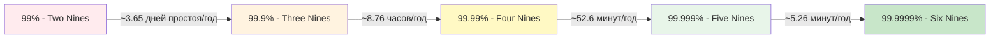
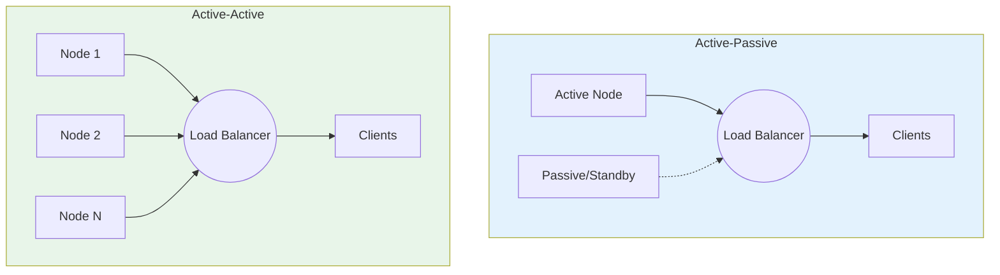
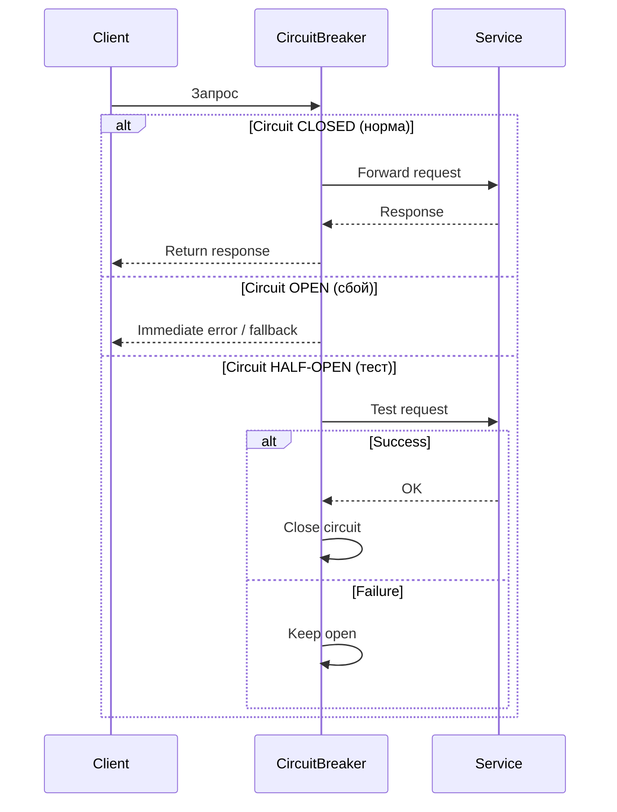
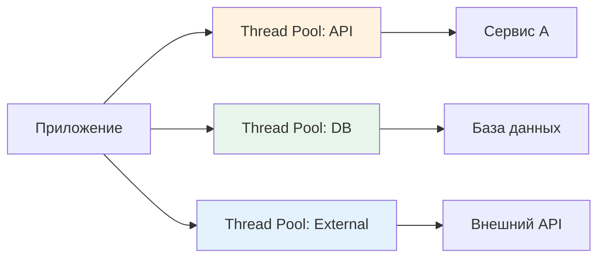
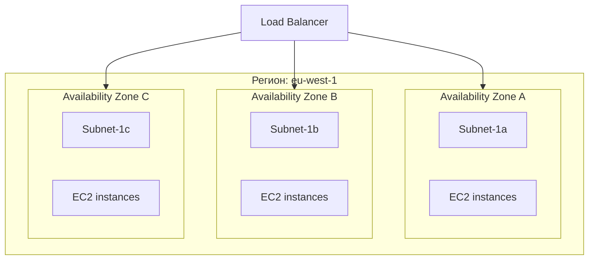
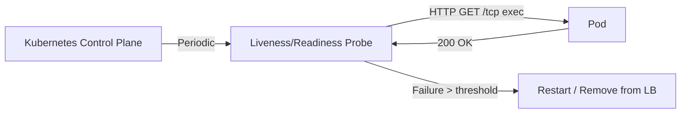
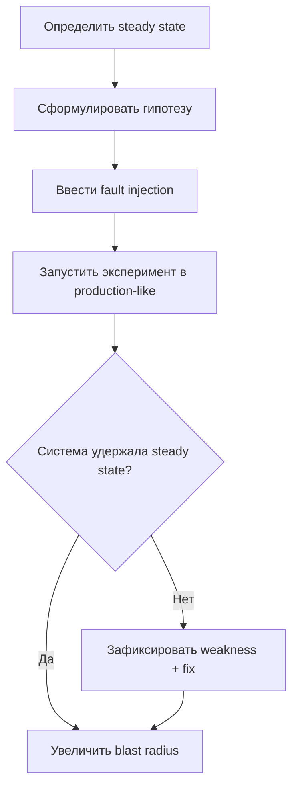
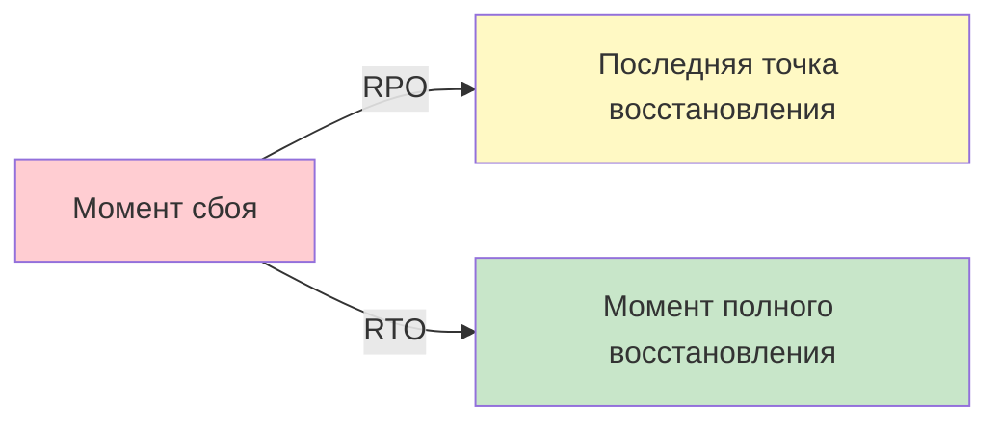
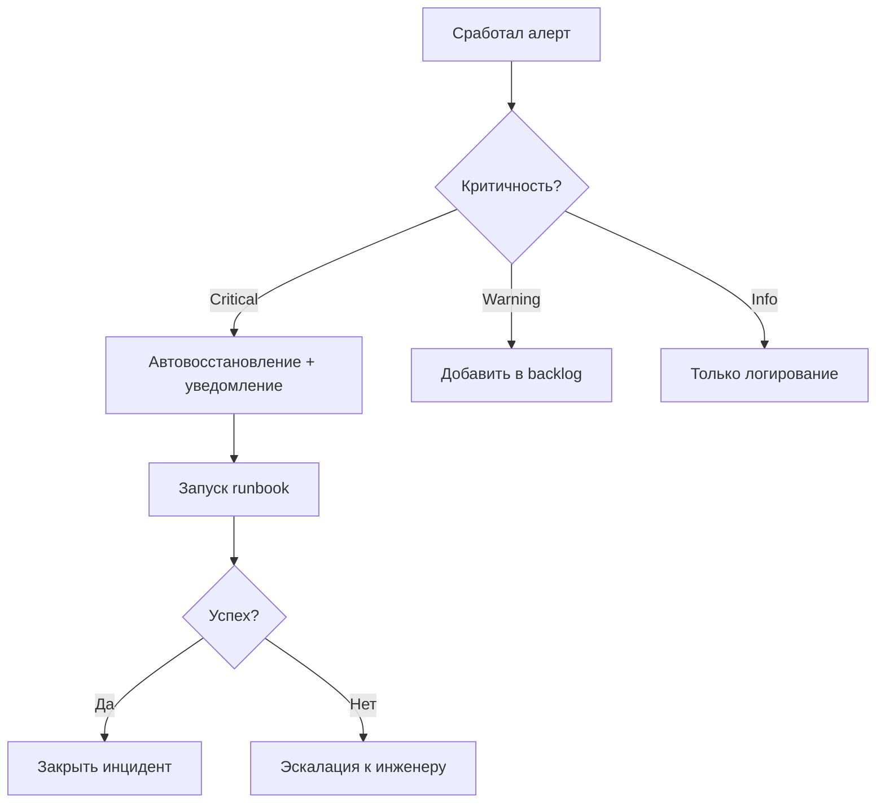

## Введение

Отказоустойчивость (Fault Tolerance) — это способность системы продолжать выполнение своих функций при частичных сбоях компонентов. В отличие от высокой доступности (High Availability), которая фокусируется на минимизации времени простоя, отказоустойчивость предполагает **автоматическое восстановление без вмешательства оператора**.

Для DevOps-инженера понимание принципов проектирования таких систем критично: современные распределенные приложения состоят из десятков взаимозависимых сервисов, и отказ любого из них не должен приводить к каскадному коллапсу.

>[!INFO] Связь с предыдущими темами Проектирование отказоустойчивых систем опирается на [[Synced/DevOps/Сетевое и системное администрирование/0. Введение и методология/1. Принцип работы ОС.md | понимание работы ОС]] для изоляции сбоев и на [[Synced/DevOps/Сетевое и системное администрирование/0. Введение и методология/2. Методология Troubleshooting.md | методологию диагностики]] для быстрого восстановления. Связь с мониторингом — в [[Synced/DevOps/Мониторинг, логирование и трассировка (Observability)/0. Концепции и теория Observability/3. SLI, SLO, SLA.md | SLI/SLO/SLA]].

## 1. Ключевые концепции надежности

### MTBF, MTTR, Availability

| Метрика          | Расшифровка                | Формула/Описание              | Целевое значение      | Формула                                                          |
| ---------------- | -------------------------- | ----------------------------- | --------------------- | ---------------------------------------------------------------- |
| **MTBF**         | Mean Time Between Failures | Среднее время между сбоями    | Чем выше, тем лучше   | (Суммарное время работы) / (Количество отказов)                  |
| **MTTR**         | Mean Time To Repair        | Среднее время восстановления  | Минимизировать        | Time to Detect + Time to Diagnose + Time to Fix + Time to Verify |
| **Availability** | Доступность                | `MTBF / (MTBF + MTTR) × 100%` | 99.9%+ для production | MTBF / (MTBF + MTTR) × 100%                                      |

| Составляющая                  | Описание                                         | Как сократить                                                                          |
| ----------------------------- | ------------------------------------------------ | -------------------------------------------------------------------------------------- |
| **TTD (Time to Detect)**      | Время от начала инцидента до срабатывания алерта | Улучшить мониторинг, добавить синтетические проверки, уменьшить интервал сбора метрик. |
| **TTDiag (Time to Diagnose)** | Время на поиск причины                           | Улучшить логирование, добавить трейсинг (Jaeger), написать runbook'и.                  |
| **TTFix (Time to Fix)**       | Время на применение фикса                        | Автоматизировать rollback, иметь готовые плейбуки, использовать feature flags.         |
| **TTVerify (Time to Verify)** | Время на проверку, что сервис работает           | Автоматизировать smoke-тесты, health-checks, использовать canary deployments.          |
### «Девятки» доступности



| Уровень                  | Допустимый простой в год | Допустимый простой в месяц | Примеры сервисов                               | Реализация                                                                    |
| ------------------------ | ------------------------ | -------------------------- | ---------------------------------------------- | ----------------------------------------------------------------------------- |
| **99%** (2 девятки)      | 3.65 дней                | 7.2 часа                   | Внутренние тестовые стенды                     | Одиночный сервер, бекап раз в сутки.                                          |
| **99.9%** (3 девятки)    | 8.76 часов               | 43.2 минуты                | Стартапы, внутренние CRM                       | Одиночный сервер + автоматический бэкап, мониторинг.                          |
| **99.95%**               | 4.38 часа                | 21.6 минуты                | Корпоративные приложения                       | Master-replica БД, балансировщик, автоматический failover.                    |
| **99.99%** (4 девятки)   | 52.6 минут               | 4.32 минуты                | Финансовые сервисы, платежные системы          | Multi-AZ развертывание, автоматическое восстановление, резервное кэширование. |
| **99.999%** (5 девяток)  | 5.26 минут               | 25.9 секунд                | Телеком, авиадиспетчерские системы             | Multi-region, active-active, идемпотентность, консенсусные алгоритмы.         |
| **99.9999%** (6 девяток) | 31.5 секунд              | 2.6 секунды                | Критическая инфраструктура (операторские сети) | Полный избыточность на всех уровнях + предсказательная аналитика.             |

>[!WARNING] Закон убывающей отдачи Каждая дополнительная «девятка» требует экспоненциально больших инвестиций. 99.999% часто экономически неоправданны для внутренних сервисов.

### Как считать доступность для распределенных систем

В распределенных системах доступность рассчитывается сложнее, чем просто `uptime / total_time`.

#### Метод 1: Доступность на основе запросов

`Availability = (Успешные запросы) / (Всего запросов) × 100%`

**Пример:** Из 1 000 000 запросов за месяц 999 900 завершились успешно (HTTP 2xx) → Availability = 99.99%.

**Преимущество:** Учитывает пользовательский опыт, а не время работы железа.  
**Недостаток:** Не учитывает простои, когда нет трафика (ночью) — недооценивает проблемы.

#### Метод 2: Composite Availability (цепочечная)

Для системы из N компонентов, соединенных последовательно:

`Total Availability = A1 × A2 × A3 × ... × An`

**Пример:**

- API Gateway: 99.99%
- Auth Service: 99.95%
- Database: 99.99%
- Total = 0.9999 × 0.9995 × 0.9999 ≈ 0.9993 = **99.93%**

**Вывод:** Каждый дополнительный компонент **снижает** общую доступность. Чтобы получить 99.99% на уровне пользователя, каждый компонент должен быть >99.995%.

### Метод 3: Error Budget (Бюджет ошибок)

`Error Budget = 1 - Availability SLO`

**Пример:** Для SLO 99.9% → Error Budget = 0.1% (примерно 43 минуты в месяц). Пока не исчерпан бюджет — можно делать рисковые деплои. Как только бюджет исчерпан — разработка замораживается до следующего периода.

**Использование в Google SRE:** Ошибки тратят бюджет. Если у вас остается 20% бюджета на конец квартала — вы слишком консервативны (можно было больше экспериментировать). Если бюджет израсходован раньше времени — нужно притормозить с изменениями.

### Мифы и реальность о доступности

| Миф                                                       | Реальность                                                                                                                |
| --------------------------------------------------------- | ------------------------------------------------------------------------------------------------------------------------- |
| "У нас 99.99% доступности, потому что мы платим AWS"      | AWS гарантирует доступность инфраструктуры, но ваше приложение может падать из-за кода. Реальная доступность всегда ниже. |
| "Мы измеряем доступность по uptime хоста"                 | Хост может быть запущен, но приложение не отвечать. Доступность нужно считать по бизнес-транзакциям.                      |
| "99.99% — это почти идеально"                             | Это > 50 минут простоев в год. Для платежной системы это миллионы долларов потерь.                                        |
| "Если мы платим за multi-AZ, у нас гарантированно 99.99%" | Multi-AZ защищает от отказа одного центра. Но от человеческой ошибки (неправильный деплой) не защищает.                   |
### Практические рекомендации

1. **Начните с измерения:** Невозможно улучшить то, что не измеряется. Начните собирать реальные показатели доступности через синтетические тесты (Blackbox exporter, Google Cloud Uptime Checks).
2. **Определите критический путь:** Не все запросы одинаково важны. Ошибка в `GET /status` не влияет на бизнес. Ошибка в `POST /payment` — критична. Отдельно следите за критическими эндпоинтами.
3. **Устанавливайте SLO, а не просто SLI:** SLI (индикатор) — это метрика. SLO (цель) — это обещание бизнесу. Например: SLI = latency P95, SLO = P95 < 300ms в 95% случаев за месяц.
4. **Планируйте бюджеты на ошибки:** Используйте Error Budget как инструмент принятия решений, а не как наказание.
    
5. **Используйте многослойный подход:** У вас может быть несколько SLO:
    - Внутренний (жесткий): P95 < 100ms — цель для инженеров.
    - Внешний (бизнес): P95 < 500ms — обещание клиентам.
6. **Не гонитесь за 99.999% без причины:** Оцените стоимость простоя. Если 1 час простоя стоит $1000, а переход с 99.9% на 99.99% стоит $100 000 в год — экономически неоправданно.

> [!TIP] Правило проектирования **Предполагайте, что всё сломается**: диски, сеть, ЦОД, зависимости. Проектируйте систему с учётом этих предположений.

## 2. Паттерны отказоустойчивости

### Redundancy (Избыточность)



| Критерий                       | Active-Passive                             | Active-Active                                       |
| ------------------------------ | ------------------------------------------ | --------------------------------------------------- |
| **Состояние (stateful)**       | Идеально для БД (только мастер пишет)      | Сложно для stateful (нужна синхронизация)           |
| **Stateless приложения**       | Возможно, но неэффективно                  | Идеально (распределение нагрузки)                   |
| **Время восстановления (RTO)** | Выше (несколько минут — промоушен реплики) | Ниже (падает один узел, другие продолжают работу)   |
| **Сложность настройки**        | Низкая                                     | Высокая (синхронизация сессий, лишние копии данных) |
| **Примеры**                    | PostgreSQL, MongoDB, RabbitMQ (кластер)    | Веб-серверы, Kubernetes Pods, CDN                   |

**N+1, N+2:**
- **N+1** — стандарт для critical сервисов (если N узлов нужны для нагрузки, добавляем 1 запасной).
- **N+2** — когда нужно обслуживание без отключения (могут выпасть 2 узла одновременно, например, при обновлении ОС).

**Пример с Kubernetes:** Если у вас Deployment с `replicas: 3` для stateless-сервиса — это N+2 (запас на случай отказа 2 подов). Для БД в StatefulSet лучше `replicas: 3` с Active-Passive (один мастер, две реплики для failover).

### Retry, Timeout, Circuit Breaker



#### Retry с backoff (экспоненциальная задержка)

**Когда использовать:**

- Временные сбои: перезагрузка сервиса, сетевая флуктуация, кратковременный таймаут.
- **Не использовать:** при неидемпотентных запросах (например, создание заказа) — если повторить, создаст дубликат. 

**Формула задержки (с jitter):**

`delay = base_delay × (2 ^ attempt) + random_jitter`

Например: 100ms → 200ms → 400ms → 800ms (+ jitter для предотвращения "эффекта толпы").

**Параметры для типичного сервиса:**

```yml
max_retries: 3
initial_backoff: 100ms
max_backoff: 5s
backoff_multiplier: 2.0
jitter: 0.2  # 20% случайности
```

**Метрики:** Количество ретраев на запрос, успешность после ретрая.

#### Timeout

|Тип таймаута|Описание|Рекомендуемое значение|Признак неправильной настройки|
|---|---|---|---|
|**Connection Timeout**|Время на установку соединения (TCP handshake)|1–3 секунды|Слишком низкий → ложные ошибки при перегрузке сети. Слишком высокий → долго ждать, если сервис упал.|
|**Read Timeout**|Время ожидания первого байта ответа|5–30 секунд (зависит от операции)|Внезапно упавшая производительность → увеличить. Постоянные таймауты → оптимизировать запрос.|
|**Write Timeout**|Время на отправку запроса (актуально для больших файлов)|5–10 секунд|Редко настраивается отдельно (обычно = Read).|

**Правило:** Всегда устанавливайте таймауты. Бесконечное ожидание убивает систему при сбое.

#### Circuit Breaker (Автоматический выключатель)

**Состояния и переходы:**

|Состояние|Описание|Переход|
|---|---|---|
|**CLOSED**|Нормальная работа, запросы идут к сервису|→ OPEN, если процент ошибок > порога за период|
|**OPEN**|Запросы блокируются (немедленная ошибка) без вызова сервиса|→ HALF-OPEN после таймаута (recovery timeout)|
|**HALF-OPEN**|Пропускается ограниченное число запросов для проверки|→ CLOSED, если все успешны; → OPEN, если ошибка|

**Настройки:**

```yml
failure_threshold: 50%   # ошибок за 10 секунд
success_threshold: 3     # успешных вызовов в HALF-OPEN
recovery_timeout: 30s    # через сколько пробовать снова
max_calls_half_open: 10  # сколько запросов пустить на проверку
```

**Пример:** Сервис А вызывает сервис Б. Б начинает падать. После 50% ошибок Circuit Breaker открывается → все запросы к Б немедленно возвращают fallback-ответ (или ошибку), не давая перегружать Б еще больше. Через 30 секунд проверяем, не восстановился ли Б.

**Реализации:**

- **Код:** resilience4j (Java), Polly (.NET), Hystrix (устаревший)
- **Service Mesh:** Istio (Circuit Breaker через DestinationRule)
- **API Gateway:** Kong, NGINX с плагином circuit-breaker

**Метрики:** Состояние выключателя (CLOSED/OPEN/HALF-OPEN), кол-во отвергнутых запросов.

>[!LINK] Реализация Паттерны resilience в микросервисах — в [[Synced/DevOps/Балансировка, проксирование и веб-сервера/4. Service Mesh и управление трафиком микросервисов/1. Istio/4. Resilience.md | Istio Resilience]], в коде — библиотеки like Polly (.NET), resilience4j (Java).

#### Bulkhead (Изоляция ресурсов)

**Проблема:** Один медленный запрос к внешнему API съедает весь пул соединений → блокируются все остальные запросы (Tomcat, gunicorn worker'ы).

**Решение:** Разделите ресурсы на пулы для разных типов операций.



**Пример**: Отдельные connection pools для разных баз данных в приложении, чтобы медленный запрос к аналитической БД не блокировал транзакционные операции.

**Практика в Kubernetes:**

- Разные Pods для разных типов нагрузки (например, web и worker).
- Resource Quotas для namespace'ов — изоляция на уровне кластера.
- Network Policies — изоляция трафика между сервисами.

**Когда Bulkhead НЕ нужен:** Для stateless-сервисов с короткими запросами, где лимиты уже настроены на уровне LB.

#### Сравнение паттернов

| Паттерн             | Решает проблему                  | Сложность реализации                      | Влияние на пользователя                   |
| ------------------- | -------------------------------- | ----------------------------------------- | ----------------------------------------- |
| **Redundancy**      | Отказ hardware/network           | Средняя (нужен LB, конфигурация failover) | Незаметно при отказе одного узла          |
| **Retry**           | Временные сбои (таймауты)        | Низкая (в коде)                           | Может увеличить время ответа на N ретраев |
| **Timeout**         | Зависания (бесконечное ожидание) | Очень низкая (простая настройка)          | Защищает от "зависших" запросов           |
| **Circuit Breaker** | Каскадные сбои (эффект домино)   | Средняя (нужен state и мониторинг)        | Быстрый отказ вместо долгого таймаута     |
| **Bulkhead**        | Конкуренция за ресурсы           | Низкая (конфигурация)                     | Изолирует медленные запросы от быстрых    |

#### Комбинирование паттернов (Golden Path)

Для внешнего вызова (REST API) рекомендуется такая цепочка:

1. Timeout (например, 5 секунд)
2. Retry (max 3 раза с экспоненциальным backoff)
3. Circuit Breaker (если 50% ошибок за 10 секунд)
4. Bulkhead (свой пул потоков для этого сервиса)
5. Fallback (кэшированный ответ или default value)

#### Метрики для мониторинга resilience

| Метрика                    | Prometheus-запрос                                         | Что показывает                         |
| -------------------------- | --------------------------------------------------------- | -------------------------------------- |
| **Retry rate**             | `rate(retries_total[5m])`                                 | Как часто мы перезапрашиваем           |
| **Retry success rate**     | `rate(retry_success_total[5m]) / rate(retries_total[5m])` | Сколько ретраев приводят к успеху      |
| **Circuit breaker state**  | `circuit_breaker_state{service="payment"}`                | OPEN/CLOSED/HALF-OPEN                  |
| **Blocked requests by CB** | `rate(circuit_breaker_requests_blocked[5m])`              | Сколько запросов отвергнуто (fallback) |
| **Timeout rate**           | `rate(timeout_total[5m])`                                 | Сколько запросов упало по таймауту     |
| **Bulkhead queue size**    | `bulkhead_queue_size{pool="analytics"}`                   | Длина очереди ожидания в пуле          |
#### Практические anti-patterns

❌ **Retry без backoff** → если сервис перегружен, агрессивные ретраи усугубят ситуацию (эффект "thundering herd").

❌ **Бесконечный retry** → система никогда не вернет ошибку, пользователь будет ждать вечно.

❌ **Одинаковые таймауты для всех операций** → для тяжелых запросов слишком короткий, для легких слишком длинный.

❌ **Circuit Breaker без fallback** → пользователь все равно видит ошибку, только быстрее.

❌ **Bulkhead без мониторинга** → вы не знаете, что пул переполнен, пока не начнутся таймауты.

✅ **Правильно:** Определите для каждого внешнего вызова свои параметры, собирайте метрики, настраивайте алерты, тестируйте отказоустойчивость в Chaos Engineering.

## 3. Проектирование на уровне инфраструктуры

### Зоны отказа (Failure Domains)



|Уровень|Пример отказа|Время восстановления|Стратегия защиты|Стоимость|
|---|---|---|---|---|
|**Хост (сервер)**|Сбой питания, выход из строя диска, перегрев CPU|15–60 минут (замена железа)|Репликация на несколько хостов (Kubernetes ReplicaSet), автоматическое перепланирование подов|Низкая|
|**Стойка (rack)**|Отказ сетевого коммутатора, сбой питания на всю стойку|1–4 часа (ремонт оборудования)|Распределение подов по разным стойкам (podAntiAffinity в K8s), использование нескольких топологий|Средняя|
|**Зона доступности (AZ)**|Отказ дата-центра (пожар, отключение электричества)|Часы – дни|Multi-AZ развертывание: репликация БД (синхронная/асинхронная), балансировщик с поддержкой нескольких AZ|Высокая|
|**Регион**|Стихийное бедствие, сбой всей облачной инфраструктуры|Дни – недели|Multi-region: активная репликация данных, DNS-балансировка с гео-привязкой, DR-планы|Очень высокая|
|**Провайдер**|Банкротство провайдера, политические ограничения|Неопределенно|Multi-cloud: развертывание у разных провайдеров (AWS + GCP + Azure)|Экстремально высокая (обычно неоправданно)|

### Практические рекомендации по failure domains

1. **Для большинства сервисов:** распределение по хостам + 2 AZ достаточно.
2. **Для критичных (платежи, голосования):** 3 AZ или multi-region.
3. **Для внутренних (CI/CD, тестовые стенды):** достаточно хостовой избыточности.
4. **Всегда используйте podAntiAffinity в Kubernetes** для распределения по разным нодам.

|Уровень|Пример failure domain|Стратегия изоляции|
|---|---|---|
|**Хост**|Физический сервер, VM|Репликация на разные хосты, [[Synced/DevOps/Контейнеризация и оркестрация/4. Kubernetes (Базовые объекты и рабочие нагрузки)/2. ReplicaSet.md|
|**Стойка/Рек**|Питание, сеть в пределах rack|Rack-aware размещение, [[Synced/DevOps/Облачные сервисы и модели (XaaS)/6. Private cloud платформы/1. OpenStack/3. Эксплуатация OpenStack/5. Сети (Neutron)/4. Продвинутые сетевые сервисы.md|
|**AZ/Дата-центр**|Зона доступности в облаке|Multi-AZ деплой, репликация данных между AZ|
|**Регион**|Географический регион|Active-Active между регионами, DNS-based failover|
|**Провайдер**|Cloud vendor|Multi-cloud стратегия (сложно, дорого)|

### Stateful vs Stateless сервисы

**Как определить, является ли сервис stateful?**

**Тест:** Могу ли я удалить этот экземпляр и создать новый (с тем же именем/IP) без потери данных и без дополнительных действий?
- **Да → Stateless** (веб-сервер, API Gateway, worker).
- **Нет → Stateful** (БД, кэш, очередь сообщений).

|Характеристика|Stateless|Stateful|
|---|---|---|
|**Хранение состояния**|Нет (внешний кэш/БД)|Локально на узле|
|**Масштабирование**|Горизонтальное, любое|Ограничено, требует шардирования|
|**Восстановление**|Пересоздание из образа|Восстановление из бэкапа/реплики|
|**Примеры**|Web servers, API gateways|Базы данных, [[Synced/DevOps/Брокеры сообщений/1. Apache Kafka/1. Архитектура и основные понятия.md|

#### Практические стратегии для stateful-сервисов

| Подход                      | Описание                                | Пример                              | Преимущества                                          | Недостатки                                              |
| --------------------------- | --------------------------------------- | ----------------------------------- | ----------------------------------------------------- | ------------------------------------------------------- |
| **Внешнее хранилище**       | Вынос состояния в отдельную БД/кэш      | Приложение сохраняет сессии в Redis | Приложение становится stateless, легко масштабировать | Дополнительная задержка (сеть), сложность управления БД |
| **Шардирование (Sharding)** | Разбиение данных по узлам (ключ → узел) | Kafka partitions, MongoDB sharding  | Линейное масштабирование                              | Сложность перебалансировки, горячие ключи               |
| **Replication**             | Копия данных на несколько узлов         | PostgreSQL master-replica           | Отказоустойчивость, чтение с реплик                   | Задержка репликации, split-brain                        |
| **Consensus (Raft/Paxos)**  | Кворумный протокол для согласованности  | etcd, ZooKeeper, Consul             | Strong consistency, автоматический выбор лидера       | Сложность, задержка при записи                          |

>[!TIP] Золотое правило **Выносите состояние наружу**: используйте внешние хранилища ([[Synced/DevOps/Базы данных и хранилища/5. Объектные и распределенные хранилища/2. Реализации S3/1. MinIO.md | MinIO]], [[Synced/DevOps/Базы данных и хранилища/1. Реляционные СУБД (OLTP)/1. PostgreSQL/5. Point-in-Time Recovery (PITR) с использованием WAL-архивов.md | PostgreSQL PITR]]), кэши ([[Synced/DevOps/Базы данных и хранилища/2. NoSQL и специализированные СУБД/1. Key-Value и кэширование/1. Redis.md | Redis]]), чтобы сервисы оставались stateless.

#### Как проектировать stateless-сервисы

1. **Никакого локального хранилища** (не использовать PV в K8s для временных данных).
2. **Вся конфигурация** — через environment variables или ConfigMap.
3. **Сессии** — во внешнем хранилище (Redis, Memcached) или JWT (клиентские).
4. **Кэш** — отдельный сервис (Redis) или CDN.
5. **Логи и метрики** — агрегируются в централизованные системы (ELK, Prometheus).

#### Когда допустимо иметь stateful-сервис внутри K8s

- StatefulSet + PersistentVolume (для баз данных, кэшей, очередей).
- Используйте **Headless Service** для прямого доступа к подам.
- Настройте **podManagementPolicy: OrderedReady** для упорядоченного развертывания.

### Стратегии развертывания в failure domains

#### Multi-AZ развертывание
#### Multi-region с активным резервированием (Active-Active)

1. **DNS:** Route53 с гео-балансировкой (латентность-based или weight-based).
2. **Данные:** Репликация БД между регионами (синхронная для критичных данных).
3. **Кэш:** Global Redis (с синхронизацией через CRDT).
4. **Failover:** Автоматическое переключение при сбое региона.

### Тестирование failure domains (Chaos Engineering)

**Как проверить, что ваша архитектура действительно отказоустойчива:**

|Инструмент|Назначение|Пример сценария|
|---|---|---|
|**kube-monkey**|Случайное удаление подов в K8s|"Выключить 1 под каждый час"|
|**Chaos Mesh**|Инжекция сетевых задержек, ошибок|"Добавить 100ms задержки к трафику между сервисами"|
|**AWS Fault Injection Simulator**|Сбой AZ, замедление сети|"Отключить питание одной AZ в регионе"|
|**Gremlin**|Атака на CPU, память, сеть|"Заполнить 80% памяти контейнера"|
|**Личный подход**|`kubectl delete pod` вручную|Удалить под БД и проверить, восстановится ли он|

**Частота:** Проводить хаос-эксперименты в staging раз в неделю, в production — раз в месяц (вне пиковых часов).

### Матрица выбора стратегии в зависимости от критичности

| Критичность          | Stateless           | Stateful                                 | Failure domain | RTO      | RPO      |
| -------------------- | ------------------- | ---------------------------------------- | -------------- | -------- | -------- |
| **P0 (Критический)** | Multi-region + 3 AZ | Multi-region синхронная репликация, PITR | AZ + Region    | < 5 мин  | < 1 сек  |
| **P1 (Важный)**      | 3 AZ                | 2 AZ + асинхронная репликация            | Хост + AZ      | < 15 мин | < 5 мин  |
| **P2 (Обычный)**     | 2 AZ                | 1 AZ + бэкап раз в час                   | Хост           | < 1 час  | < 1 час  |
| **P3 (Внутренний)**  | 1 хост              | Бэкап раз в день                         | Хост           | < 4 часа | < 1 день |

### Распространенные ошибки при проектировании инфраструктуры

❌ **Single point of failure:** Один балансировщик, одна БД, одна сеть.

❌ **Игнорирование сетевых задержек:** Multi-AZ развертывание без учета latency между AZ (может быть 2-5 мс → добавляет задержку).

❌ **Недостаточное тестирование failover:** "У нас есть реплика, но мы никогда не пробовали переключиться на нее".

❌ **Общий пул ресурсов для всех сервисов:** Один сервис исчерпывает лимиты → падают все.

❌ **Хранение состояния в stateless-сервисе:** Кэширование данных в памяти без репликации → при перезапуске потеря данных.

✅ **Правильно:** Проектируйте с учетом самого плохого сценария, тестируйте его регулярно и автоматизируйте восстановление.

## 4. Автоматическое восстановление и самовосстановление

### Health Checks и Probes



#### Liveness Probe: «Умер ли процесс?»

**Назначение:** Определяет, находится ли контейнер в рабочем состоянии. Если проба проваливается, kubelet **перезапускает** контейнер.

**Когда использовать:**

- ✅ Приложения, которые могут зависнуть (deadlock, бесконечный цикл).
- ✅ Сервисы с утечкой памяти (перезапуск очищает память).
- ❌ **НЕ использовать** для проверки зависимостей (БД, внешние API) — это приведет к ложным перезапускам.

#### Readiness Probe: «Готов ли принимать трафик?»

**Назначение:** Определяет, может ли контейнер обслуживать запросы. Если проба проваливается, Pod исключается из Service (не получает трафик), но **не перезапускается**.

**Когда использовать:**
- ✅ Во время старта (приложение загружает конфигурацию, подключается к БД).
- ✅ Во время перегрузки (временная недоступность).
- ✅ Во время rolling update (старый Pod выводится из ротации, новый подключается).

**Реальный сценарий:** Приложение поднимается, загружает модель ML (30 секунд). Readiness probe вернет 200 только после загрузки. До этого Pod не получает трафик.

**Anti-pattern:** readinessProbe слишком строгая (проверяет все зависимости). При падении кэша Pod выводится из ротации, хотя основная функциональность работает.

#### Startup Probe: «Долгая инициализация»

**Назначение:** Дает приложению дополнительное время на старт, не ограничивая livenessProbe. После успешной проверки startupProbe отключается, и начинает работать livenessProbe.

**Когда использовать:**
- ✅ Java-приложения с долгим стартом (Spring Boot).
- ✅ ML-модели, загружаемые из S3.
- ✅ Приложения, которым нужно > 30 секунд для инициализации.

**Реальный сценарий:** Java-приложение стартует 2 минуты. Без startupProbe livenessProbe (с `failureThreshold: 3`) перезапустила бы его через 30 секунд, создавая бесконечный цикл.

#### Практические рекомендации по probes

|Совет|Почему|
|---|---|
|**Разделяйте liveness и readiness**|Это разные цели: liveness = "жив", readiness = "готов к работе"|
|**Используйте отдельные эндпоинты**|`/healthz` для liveness (легкий), `/ready` для readiness (проверка зависимостей)|
|**Не делайте тяжелых проверок в liveness**|Проверка БД в liveness может вызвать каскадные перезапуски при проблемах с сетью|
|**Устанавливайте `initialDelaySeconds` с запасом**|Дайте приложению время на старт|
|**Для медленных приложений используйте startupProbe**|Иначе liveness убьет приложение до того, как оно запустится|
|**Проверяйте логи перезапусков**|`kubectl describe pod` покажет, почему происходили рестарты|

### Self-healing паттерны — детализация

#### Auto-restart (перезапуск контейнера)

|Механизм|Где используется|Команда/Конфигурация|
|---|---|---|
|**systemd**|На хосте (VM, bare-metal)|`Restart=on-failure` в `.service` файле|
|**Docker**|Одиночные контейнеры|`--restart=always` или `--restart=on-failure:3`|
|**Kubernetes**|Контейнеры в Pod'ах|`restartPolicy: Always` (по умолчанию)|
|**Supervisor**|Внутри контейнера (legacy)|`autorestart=true` в конфиге|
#### Auto-replacement (автоматическая замена узла)

**AWS Auto Scaling Groups (ASG):**
- **Health Check:** ELB health checks или EC2 status checks.
- **Действие:** При провале health check ASG завершает инстанс и создает новый.
- **Типы:**
    - `EC2` (статус инстанса).
    - `ELB` (проверка через балансировщик).
    - `Custom` (собственный скрипт через Lifecycle Hooks).

**GKE Node Auto-Repair:**
- Мониторинг узлов: не отвечает на запросы, сбойный kernel, проблемы с диском.
- Автоматически пересоздает узел (выселяет Pod'ы, создает новый).

**Kubernetes Node Problem Detector:**
- Определяет проблемы с нодой (ошибки памяти, проблемы с диском).
- Если нода нездорова → taint `node.kubernetes.io/unreachable` → Pod'ы пересоздаются на других нодах.

#### Auto-failover (автоматическое переключение на реплику)

|Система|Механизм|Время переключения|
|---|---|---|
|**Patroni (PostgreSQL)**|Raft-консенсус между узлами, автоматический выбор лидера|5-30 секунд|
|**etcd**|Raft + Leader Election|< 1 секунды|
|**Redis Sentinel**|Мониторинг мастеров, автоматический промоушен реплики|10-30 секунд|
|**AWS RDS Multi-AZ**|Автоматический failover на реплику в другой AZ|30-60 секунд|
|**HAProxy + Keepalived**|VRRP для виртуального IP, активный-пассивный|3-10 секунд|
#### Auto-scaling (автоматическое масштабирование)

|Тип|Где используется|Метрики|Пример|
|---|---|---|---|
|**HPA (Horizontal)**|Kubernetes|CPU, Memory, Custom Metrics|Увеличить количество подов при 80% CPU|
|**VPA (Vertical)**|Kubernetes|CPU, Memory|Увеличить запросы ресурсов контейнера|
|**KEDA**|Kubernetes|Очереди (RabbitMQ, Kafka), длина очереди|Масштабировать при 100 сообщений в очереди|
|**Cluster Autoscaler**|Kubernetes|Нехватка ресурсов на нодах|Добавить новую ноду в кластер|
|**AWS Auto Scaling**|AWS|CPU, RPS, Custom CloudWatch|Увеличить количество EC2 инстансов|

## 4.3 Graceful Shutdown — обязательная часть self-healing

При рестарте или замене контейнера приложение должно корректно завершиться, чтобы не потерять данные.

**Процесс:**

1. **SIGTERM** отправляется процессу → приложение должно завершить текущие транзакции, закрыть соединения.
    
2. **terminationGracePeriodSeconds** (по умолчанию 30 секунд) — время на завершение.
    
3. Если не завершился → **SIGKILL** (принудительное убийство).
    

**Пример обработки SIGTERM в Python:**

python

import signal
import time
def handle_sigterm(signum, frame):
    print("Received SIGTERM, cleaning up...")
    # Закрыть соединения с БД
    # Завершить активные запросы
    # Сохранить состояние
    time.sleep(2)
    sys.exit(0)
signal.signal(signal.SIGTERM, handle_sigterm)

**В Kubernetes:**

yaml

spec:
  containers:
  - name: app
    image: app:latest
    lifecycle:
      preStop:
        exec:
          command: ["/bin/sh", "-c", "sleep 10"]  # дать время на завершение
  terminationGracePeriodSeconds: 30

---

## 4.4 Мониторинг самовосстановления

|Метрика|Что показывает|Алерт|
|---|---|---|
|**Pod Restart Count**|Сколько раз перезапускался контейнер|Если > 5 за час → проблема|
|**HPA Scale Events**|Частота масштабирования|Если масштабируется чаще 10 раз в час → метрики нестабильны|
|**Node Replacement Rate**|Как часто заменяются ноды|Если > 1 ноды в день → проблемы с железом|
|**Failover Time**|Время переключения на реплику|Если > 60 сек → настройки не оптимальны|
|**OOM Killer Events**|Процесс убит из-за нехватки памяти|Любой OOM → нужно увеличить лимиты|

**Пример Prometheus-запроса для перезапусков:**

promql

rate(kube_pod_container_status_restarts_total[5m]) > 0.1

---

## 4.5 Тестирование самовосстановления (Chaos Engineering)

**Сценарии для проверки:**

|Сценарий|Ожидаемое поведение|Инструмент|
|---|---|---|
|**Удалить под БД**|БД восстановится, данные не потеряны|`kubectl delete pod postgres-0`|
|**Отключить сеть между AZ**|Трафик переключится на другую AZ|AWS Fault Injection Simulator|
|**Заполнить диск на 100%**|Система очистит логи, алерт сработает|`dd if=/dev/zero of=/tmp/bigfile`|
|**Высокая нагрузка на CPU**|HPA поднимет новые поды|`stress --cpu 4` внутри контейнера|
|**Сбой ноды**|Pod'ы перепланируются на другие ноды|Остановить EC2 инстанс|

**Регулярность:**

- Staging: ежедневно (автоматически через Chaos Mesh).
    
- Production: ежемесячно (ручной режим, в нерабочее время).
    

---

## 4.6 Итоговая схема самовосстановления

**Ключевой принцип:** Система должна восстанавливаться **быстрее**, чем пользователь заметит проблему. Если MTTR < 1 минуты — пользователи не увидят ошибок (за счет ретраев на клиенте).

>[!LINK] Kubernetes-реализация Детали настройки probes — в [[Synced/DevOps/Контейнеризация и оркестрация/4. Kubernetes (Базовые объекты и рабочие нагрузки)/1. Pod.md | объекте Pod]], управление обновлениями — в [[Synced/DevOps/Контейнеризация и оркестрация/4. Kubernetes (Базовые объекты и рабочие нагрузки)/3. Deployment.md | Deployment]].

### Self-healing паттерны

1. **Auto-restart**: systemd, Kubernetes restartPolicy, Docker `--restart=always`
2. **Auto-replacement**: Auto Scaling Groups (AWS), Node Auto-Repair (GKE)
3. **Auto-failover**: Patroni для PostgreSQL, Raft-консенсус в etcd
4. **Auto-scaling**: HPA в Kubernetes, облачные auto-scalers по метрикам CPU/RPS

```bash
# Пример: systemd service с auto-restart
# /etc/systemd/system/myapp.service
[Service]
ExecStart=/usr/local/bin/myapp
Restart=on-failure
RestartSec=5s
StartLimitBurst=3
StartLimitIntervalSec=60s
```

## 5. Тестирование отказоустойчивости

### Chaos Engineering принципы

>[!INFO] Определение Chaos Engineering — это дисциплина экспериментов над распределенными системами для выявления слабых мест **до** того, как они проявятся в production.



### Инструменты для fault injection

| Инструмент       | Уровень         | Пример сценариев                                         |
| ---------------- | --------------- | -------------------------------------------------------- |
| **Chaos Mesh**   | Kubernetes      | Kill pod, network delay, CPU stress, IO failure          |
| **Litmus Chaos** | Kubernetes      | Аналогично, с фокусом на CNCF-экосистему                 |
| **Gremlin**      | Multi-cloud     | Region outage, latency injection, resource exhaustion    |
| **Pumba**        | Docker          | Network loss, CPU limit, container kill                  |
| **Toxiproxy**    | Приложение/сеть | Proxy для добавления задержек/сбоев в тестовом окружении |

>[!WARNING] Безопасность экспериментов Всегда начинайте с **non-production** окружений, используйте **blast radius limiting** (ограничение воздействия), имейте **abort switch** для мгновенной остановки эксперимента.

### Сценарии для тестирования

```yml
# Пример chaos experiment (Chaos Mesh YAML)
apiVersion: chaos-mesh.org/v1alpha1
kind: NetworkChaos
metadata:
  name: api-latency-injection
spec:
  action: delay
  mode: one
  selector:
    labelSelectors:
      app: api-gateway
  delay:
    latency: "200ms"
    jitter: "50ms"
  duration: "5m"
  scheduler:
    cron: "@every 30m"  # Запускать каждые 30 минут
```

>[!LINK] Связь с тестированием Интеграция chaos-тестов в CI/CD — в [[Synced/DevOps/CI-CD, артефакты, тестирование и DevSecOps/3. Обеспечение качества/2. Нефункциональное тестирование/3. Chaos Engineering/1. Концепция.md | концепции Chaos Engineering]].

## 6. Резервное копирование и восстановление (DR)

### Стратегии бэкапа для отказоустойчивости

|Стратегия|Описание|RPO|RTO|Use-case|
|---|---|---|---|---|
|**Full backup**|Полная копия данных|24h|Часы|Архивные данные|
|**Incremental**|Только изменения с последнего бэкапа|1h|Часы|Базы данных, файловые хранилища|
|**Snapshot + replication**|Моментальные снимки + асинхронная репликация|Minutes|Minutes|[[Synced/DevOps/Контейнеризация и оркестрация/6. Kubernetes (Сеть и хранение данных)/2. Хранение данных (Storage)/2. PersistentVolume (PV) и PersistentVolumeClaim (PVC)..md|
|**Multi-region active-active**|Данные в нескольких регионах одновременно|Seconds|Seconds|Критичные финансовые системы|

### Recovery Time/Point Objectives



- **RPO (Recovery Point Objective)**: Максимально допустимая потеря данных (временной интервал).
- **RTO (Recovery Time Objective)**: Максимально допустимое время простоя.

>[!TIP] Тестирование восстановления **Бэкап без проверки восстановления = отсутствие бэкапа**. Регулярно проводите restore-тесты в изолированном окружении. Документируйте процесс в [[Synced/DevOps/Сетевое и системное администрирование/0. Введение и методология/3. Документирование.md | runbook для восстановления]].

## 7. Мониторинг и алертинг для отказоустойчивости

### Метрики для детекции деградации

| Категория       | Ключевые метрики                            | Порог алерта           |
| --------------- | ------------------------------------------- | ---------------------- |
| **Доступность** | `up{job="..."}`, HTTP 5xx rate              | < 99.9% за 5 мин       |
| **Задержки**    | p95/p99 latency, queue length               | p99 > 2× baseline      |
| **Ресурсы**     | CPU/MEM/Disk utilization, saturation        | > 80% sustained        |
| **Зависимости** | External API error rate, DB connection pool | Error rate > 1%        |
| **Бэкапы**      | Last backup age, restore test success       | Backup > RPO threshold |

### Алертинг: избегайте alert fatigue



>[!LINK] Best practices алертинга Детали настройки Alertmanager и маршрутизации — в [[Synced/DevOps/Мониторинг, логирование и трассировка (Observability)/2. Управление инцидентами и алертинг/5. Best practices алертинга.md | best practices алертинга]].

---
## Контрольные вопросы для самопроверки

1. В чем практическая разница между MTBF и MTTR? Какую метрику проще улучшить в first-line support?
2. Почему active-active архитектура сложнее в реализации, чем active-passive? Какие проблемы с состоянием (state) возникают?
3. Как circuit breaker предотвращает каскадный сбой? Что происходит в состоянии HALF-OPEN?
4. Зачем разделять liveness и readiness probes в Kubernetes? Что случится, если перепутать их назначение?
5. Как определить подходящий RPO/RTO для нового сервиса? Какие бизнес-факторы влияют на эти значения?
6. Почему chaos-эксперименты нужно начинать с малого blast radius? Как безопасно остановить эксперимент в production?
7. Как отличить деградацию производительности от полного отказа при настройке алертов?

---

#devops #fault-tolerance #high-availability #resilience #chaos-engineering #redundancy #circuit-breaker #bulkhead #rpo-rto #monitoring #kubernetes #infrastructure-design #disaster-recovery #self-healing #observability