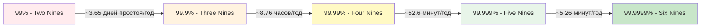
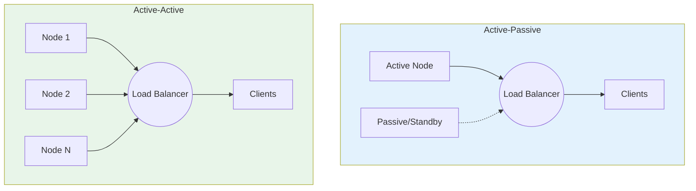
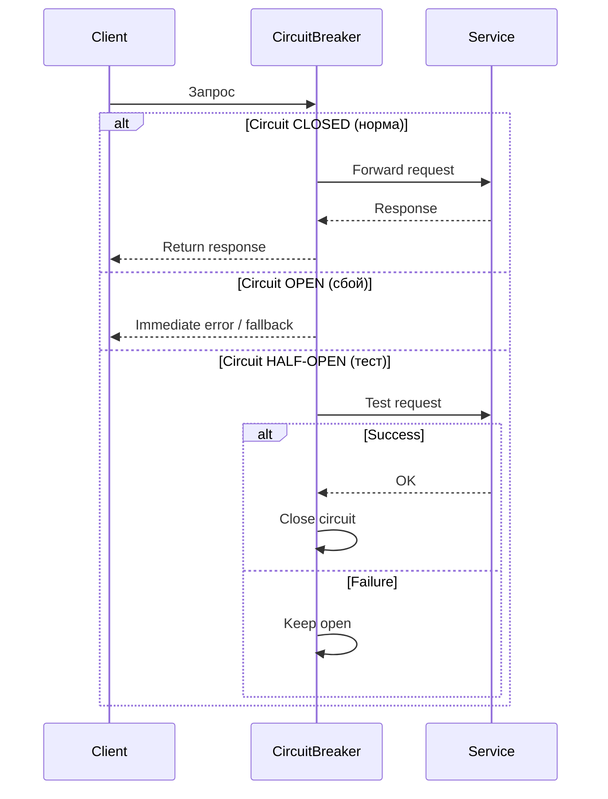
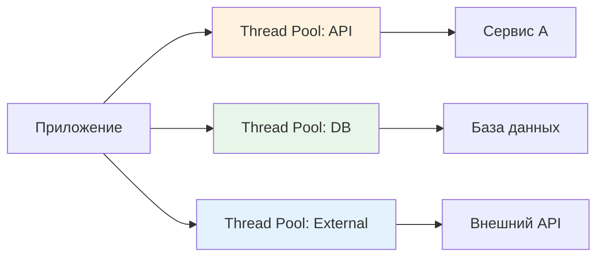
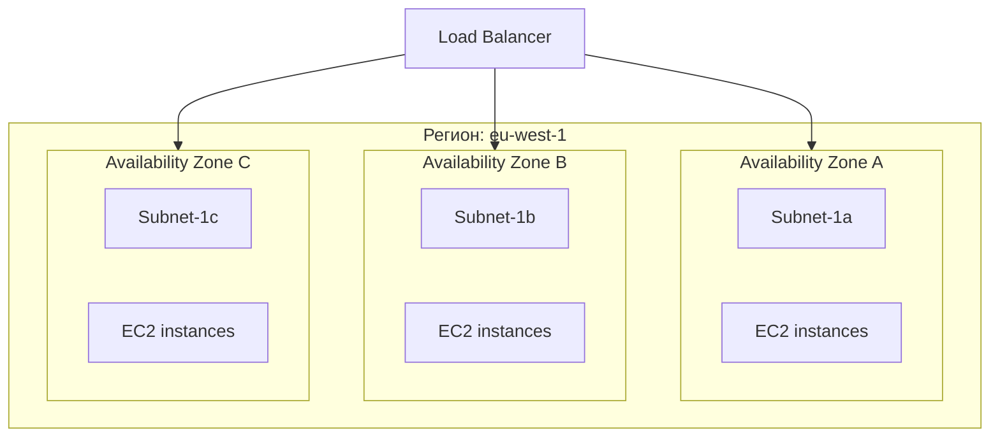
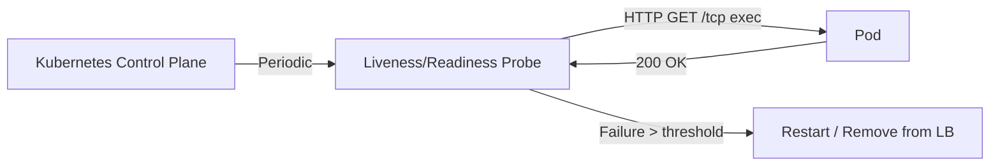
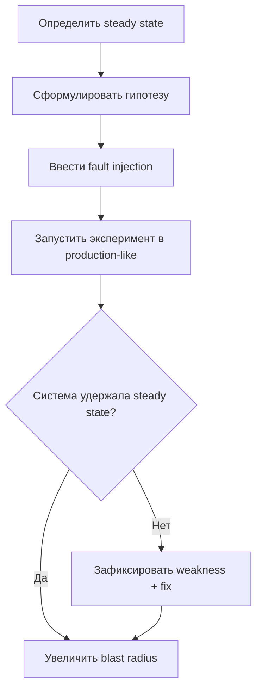
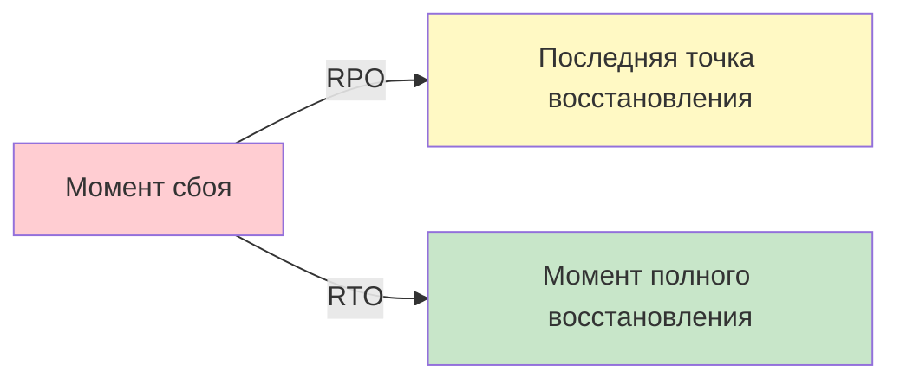
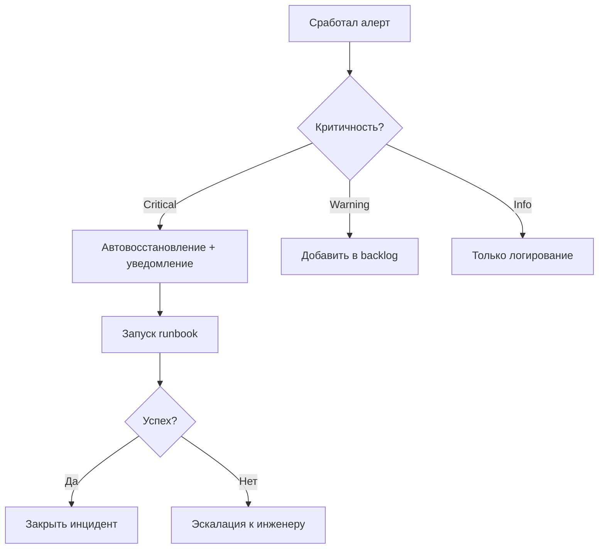

## Введение

Отказоустойчивость (Fault Tolerance) — это способность системы продолжать выполнение своих функций при частичных сбоях компонентов. В отличие от высокой доступности (High Availability), которая фокусируется на минимизации времени простоя, отказоустойчивость предполагает **автоматическое восстановление без вмешательства оператора**.

Для DevOps-инженера понимание принципов проектирования таких систем критично: современные распределенные приложения состоят из десятков взаимозависимых сервисов, и отказ любого из них не должен приводить к каскадному коллапсу.

>[!INFO] Связь с предыдущими темами Проектирование отказоустойчивых систем опирается на [[Synced/DevOps/Сетевое и системное администрирование/0. Введение и методология/1. Принцип работы ОС.md | понимание работы ОС]] для изоляции сбоев и на [[Synced/DevOps/Сетевое и системное администрирование/0. Введение и методология/2. Методология Troubleshooting.md | методологию диагностики]] для быстрого восстановления. Связь с мониторингом — в [[Synced/DevOps/Мониторинг, логирование и трассировка (Observability)/0. Концепции и теория Observability/3. SLI, SLO, SLA.md | SLI/SLO/SLA]].

## 1. Ключевые концепции надежности

### MTBF, MTTR, Availability

|Метрика|Расшифровка|Формула/Описание|Целевое значение|
|---|---|---|---|
|**MTBF**|Mean Time Between Failures|Среднее время между сбоями|Чем выше, тем лучше|
|**MTTR**|Mean Time To Repair|Среднее время восстановления|Минимизировать|
|**Availability**|Доступность|`MTBF / (MTBF + MTTR) × 100%`|99.9%+ для production|
### «Девятки» доступности



>[!WARNING] Закон убывающей отдачи Каждая дополнительная «девятка» требует экспоненциально больших инвестиций. 99.999% часто экономически неоправданны для внутренних сервисов.

### Fallacies of Distributed Computing

Фундаментальные заблуждения, которые разрушают отказоустойчивость:

1. Сеть надёжна
2. Задержки отсутствуют
3. Пропускная способность бесконечна
4. Сеть безопасна
5. Топология не меняется
6. Существует один администратор
7. Стоимость транспорта нулевая
8. Сеть однородна

> [!TIP] Правило проектирования **Предполагайте, что всё сломается**: диски, сеть, ЦОД, зависимости. Проектируйте систему с учётом этих предположений.

## 2. Паттерны отказоустойчивости

### Redundancy (Избыточность)



|Тип|Описание|Use-case|Сложность|
|---|---|---|---|
|**Active-Passive**|Один узел обрабатывает трафик, второй готов к переключению|Базы данных с репликацией, [[Synced/DevOps/Балансировка, проксирование и веб-сервера/2. Специализированные балансировщики нагрузки L4, L7/1. HAProxy/7. Отказоустойчивость самого HAProxy.md|HAProxy failover]]|
|**Active-Active**|Все узлы обрабатывают трафик параллельно|Stateless-сервисы, веб-фермы, [[Synced/DevOps/Контейнеризация и оркестрация/4. Kubernetes (Базовые объекты и рабочие нагрузки)/3. Deployment.md|Kubernetes Deployment]]|
|**N+1, N+2**|Добавление 1-2 избыточных узлов к кластеру из N|Критичные системы, требующие обслуживания без простоя|Высокая|

### Retry, Timeout, Circuit Breaker



| Паттерн                | Назначение                          | Параметры настройки                                      |
| ---------------------- | ----------------------------------- | -------------------------------------------------------- |
| **Retry with backoff** | Повтор запроса при временных сбоях  | Max retries, exponential delay, jitter                   |
| **Timeout**            | Ограничение времени ожидания ответа | Connection timeout, read timeout                         |
| **Circuit Breaker**    | Предотвращение каскадных сбоев      | Failure threshold, recovery timeout, half-open max calls |

>[!LINK] Реализация Паттерны resilience в микросервисах — в [[Synced/DevOps/Балансировка, проксирование и веб-сервера/4. Service Mesh и управление трафиком микросервисов/1. Istio/4. Resilience.md | Istio Resilience]], в коде — библиотеки like Polly (.NET), resilience4j (Java).

### Bulkhead (Изоляция ресурсов)

Аналогия с водонепроницаемыми отсеками корабля: сбой в одном модуле не должен истощать ресурсы всей системы.



**Пример**: Отдельные connection pools для разных баз данных в приложении, чтобы медленный запрос к аналитической БД не блокировал транзакционные операции.

## 3. Проектирование на уровне инфраструктуры

### Зоны отказа (Failure Domains)



|Уровень|Пример failure domain|Стратегия изоляции|
|---|---|---|
|**Хост**|Физический сервер, VM|Репликация на разные хосты, [[Synced/DevOps/Контейнеризация и оркестрация/4. Kubernetes (Базовые объекты и рабочие нагрузки)/2. ReplicaSet.md|
|**Стойка/Рек**|Питание, сеть в пределах rack|Rack-aware размещение, [[Synced/DevOps/Облачные сервисы и модели (XaaS)/6. Private cloud платформы/1. OpenStack/3. Эксплуатация OpenStack/5. Сети (Neutron)/4. Продвинутые сетевые сервисы.md|
|**AZ/Дата-центр**|Зона доступности в облаке|Multi-AZ деплой, репликация данных между AZ|
|**Регион**|Географический регион|Active-Active между регионами, DNS-based failover|
|**Провайдер**|Cloud vendor|Multi-cloud стратегия (сложно, дорого)|

### Stateful vs Stateless сервисы

|Характеристика|Stateless|Stateful|
|---|---|---|
|**Хранение состояния**|Нет (внешний кэш/БД)|Локально на узле|
|**Масштабирование**|Горизонтальное, любое|Ограничено, требует шардирования|
|**Восстановление**|Пересоздание из образа|Восстановление из бэкапа/реплики|
|**Примеры**|Web servers, API gateways|Базы данных, [[Synced/DevOps/Брокеры сообщений/1. Apache Kafka/1. Архитектура и основные понятия.md|

>[!TIP] Золотое правило **Выносите состояние наружу**: используйте внешние хранилища ([[Synced/DevOps/Базы данных и хранилища/5. Объектные и распределенные хранилища/2. Реализации S3/1. MinIO.md | MinIO]], [[Synced/DevOps/Базы данных и хранилища/1. Реляционные СУБД (OLTP)/1. PostgreSQL/5. Point-in-Time Recovery (PITR) с использованием WAL-архивов.md | PostgreSQL PITR]]), кэши ([[Synced/DevOps/Базы данных и хранилища/2. NoSQL и специализированные СУБД/1. Key-Value и кэширование/1. Redis.md | Redis]]), чтобы сервисы оставались stateless.

## 4. Автоматическое восстановление и самовосстановление

### Health Checks и Probes



| Тип probe     | Назначение                       | Когда использовать                                    |
| ------------- | -------------------------------- | ----------------------------------------------------- |
| **Liveness**  | Определяет, «жив» ли процесс     | Для автоматического рестарта зависшего приложения     |
| **Readiness** | Готов ли сервис принимать трафик | Для graceful startup, rolling updates                 |
| **Startup**   | Долгая инициализация при старте  | Для приложений с медленным boot (загрузка моделей ML) |

>[!LINK] Kubernetes-реализация Детали настройки probes — в [[Synced/DevOps/Контейнеризация и оркестрация/4. Kubernetes (Базовые объекты и рабочие нагрузки)/1. Pod.md | объекте Pod]], управление обновлениями — в [[Synced/DevOps/Контейнеризация и оркестрация/4. Kubernetes (Базовые объекты и рабочие нагрузки)/3. Deployment.md | Deployment]].

### Self-healing паттерны

1. **Auto-restart**: systemd, Kubernetes restartPolicy, Docker `--restart=always`
2. **Auto-replacement**: Auto Scaling Groups (AWS), Node Auto-Repair (GKE)
3. **Auto-failover**: Patroni для PostgreSQL, Raft-консенсус в etcd
4. **Auto-scaling**: HPA в Kubernetes, облачные auto-scalers по метрикам CPU/RPS

```bash
# Пример: systemd service с auto-restart
# /etc/systemd/system/myapp.service
[Service]
ExecStart=/usr/local/bin/myapp
Restart=on-failure
RestartSec=5s
StartLimitBurst=3
StartLimitIntervalSec=60s
```

## 5. Тестирование отказоустойчивости

### Chaos Engineering принципы

>[!INFO] Определение Chaos Engineering — это дисциплина экспериментов над распределенными системами для выявления слабых мест **до** того, как они проявятся в production.



### Инструменты для fault injection

| Инструмент       | Уровень         | Пример сценариев                                         |
| ---------------- | --------------- | -------------------------------------------------------- |
| **Chaos Mesh**   | Kubernetes      | Kill pod, network delay, CPU stress, IO failure          |
| **Litmus Chaos** | Kubernetes      | Аналогично, с фокусом на CNCF-экосистему                 |
| **Gremlin**      | Multi-cloud     | Region outage, latency injection, resource exhaustion    |
| **Pumba**        | Docker          | Network loss, CPU limit, container kill                  |
| **Toxiproxy**    | Приложение/сеть | Proxy для добавления задержек/сбоев в тестовом окружении |

>[!WARNING] Безопасность экспериментов Всегда начинайте с **non-production** окружений, используйте **blast radius limiting** (ограничение воздействия), имейте **abort switch** для мгновенной остановки эксперимента.

### Сценарии для тестирования

```yml
# Пример chaos experiment (Chaos Mesh YAML)
apiVersion: chaos-mesh.org/v1alpha1
kind: NetworkChaos
metadata:
  name: api-latency-injection
spec:
  action: delay
  mode: one
  selector:
    labelSelectors:
      app: api-gateway
  delay:
    latency: "200ms"
    jitter: "50ms"
  duration: "5m"
  scheduler:
    cron: "@every 30m"  # Запускать каждые 30 минут
```

>[!LINK] Связь с тестированием Интеграция chaos-тестов в CI/CD — в [[Synced/DevOps/CI-CD, артефакты, тестирование и DevSecOps/3. Обеспечение качества/2. Нефункциональное тестирование/3. Chaos Engineering/1. Концепция.md | концепции Chaos Engineering]].

## 6. Резервное копирование и восстановление (DR)

### Стратегии бэкапа для отказоустойчивости

|Стратегия|Описание|RPO|RTO|Use-case|
|---|---|---|---|---|
|**Full backup**|Полная копия данных|24h|Часы|Архивные данные|
|**Incremental**|Только изменения с последнего бэкапа|1h|Часы|Базы данных, файловые хранилища|
|**Snapshot + replication**|Моментальные снимки + асинхронная репликация|Minutes|Minutes|[[Synced/DevOps/Контейнеризация и оркестрация/6. Kubernetes (Сеть и хранение данных)/2. Хранение данных (Storage)/2. PersistentVolume (PV) и PersistentVolumeClaim (PVC)..md|
|**Multi-region active-active**|Данные в нескольких регионах одновременно|Seconds|Seconds|Критичные финансовые системы|

### Recovery Time/Point Objectives



- **RPO (Recovery Point Objective)**: Максимально допустимая потеря данных (временной интервал).
- **RTO (Recovery Time Objective)**: Максимально допустимое время простоя.

>[!TIP] Тестирование восстановления **Бэкап без проверки восстановления = отсутствие бэкапа**. Регулярно проводите restore-тесты в изолированном окружении. Документируйте процесс в [[Synced/DevOps/Сетевое и системное администрирование/0. Введение и методология/3. Документирование.md | runbook для восстановления]].

## 7. Мониторинг и алертинг для отказоустойчивости

### Метрики для детекции деградации

| Категория       | Ключевые метрики                            | Порог алерта           |
| --------------- | ------------------------------------------- | ---------------------- |
| **Доступность** | `up{job="..."}`, HTTP 5xx rate              | < 99.9% за 5 мин       |
| **Задержки**    | p95/p99 latency, queue length               | p99 > 2× baseline      |
| **Ресурсы**     | CPU/MEM/Disk utilization, saturation        | > 80% sustained        |
| **Зависимости** | External API error rate, DB connection pool | Error rate > 1%        |
| **Бэкапы**      | Last backup age, restore test success       | Backup > RPO threshold |

### Алертинг: избегайте alert fatigue



>[!LINK] Best practices алертинга Детали настройки Alertmanager и маршрутизации — в [[Synced/DevOps/Мониторинг, логирование и трассировка (Observability)/2. Управление инцидентами и алертинг/5. Best practices алертинга.md | best practices алертинга]].

---
## Контрольные вопросы для самопроверки

1. В чем практическая разница между MTBF и MTTR? Какую метрику проще улучшить в first-line support?
2. Почему active-active архитектура сложнее в реализации, чем active-passive? Какие проблемы с состоянием (state) возникают?
3. Как circuit breaker предотвращает каскадный сбой? Что происходит в состоянии HALF-OPEN?
4. Зачем разделять liveness и readiness probes в Kubernetes? Что случится, если перепутать их назначение?
5. Как определить подходящий RPO/RTO для нового сервиса? Какие бизнес-факторы влияют на эти значения?
6. Почему chaos-эксперименты нужно начинать с малого blast radius? Как безопасно остановить эксперимент в production?
7. Как отличить деградацию производительности от полного отказа при настройке алертов?

---

#devops #fault-tolerance #high-availability #resilience #chaos-engineering #redundancy #circuit-breaker #bulkhead #rpo-rto #monitoring #kubernetes #infrastructure-design #disaster-recovery #self-healing #observability