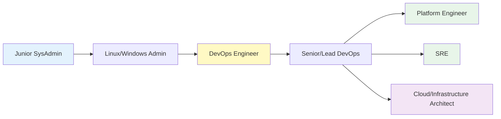
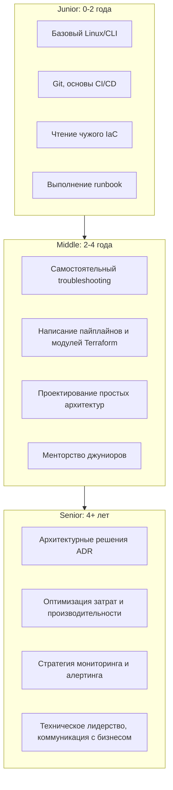
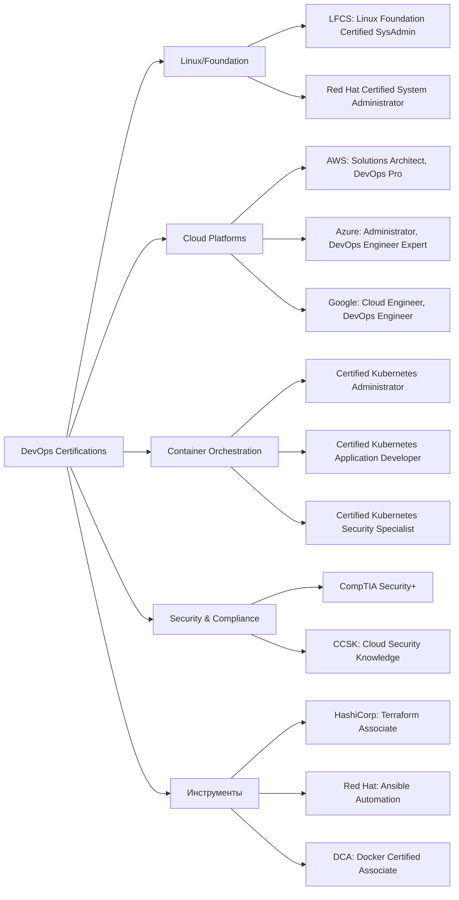
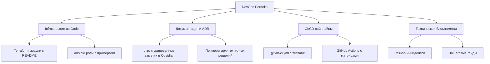
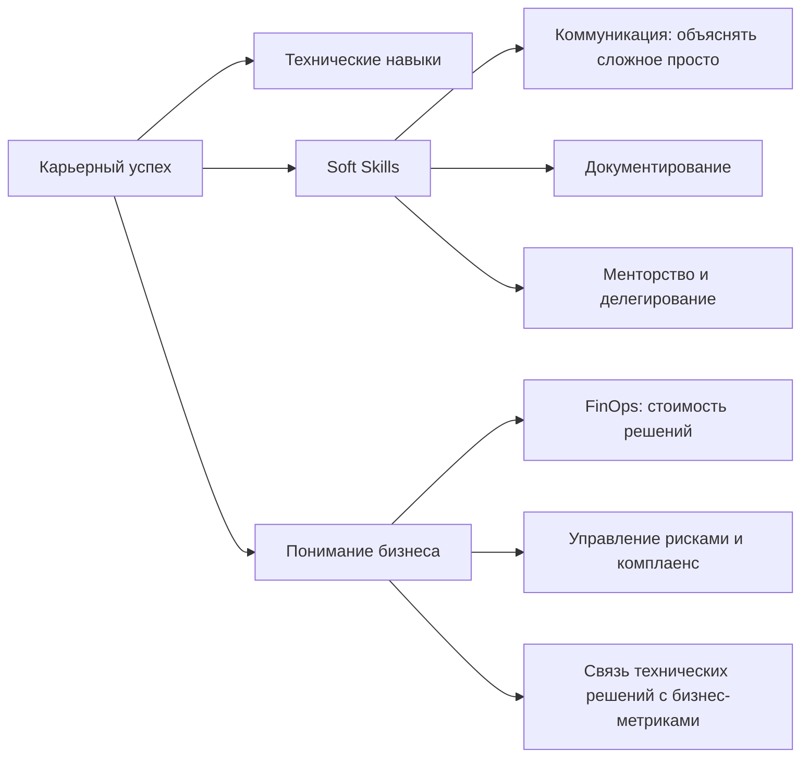

RHCSA/CE, CCNA/CCNP, LFCS, CompTIA.

## Введение

Построение карьеры в DevOps и системном администрировании — это не просто изучение инструментов, а развитие **T-shaped навыков**: глубокая экспертиза в одной области (вертикаль) плюс широкий контекст смежных дисциплин (горизонталь). Понимание путей развития и роли сертификаций помогает осознанно планировать обучение и избегать «синдрома самозванца».

>[!INFO] Связь с предыдущими темами
>Успешная карьера строится на фундаментальных знаниях: [[Synced/DevOps/Сетевое и системное администрирование/0. Введение и методология/1. Принцип работы ОС.md | принципы работы ОС]], [[Synced/DevOps/Сетевое и системное администрирование/0. Введение и методология/2. Методология Troubleshooting.md | методология диагностики]] и [[Synced/DevOps/Сетевое и системное администрирование/0. Введение и методология/4. Основы проектирования отказоустойчивой инфраструктуры.md | проектирование надежных систем]] — это база, которую ожидают от кандидата на любом уровне.

## 1. Карьерные треки в инфраструктуре и DevOps

### Эволюция ролей: от админа до архитектора

### Сравнение ключевых ролей

| Роль                                | Фокус                            | Ключевые навыки                               | Типичные задачи                                                   |
| ----------------------------------- | -------------------------------- | --------------------------------------------- | ----------------------------------------------------------------- |
| **System Administrator**            | Стабильность хостов              | Linux/Windows, сети, бэкапы, мониторинг       | Установка ОС, настройка сервисов, реакция на инциденты            |
| **DevOps Engineer**                 | Автоматизация доставки           | CI/CD, IaC, контейнеры, scripting             | Пайплайны, Terraform, Docker, интеграция инструментов             |
| **SRE (Site Reliability Engineer)** | Надежность через инженерию       | SLO/SLI, capacity planning, chaos engineering | Определение error budgets, автоматизация toil, постмортемы        |
| **Platform Engineer**               | Внутренняя платформа как продукт | Kubernetes, GitOps, self-service APIs         | Построение Internal Developer Platform, абстракция инфраструктуры |
| **Cloud Architect**                 | Стратегия и проектирование       | Multi-cloud, cost optimization, security      | Архитектурные решения, ADR, миграция, governance                  |

>[!TIP] Пересечение ролей
>Границы между ролями размыты. В небольших командах один инженер может совмещать функции DevOps+SRE+Admin. Фокус на **результат** (стабильный сервис), а не на титул.

### Навыки по уровням (матрица компетенций)

## 2. Сертификации: зачем, какие и когда

### Философия сертификаций в DevOps

| Аргумент «За»                                                   | Аргумент «Против»                                   |
| --------------------------------------------------------------- | --------------------------------------------------- |
| Структурирует обучение по четкой программе                      | Не заменяет практический опыт                       |
| Подтверждает базовые знания для HR/рекрутеров                   | Некоторые экзамены устаревают быстрее, чем выдаются |
| Требуется для партнерских статусов компаний (AWS Partner, etc.) | Дорого и требует времени на подготовку              |
| Помогает систематизировать пробелы в знаниях                    | Реальная работа ≠ тестовые сценарии экзамена        |

>[!WARNING] Ловушка «collect them all» Не гонитесь за количеством сертификатов. **Одна глубокая сертификация + портфолио реальных проектов** ценнее пяти поверхностных.

### Карта сертификаций по доменам

### Приоритизация сертификаций для старта

| Стаж         | Рекомендуемые сертификации                      | Почему                                          |
| ------------ | ----------------------------------------------- | ----------------------------------------------- |
| **0-1 год**  | LFCS/RHCSA, Terraform Associate                 | Фундамент Linux + востребованный IaC-инструмент |
| **1-3 года** | CKA, AWS/Azure Associate                        | Контейнеры + облака — ядро современного DevOps  |
| **3-5 лет**  | AWS/Azure Professional, CKS                     | Углубление в архитектуру и безопасность         |
| **5+ лет**   | Специализированные (FinOps, SRE) или менторство | Лидерство, стратегия, нишевая экспертиза        |

>[!LINK] Подготовка к CKA
>Практические навыки для CKA формируются при изучении [[Synced/DevOps/Контейнеризация и оркестрация/3. Kubernetes (Архитектура и основные компоненты)/1. Control Plane (Мастер-узлы)/1. kube-apiserver.md | компонентов Kubernetes]] и [[Synced/DevOps/Контейнеризация и оркестрация/9. Эксплуатация и Troubleshooting (Day-2 Operations)/2. Диагностика и отладка/2. Ключевые команды.md | ключевых команд kubectl]].

## 3. Портфолио и практический опыт

### Почему GitHub > сертификат для технического интервью

Рекрутер может отфильтровать по сертификату, но **техлид нанимает по коду**. Ваше портфолио должно демонстрировать:

### Чеклист «продающего» репозитория

Что должно быть в вашем pet-проекте:

- [ ] README.md с описанием: что деплоим, зачем, архитектура (Mermaid-диаграмма)
- [ ] Инструкции по запуску: `make up`, `terraform apply`, `docker-compose up`
- [ ] Переменные окружения через `.env.example` (не секреты!)
- [ ] Примеры конфигураций: Prometheus alerts, Grafana dashboards, Nginx conf
- [ ] Тесты: хотя бы базовые `terraform validate`, `ansible-lint`, `shellcheck`
- [ ] CI-пайплайн: линтеры + план Terraform при PR
- [ ] Ссылки на связанные темы: [[Synced/DevOps/IaC/1. HashiCorp Terraform (Основы)/4. Жизненный цикл.md | жизненный цикл TF]], [[Synced/DevOps/CI-CD, артефакты, тестирование и DevSecOps/2. Платформы автоматизации/2. GitLab CI-CD/2. Настройка yml конфигурации.md | GitLab CI config]]

>[!TIP] Начинайте с малого
>Не пытайтесь сразу воссоздать production-кластер. Начните с: «Деплой статического сайта на S3 + CloudFront + Terraform». Затем добавьте: CI/CD, мониторинг, алерты. Итеративное усложнение — ключ к устойчивому прогрессу.

## 4. Непрерывное обучение и сообщества

### Стратегия обучения: 70-20-10

| Источник         | Доля                                                                   | Примеры                                                                                                                                                                                                             |
| ---------------- | ---------------------------------------------------------------------- | ------------------------------------------------------------------------------------------------------------------------------------------------------------------------------------------------------------------- |
| **70% Practice** | Работа над реальными задачами, pet-проекты, contribution в open-source | Написание модуля Terraform для внутреннего инструмента, фикс бага в экспортере Prometheus                                                                                                                           |
| **20% Social**   | Менторство, код-ревью, митапы, конференции                             | Участие в DevOps Days, ведение внутреннего tech talk, ответы на Stack Overflow                                                                                                                                      |
| **10% Formal**   | Курсы, сертификации, книги, документация                               | Подготовка к CKA, чтение [[Synced/DevOps/Облачные сервисы и модели (XaaS)/0. Фундаментальные концепции облачных вычислений/1. Определение облачных вычислений (NIST).md \| Определение облачных вычислений (NIST)]] |

### Ресурсы для роста

| Тип                | Ресурс                                                                                                                | Фокус                         |
| ------------------ | --------------------------------------------------------------------------------------------------------------------- | ----------------------------- |
| **Документация**   | [Kubernetes Docs](https://kubernetes.io/docs/), [Terraform Registry](https://registry.terraform.io/)                  | Reference, best practices     |
| **Практика**       | [Katacoda](https://www.katacoda.com/), [Killercoda](https://killercoda.com/), [AWS Workshops](https://workshops.aws/) | Интерактивные сценарии        |
| **Сообщества**     | DevOps Reddit, Kubernetes Slack, Russian DevOps Telegram                                                              | Вопросы, нетворкинг, вакансии |
| **Блоги/Подкасты** | DevOps Toolkit, ArgoCon talks, High Scalability                                                                       | Архитектурные кейсы, тренды   |
| **Книги**          | «The DevOps Handbook», «Site Reliability Engineering», «Designing Data-Intensive Applications»                        | Фундаментальные принципы      |

>[!INFO] Локализация контента
>Для доступа к документации Terraform и другим ресурсам без VPN используйте [[Synced/DevOps/Сетевое и системное администрирование/1. Операционные системы/1. Linux/7. Управление пакетами/1. Debian, Ubuntu/3. Репозитории.md | настройку локальных зеркал]] или официальные offline-версии, если доступны.

## 5. Soft skills для инфраструктурного инженера

### Технические навыки ≠ успех в карьере

### Критичные soft skills по уровням

| Навык                | Junior                       | Middle                        | Senior+                                          |
| -------------------- | ---------------------------- | ----------------------------- | ------------------------------------------------ |
| **Коммуникация**     | Четко формулировать проблему | Вести диалог с разработчиками | Презентовать архитектуру стейкхолдерам           |
| **Документирование** | Следовать шаблонам runbook   | Создавать понятные инструкции | Разрабатывать стандарты документации для команды |
| **Принятие решений** | Выполнять по инструкции      | Предлагать варианты решения   | Брать ответственность за архитектурный выбор     |
| **Менторство**       | Задавать вопросы             | Помогать джуниорам с задачами | Развивать команду, проводить 1:1, код-ревью      |

>[!TIP] Правило 5 минут
>Если вы не можете объяснить проблему или решение за 5 минут простыми словами — вы сами до конца не понимаете тему. Практикуйтесь в упрощении сложных концепций.

## 6. Планирование развития: личный roadmap

### Шаблон индивидуального плана развития (IDP)

Цель на 6 месяцев: Переход на позицию Middle DevOps

🔹 Технические цели
- [ ] Пройти CKA сертификацию (дедлайн: Q3)
  - Ресурсы: [[Synced/DevOps/Контейнеризация и оркестрация/3. Kubernetes (Архитектура и основные компоненты)/1. Control Plane (Мастер-узлы)/1. kube-apiserver.md | изучение компонентов]], Killercoda сценарии
- [ ] Реализовать GitOps-пайплайн для pet-проекта
  - Инструменты: [[Synced/DevOps/GitOps/2. ArgoCD/1. Архитектура и основы/1. Компоненты.md | ArgoCD]], [[Synced/DevOps/CI-CD, артефакты, тестирование и DevSecOps/2. Платформы автоматизации/2. GitLab CI-CD/2. Настройка yml конфигурации.md | GitLab CI]]
- [ ] Углубить знания по мониторингу
  - Темы: [[Synced/DevOps/Мониторинг, логирование и трассировка (Observability)/1. Сбор и хранение метрик/1. Prometheus.md | Prometheus]], [[Synced/DevOps/Мониторинг, логирование и трассировка (Observability)/1. Сбор и хранение метрик/4. Сборщики метрик/1. Node Exporter.md | Node Exporter]]

🔹 Soft skills цели
- [ ] Провести 2 внутренних tech talk для команды
- [ ] Написать 3 поста в внутренний wiki с разбором инцидентов

🔹 Метрики успеха
- ✅ Сертификат CKA получен
- ✅ Pet-проект с GitOps задеплоен и документирован
- ✅ Положительный фидбек от команды после презентаций

### Ретроспектива и корректировка

>[!INFO] Quarterly Review Каждые 3 месяца пересматривайте свой IDP:
>1. Что удалось выполнить? Почему?
>2. Что не получилось? Какие препятствия?
>3. Изменились ли приоритеты бизнеса/команды?
>4. Какие новые технологии появились в вашей области?

---
## Контрольные вопросы для самопроверки

1. В чем ключевое различие между ролями DevOps Engineer и SRE? Когда компании стоит нанимать SRE вместо DevOps?
2. Почему портфолио с реальными проектами часто важнее сертификатов для технического интервьюера?
3. Как применить принцип 70-20-10 для планирования изучения новой технологии (например, Service Mesh)?
4. Какие три soft skills наиболее критичны для перехода с позиции Middle на Senior DevOps?
5. Как объяснить бизнесу необходимость инвестиций в отказоустойчивость, используя метрики RTO/RPO?
6. Что должно быть в README.md вашего pet-проекта, чтобы он произвел впечатление на техлида за 30 секунд просмотра?
7. Как часто стоит пересматривать свой карьерный roadmap и какие сигналы должны触发 корректировку плана?

---

#devops #career #certifications #learning-path #cka #terraform #kubernetes #soft-skills #portfolio #mentorship #sre #platform-engineering #professional-development #idp #community