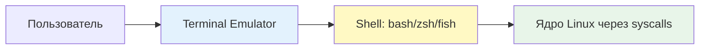
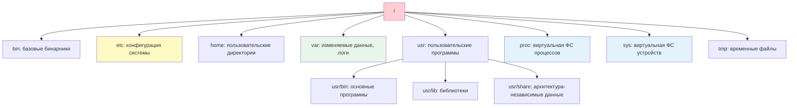
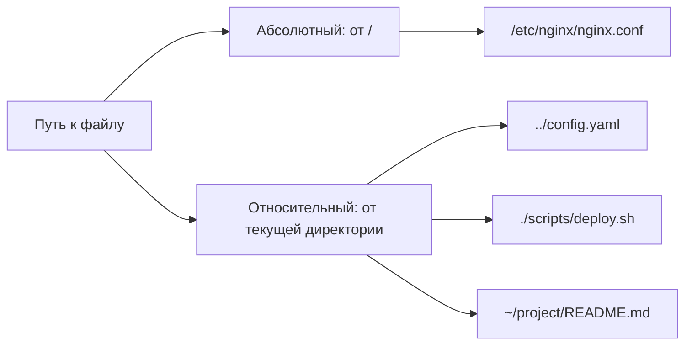

## Введение

Терминал (command-line interface, CLI) — это основной интерфейс взаимодействия DevOps-инженера с Linux-системами. Понимание принципов работы оболочки (shell), навигации по файловой системе и базовых операций с файлами — это **фундамент**, без которого невозможна эффективная автоматизация, диагностика и управление инфраструктурой.

> [!INFO] Связь с предыдущими темами Навыки работы в терминале критичны для применения [[Synced/DevOps/Сетевое и системное администрирование/0. Введение и методология/2. Методология Troubleshooting.md | методологии troubleshooting]] и понимания [[Synced/DevOps/Сетевое и системное администрирование/0. Введение и методология/1. Принцип работы ОС.md | принципов работы ОС]], так как большинство системных утилит и логов доступны именно через CLI.

## 1. Терминал, консоль, shell: в чем разница?



|Термин|Описание|Пример|
|---|---|---|
|**Консоль (TTY)**|Физический или виртуальный текстовый интерфейс|`tty1`-`tty6`, `pts/0` для SSH|
|**Terminal Emulator**|Программа, эмулирующая терминал в GUI|GNOME Terminal, Konsole, Alacritty, WezTerm|
|**Shell**|Интерпретатор команд, оболочка между пользователем и ОС|`bash`, `zsh`, `fish`, `sh`|
|**Prompt**|Строка приглашения ввода, показывает контекст|`user@host:~/project$`|
### Проверка текущего окружения

```bash
# Какой shell используется сейчас
echo $SHELL
# Текущий TTY
tty
# Версия bash
bash --version
# Список доступных shell в системе
cat /etc/shells
```

> [!TIP] Смена shell Для временной смены оболочки: `zsh`. Для постоянной: `chsh -s /usr/bin/zsh` (требуется logout/login). Список популярных shell — в [[Synced/DevOps/Сетевое и системное администрирование/1. Операционные системы/1. Linux/6. Редакторы и среда/3. Shell окружение.md | настройке shell окружения]].

## 2. Структура файловой системы Linux (FHS)

### Иерархия ключевых директорий



| Директория | Назначение                                            | DevOps use-case                                                    |
| ---------- | ----------------------------------------------------- | ------------------------------------------------------------------ |
| `/etc`     | Конфигурационные файлы системы и сервисов             | Правка `sshd_config`, `nginx.conf`, `systemd` юнитов               |
| `/var/log` | Логи приложений и системных сервисов                  | Анализ инцидентов: `journalctl`, `tail -f /var/log/syslog`         |
| `/var/lib` | Данные сервисов: БД, пакеты, состояния                | Бэкап PostgreSQL: `/var/lib/postgresql`, Docker: `/var/lib/docker` |
| `/home`    | Домашние директории пользователей                     | SSH-ключи: `~/.ssh`, конфиги CLI: `~/.aws`, `~/.kube`              |
| `/tmp`     | Временные файлы (очищаются при перезагрузке)          | Промежуточные артефакты сборки, тестовые данные                    |
| `/proc`    | Виртуальная ФС: информация о процессах и ядре         | Диагностика: `cat /proc/<PID>/status`, `cat /proc/meminfo`         |
| `/sys`     | Виртуальная ФС: информация об устройствах и драйверах | Tuning: `echo 1 > /sys/block/sda/queue/iosched/...`                |
| `/opt`     | Стороннее ПО, установленное вручную                   | Установка бинарников: Terraform, kubectl, Helm                     |

>[!LINK] Связь с управлением пакетами Установка пакетов в разные директории зависит от пакетного менеджера: `apt`/`dpkg` — в [[Synced/DevOps/Сетевое и системное администрирование/1. Операционные системы/1. Linux/7. Управление пакетами/1. Debian, Ubuntu/1. apt.md | apt]], `rpm`/`dnf` — в [[Synced/DevOps/Сетевое и системное администрирование/1. Операционные системы/1. Linux/7. Управление пакетами/2. RHEL, CentOS, Rocky, AlmaLinux/1. dnf.md | dnf]].

## 3. Базовые команды навигации и работы с файлами

### Навигация по директориям

```bash
# Показать текущую директорию
pwd

# Список файлов и директорий
ls -la          # все файлы, включая скрытые, с деталями
ls -lh /var/log # человеческий формат размеров
ls -t /tmp      # сортировка по времени изменения

# Переход между директориями
cd /var/log     # абсолютный путь
cd ../lib       # относительный путь (на уровень выше)
cd ~            # в домашнюю директорию
cd -            # вернуться в предыдущую директорию

# Автодополнение путей: TAB — ваш лучший друг
cd /var/log/<TAB>  # покажет варианты
```

### Операции с файлами и директориями

| Команда    | Назначение                                      | Пример                                             |
| ---------- | ----------------------------------------------- | -------------------------------------------------- |
| `mkdir -p` | Создание директории с родителями                | `mkdir -p project/{src,tests,docs}`                |
| `touch`    | Создание пустого файла или обновление timestamp | `touch file.txt`, `touch -t 202601011200 file.txt` |
| `cp -r`    | Копирование файлов/директорий                   | `cp -r config/ backup/config_$(date +%F)`          |
| `mv`       | Перемещение или переименование                  | `mv old_name.txt new_name.txt`                     |
| `rm -rf`   | Удаление (**осторожно!**)                       | `rm -rf /tmp/build/*`                              |
| `ln -s`    | Создание символической ссылки                   | `ln -s /var/log/app /home/user/app-logs`           |

> [!WARNING] Опасные команды
> - `rm -rf /` — удалит всю файловую систему
> - `rm -rf *` в корне домашней директории — удалит все файлы
> - Всегда проверяйте путь перед выполнением деструктивных команд: `echo rm -rf /путь/к/файлам`

### Просмотр содержимого файлов

```bash
# Короткие файлы
cat config.yaml

# Файлы с постраничным выводом
less /var/log/syslog    # навигация: стрелки, /поиск, q-выход
more /var/log/auth.log  # упрощенная версия less

# Первые/последние строки
head -n 20 app.log      # первые 20 строк
tail -n 50 app.log      # последние 50 строк
tail -f app.log         # режим реального времени (follow)
tail -F app.log         # follow с обработкой ротации логов

# Поиск по содержимому
grep "ERROR" app.log
grep -r "config" /etc/  # рекурсивный поиск
grep -i "error" *.log   # без учета регистра
```

> [!TIP] Эффективный просмотр логов Комбинируйте `tail -f` с `grep` для фильтрации в реальном времени:

```bash
tail -f /var/log/app.log | grep --line-buffered "ERROR\|Exception"
```

## 4. Пути: абсолютные, относительные, специальные

### Типы путей



|Обозначение|Значение|Пример|
|---|---|---|
|`/`|Корень файловой системы|`/etc`, `/usr/bin`|
|`~`|Домашняя директория текущего пользователя|`~/.ssh/id_rsa`|
|`.`|Текущая директория|`./script.sh`|
|`..`|Родительская директория|`../config.yaml`|
|`-`|Предыдущая директория (для `cd`)|`cd -`|

## 5. Права доступа и владение (basics)

### Отображение прав: `ls -l`

```bash
$ ls -l /etc/nginx/nginx.conf
-rw-r--r-- 1 root root 2.4K Jan 15 10:30 /etc/nginx/nginx.conf
```

```
[-][rwx][rwx][rwx] [links] [owner] [group] [size] [date] [path]
 |    |    |    |
 |    |    |    +-- Others: read
 |    |    +------- Group: read
 |    +------------ Owner: read+write
 +----------------- Тип: - (файл), d (директория), l (ссылка)
```