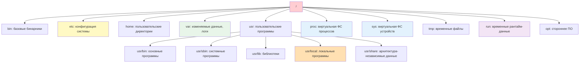
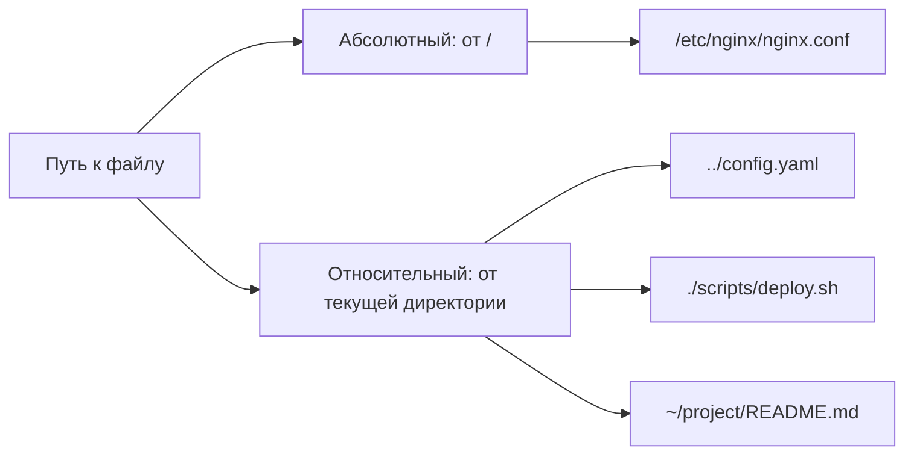

## Введение

Терминал (command-line interface, CLI) — это основной интерфейс взаимодействия DevOps-инженера с Linux-системами. Понимание принципов работы оболочки (shell), навигации по файловой системе и базовых операций с файлами — это **фундамент**, без которого невозможна эффективная автоматизация, диагностика и управление инфраструктурой.

> [!INFO] Связь с предыдущими темами Навыки работы в терминале критичны для применения [[Synced/DevOps/Сетевое и системное администрирование/0. Введение и методология/2. Методология Troubleshooting.md | методологии troubleshooting]] и понимания [[Synced/DevOps/Сетевое и системное администрирование/0. Введение и методология/1. Принцип работы ОС.md | принципов работы ОС]], так как большинство системных утилит и логов доступны именно через CLI.

## 1. Терминал, консоль, shell: в чем разница?


|Термин|Описание|Пример|
|---|---|---|
|**Консоль (TTY)**|Физический или виртуальный текстовый интерфейс|`tty1`-`tty6`, `pts/0` для SSH|
|**Terminal Emulator**|Программа, эмулирующая терминал в GUI|GNOME Terminal, Konsole, Alacritty, WezTerm|
|**Shell**|Интерпретатор команд, оболочка между пользователем и ОС|`bash`, `zsh`, `fish`, `sh`|
|**Prompt**|Строка приглашения ввода, показывает контекст|`user@host:~/project$`|

| Термин                    | Описание                                                     | Пример           |
| ------------------------- | ------------------------------------------------------------ | ---------------- |
| **TTY** (TeleTYpewriter)  | Исторический термин, сейчас обозначает любой текстовый сеанс | `tty`, `pts/2`   |
| **PTY** (Pseudo-Terminal) | Программный терминал, создаваемый эмулятором или SSH         | `pts/0`, `pts/1` |

**Типы shell по происхождению**

| Shell    | Особенности                                                                |
| -------- | -------------------------------------------------------------------------- |
| **sh**   | Минималистичный, POSIX-стандарт, используется в скриптах для переносимости |
| **bash** | Самый распространённый, есть автодополнение, история, job control          |
| **zsh**  | Расширенное автодополнение, темы, плагины (стал стандартом на macOS)       |
| **fish** | Умный синтаксис и подсказки "из коробки", но не совместим с bash-скриптами |

>[!NOTE] **shebang** (`#!/bin/bash` в скриптах) — это указание, какой shell интерпретирует файл.

### Проверка текущего окружения

```bash
# Какой shell используется сейчас
echo $SHELL
# Текущий TTY
tty
# Версия bash
bash --version
# Список доступных shell в системе
cat /etc/shells
```

> [!TIP] Смена shell Для временной смены оболочки: `zsh`. Для постоянной: `chsh -s /usr/bin/zsh` (требуется logout/login). Список популярных shell — в [[Synced/DevOps/Сетевое и системное администрирование/1. Операционные системы/1. Linux/6. Редакторы и среда/3. Shell окружение.md | настройке shell окружения]].

> [!NOTE] В строке приглашения `user@host:~/project$`:
> - `~` — это домашняя директория, _сокращение_, а не реальный путь.
> - Символ `$` говорит, что ты обычный пользователь, `#` — root. Это **критично** для безопасности (чтобы случайно не вводить опасные команды под root). 

## 2. Структура файловой системы Linux (FHS)

### Иерархия ключевых директорий



>[!NOTE] Симлинки в современных системах  
В дистрибутивах начиная с Ubuntu 20.04, RHEL 8+, Debian 10+ директории `/bin`, `/sbin`, `/lib` являются символическими ссылками на соответствующие директории в `/usr`. Это сделано для упрощения структуры. На практике все бинарники в `/usr/bin/`, все системные утилиты — в `/usr/sbin/`.

| Директория   | Назначение                                            | DevOps use-case                                                                                                                                |
| ------------ | ----------------------------------------------------- | ---------------------------------------------------------------------------------------------------------------------------------------------- |
| `/etc`       | Конфигурационные файлы системы и сервисов             | Правка `sshd_config`, `nginx.conf`, `systemd` юнитов. Всегда делай бэкап перед правкой: `cp /etc/nginx/nginx.conf{,.bak}`                      |
| `/var/log`   | Логи приложений и системных сервисов                  | Анализ инцидентов: `journalctl`, `tail -f /var/log/syslog`. Первое место при отладке                                                           |
| `/var/lib`   | Данные сервисов: БД, пакеты, состояния                | Бэкап PostgreSQL: `/var/lib/postgresql`, Docker: `/var/lib/docker`. При удалении пакета через `apt remove` данные здесь часто **не удаляются** |
| `/home`      | Домашние директории пользователей                     | SSH-ключи: `~/.ssh`, конфиги CLI: `~/.aws`, `~/.kube`                                                                                          |
| `/tmp`       | Временные файлы (очищаются при перезагрузке)          | Промежуточные артефакты сборки, тестовые данные. На некоторых системах монтируется как `tmpfs` (в ОЗУ) — большие файлы не клади                |
| `/run`       | Временные рантайм-данные (tmpfs в ОЗУ)                | PID-файлы и сокеты работающих сервисов (Docker, MySQL, systemd). Очищается при каждой загрузке                                                 |
| `/proc`      | Виртуальная ФС: информация о процессах и ядре         | Диагностика: `cat /proc/<PID>/status`, `cat /proc/meminfo`, `cat /proc/loadavg`. Только для чтения                                             |
| `/sys`       | Виртуальная ФС: информация об устройствах и драйверах | Управление железом: `echo 0 > /sys/devices/system/cpu/cpu1/online`. Требует осторожности                                                       |
| `/opt`       | Стороннее ПО, установленное вручную                   | Установка бинарников: Terraform, kubectl, Helm                                                                                                 |
| `/usr/bin`   | Основные программы, установленные пакетным менеджером | `apt`, `dnf`, `pip` кладут сюда исполняемые файлы                                                                                              |
| `/usr/sbin`  | Системные утилиты для администрирования               | `fdisk`, `iptables`, `systemctl` — обычно требуют прав root                                                                                    |
| `/usr/local` | Программы, скомпилированные/установленные вручную     | Бинарники из исходников или скачанные вручную. Имеет приоритет в `PATH` перед `/usr/bin`                                                       |
| `/usr/share` | Архитектурно-независимые данные                       | Документация, иконки, примеры конфигов, временные зоны (`/usr/share/zoneinfo`)                                                                 |

>[!LINK] Связь с управлением пакетами Установка пакетов в разные директории зависит от пакетного менеджера: `apt`/`dpkg` — в [[Synced/DevOps/Сетевое и системное администрирование/1. Операционные системы/1. Linux/7. Управление пакетами/1. Debian, Ubuntu/1. apt.md | apt]], `rpm`/`dnf` — в [[Synced/DevOps/Сетевое и системное администрирование/1. Операционные системы/1. Linux/7. Управление пакетами/2. RHEL, CentOS, Rocky, AlmaLinux/1. dnf.md | dnf]].

>[!TIP] Где искать конфиги?
>1. Системные сервисы → `/etc/<service>/`
>2. Пользовательские настройки → `~/.config/` или `~/.*` (скрытые файлы).
>3. Временная конфигурация → `/run/<service>/` (пересоздаётся при старте)

## 3. Базовые команды навигации и работы с файлами

### Навигация по директориям

```bash
# Показать текущую директорию
pwd

# Список файлов и директорий
ls -la          # все файлы, включая скрытые, с деталями
ls -lh /var/log # человеческий формат размеров
ls -t /tmp      # сортировка по времени изменения

# Переход между директориями
cd /var/log     # абсолютный путь
cd ../lib       # относительный путь (на уровень выше)
cd ~            # в домашнюю директорию
cd -            # вернуться в предыдущую директорию

# Автодополнение путей: TAB — ваш лучший друг
cd /var/log/<TAB>  # покажет варианты
```

### Операции с файлами и директориями

| Команда    | Назначение                                      | Пример                                             |
| ---------- | ----------------------------------------------- | -------------------------------------------------- |
| `mkdir -p` | Создание директории с родителями                | `mkdir -p project/{src,tests,docs}`                |
| `touch`    | Создание пустого файла или обновление timestamp | `touch file.txt`, `touch -t 202601011200 file.txt` |
| `cp -r`    | Копирование файлов/директорий                   | `cp -r config/ backup/config_$(date +%F)`          |
| `mv`       | Перемещение или переименование                  | `mv old_name.txt new_name.txt`                     |
| `rm -rf`   | Удаление (**осторожно!**)                       | `rm -rf /tmp/build/*`                              |
| `ln -s`    | Создание символической ссылки                   | `ln -s /var/log/app /home/user/app-logs`           |

> [!WARNING] Опасные команды
> - `rm -rf /` — удалит всю файловую систему
> - `rm -rf *` в корне домашней директории — удалит все файлы
> - Всегда проверяйте путь перед выполнением деструктивных команд: `echo rm -rf /путь/к/файлам`

### Просмотр содержимого файлов

```bash
# Короткие файлы
cat config.yaml

# Файлы с постраничным выводом
less /var/log/syslog    # навигация: стрелки, /поиск, q-выход
more /var/log/auth.log  # упрощенная версия less

# Первые/последние строки
head -n 20 app.log      # первые 20 строк
tail -n 50 app.log      # последние 50 строк
tail -f app.log         # режим реального времени (follow)
tail -F app.log         # follow с обработкой ротации логов

# Поиск по содержимому
grep "ERROR" app.log
grep -r "config" /etc/  # рекурсивный поиск
grep -i "error" *.log   # без учета регистра
```

> [!TIP] Эффективный просмотр логов Комбинируйте `tail -f` с `grep` для фильтрации в реальном времени:

```bash
tail -f /var/log/app.log | grep --line-buffered "ERROR\|Exception"
```

## 4. Пути: абсолютные, относительные, специальные

### Типы путей



|Обозначение|Значение|Пример|
|---|---|---|
|`/`|Корень файловой системы|`/etc`, `/usr/bin`|
|`~`|Домашняя директория текущего пользователя|`~/.ssh/id_rsa`|
|`.`|Текущая директория|`./script.sh`|
|`..`|Родительская директория|`../config.yaml`|
|`-`|Предыдущая директория (для `cd`)|`cd -`|

## 5. Права доступа и владение (basics)

### Отображение прав: `ls -l`

```bash
$ ls -l /etc/nginx/nginx.conf
-rw-r--r-- 1 root root 2.4K Jan 15 10:30 /etc/nginx/nginx.conf
```

Разбор строки:

```
[-][rwx][rwx][rwx] [links] [owner] [group] [size] [date] [path]
 |    |    |    |
 |    |    |    +-- Others: read
 |    |    +------- Group: read
 |    +------------ Owner: read+write
 +----------------- Тип: - (файл), d (директория), l (ссылка)
```

### Базовые команды управления правами

```bash
# Изменение прав (chmod): символьный режим
chmod u+x script.sh      # добавить execute владельцу
chmod go-w config.yaml   # убрать write у группы и others
chmod a+r README.md      # добавить read всем

# Изменение прав: числовой режим (octal)
chmod 755 script.sh      # rwxr-xr-x
chmod 644 config.yaml    # rw-r--r--
chmod 600 secret.key     # rw------- (только владелец)

# Изменение владельца (chown)
chown www-data:www-data /var/www/html
chown -R user:group ./project  # рекурсивно

# Изменение только группы (chgrp)
chgrp developers /shared/docs
```

| Права   | Число | Символ | Описание                                     |
| ------- | ----- | ------ | -------------------------------------------- |
| read    | 4     | r      | Чтение файла / список директории             |
| write   | 2     | w      | Запись в файл / создание файлов в директории |
| execute | 1     | x      | Выполнение файла / вход в директорию         |

> [!WARNING] Опасные изменения прав
> 
> - `chmod -R 777 /` — откроет доступ ко всей системе, критичная уязвимость
> - Неправильные права на `/etc/sudoers` могут заблокировать sudo
> - Всегда проверяйте результат: `ls -l <файл>` после изменения

> [!LINK] Продвинутые темы Детали работы с ACL, SUID/SGID, capabilities — в [[Synced/DevOps/Сетевое и системное администрирование/1. Операционные системы/1. Linux/8. Пользователи, группы, аутентификация/5. ACL.md | ACL]] и [[Synced/DevOps/Сетевое и системное администрирование/1. Операционные системы/1. Linux/15. Безопасность хоста/2. File capabilities вместо SUID.md | capabilities]].

## 6. Поиск файлов и контента

### Поиск по имени и атрибутам: `find`

```bash
# Найти все .log файлы в /var
find /var -name "*.log"

# Найти файлы, измененные за последние 24 часа
find /etc -mtime -1

# Найти файлы больше 100MB
find /home -type f -size +100M

# Найти и удалить старые временные файлы
find /tmp -type f -name "*.tmp" -mtime +7 -delete

# Найти и выполнить команду над результатами
find . -name "*.sh" -exec chmod +x {} \;
```

### Поиск по содержимому: `grep` + `find`

```bash
# Рекурсивный поиск строки в файлах
grep -r "api_key" /home/user/project/

# Только в файлах определенного типа
grep -r --include="*.yaml" "password" ./configs/

# Игнорировать бинарные файлы и скрытые директории
grep -r --exclude-dir={.git,node_modules} "TODO" .

# Комбинация find + grep для сложных сценариев
find /var/log -name "*.log" -exec grep -l "ERROR" {} \;
```

### Быстрый поиск по имени: `locate`

```bash
# Обновить базу данных файлов (требует прав)
sudo updatedb

# Мгновенный поиск по имени
locate nginx.conf
locate -i error.log  # без учета регистра
```

>[!TIP] Производительность поиска
>- `find` — сканирует ФС в реальном времени, точный, но медленный на больших объемах
>- `locate` — использует предварительно построенную базу, быстрый, но может быть неактуальным
>- Для разработки: используйте `fd` (rust-альтернатива `find`) или `ripgrep` (`rg`) для поиска по содержимому

## 7. Работа с архивами и сжатием

### Основные утилиты

|Утилита|Назначение|Пример|
|---|---|---|
|`tar`|Архивирование (без сжатия или с)|`tar -czf backup.tar.gz /data`|
|`gzip`/`gunzip`|Сжатие/распаковка .gz|`gzip large.log`, `gunzip file.gz`|
|`zip`/`unzip`|ZIP-архивы (кросс-платформенные)|`zip -r project.zip ./src`|
|`rsync`|Синхронизация файлов с дельта-передачей|`rsync -avz src/ user@host:backup/`|
### Практические примеры с `tar`

```bash
# Создать архив с сжатием gzip
tar -czf backup-$(date +%F).tar.gz /var/lib/postgresql

# Создать архив с исключением паттернов
tar -czf code.tar.gz --exclude='*.log' --exclude='node_modules' ./project

# Просмотреть содержимое архива без распаковки
tar -tzf archive.tar.gz

# Распаковать в конкретную директорию
tar -xzf archive.tar.gz -C /restore/path

# Извлечь только определенные файлы
tar -xzf backup.tar.gz var/log/app/error.log
```

>[!LINK] Бэкапы и восстановление Стратегии резервного копирования и инструменты — в [[Synced/DevOps/Базы данных и хранилища/7. Эксплуатация, HA и проксирование/2. Резервное копирование и восстановление/1. Стратегии.md | стратегиях бэкапа]] и [[Synced/DevOps/Сетевое и системное администрирование/1. Операционные системы/1. Linux/9. Файловые системы и диски/6. Проверка и восстановление.md | восстановлении ФС]].

## 8. Переменные окружения и алиасы

### Работа с переменными

```bash
# Просмотр всех переменных
env
printenv

# Просмотр конкретной переменной
echo $PATH
echo $HOME

# Установка переменной (только для текущей сессии)
export APP_ENV=production
export API_KEY="secret123"

# Установка переменной только для одной команды
API_KEY=secret ./deploy.sh

# Постоянные переменные: добавление в ~/.bashrc или ~/.zshrc
echo 'export PATH="$HOME/bin:$PATH"' >> ~/.bashrc
source ~/.bashrc  # применить изменения
```

### Алиасы для ускорения работы

```bash
# Временный алиас (текущая сессия)
alias ll='ls -lah'
alias ..='cd ..'
alias k='kubectl'

# Постоянные алиасы: ~/.bash_aliases или ~/.bashrc
echo "alias gs='git status'" >> ~/.bash_aliases
echo "alias tf='terraform'" >> ~/.bash_aliases

# Алиасы с аргументами (функции)
mkcd() { mkdir -p "$1" && cd "$1"; }
# Использование: mkcd new-project/src
```

>[!TIP] Портативность скриптов В скриптах избегайте зависимостей от алиасов — они не работают в non-interactive shell. Используйте полные команды или функции.

## 9. История команд и эффективный ввод

### Управление историей

```bash
# Просмотр истории
history
history | grep terraform

# Поиск по истории в реальном времени: Ctrl+R
# Нажать Ctrl+R, начать вводить команду, повторять Ctrl+R для перебора

# Повтор последней команды
!!
# Повтор последней команды с sudo
sudo !!

# Выполнить команду по номеру из history
!123

# Очистить историю
history -c
```

### Горячие клавиши для продуктивности

| Комбинация          | Действие                                 |
| ------------------- | ---------------------------------------- |
| `Ctrl+A` / `Ctrl+E` | В начало / в конец строки                |
| `Ctrl+Left/Right`   | Перемещение по словам                    |
| `Ctrl+W`            | Удалить слово перед курсором             |
| `Ctrl+U`            | Удалить от курсора до начала строки      |
| `Ctrl+K`            | Удалить от курсора до конца строки       |
| `Ctrl+L`            | Очистить экран (аналог `clear`)          |
| `Ctrl+C`            | Прервать текущую команду                 |
| `Ctrl+Z`            | Отправить процесс в фон (suspend)        |
| `fg` / `bg`         | Вернуть процесс на передний план / в фон |

>[!LINK] Продвинутая настройка shell Кастомизация prompt, плагины, автодополнение — в [[Synced/DevOps/Сетевое и системное администрирование/1. Операционные системы/1. Linux/6. Редакторы и среда/3. Shell окружение.md | настройке shell окружения]].

## 10. Практические сценарии для DevOps

### Сценарий 1: Быстрая диагностика проблемы

```bash
# 1. Где мы?
pwd
# 2. Что в директории?
ls -lah
# 3. Есть ли логи?
ls -lh /var/log/app/
# 4. Последние ошибки?
tail -n 50 /var/log/app/error.log | grep -i exception
# 5. Кто владеет файлами?
ls -l /var/log/app/ | head -5
# 6. Достаточно ли места?
df -h /var
```

### Сценарий 2: Подготовка окружения для деплоя

```bash
# Создать структуру проекта
mkdir -p ~/deploy/{configs,scripts,logs}
cd ~/deploy

# Скопировать конфигурацию с сохранением прав
cp -p /etc/nginx/nginx.conf ./configs/

# Создать скрипт деплоя с правильными правами
touch scripts/deploy.sh
chmod 755 scripts/deploy.sh

# Установить переменные окружения для сессии
export DEPLOY_ENV=staging
export DEPLOY_LOG=~/deploy/logs/deploy.log

# Запустить с логированием
./scripts/deploy.sh 2>&1 | tee -a $DEPLOY_LOG
```

### Сценарий 3: Очистка и архивация старых данных

```bash
# Найти логи старше 30 дней
find /var/log/app -name "*.log" -mtime +30 -type f

# Архивировать их перед удалением
find /var/log/app -name "*.log" -mtime +30 -type f \
  -exec tar -rzf old-logs-$(date +%F).tar.gz {} \;

# Удалить оригиналы после успешного архивирования
find /var/log/app -name "*.log" -mtime +30 -type f -delete

# Проверить размер архива
ls -lh old-logs-*.tar.gz
```

>[!TIP] Автоматизация рутины Повторяющиеся сценарии оформляйте как скрипты или Ansible-роли: [[Synced/DevOps/IaC/6. Ansible (Продвинутые практики)/1. Роли и Коллекции.md | Роли и Коллекции Ansible]].


## Контрольные вопросы для самопроверки

1. В чем разница между абсолютным и относительным путем? Когда целесообразно использовать каждый из них в скриптах?
2. Что означает строка прав `drwxr-x---` и кто может выполнять операции с такой директорией?
3. Как найти все файлы `.conf`, измененные за последние 3 дня, и скопировать их в бэкап-директорию одной командой?
4. Почему `rm -rf *` может быть опасен даже в домашней директории? Как защитить себя от случайного удаления?
5. Как добавить новую переменную окружения так, чтобы она сохранялась после перезагрузки терминала?
6. В чем разница между `tar -czf` и `tar -xzf`? Как извлечь из архива только один конкретный файл?
7. Как использовать `tail -f` и `grep` вместе для мониторинга ошибок в реальном времени без лишних строк?
8. Почему алиасы не работают внутри bash-скриптов по умолчанию и как это обойти?

---

#devops #linux #terminal #cli #filesystem #bash #navigation #permissions #find #grep #tar #rsync #environment-variables #aliases #shell #fundamentals #sysadmin