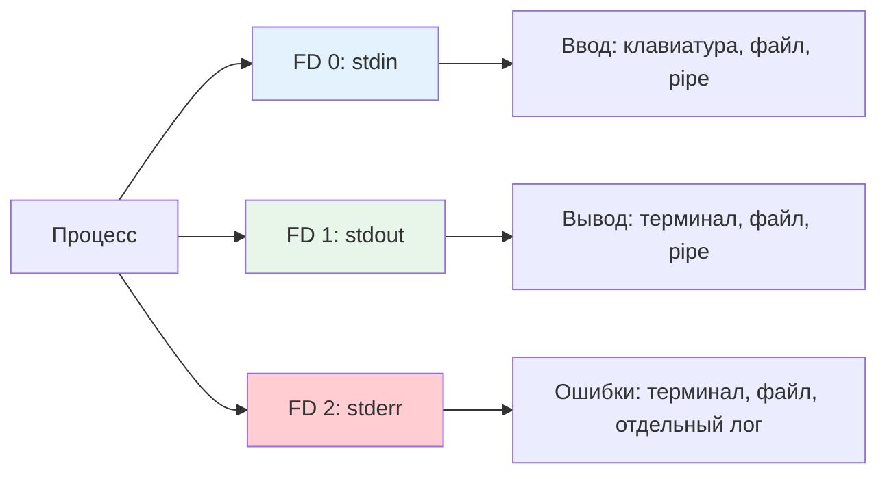

## Введение

Понимание потоков ввода-вывода (I/O streams) и механизмов их перенаправления — это **ключевой навык** для любого DevOps-инженера, работающего с Linux. Эти концепции лежат в основе конвейерной обработки данных, автоматизации через скрипты, логирования и отладки. Умение грамотно комбинировать команды через пайплайны (`|`) и управлять потоками (`>`, `2>&1`, `<<`) позволяет создавать мощные однострочники и надежные скрипты.

>[!INFO] Связь с предыдущими темами Работа с потоками напрямую опирается на [[Synced/DevOps/Сетевое и системное администрирование/1. Операционные системы/1. Linux/1. Основы работы в терминале и навигация по ФС.md | базовые навыки CLI]] и является фундаментом для [[Synced/DevOps/Сетевое и системное администрирование/1. Операционные системы/1. Linux/4. Bash скрипты.md | написания скриптов]] и [[Synced/DevOps/Сетевое и системное администрирование/0. Введение и методология/2. Методология Troubleshooting.md | диагностики проблем]].

## 1. Три стандартных потока: теория

### Файловые дескрипторы в Unix-like системах

Каждый процесс при запуске получает три открытых файловых дескриптора (FD):



|Поток|FD|Назначение|По умолчанию|
|---|---|---|---|
|**stdin**|0|Входные данные для команды|Клавиатура (`/dev/tty`)|
|**stdout**|1|Нормальный вывод команды|Терминал (`/dev/tty`)|
|**stderr**|2|Сообщения об ошибках и диагностике|Терминал (`/dev/tty`)|
### Почему stderr отделен от stdout?

> [!TIP] Практическая ценность разделения. Разделение позволяет:
> 
> 1. Логировать ошибки отдельно от полезных данных
> 2. Видеть ошибки даже когда stdout перенаправлен в файл
> 3. Фильтровать ошибки через `grep` независимо от основного вывода
> 4. Не «ломать» пайплайны, когда одна команда выводит ошибку

```bash
# Пример: вывод и ошибка разделены
ls /existing /nonexistent 2>/dev/null
/existing    # stdout: показан
# ошибка "No such file" скрыта в stderr → /dev/null
```

## 2. Операторы перенаправления

### Базовые операторы

|Оператор|Описание|Пример|
|---|---|---|
|`>`|Перенаправить stdout в файл (**перезапись**)|`echo "log" > file.txt`|
|`>>`|Перенаправить stdout в файл (**добавление**)|`echo "new line" >> file.txt`|
|`2>`|Перенаправить stderr в файл|`cmd 2> errors.log`|
|`2>>`|Добавить stderr в файл|`cmd 2>> errors.log`|
|`&>`|Перенаправить stdout и stderr в файл (bash 4+)|`cmd &> all.log`|
|`>file 2>&1`|Классический способ объединить потоки|`cmd > all.log 2>&1`|
|`<`|Перенаправить stdin из файла|`sort < unsorted.txt`|
|`<<EOF`|Here-document: ввод до метки|`cat <<EOF > file.txt`|

### Порядок имеет значение!

```bash
# ❌ Неправильно: stderr перенаправляется ДО объединения
command > output.log 2>&1
# stdout → output.log, затем stderr → текущий stdout (терминал)

# ✅ Правильно: сначала объединяем, потом перенаправляем
command 2>&1 > output.log
# stderr → stdout, затем оба → output.log

# ✅ Современный синтаксис (bash 4+)
command &> output.log
```

>[!WARNING] Частая ошибка Операторы обрабатываются **слева направо**. `>file 2>&1` и `2>&1 >file` дают разный результат.

### Практические примеры

```bash
# Сохранить только вывод, ошибки показать в терминале
./deploy.sh > deploy.log

# Сохранить только ошибки, вывод показать
./deploy.sh 2> errors.log

# Сохранить всё в один файл
./deploy.sh &> full.log

# Сохранить вывод в один файл, ошибки — в другой
./deploy.sh > output.log 2> errors.log

# Добавить вывод в конец файла, ошибки игнорировать
./deploy.sh >> output.log 2>/dev/null

# Полностью подавить весь вывод (тихий режим)
./deploy.sh &>/dev/null

# Перенаправить stderr в stdout, затем в pipe
./deploy.sh 2>&1 | grep -i "error\|fail"
```

## 3. Пайплайны (Pipes): конвейерная обработка

### Принцип работы pipe (`|`)


- stdout первой команды становится stdin второй
- stderr **не передается** через pipe по умолчанию
- Команды выполняются **параллельно** (конвейер)

### Цепочки пайплайнов

```bash
# Классический пример: поиск процесса
ps aux | grep nginx | grep -v grep | awk '{print $2}'

# Разбор:
# 1. ps aux → список всех процессов
# 2. grep nginx → оставить только строки с "nginx"
# 3. grep -v grep → исключить строку с самим grep
# 4. awk '{print $2}' → вывести только PID (второе поле)

# Логи: фильтрация + агрегация
tail -f /var/log/nginx/access.log \
  | grep " 5[0-9][0-9] " \
  | awk '{print $1}' \
  | sort \
  | uniq -c \
  | sort -rn \
  | head -10
# Результат: топ-10 IP, получивших 5xx ошибки
```

### Обработка stderr в пайплайне

```bash
# Передать и stdout, и stderr дальше по пайплайну
command 2>&1 | grep "ERROR"

# Только stderr в пайплайн, stdout в терминал
command 2>&1 1>/dev/null | grep "ERROR"

# Разделить потоки: stdout в файл, stderr в пайплайн
command > output.log 2>&1 | tee -a errors.log
```

>[!TIP] Отладка пайплайнов Для пошаговой отладки сложного пайплайна временно заменяйте `|` на `| tee stepN.log`:

```bash
cmd1 | tee step1.log | cmd2 | tee step2.log | cmd3
```

## 4. Here-document и Here-string

### Here-document (`<<`)

Позволяет передавать многострочный ввод в команду:

```bash
# Базовый синтаксис
cat <<EOF > config.yaml
server:
  port: 8080
  host: localhost
EOF

# Без подстановки переменных (одинарные кавычки у метки)
cat <<'EOF' > template.sh
# Этот $VAR не будет подставлен
echo "Hello $USER"
EOF

# С подстановкой переменных (по умолчанию)
NAME="prod"
cat <<EOF > env.txt
Environment: $NAME
EOF
# Результат: Environment: prod
```

### Here-string (`<<<`)

Короткая форма для передачи одной строки:

```bash
# Вместо echo + pipe
echo "hello world" | wc -w
# Можно написать:
wc -w <<< "hello world"

# Использование с grep
grep -o "error" <<< "This is an error message"
error
```

>[!LINK] Связь с автоматизацией Here-documents активно используются в [[Synced/DevOps/IaC/5. Ansible (Основы)/6. Шаблоны.md | Ansible шаблонах]] и [[Synced/DevOps/CI-CD, артефакты, тестирование и DevSecOps/2. Платформы автоматизации/2. GitLab CI-CD/2. Настройка yml конфигурации.md | CI/CD скриптах]] для генерации конфигов «на лету».

