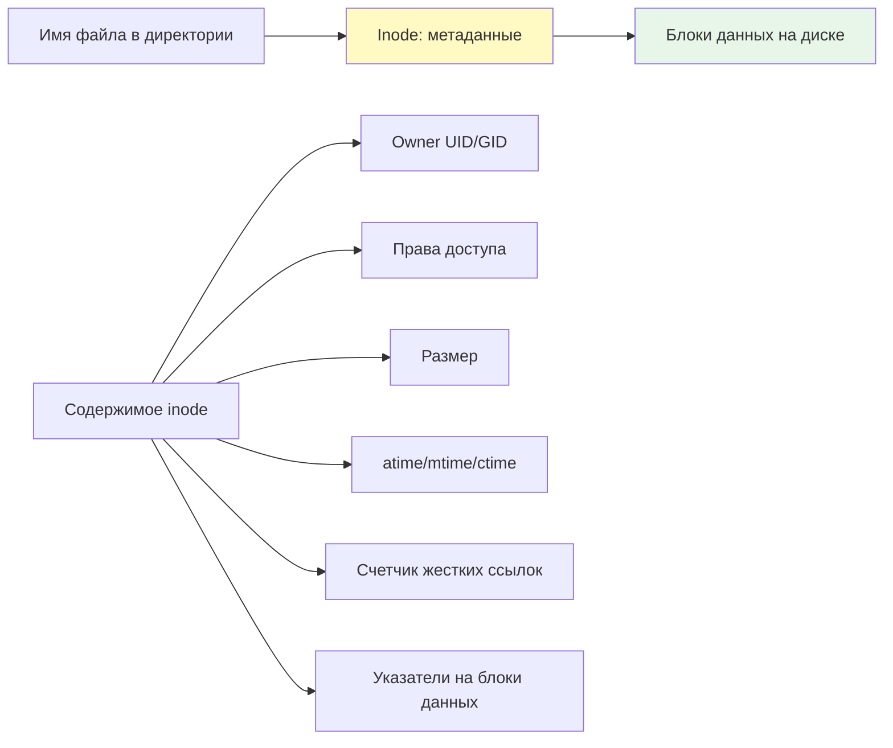
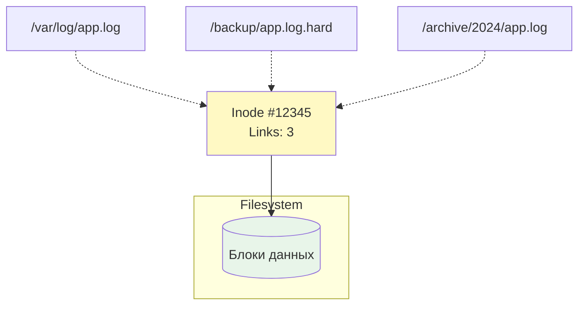

## Введение

Ссылки в Linux — это механизм, позволяющий нескольким именам файлов указывать на одни и те же данные на диске. Понимание различий между жесткими (hard) и символическими (soft/symlink) ссылками критично для DevOps-инженера: от управления конфигурациями и версионирования до оптимизации хранения и создания надежных скриптов деплоя.

>[!INFO] Связь с предыдущими темами Работа со ссылками опирается на понимание [[Synced/DevOps/Сетевое и системное администрирование/1. Операционные системы/1. Linux/1. Основы работы в терминале и навигация по ФС.md | структуры файловой системы]] и [[Synced/DevOps/Сетевое и системное администрирование/0. Введение и методология/1. Принцип работы ОС.md | концепции inode]], так как именно inode является ключевым элементом в механизме жестких ссылок.

## 1. Inode: фундаментальная единица файловой системы

### Что такое inode?

Каждый файл в Linux описывается структурой данных **inode** (index node), которая хранит метаданные, но не имя файла и не содержимое:



### Просмотр информации об inode

```bash
# Номер inode файла
ls -li /etc/nginx/nginx.conf
# 1234567 -rw-r--r-- 1 root root 2.4K Jan 15 10:30 /etc/nginx/nginx.conf
# ^^^^^^^ это inode

# Детальная информация
stat /etc/nginx/nginx.conf

# Статистика по inode на файловой системе
df -i /
# Показывает использование inode, а не дискового пространства
```

| Поле в `stat`          | Описание                         | DevOps use-case                                 |
| ---------------------- | -------------------------------- | ----------------------------------------------- |
| `Device`               | ID устройства, где хранится файл | Проверка, что файлы на одном FS для hard links  |
| `Inode`                | Уникальный номер inode           | Идентификация файла независимо от имени         |
| `Links`                | Счетчик жестких ссылок           | Определение, есть ли другие имена у этого файла |
| `Access/Modify/Change` | Временные метки                  | Отладка проблем с кэшированием, бэкапами        |

>[!TIP] Ключевое ограничение Жесткие ссылки могут создаваться **только в пределах одной файловой системы**, так как inode уникальны только внутри FS. Символические ссылки этого ограничения не имеют.

## 2. Жесткие ссылки (Hard Links)

### Принцип работы

Жесткая ссылка — это **дополнительное имя файла**, которое указывает на тот же inode и те же данные:

