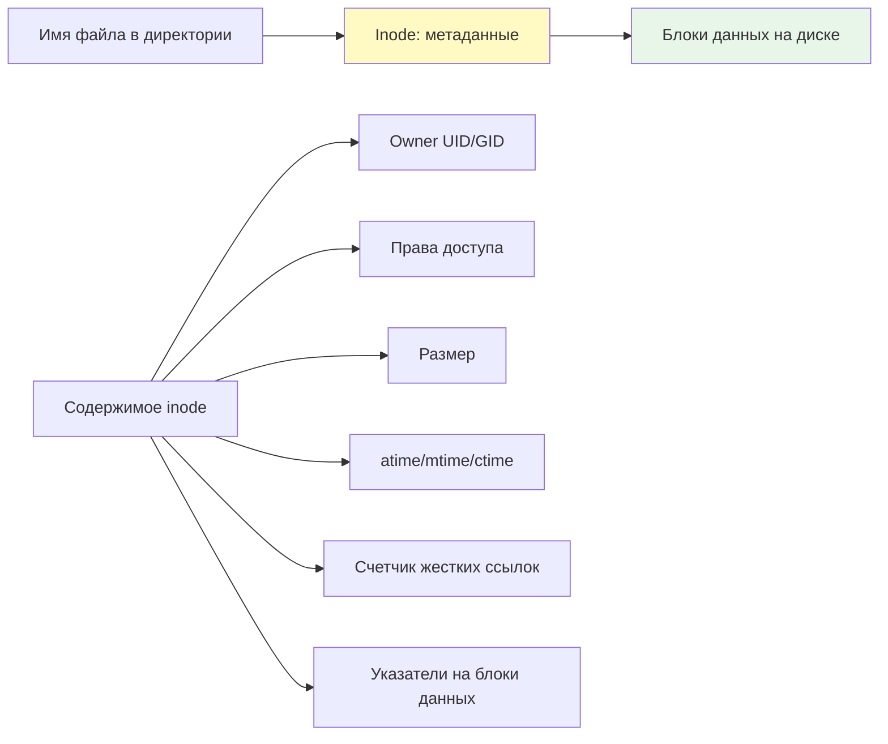
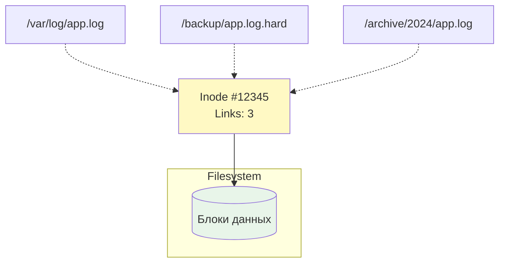
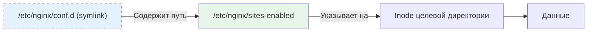
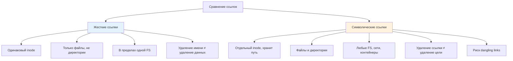
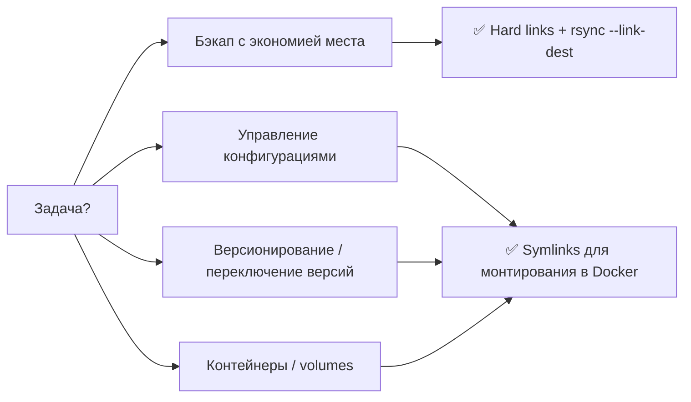

## Введение

Ссылки в Linux — это механизм, позволяющий нескольким именам файлов указывать на одни и те же данные на диске. Понимание различий между жесткими (hard) и символическими (soft/symlink) ссылками критично для DevOps-инженера: от управления конфигурациями и версионирования до оптимизации хранения и создания надежных скриптов деплоя.

>[!INFO] Связь с предыдущими темами Работа со ссылками опирается на понимание [[Synced/DevOps/Сетевое и системное администрирование/1. Операционные системы/1. Linux/1. Основы работы в терминале и навигация по ФС.md | структуры файловой системы]] и [[Synced/DevOps/Сетевое и системное администрирование/0. Введение и методология/1. Принцип работы ОС.md | концепции inode]], так как именно inode является ключевым элементом в механизме жестких ссылок.

## 1. Inode: фундаментальная единица файловой системы

### Что такое inode?

Каждый файл в Linux описывается структурой данных **inode** (index node), которая хранит метаданные, но не имя файла и не содержимое:



### Просмотр информации об inode

```bash
# Номер inode файла
ls -li /etc/nginx/nginx.conf
# 1234567 -rw-r--r-- 1 root root 2.4K Jan 15 10:30 /etc/nginx/nginx.conf
# ^^^^^^^ это inode

# Детальная информация
stat /etc/nginx/nginx.conf

# Статистика по inode на файловой системе
df -i /
# Показывает использование inode, а не дискового пространства
```

| Поле в `stat`          | Описание                         | DevOps use-case                                 |
| ---------------------- | -------------------------------- | ----------------------------------------------- |
| `Device`               | ID устройства, где хранится файл | Проверка, что файлы на одном FS для hard links  |
| `Inode`                | Уникальный номер inode           | Идентификация файла независимо от имени         |
| `Links`                | Счетчик жестких ссылок           | Определение, есть ли другие имена у этого файла |
| `Access/Modify/Change` | Временные метки                  | Отладка проблем с кэшированием, бэкапами        |

>[!TIP] Ключевое ограничение Жесткие ссылки могут создаваться **только в пределах одной файловой системы**, так как inode уникальны только внутри FS. Символические ссылки этого ограничения не имеют.

## 2. Жесткие ссылки (Hard Links)

### Принцип работы

Жесткая ссылка — это **дополнительное имя файла**, которое указывает на тот же inode и те же данные:



### Создание и проверка

```bash
# Создание жесткой ссылки
ln source_file hard_link_name

# Пример
ln /var/log/nginx/access.log /backup/access.log.hard

# Проверка: одинаковые inode и счетчик ссылок
ls -li /var/log/nginx/access.log /backup/access.log.hard
# 1234567 -rw-r--r-- 2 root root 1.2M ... access.log
# 1234567 -rw-r--r-- 2 root root 1.2M ... access.log.hard
# ^^^^^^^ одинаковый inode, Links: 2

# Просмотр всех жестких ссылок на inode (требует прав)
find / -inum 1234567 2>/dev/null
```

### Свойства жестких ссылок

|Характеристика|Описание|Последствия для DevOps|
|---|---|---|
|**Одинаковый inode**|Все жесткие ссылки — равноправные имена одного файла|Удаление одного имени не удаляет данные, пока `Links > 0`|
|**Счетчик ссылок**|Поле `Links` в inode увеличивается при создании ссылки|`rm` уменьшает счетчик; данные удаляются только при `Links: 0`|
|**Нет различия "оригинал/копия"**|Все имена равнозначны|Нельзя определить, какое имя было «первым»|
|**Только в пределах одной FS**|Нельзя создать hard link между разными разделами/дисками|Ограничение для стратегий бэкапа и архивации|
|**Не работают для директорий**|За исключением `.` и `..` (системные)|Нельзя использовать для «псевдо-клонирования» папок|

### Практические use-cases

#### Бэкап с экономией места: `rsync --link-dest`

```bash
# Создание инкрементального бэкапа с hard links для неизмененных файлов
rsync -av --delete --link-dest=/backup/weekly-1/ \
  /data/ /backup/weekly-2/

# Результат:
# - Измененные файлы копируются заново
# - Неизмененные файлы становятся hard links → экономят место
# - Каждый бэкап выглядит как полная копия, но занимает минимум доп. места
```

#### Атомарное обновление конфигураций

```bash
# 1. Создать новую версию конфига
cp nginx.conf.new /etc/nginx/.nginx.conf.new

# 2. Атомарно заменить активный конфиг через hard link + rename
ln /etc/nginx/.nginx.conf.new /etc/nginx/.nginx.conf.tmp
mv -f /etc/nginx/.nginx.conf.tmp /etc/nginx/nginx.conf

# Преимущество: процессы, держащие старый файл, продолжат работать с ним,
# пока не перезагрузят конфиг, а новые процессы получат обновленную версию
```

>[!WARNING] Опасности жестких ссылок
>- Неочевидное использование диска: файл занимает место, пока все жесткие ссылки не удалены
>- Сложность аудита: `find / -inum <inode>` требует прав root
>- Не работают с директориями — нельзя создать hard link на `/etc/nginx`

## 3. Символические ссылки (Symlinks, Soft Links)

### Принцип работы

Символическая ссылка — это **отдельный файл**, содержащий путь к целевому файлу:



### Создание и проверка

```bash
# Создание символической ссылки
ln -s target_path symlink_name

# Примеры
ln -s /etc/nginx/sites-available/default /etc/nginx/conf.d/default.conf
ln -s ../configs/app.yaml ./current-config.yaml  # относительный путь

# Проверка: стрелка в выводе ls -l
ls -l /etc/nginx/conf.d/default.conf
# lrwxrwxrwx 1 root root 35 Jan 15 10:30 default.conf -> /etc/nginx/sites-available/default
# ^ первая буква 'l' = link

# Узнать, куда ведет ссылка (разрешение цепочки)
readlink /etc/nginx/conf.d/default.conf
readlink -f /etc/nginx/conf.d/default.conf  # полное разрешение, включая цепочки
```

### Свойства символических ссылок

|Характеристика|Описание|Последствия для DevOps|
|---|---|---|
|**Отдельный inode**|Symlink имеет свой inode и размер (длина пути)|Удаление symlink не затрагивает целевой файл|
|**Хранит путь, а не данные**|Содержит текстовый путь (абсолютный или относительный)|Если целевой файл перемещен — ссылка «ломается» (dangling)|
|**Работают между FS**|Можно ссылаться на файлы в других разделах, NFS, Docker volumes|Гибкость для монтажа конфигураций, бэкапов, контейнеров|
|**Работают с директориями**|Можно создать symlink на папку|Удобно для унификации путей: `/opt/app/config` → `/etc/app`|
|**Рекурсивное разрешение**|Цепочка symlink разрешается до конечного файла|Риск циклических ссылок → бесконечный цикл при обходе|

### Диагностика проблем с symlinks

```bash
# Найти «битые» ссылки в директории
find /etc/nginx -type l ! -exec test -e {} \; -print

# Проверить всю цепочку разрешения
namei -l /path/to/symlink
# Покажет каждый шаг: права, владелец, тип на каждом уровне

# Проверить, является ли файл symlink в скрипте
if [ -L /path/to/file ]; then
    echo "Это символическая ссылка"
    target=$(readlink -f /path/to/file)
fi
```

>[!WARNING] Типичные ошибки
>- **Относительные пути**: `ln -s ../config.yaml link` может «сломаться», если переместить ссылку
>- **Циклические ссылки**: `ln -s /a/b /a/b/c` → `ls -lR /a` зависнет
>- **Права на symlink**: Права самой ссылки игнорируются, важны права целевого файла

## 4. Сравнение: Hard Links vs Symlinks

### Сводная таблица



|Критерий|Hard Link|Symlink|
|---|---|---|
|**Тип объекта**|Только файлы|Файлы, директории, устройства|
|**Cross-filesystem**|❌ Нет|✅ Да|
|**Целевой файл удален**|Данные доступны, пока `Links > 0`|Ссылка становится «битой» (dangling)|
|**Размер на диске**|Не занимает доп. места (кроме записи в директории)|Занимает место под хранение пути (~4K мин.)|
|**Производительность**|Прямой доступ к данным|Дополнительное разрешение пути|
|**Безопасность**|Нельзя создать на чужой файл без прав на директорию|Можно создать ссылку на любой доступный путь|
|**Use-case в DevOps**|Инкрементальные бэкапы, атомарные обновления|Управление конфигурациями, версионирование, контейнеры|

### Когда что использовать



## 5. Практические сценарии для DevOps

### Сценарий 1: Версионирование приложений с symlinks

```bash
# Структура деплоя
/opt/myapp/
├── releases/
│   ├── v1.2.0/
│   ├── v1.2.1/
│   └── v1.3.0/  # текущая
├── current -> releases/v1.3.0  # symlink для nginx/systemd
└── shared/
    ├── logs -> /var/log/myapp
    └── uploads -> /data/uploads

# Переключение на новую версию (атомарно)
ln -sfn /opt/myapp/releases/v1.3.1 /opt/myapp/current
# -s: symbolic, -f: заменить существующую, -n: если target — symlink

# В systemd unit:
# ExecStart=/opt/myapp/current/bin/myapp
# После переключения symlink — новый бинарник подхватится при рестарте
```

### Сценарий 2: Управление конфигурациями через symlinks

```bash
# Хранение конфигов в Git-репозитории
~/configs/
├── nginx/
│   ├── nginx.conf
│   └── sites/
│       └── myapp.conf
└── ansible/

# Создание ссылок в системные директории
ln -s ~/configs/nginx/nginx.conf /etc/nginx/nginx.conf
ln -s ~/configs/nginx/sites/myapp.conf /etc/nginx/sites-enabled/myapp.conf

# Преимущество: 
# - Конфиги версионируются в Git
# - Легко откатить: git checkout + перезагрузка сервиса
# - Единый источник истины для всех серверов

# Связь с IaC: автоматизация через Ansible
# [[Synced/DevOps/IaC/5. Ansible (Основы)/6. Шаблоны.md | Ansible шаблоны]]
# могут создавать symlinks при деплое конфигураций
```

### Сценарий 3: Инкрементальные бэкапы с hard links

```bash
#!/bin/bash
# backup-daily.sh

BACKUP_ROOT="/backup"
SOURCE="/data"
TODAY=$(date +%F)
YESTERDAY=$(date -d yesterday +%F)

# Создание новой директории бэкапа
mkdir -p "$BACKUP_ROOT/$TODAY"

# Rsync с hard links для неизмененных файлов
rsync -av --delete \
  --link-dest="$BACKUP_ROOT/$YESTERDAY" \
  "$SOURCE/" "$BACKUP_ROOT/$TODAY/"

# Результат:
# - Каждый бэкап — полная копия по структуре
# - Неизмененные файлы — hard links → экономят место
# - Измененные — новые копии
# - Удаление старого бэкапа не затронет файлы, используемые в новых

# Проверка экономии
du -sh "$BACKUP_ROOT"/*
# vs
du -sh --count-links "$BACKUP_ROOT"/*  # покажет реальное использование
```

### Сценарий 4: Docker volumes и symlinks

```bash
# Проблема: приложение пишет логи в /app/logs, но нужно собирать их через Fluent Bit
# Решение: symlink на host-путь

# В Dockerfile или docker-compose:
# volumes:
#   - ./host-logs:/var/log/app

# В entrypoint.sh контейнера:
if [ ! -L /app/logs ]; then
    ln -s /var/log/app /app/logs
fi

# Преимущество: приложение не требует изменений, логи собираются централизованно
# Связь с мониторингом: [[Synced/DevOps/Мониторинг, логирование и трассировка (Observability)/3. Сбор, хранение и анализ логов/2. Агенты сбора и доставки логов/1. Fluent Bit.md | Fluent Bit]]
```

## 6. Отладка и диагностика проблем со ссылками

### Поиск «битых» ссылок

```bash
# Найти все dangling symlinks в директории
find /etc -xtype l 2>/dev/null

# Детальная проверка с namei
namei -ov /path/to/symlink
# o: подробный вывод, v: verbose
# Покажет права и владельца на каждом уровне разрешения

# Проверка в скрипте перед использованием
if [ -L /path/to/link ] && [ ! -e /path/to/link ]; then
    echo "WARNING: Dangling symlink detected" >&2
    logger -t symlink-check "Broken link: /path/to/link"
fi
```

### Анализ использования hard links

```bash
# Найти файлы с множественными hard links
find /var -type f -links +1 -exec ls -li {} \; 2>/dev/null | head -20

# Проверить, какие файлы занимают место из-за hard links
# (du по умолчанию считает каждый hard link отдельно)
du -sh --count-links /backup/weekly-*

# Найти все имена для конкретного inode
inode=$(stat -c %i /path/to/file)
find / -inum $inode 2>/dev/null
```

### Циклические ссылки: обнаружение и предотвращение

```bash
# Обнаружение цикла при обходе (ls может зависнуть)
# Используйте find с ограничением глубины:
find /path -maxdepth 3 -type l -exec readlink -f {} \; 2>/dev/null

# В скриптах: защита от бесконечной рекурсии
resolve_link() {
    local path="$1"
    local max_depth=10
    local depth=0
    
    while [ -L "$path" ] && [ $depth -lt $max_depth ]; do
        path=$(readlink "$path")
        ((depth++))
    done
    
    if [ $depth -eq $max_depth ]; then
        echo "ERROR: Possible cyclic symlink" >&2
        return 1
    fi
    echo "$path"
}
```

> [!LINK] Связь с troubleshooting Диагностика проблем с путями и ссылками — часть [[Synced/DevOps/Сетевое и системное администрирование/0. Введение и методология/2. Методология Troubleshooting.md | методологии диагностики]], особенно при анализе «файл не найден» при наличии файла.

## 7. Безопасность и ограничения

### Потенциальные уязвимости

|Риск|Описание|Митигация|
|---|---|---|
|**Symlink race condition**|Атака TOCTOU: создание symlink между проверкой и использованием|Использовать `open()` с `O_NOFOLLOW`, атомарные операции|
|**Hard link privilege escalation**|Создание hard link на setuid-файл в writable директории|Монтировать noexec/nosuid на пользовательские разделы|
|**Dangling symlink leakage**|Ссылка на удаленный конфиденциальный файл|Регулярный аудит: `find / -xtype l`, мониторинг изменений|
|**Recursive symlink DoS**|Циклические ссылки → зависание сканеров/бэкапов|Ограничение глубины обхода (`find -maxdepth`), таймауты|

### Best practices

```bash
# 1. Создавайте symlinks с абсолютными путями в production
ln -s /opt/configs/app.yaml /etc/app/config.yaml  # ✅ надежнее
ln -s ../configs/app.yaml ./config.yaml           # ⚠️ может сломаться при перемещении

# 2. Проверяйте существование цели перед созданием ссылки
if [ -e /target/path ]; then
    ln -s /target/path /link/name
else
    echo "ERROR: Target does not exist" >&2
    exit 1
fi

# 3. Используйте -n флаг при обновлении ссылок, чтобы избежать рекурсии
ln -sfn /new/target /existing/symlink

# 4. Документируйте критичные symlinks в runbook
# [[Synced/DevOps/Сетевое и системное администрирование/0. Введение и методология/3. Документирование.md | Документирование]]
```

>[!INFO] Контейнеры и ссылки В Docker/Kubernetes symlinks могут вести себя неочевидно при монтировании volumes. Всегда тестируйте разрешение путей внутри контейнера: `docker exec <container> readlink -f /path`.

---

## Контрольные вопросы для самопроверки

1. В чем фундаментальная разница между hard link и symlink на уровне inode? Почему hard link не может ссылаться на директорию?
2. Что произойдет, если удалить исходный файл, на который указывает: а) hard link, б) symlink? Как это влияет на стратегии бэкапа?
3. Почему `rsync --link-dest` экономит место при инкрементальных бэкапах? Как проверить реальное использование диска с учетом hard links?
4. В чем риск использования относительных путей в symlinks? Когда их все же целесообразно применять?
5. Как обнаружить «битые» symlinks в системе? Какие команды покажут полную цепочку разрешения ссылки?
6. Почему hard links не работают между разными файловыми системами? Как это ограничение обходится в стратегиях хранения?
7. Как атомарно переключить версию приложения, используя symlink? Почему флаг `-sfn` критичен в этой операции?
8. Какие меры безопасности стоит предпринять при работе с symlinks в multi-user окружениях?

---

#devops #linux #filesystem #hard-link #symlink #inode #rsync #backup #versioning #configuration-management #troubleshooting #security #cli #fundamentals #storage-optimization