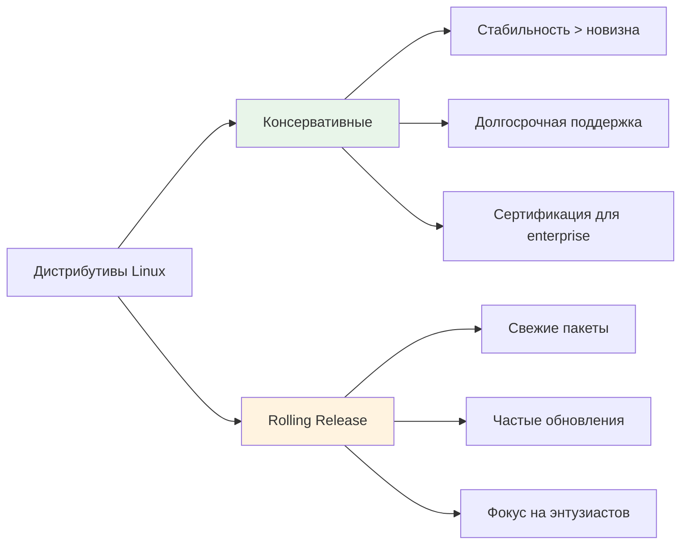
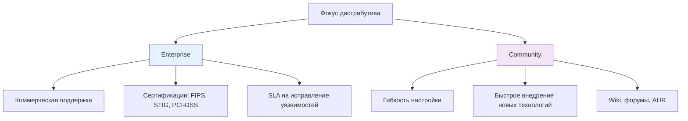
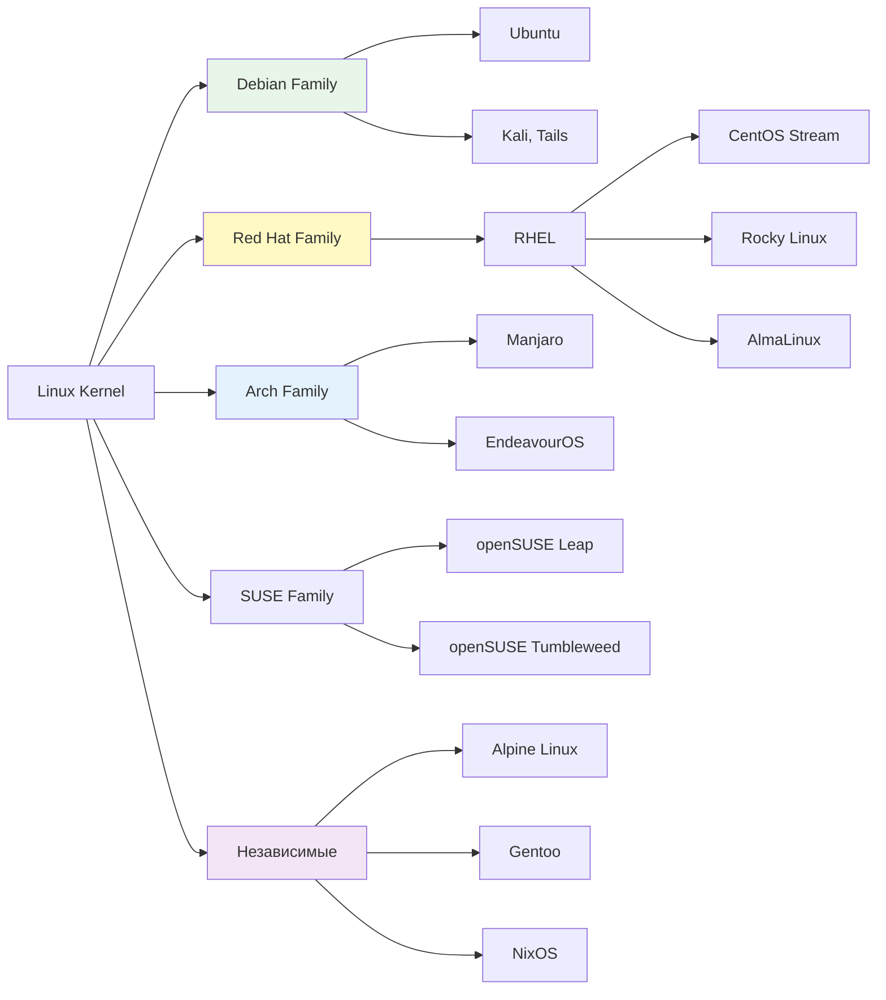
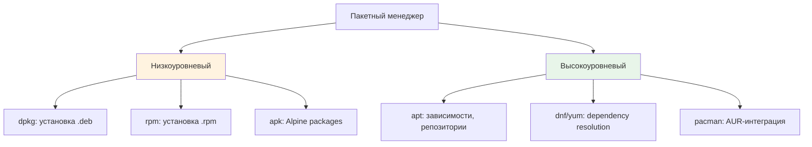
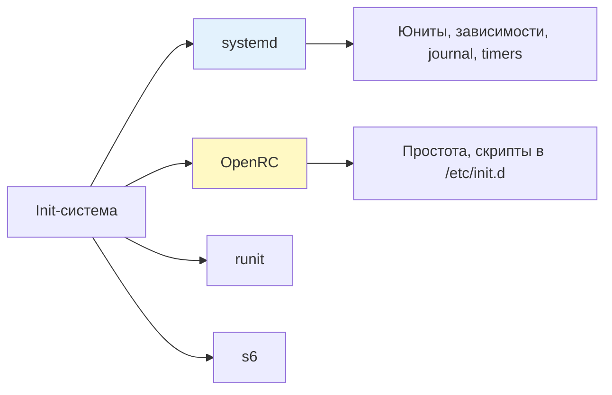
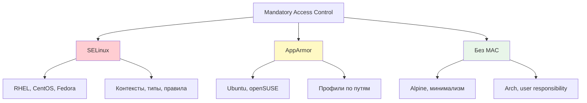
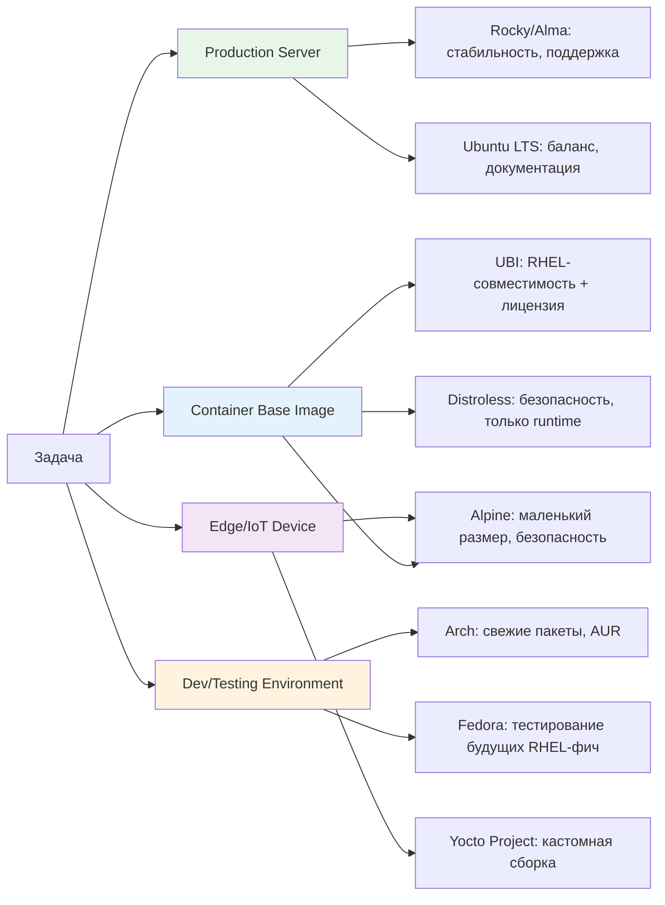
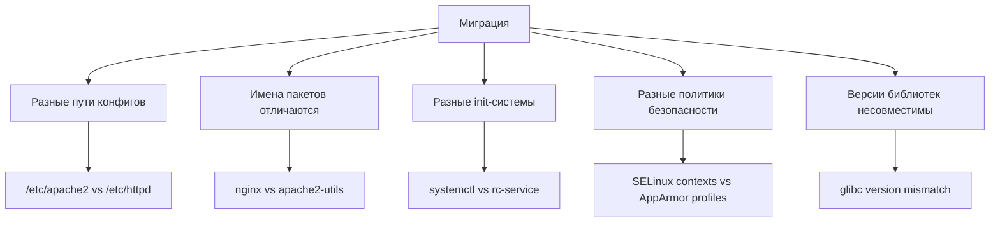

Linux — это ядро операционной системы, а не готовая ОС. Дистрибутив (дистрибуция) — это комплект на базе ядра Linux, включающий пакетный менеджер, набор предустановленных утилит, систему инициализации, политики безопасности и философию разработки. Для DevOps-инженера понимание различий между дистрибутивами критично: от выбора базового образа для контейнера до настройки CI/CD-пайплайнов под разные целевые платформы.

>[!INFO] Связь с предыдущими темами
>Знание различий дистрибутивов помогает применять [[Synced/DevOps/Сетевое и системное администрирование/1. Операционные системы/1. Linux/1. Основы работы в терминале и навигация по ФС.md | базовые навыки CLI]] и [[Synced/DevOps/Сетевое и системное администрирование/1. Операционные системы/1. Linux/4. Bash скрипты.md | скриптинг]] с учетом особенностей целевой системы, а также правильно использовать [[1. apt| пакетные менеджеры]].

## 1. Философия и модели релизов

### Консервативные vs Rolling-релизы



| Характеристика      | Консервативные (RHEL, Debian Stable)               | Rolling (Arch, openSUSE Tumbleweed)                         |
| ------------------- | -------------------------------------------------- | ----------------------------------------------------------- |
| **Цикл релизов**    | 2-5 лет между мажорными версиями                   | Непрерывные обновления                                      |
| **Версии пакетов**  | Заморожены на момент релиза, только security-патчи | Последние стабильные версии                                 |
| **Тестирование**    | Extensive QA, backporting патчей                   | Автоматизированное тестирование, быстрая доставка           |
| **Use-case DevOps** | Production-серверы, контейнеры, CI-раннеры         | Dev-окружения, тестирование новых фич, домашние лаборатории |
| **Риск обновлений** | Минимальный                                        | Требует внимания к changelogs                               |

### Enterprise-ориентированные vs Community-драйвенные



>[!TIP] Выбор для production
>Для критичных систем выбирайте дистрибутивы с [[Synced/DevOps/Сетевое и системное администрирование/0. Введение и методология/4. Основы проектирования отказоустойчивой инфраструктуры.md | гарантированным сроком поддержки]] и четким циклом обновлений. Для dev/test-окружений можно использовать rolling-релизы для раннего доступа к новым версиям инструментов.

## 2. Семейства дистрибутивов и их экосистемы

### Основные ветви развития



### Сравнительная таблица ключевых дистрибутивов

|Дистрибутив|Пакетный менеджер|Init-система|Релиз-цикл|Поддержка|Базовый образ Docker|
|---|---|---|---|---|---|
|**Debian Stable**|`apt`/`dpkg`|systemd|~2 года|5 лет LTS|`debian:bookworm-slim`|
|**Ubuntu LTS**|`apt`/`dpkg`|systemd|2 года|5-10 лет|`ubuntu:22.04`|
|**RHEL**|`dnf`/`rpm`|systemd|3-5 лет|10 лет|`registry.access.redhat.com/ubi9/ubi`|
|**Rocky/Alma**|`dnf`/`rpm`|systemd|Следует RHEL|10 лет|`rockylinux:9`, `almalinux:9`|
|**Alpine**|`apk`|OpenRC|Rolling|Community|`alpine:3.19`|
|**Arch**|`pacman`|systemd|Rolling|Community|`archlinux:latest` (официальный)|
|**openSUSE Leap**|`zypper`/`rpm`|systemd|~1 год|~3 года|`opensuse/leap:15.5`|

> [!LINK] Связь с контейнеризацией
> Выбор базового образа для Docker напрямую влияет на размер, безопасность и поддерживаемость: детали в [[Synced/DevOps/Контейнеризация и оркестрация/2. Сборка и оптимизация образов/2. Базовые образы.md | Базовые образы]].

## 3. Пакетные менеджеры: сравнение подходов

### Архитектура управления пакетами



### Сравнение команд для типовых операций

|Операция|Debian/Ubuntu (`apt`)|RHEL/Rocky (`dnf`)|Alpine (`apk`)|Arch (`pacman`)|
|---|---|---|---|---|
|**Обновить индекс**|`apt update`|`dnf check-update`|`apk update`|`pacman -Sy`|
|**Установить пакет**|`apt install nginx`|`dnf install nginx`|`apk add nginx`|`pacman -S nginx`|
|**Удалить пакет**|`apt remove nginx`|`dnf remove nginx`|`apk del nginx`|`pacman -R nginx`|
|**Поиск пакета**|`apt search nginx`|`dnf search nginx`|`apk search nginx`|`pacman -Ss nginx`|
|**Обновить систему**|`apt upgrade`|`dnf upgrade`|`apk upgrade`|`pacman -Su`|
|**Показать информацию**|`apt show nginx`|`dnf info nginx`|`apk info nginx`|`pacman -Qi nginx`|
|**Очистка кэша**|`apt clean`|`dnf clean all`|`apk cache clean`|`pacman -Sc`|

### Особенности и ограничения

```bash
# Debian/Ubuntu: pinning версий через /etc/apt/preferences.d/
# [[Synced/DevOps/Сетевое и системное администрирование/1. Операционные системы/1. Linux/7. Управление пакетами/1. Debian, Ubuntu/4. pinning.md | pinning]]

# RHEL: модули (module streams) для выбора версий ПО
dnf module list nginx
dnf module install nginx:1.24

# Alpine: статическая линковка, musl вместо glibc
# ⚠️ Не все бинарники совместимы с musl!

# Arch: AUR (Arch User Repository) для community-пакетов
# Требует осторожности: пакеты не проходят официальную валидацию
```

>[!WARNING] Совместимость бинарников
>Alpine использует `musl libc` вместо `glibc`. Скомпилированные под glibc бинарники (например, некоторые Node.js native modules) могут не работать в Alpine без пересборки. Для максимальной переносимости в контейнерах используйте `debian-slim` или `ubi-minimal`.

## 4. Системы инициализации и управления сервисами

### systemd vs альтернативы



| Дистрибутив   | Init-система          | Управление сервисами      | Логирование                        |
| ------------- | --------------------- | ------------------------- | ---------------------------------- |
| Debian/Ubuntu | systemd               | `systemctl`, `journalctl` | `journald` + опционально `rsyslog` |
| RHEL/Rocky    | systemd               | `systemctl`, `journalctl` | `journald` + `rsyslog`             |
| Alpine        | OpenRC                | `rc-service`, `rc-update` | `syslog-ng` или `busybox syslog`   |
| Arch          | systemd               | `systemctl`, `journalctl` | `journald`                         |
| Gentoo        | OpenRC (по умолчанию) | `rc-service`              | Настраивается пользователем        |

### Практические различия в управлении сервисами

```bash
# systemd (большинство дистрибутивов)
systemctl start nginx
systemctl enable nginx  # Автозапуск при загрузке
systemctl status nginx
journalctl -u nginx -f  # Просмотр логов юнита

# OpenRC (Alpine, Gentoo)
rc-service nginx start
rc-update add nginx default  # Автозапуск
rc-service nginx status
tail -f /var/log/nginx/error.log  # Традиционные логи
```

>[!LINK] Связь с эксплуатацией
>Детали работы с systemd и восстановление после сбоев — в [[1. Unit файлы| Systemd и загрузка]] и [[1. Модули ядра| Ядро и восстановление]].

## 5. Политики безопасности и compliance

### SELinux vs AppArmor vs без MAC



| Механизм     | Дистрибутивы                        | Сложность | Use-case DevOps                           |
| ------------ | ----------------------------------- | --------- | ----------------------------------------- |
| **SELinux**  | RHEL, Rocky, Fedora                 | Высокая   | Enterprise, compliance, изоляция сервисов |
| **AppArmor** | Ubuntu, openSUSE                    | Средняя   | Баланс безопасности и удобства            |
| **Без MAC**  | Alpine, Arch, Debian (по умолчанию) | Низкая    | Контейнеры, dev-окружения, минимализм     |

### Практическое влияние на DevOps-задачи

```bash
# SELinux: проверка статуса
getenforce
sestatus

# SELinux: разрешение доступа для веб-сервера
# Если nginx не может читать файлы в домашней директории:
chcon -R -t httpd_sys_content_t /home/user/webapp

# SELinux: отладка отказов
ausearch -m avc -ts recent | grep nginx
audit2allow -a  # Предложить правила для разрешения

# AppArmor: статус профилей
aa-status
aa-logprof  # Интерактивное создание правил по логам

# В контейнерах: часто отключают MAC для упрощения
# Но это снижает изоляцию! Лучше настраивать корректные политики.
```

>[!WARNING] Контейнеры и SELinux/AppArmor
>Docker/Podman могут применять контексты безопасности к томам. При проблемах с доступом к mounted-файлам проверьте:
>```bash
># Для SELinux
docker run -v /host/path:/container:Z ...  # :Z перемаркирует том
># Или отключить (не рекомендуется для production)
>docker run --security-opt label=disable ...
>```

## 6. Выбор дистрибутива для конкретных DevOps-задач

### Матрица выбора по сценариям



### Рекомендации по базовым образам для Docker

| Требование                    | Рекомендуемый образ                         | Почему                                            |
| ----------------------------- | ------------------------------------------- | ------------------------------------------------- |
| **Минимальный размер**        | `alpine:3.19` (~5 MB)                       | Идеален для serverless, edge                      |
| **Совместимость с glibc**     | `debian:bookworm-slim` (~80 MB)             | Большинство бинарников работают out-of-the-box    |
| **Enterprise compliance**     | `ubi9/ubi-minimal` (~75 MB)                 | RHEL-экосистема, бесплатная подписка              |
| **Python/Node.js приложения** | `python:3.12-slim-bookworm`, `node:20-slim` | Официальные образы на базе Debian, оптимизированы |
| **Максимальная безопасность** | `gcr.io/distroless/base-debian12`           | Нет shell, package manager — только runtime       |

>[!TIP] Multi-stage сборки 
>Используйте разные дистрибутивы на разных этапах:
>```dockerfile
># Этап сборки: debian с полными инструментами
FROM debian:bookworm AS builder
RUN apt update && apt install -y build-essential
COPY . /src
RUN cd /src && make
>
># Этап запуска: alpine для минимального размера
>FROM alpine:3.19
>COPY --from=builder /src/bin/app /app
>CMD ["/app"]
>```
>Детали в [[Synced/DevOps/Контейнеризация и оркестрация/2. Сборка и оптимизация образов/1. Multi-stage builds.md | Multi-stage builds]].

## 7. Миграция между дистрибутивами: подводные камни

### Общие проблемы при переходе



### Чеклист перед миграцией

```bash
# 1. Аудит установленных пакетов
# Debian → RHEL
dpkg --get-selections > packages.txt
# Затем сопоставить имена: nginx (deb) = nginx (rpm), но libapache2-mod-php ≠ php-apache

# 2. Проверка кастомных конфигов
find /etc -name "*.conf" -o -name "*.cfg" | xargs grep -l "custom"

# 3. Тестирование в изолированном окружении
# Использовать Vagrant, Docker или Proxmox для тестовой миграции

# 4. План отката
# Сохранить бэкапы: [[Synced/DevOps/Базы данных и хранилища/7. Эксплуатация, HA и проксирование/2. Резервное копирование и восстановление/1. Стратегии.md | стратегии бэкапа]]

# 5. Документирование различий
# Создать runbook для новой ОС: [[Synced/DevOps/Сетевое и системное администрирование/0. Введение и методология/3. Документирование.md | документирование]]
```

### Инструменты для облегчения миграции

|Инструмент|Назначение|Ограничения|
|---|---|---|
|**Ansible**|Абстракция управления конфигурацией через модули|Требует знания фактов каждого дистрибутива (`ansible_facts['os_family']`)|
|**Terraform**|Provisioning облачных инстансов с нужным образом|Не управляет конфигурацией внутри ОС|
|**Packer**|Создание идентичных образов для разных платформ|Требует отдельных билдов под каждый дистрибутив|
|**Containers**|Абстракция от хост-ОС через Docker/Podman|Не подходит для системных сервисов, ядра, драйверов|

>[!LINK] Связь с IaC
>Написание переносимых Ansible-плейбуков — в [[Synced/DevOps/IaC/5. Ansible (Основы)/3. Playbooks.md | Playbooks]] с использованием условий по `ansible_os_family`.

## 8. Практические сценарии для DevOps

### Сценарий 1: Универсальный скрипт установки зависимости

```bash
#!/usr/bin/env bash
set -euo pipefail

install_package() {
    local pkg="$1"
    
    if command -v apt &>/dev/null; then
        apt update && apt install -y "$pkg"
    elif command -v dnf &>/dev/null; then
        dnf install -y "$pkg"
    elif command -v apk &>/dev/null; then
        apk add --no-cache "$pkg"
    elif command -v pacman &>/dev/null; then
        pacman -Sy --noconfirm "$pkg"
    else
        echo "ERROR: Unsupported package manager" >&2
        return 1
    fi
}

# Использование с маппингом имен пакетов
install_nginx() {
    if [[ -f /etc/debian_version ]]; then
        install_package "nginx"
    elif [[ -f /etc/redhat-release ]]; then
        install_package "nginx"
    elif [[ -f /etc/alpine-release ]]; then
        install_package "nginx"
    else
        echo "WARNING: Unknown distro, trying generic name" >&2
        install_package "nginx"
    fi
}
```

### Сценарий 2: Проверка совместимости скрипта с дистрибутивом

```bash
#!/usr/bin/env bash
# pre-flight-check.sh

check_prerequisites() {
    local required_cmds=("$@")
    
    for cmd in "${required_cmds[@]}"; do
        if ! command -v "$cmd" &>/dev/null; then
            echo "ERROR: Required command '$cmd' not found" >&2
            return 1
        fi
    done
}

detect_os_family() {
    if [[ -f /etc/os-release ]]; then
        source /etc/os-release
        echo "$ID"  # debian, ubuntu, rhel, alpine, arch, etc.
    else
        echo "unknown"
    fi
}

main() {
    local os_family
    os_family=$(detect_os_family)
    
    case "$os_family" in
        debian|ubuntu)
            check_prerequisites apt curl jq
            ;;
        rhel|centos|rocky|almalinux)
            check_prerequisites dnf curl jq
            ;;
        alpine)
            check_prerequisites apk curl jq
            # Проверка musl-совместимости для бинарников
            ldd --version 2>&1 | grep -q musl || {
                echo "WARNING: Expected musl libc, found glibc?" >&2
            }
            ;;
        arch)
            check_prerequisites pacman curl jq
            ;;
        *)
            echo "WARNING: Unsupported OS family: $os_family" >&2
            ;;
    esac
    
    echo "✅ Pre-flight checks passed for $os_family"
}

main "$@"
```

### Сценарий 3: Выбор базового образа в CI/CD

```bash
# .gitlab-ci.yml пример динамического выбора образа
variables:
  DOCKER_BASE_IMAGE: "debian:bookworm-slim"  # default

before_script:
  # Определение целевого дистрибутива из переменной окружения
  - |
    case "${TARGET_DISTRO:-debian}" in
      alpine)
        export DOCKER_BASE_IMAGE="alpine:3.19"
        export PKG_MANAGER="apk add --no-cache"
        ;;
      rhel)
        export DOCKER_BASE_IMAGE="registry.access.redhat.com/ubi9/ubi-minimal"
        export PKG_MANAGER="microdnf install -y"
        ;;
      debian|*)
        export DOCKER_BASE_IMAGE="debian:bookworm-slim"
        export PKG_MANAGER="apt update && apt install -y"
        ;;
    esac

build:
  script:
    - docker build --build-arg BASE_IMAGE=$DOCKER_BASE_IMAGE -t myapp .
```

>[!LINK] Связь с CI/CD
>Управление переменными и условиями в пайплайнах — в [[Synced/DevOps/CI-CD, артефакты, тестирование и DevSecOps/2. Платформы автоматизации/2. GitLab CI-CD/2. Настройка yml конфигурации.md | настройке yml конфигурации]].

---

## Контрольные вопросы для самопроверки

1. В чем фундаментальная разница между rolling-release и LTS-дистрибутивами? Какой подход предпочтительнее для production-серверов и почему?
2. Почему Alpine Linux популярен для контейнеров, но может создавать проблемы с совместимостью бинарников?
3. Как определить дистрибутив и его версию из bash-скрипта для условной логики установки пакетов?
4. В чем практическая разница между `apt upgrade` и `apt full-upgrade`? Когда использовать каждый?
5. Почему SELinux может «ломать» работу приложения после миграции с Ubuntu на Rocky Linux, и как это диагностировать?
6. Как написать переносимый Ansible-плейбук, который корректно устанавливает nginx на Debian, RHEL и Alpine?
7. Какие преимущества дает использование UBI (Universal Base Image) вместо официального образа RHEL в коммерческих проектах?
8. Почему в multi-stage Docker-сборке целесообразно использовать разные дистрибутивы на этапах build и runtime?

---

#devops #linux #distributions #debian #ubuntu #rhel #alpine #arch #package-management #systemd #selinux #apparmor #containers #docker #migration #best-practices #sysadmin #fundamentals