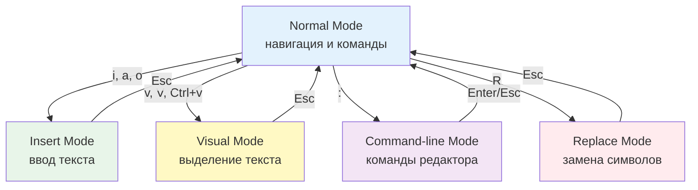
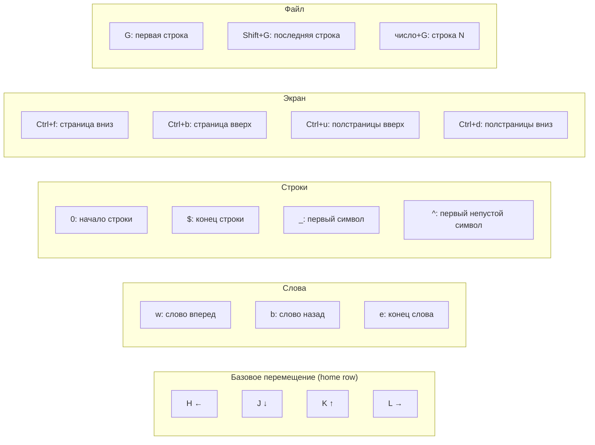
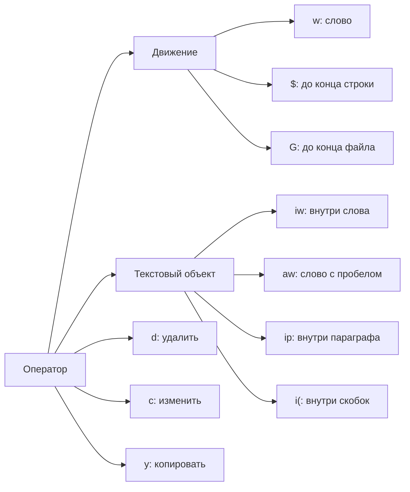
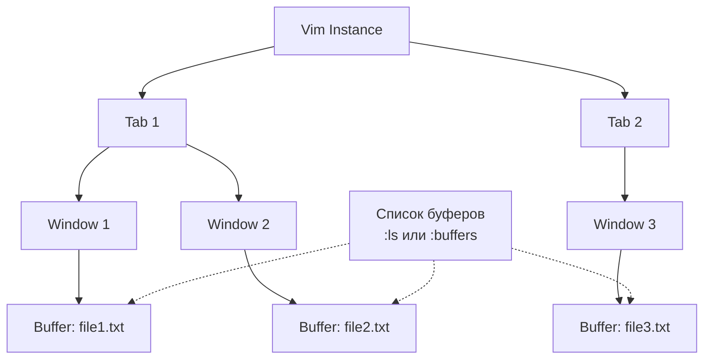
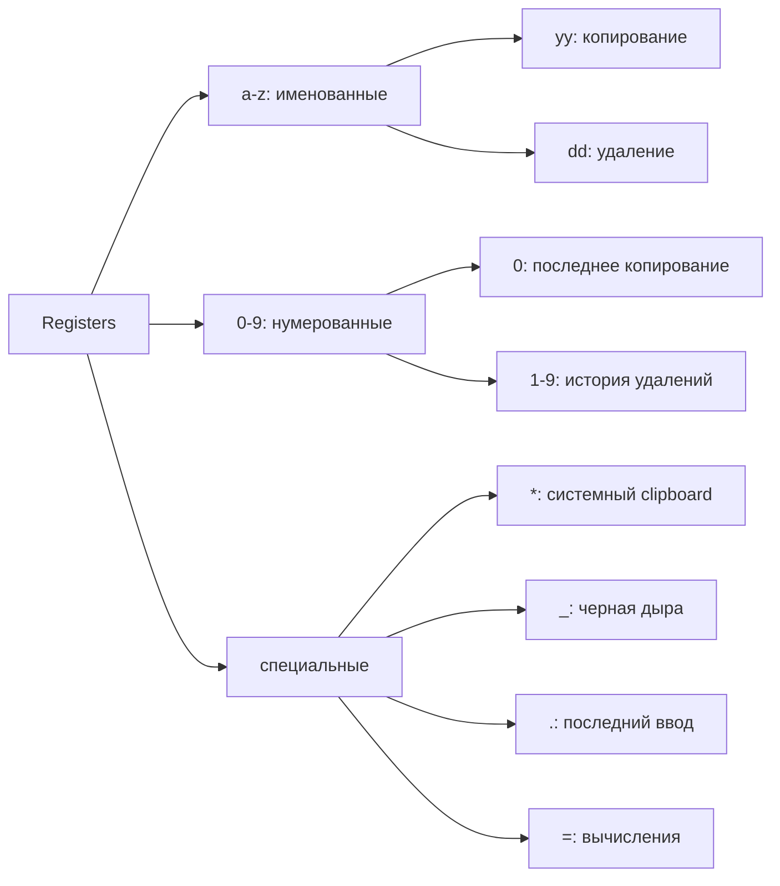
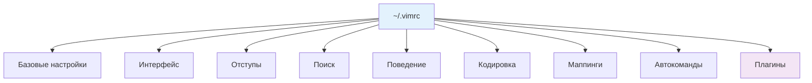
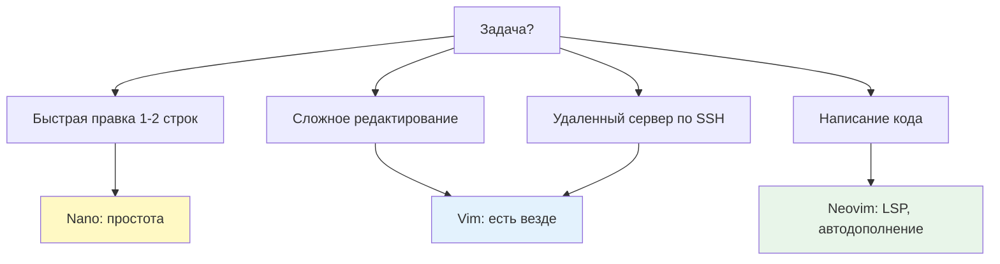

## Введение

Vim (Vi IMproved) — это высокоэффективный модальный текстовый редактор, который является стандартом де-факто для работы с конфигурационными файлами, скриптами и кодом в Linux-среде. Для DevOps-инженера владение Vim критически важно: при подключении к серверу по SSH часто доступен только Vim (или его минималистичный предшественник `vi`), а умение быстро редактировать конфиги, логи и скрипты напрямую влияет на скорость [[Synced/DevOps/Сетевое и системное администрирование/0. Введение и методология/2. Методология Troubleshooting.md | troubleshooting]] и восстановления сервисов.

>[!INFO] Философия Vim
>Vim следует принципу «модалого редактирования»: клавиатура используется не для ввода текста напрямую, а как инструмент управления. Это требует обучения, но после освоения скорость редактирования многократно возрастает по сравнению с традиционными редакторами.

## 1. Режимы работы: фундамент Vim

### Модальная архитектура



|Режим|Назначение|Как войти|Как выйти|
|---|---|---|---|
|**Normal**|Навигация, операции с текстом, вызов команд|`Esc` (всегда работает)|—|
|**Insert**|Ввод текста (как в обычном редакторе)|`i`, `a`, `o`, `I`, `A`, `O`|`Esc`|
|**Visual**|Выделение текста для операций|`v` (символы), `V` (строки), `Ctrl+v` (блоки)|`Esc`|
|**Command-line**|Выполнение команд `:w`, `:q`, поиск `/`|`:`, `/`, `?`|`Enter` или `Esc`|
|**Replace**|Замена символов по одному|`R`|`Esc`|

>[!WARNING] Первая помощь
>Если Vim «не реагирует» на клавиши — скорее всего, вы в Insert или Visual режиме. Нажмите `Esc` 2-3 раза, чтобы вернуться в Normal mode. Если не помогает — `:q!` для принудительного выхода.

## 2. Базовая навигация

### Перемещение курсора в Normal mode



### Практические примеры навигации

```vim
" Перейти к строке 42
42G

" Перейти к первому непустому символу текущей строки
^

" Перейти к концу строки
$

" Перейти к следующему вхождению слова "config"
/config<Enter>

" Повторить последний поиск вперед
n

" Повторить последний поиск назад
N

" Перейти к парной скобке/тегу
%

" Вернуться к предыдущей позиции
Ctrl+o

" Перейти к следующей позиции (после Ctrl+o)
Ctrl+i
```

>[!TIP] Запоминание позиций
>Vim хранит список «прыжков» (jumplist). Используйте `Ctrl+o` (назад) и `Ctrl+i` (вперед) для навигации по истории позиций, как в браузере.

## 3. Операции с текстом: грамматика Vim

### Модель «оператор + движение»



### Базовые операции

| Операция              | Синтаксис | Описание                          | Пример                 |
| --------------------- | --------- | --------------------------------- | ---------------------- |
| **Удалить символ**    | `x`       | Удалить символ под курсором       | `x`                    |
| **Удалить строку**    | `dd`      | Вырезать текущую строку           | `dd`                   |
| **Удалить N строк**   | `Ndd`     | Вырезать N строк                  | `3dd`                  |
| **Копировать строку** | `yy`      | Скопировать (yank) текущую строку | `yy`                   |
| **Вставить**          | `p` / `P` | Вставить после/перед курсором     | `p`                    |
| **Отменить**          | `u`       | Undo последнего действия          | `u`                    |
| **Повторить**         | `Ctrl+r`  | Redo отмененного действия         | `Ctrl+r`               |
| **Заменить символ**   | `r`       | Заменить один символ              | `rx` (заменить на 'x') |
| **Join строк**        | `J`       | Объединить с следующей строкой    | `J`                    |

### Комбинации оператор + движение

```vim
" Удалить до конца слова
dw

" Удалить до конца строки
d$

" Удалить до начала строки
d0

" Удалить 3 строки вниз
d3j

" Изменить до конца слова (удалить + войти в Insert mode)
cw

" Изменить всю строку (удалить содержимое + Insert)
cc

" Скопировать до конца строки
y$

" Скопировать 5 строк
5yy

" Удалить внутри скобок (не затрагивая сами скобки)
di(

" Удалить включая скобки
da(

" Изменить внутри кавычек
ci"

" Удалить внутри HTML-тега
dit

" Удалить параграф (между пустыми строками)
dip
```

>[!TIP] Текстовые объекты
>`i` (inner) — внутри объекта, `a` (around) — включая объект. Работает с: `w` (слово), `s` (предложение), `p` (параграф), `(`, `[`, `{`, `<`, `"`, `'`, `` ` ``, `t` (XML-тег).

## 4. Ввод текста: команды Insert mode

### Способы входа в Insert mode

|Команда|Позиция начала ввода|
|---|---|
|`i`|Перед курсором (insert)|
|`I`|В начало строки (первый непустой символ)|
|`a`|После курсора (append)|
|`A`|В конец строки|
|`o`|Новая строка ниже (open)|
|`O`|Новая строка выше|
|`s`|Удалить символ и начать ввод (substitute)|
|`S`|Удалить строку и начать ввод|

>[!WARNING] Частая ошибка новичков
>Не используйте `i` для начала ввода в начале строки — это добавит лишний символ. Используйте `I` или `o`/`O` для структурированного ввода.

## 5. Поиск и замена

### Поиск в файле

```vim
" Поиск вперед
/pattern<Enter>

" Поиск назад
?pattern<Enter>

" Перейти к следующему совпадению
n

" Перейти к предыдущему совпадению
N

" Поиск с игнорированием регистра (разово)
/\cpattern<Enter>

" Подсветка совпадений (включить/выключить)
:set hlsearch
:nohlsearch

" Инкрементальный поиск (по мере ввода)
:set incsearch
```

### Замена текста

```vim
" Базовая замена в текущей строке
:s/old/new/

" Заменить все вхождения в текущей строке
:s/old/new/g

" Заменить во всем файле
:%s/old/new/g

" Заменить с подтверждением каждого вхождения
:%s/old/new/gc

" Заменить в диапазоне строк (10-50)
:10,50s/old/new/g

" Заменить с использованием регулярных выражений
:%s/\bfoo\b/bar/g

" Использовать последний поиск как шаблон
:%s//new/g

" Заменить с сохранением регистра (через \u, \l)
:%s/\(foo\)/\u\1/g
```

### Практические примеры замены

```vim
" Удалить пустые строки
:%s/^$//

" Удалить пробелы в конце строк
:%s/\s\+$//

" Заменить табы на пробелы (4 пробела)
:%s/\t/    /g

" Добавить номер строки в начало каждой строки
:%s/^/\=line('.') . ' ' /

" Заменить IP-адреса на плейсхолдер
:%s/\d\{1,3}\.\d\{1,3}\.\d\{1,3}\.\d\{1,3}/<IP>/g

" Изменить дату с YYYY-MM-DD на DD.MM.YYYY
:%s/\(\d\{4}\)-\(\d\{2}\)-\(\d\{2}\)/\3.\2.\1/g
```

>[!TIP] Регулярные выражения в Vim
>Vim использует свой диалект regex. Ключевые отличия от POSIX: `\(` для групп (не `(`), `\+` для одного и более (не `+`), `\{n,m}` для повторений. Используйте `:help pattern` для полной документации.

## 6. Работа с несколькими файлами и буферами

### Буферы, окна и вкладки



| Понятие     | Описание                 | Команды                                   |
| ----------- | ------------------------ | ----------------------------------------- |
| **Буфер**   | Файл в памяти Vim        | `:ls`, `:b <name>`, `:bn`, `:bp`, `:bd`   |
| **Окно**    | Область просмотра буфера | `Ctrl+w` + навигация, `:split`, `:vsplit` |
| **Вкладка** | Группа окон (layout)     | `:tabnew`, `:tabn`, `:tabp`, `gt`, `gT`   |

### Управление буферами

```vim
" Открыть файл в новом буфере
:e /path/to/file

" Список всех буферов
:ls
:buffers

" Переключиться на буфер по номеру или имени
:b 3
:b nginx.conf

" Следующий/предыдущий буфер
:bn (или :bnext)
:bp (или :bprevious)

" Закрыть буфер
:bd (или :bdelete)

" Закрыть все буферы кроме текущего
:%bd|e#

" Сохранить все буферы
:wa
```

### Разделение экрана (windows)

```vim
" Горизонтальное разделение
:split
:sp file.txt

" Вертикальное разделение
:vsplit
:vsp file.txt

" Навигация между окнами
Ctrl+w h  " влево
Ctrl+w j  " вниз
Ctrl+w k  " вверх
Ctrl+w l  " вправо

" Изменить размер окон
Ctrl+w +  " увеличить высоту
Ctrl+w -  " уменьшить высоту
Ctrl+w >  " увеличить ширину
Ctrl+w <  " уменьшить ширину

" Сделать окно максимальным
Ctrl+w _  " по высоте
Ctrl+w |  " по ширине

" Закрыть текущее окно
Ctrl+w c
:close
```

### Практический сценарий: сравнение файлов

```vim
" Открыть два файла для сравнения
vim -d file1.txt file2.txt

" Или внутри Vim
:vert diffsplit file2.txt

" Навигация по различиям
]c  " следующее различие
[c  " предыдущее различие

" Применить изменение из другого окна
dp  " diff put (перенести в текущий буфер)
do  " diff obtain (получить из другого буфера)
```

## 7. Registers: буферы обмена Vim

### Типы registers



### Работа с registers

```vim
" Копировать в регистр 'a'
"ayy

" Вставить из регистра 'a'
"ap

" Добавить в регистр 'a' (append)
"Ayy

" Список всех registers с содержимым
:registers
:reg

" Копировать в системный clipboard (требует vim-gtk или xclip)
"+yy

" Вставить из системного clipboard
"+p

" Удалить без сохранения в register (черная дыра)
"_dd

" Повторить последний ввод
".p

" Вставить результат выражения
"=2+2<Enter>p
```

>[!TIP] Системный clipboard
>Для работы с системным буфером обмена нужен Vim с поддержкой `+clipboard`. Проверьте: `vim --version | grep clipboard`. Должно быть `+clipboard`, а не `-clipboard`. В Ubuntu: `apt install vim-gtk3`.

## 8. Macros: автоматизация повторяющихся действий

### Запись и воспроизведение

```vim
" Начать запись в регистр 'q'
qq

" Выполнить действия...
0dwA, <Esc>j

" Остановить запись
q

" Воспроизвести макрос
@q

" Повторить последний макрос
@@

" Воспроизвести 10 раз
10@q

" Применить макрос ко всем строкам с pattern
:g/pattern/normal @q

" Применить макрос к диапазону строк
:10,20normal @q
```

### Практический пример: форматирование CSV

```vim
" Задача: превратить "name,age,city" в "| name | age | city |"

" Записать макрос в регистр 'f'
qq

" Перейти в начало строки
0

" Добавить "| " в начало
i| <Esc>

" Заменить все запятые на " | "
:s/,/ | /g<Enter>

" Добавить " |" в конец строки
A |<Esc>

" Остановить запись
q

" Применить ко всем строкам
:%normal @f
```

>[!LINK] Связь с автоматизацией
>Макросы Vim — это предшественник [[Synced/DevOps/Сетевое и системное администрирование/1. Операционные системы/1. Linux/4. Bash скрипты.md | bash-скриптов]] для текстовой обработки. Для сложных сценариев лучше использовать `sed`/`awk`, но для быстрых преобразований макросы незаменимы.

## 9. Конфигурация: .vimrc

### Базовая конфигурация для DevOps

```vim
" === Базовые настройки ===
set nocompatible          " Отключить совместимость с vi
syntax on                 " Включить подсветку синтаксиса
filetype plugin indent on " Включить автоопределение типа файла

" === Интерфейс ===
set number                " Показать номера строк
set relativenumber        " Относительные номера строк
set cursorline            " Подсветить текущую строку
set showmatch             " Подсветить парную скобку
set wrap                  " Переносить длинные строки
set linebreak             " Переносить по словам, не символам

" === Отступы и табуляция ===
set expandtab             " Использовать пробелы вместо табов
set tabstop=4             " Ширина таба (4 пробела)
set shiftwidth=4          " Ширина отступа для >> и <<
set softtabstop=4         " Ширина таба в Insert mode
set autoindent            " Автоотступ для новой строки
set smartindent           " Умный отступ для C-like языков

" === Поиск ===
set hlsearch              " Подсветка результатов поиска
set incsearch             " Инкрементальный поиск
set ignorecase            " Игнорировать регистр при поиске
set smartcase             " Учитывать регистр, если есть заглавные

" === Поведение ===
set backspace=indent,eol,start  " Backspace работает как ожидается
set hidden                " Разрешить скрытые буферы
set wildmenu              " Автодополнение команд
set wildmode=longest:full,full
set laststatus=2          " Всегда показывать статусную строку
set ruler                 " Показать позицию курсора
set showcmd               " Показать выполняемую команду
set scrolloff=5           " Отступ при прокрутке (5 строк)

" === Кодировка ===
set encoding=utf-8
set fileencodings=utf-8,cp1251,koi8-r

" === Безопасность ===
set nobackup              " Не создавать backup-файлы
set noswapfile            " Не создавать swap-файлы
set nowritebackup

" === Быстрые маппинги ===
" Сохранить с sudo (если нет прав)
cmap w!! w !sudo tee % >/dev/null

" Быстрое переключение между файлами
nnoremap <leader>ff :find **/*<Tab>
nnoremap <leader>bb :buffers<CR>:b<Space>

" Очистить подсветку поиска
nnoremap <leader><space> :nohlsearch<CR>

" === Автоматические команды ===
" Удалить пробелы в конце строк при сохранении
autocmd BufWritePre * :%s/\s\+$//e

" Вернуться к последней позиции при открытии файла
autocmd BufReadPost * if line("'\"") > 1 && line("'\"") <= line("$") | exe "normal! g'\"" | endif

" === Плагины (если используется vim-plug) ===
" call plug#begin('~/.vim/plugged')
" Plug 'preservim/nerdtree'       " Файловый менеджер
" Plug 'vim-airline/vim-airline'  " Улучшенная статусная строка
" Plug 'tpope/vim-commentary'     " Быстрое комментирование
" Plug 'tpope/vim-fugitive'       " Git интеграция
" Plug 'sheerun/vim-polyglot'     " Поддержка множества языков
" call plug#end()
```

### Структура .vimrc



>[!TIP] Постепенная настройка
>Не копируйте огромный `.vimrc` из интернета. Начните с минимальной конфигурации и добавляйте настройки по мере необходимости, понимая, что делает каждая опция. Используйте `:help option` для документации.

## 10. Плагины и экосистема

### Менеджеры плагинов

|Менеджер|Особенности|Установка|
|---|---|---|
|**vim-plug**|Быстрый, асинхронный, простой синтаксис|`curl -fLo ~/.vim/autoload/plug.vim --create-dirs https://raw.githubusercontent.com/junegunn/vim-plug/master/plug.vim`|
|**Vundle**|Старый, но надежный|`git clone https://github.com/VundleVim/Vundle.vim.git ~/.vim/bundle/Vundle.vim`|
|**packer.nvim**|Для Neovim, Lua-конфигурация|Только для Neovim|

### Must-have плагины для DevOps

```vim
" Файловый менеджер
Plug 'preservim/nerdtree'
nnoremap <leader>n :NERDTreeToggle<CR>

" Нечеткий поиск файлов
Plug 'junegunn/fzf', { 'do': { -> fzf#install() } }
Plug 'junegunn/fzf.vim'
nnoremap <leader>p :Files<CR>
nnoremap <leader>g :Rg<CR>

" Git интеграция
Plug 'tpope/vim-fugitive'
nnoremap <leader>gs :Git<CR>
nnoremap <leader>gd :Gdiffsplit<CR>

" Автодополнение скобок
Plug 'jiangmiao/auto-pairs'

" Подсветка синтаксиса для множества языков
Plug 'sheerun/vim-polyglot'

" Проверка синтаксиса в реальном времени
Plug 'vim-syntastic/syntastic'
let g:syntastic_always_populate_loc_list = 1
let g:syntastic_auto_loc_list = 1
let g:syntastic_check_on_open = 1

" YAML/JSON валидация
Plug 'elzr/vim-json'
let g:vim_json_syntax_conceal = 0
```

### Neovim: современная альтернатива

> [!INFO] Neovim vs Vim
> Neovim — это форк Vim с улучшениями: встроенный LSP (Language Server Protocol), Treesitter для парсинга, Lua-конфигурация, лучшая производительность. Полностью совместим с `.vimrc` и плагинами Vim.

```bash
# Установка Neovim
# Debian/Ubuntu: apt install neovim
# macOS: brew install neovim

# Сделать neovim дефолтным vim
alias vim='nvim'
# Или через alternatives:
update-alternatives --install /usr/bin/vim vim $(which nvim) 100
```

>[!LINK] Связь с альтернативами
>Детальное сравнение Vim, Neovim, Nano и других редакторов — в [[Synced/DevOps/Сетевое и системное администрирование/1. Операционные системы/1. Linux/6. Редакторы и среда/2. Nano, MC Edit, Neovim.md | Nano, MC Edit, Neovim]].

## 11. Практические сценарии для DevOps

### Сценарий 1: Быстрое редактирование sudo-конфига

```bash
# Проблема: нужно отредактировать /etc/nginx/nginx.conf, но нет прав на запись
# Решение: использовать vim с sudo

# Способ 1: vim -c команда
sudo vim /etc/nginx/nginx.conf

# Способ 2: если уже открыли без sudo, сохранить через tee
# Внутри Vim:
:w !sudo tee % > /dev/null

# Способ 3: использовать vim's netrw для удаленного редактирования
vim scp://user@host//etc/nginx/nginx.conf
```

### Сценарий 2: Массовая замена в нескольких файлах

```bash
# Задача: заменить старый IP на новый во всех конфигах

# Способ 1: через argdo
vim /etc/nginx/sites-enabled/*
# Внутри Vim:
:argdo %s/192.168.1.100/10.0.0.50/ge | update
# :argdo - выполнить команду для каждого файла в списке аргументов
# update - сохранить только если были изменения

# Способ 2: через quickfix list
:vimgrep /192.168.1.100/ /etc/nginx/**/*
:copen  " Открыть список найденных файлов
# Навигация: :cn (следующий), :cp (предыдущий)
# Редактирование в каждом файле, затем :wa для сохранения всех
```

### Сценарий 3: Анализ логов с Vim

```vim
" Открыть большой лог-файл без swap (экономия памяти)
vim -n /var/log/syslog

" Или в read-only режиме
vim -R /var/log/auth.log

" Быстрый поиск ошибок
/ERROR\|FATAL\|Exception

" Сложить (fold) все строки без ошибок
:set foldmethod=manual
v/ERROR\|FATAL/normal zf^

" Копировать все найденные строки в новый буфер
:g/ERROR/yank A
:new
:put a

" Сортировка найденных ошибок
:%sort
```

### Сценарий 4: Работа с YAML и JSON конфигурациями

```vim
" Автоматическое форматирование JSON (требует jq)
:%!jq .

" Валидация YAML (требует yamllint)
:!yamllint %

" Преобразование YAML в JSON (требует yq)
:%!yq e -o=json

" Сортировка ключей в JSON объекте
:%!jq -S .

" Проверка синтаксиса JSON
:let g:syntastic_json_checkers = ['jsonlint']
```

### Сценарий 5: Сравнение конфигураций

```vim
" Открыть два конфига для сравнения
vim -d /etc/nginx/nginx.conf /etc/nginx/nginx.conf.bak

" Внутри Vim:
" Навигация по различиям: ]c и [c
" Копирование изменений: dp (put) и do (obtain)
" Сохранение обоих файлов: :wa

" Сравнение с Git-версией
:Gdiffsplit HEAD~1
```

>[!TIP] Vim как pager
>Используйте Vim как просмотрщик для `man`, `git log`, `less`:
>```bash
>export MANPAGER="vim -"
>export GIT_PAGER="vim -R"
>alias less='vim -R'
>```

## 12. Vim vs альтернативы: когда что использовать



| Ситуация                                 | Рекомендуемый редактор | Почему                           |
| ---------------------------------------- | ---------------------- | -------------------------------- |
| Быстрая правка конфига на сервере        | Vim/Nano               | Есть практически везде           |
| Сложное редактирование с поиском/заменой | Vim                    | Макросы, regex, registers        |
| Написание кода с автодополнением         | Neovim + LSP           | Интеграция с языковыми серверами |
| Просмотр логов и больших файлов          | Vim (read-only)        | Быстрая навигация, поиск         |
| Редактирование на минимальных системах   | Vi/Vim                 | Встроен в busybox, Alpine        |
| GUI-редактирование                       | VS Code, Neovim GUI    | Визуальное удобство              |

>[!LINK] Детальное сравнение
>Анализ альтернативных редакторов и их ниш — в [[Synced/DevOps/Сетевое и системное администрирование/1. Операционные системы/1. Linux/6. Редакторы и среда/2. Nano, MC Edit, Neovim.md | Nano, MC Edit, Neovim]].

---

## Контрольные вопросы для самопроверки

1. В чем фундаментальная разница между модальным (Vim) и немодальным (Nano, VS Code) редактированием? Какие преимущества дает модальный подход?
2. Как выполнить операцию «удалить внутри круглых скобок, не затрагивая сами скобки»? Какой текстовый объект используется?
3. В чем разница между буферами, окнами и вкладками в Vim? Как переключаться между ними эффективно?
4. Как записать и воспроизвести макрос для форматирования 100 строк CSV-файла? Как применить макрос ко всем строкам, содержащим определенный паттерн?
5. Почему команда `:w !sudo tee %` работает для сохранения файла без прав root? Что делает каждый компонент этой команды?
6. Как настроить Vim для автоматического удаления пробелов в конце строк при сохранении? Где должна быть размещена эта настройка?
7. В чем разница между регистрами `a`, `0`, `"` и `_`? Когда использовать каждый из них?
8. Почему Neovim считается более современной альтернативой Vim? Какие функции Neovim критичны для разработки на современных языках программирования?

---

#devops #linux #vim #neovim #text-editor #cli #productivity #configuration #automation #sysadmin #troubleshooting #regex #macros #plugins #fundamentals