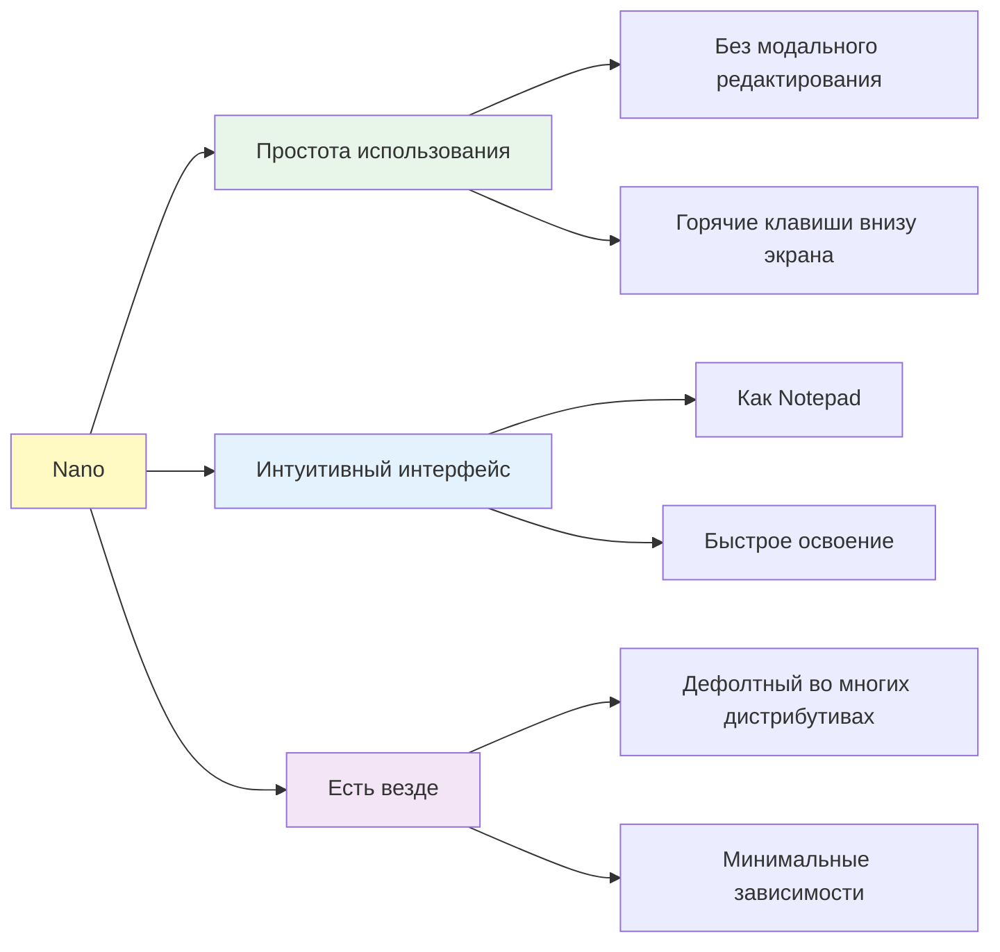
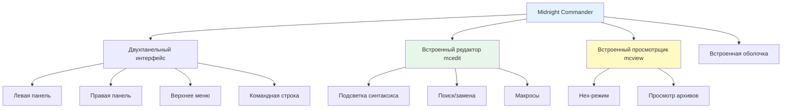
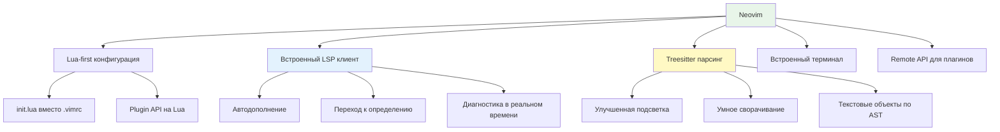
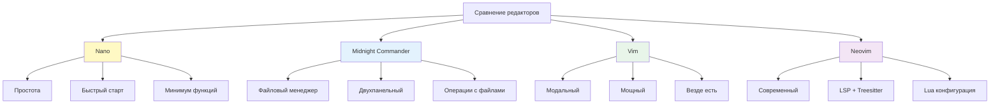
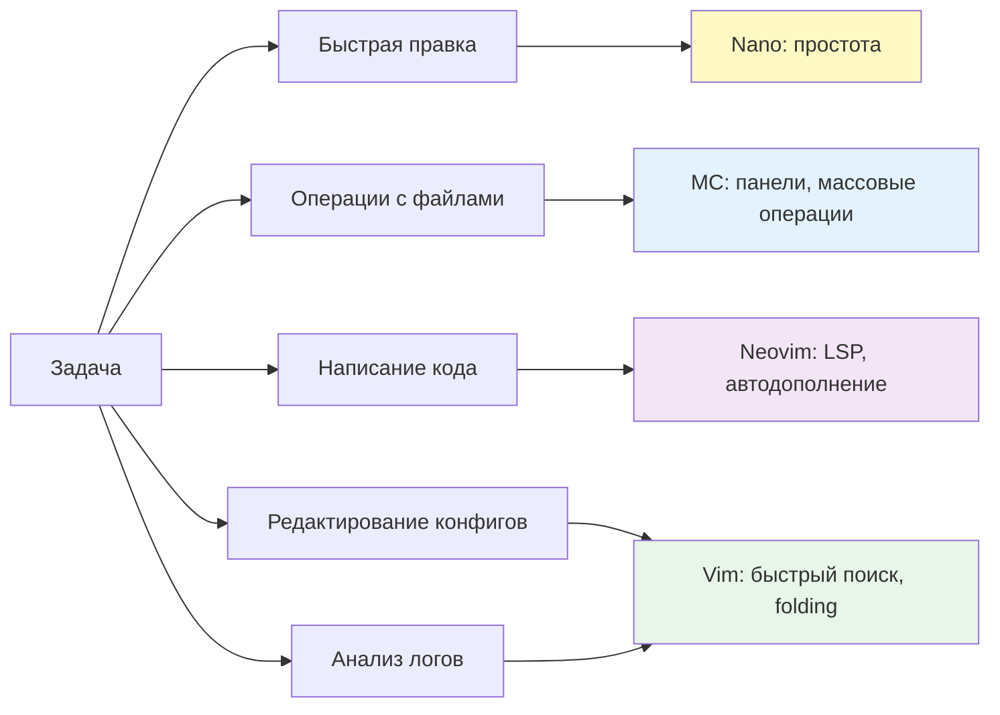

## Введение

Хотя Vim является стандартом для сложного редактирования в Linux, существует множество ситуаций, когда альтернативные редакторы оказываются более подходящими. Nano идеален для быстрых правок и новичков, Midnight Commander (MC) сочетает файловый менеджер с редактором для операций с несколькими файлами, а Neovim представляет собой современную эволюцию Vim с поддержкой LSP, Treesitter и Lua-конфигурации.

>[!INFO] Связь с предыдущей темой
>Понимание модальной архитектуры Vim из [[1. VIM| темы VIM]] критично для понимания различий с немодальными редакторами (Nano, MC) и расширенных возможностей Neovim.

## 1. Nano: простота и доступность

### Философия Nano



### Базовое использование

```bash
# Открыть файл
nano /etc/nginx/nginx.conf

# Открыть с переходом к строке 42
nano +42 /var/log/syslog

# Открыть несколько файлов
nano file1.txt file2.txt

# Открыть в режиме только для чтения
nano -v /etc/shadow
```

### Ключевые горячие клавиши

|Комбинация|Действие|Описание|
|---|---|---|
|`Ctrl+O`|Save|Сохранить файл|
|`Ctrl+X`|Exit|Выйти (с предложением сохранить)|
|`Ctrl+K`|Cut Text|Вырезать строку|
|`Ctrl+U`|Uncut Text|Вставить вырезанное|
|`Ctrl+W`|Where Is|Поиск (Ctrl+R для замены)|
|`Ctrl+\`|Replace|Заменить текст|
|`Ctrl+_`|Go To Line|Перейти к строке|
|`Alt+A`|Mark|Начать выделение|
|`Ctrl+6`|Mark|Альтернатива для выделения|
|`Alt+6`|Copy|Копировать выделенное|
|`Ctrl+T`|Invoke Spell|Проверка орфографии (если установлена)|

### Конфигурация: ~/.nanorc

```bash
# Базовая конфигурация для удобства
cat >> ~/.nanorc <<'EOF'
# Включить подсветку синтаксиса
include "/usr/share/nano/*.nanorc"
include "/usr/share/nano/extra/*.nanorc"

# Автоматический отступ
set autoindent

# Показать номера строк
set linenumbers

# Плавная прокрутка
set smooth

# Мягкий перенос строк
set softwrap

# Резервные копии
set backup
set backupdir "~/.nano-backups/"

# Отступ табами (4 пробела)
set tabsize 4
set const
EOF
```

### Практические сценарии для Nano

```bash
# Сценарий 1: Быстрая правка конфига
sudo nano /etc/ssh/sshd_config
# Найти: Ctrl+W → "PermitRootLogin"
# Изменить: стрелки + ввод
# Сохранить: Ctrl+O → Enter
# Выйти: Ctrl+X

# Сценарий 2: Массовая замена
nano /etc/hosts
# Ctrl+\ → заменить "old-host" на "new-host"
# "Y" для подтверждения каждой замены или "A" для всех

# Сценарий 3: Просмотр логов с поиском
nano -v /var/log/auth.log
# Ctrl+W → "Failed password"
# Ctrl+W → "W" для повторного поиска
```

> [!TIP] Когда использовать Nano
> 
> - Быстрая правка 1-2 строк в конфиге
> - Работа на незнакомом сервере, где нет Vim
> - Новички, которым нужна минимальная кривая обучения
> - Скрипты, где нужно открыть редактор для пользователя (`export EDITOR=nano`)

## 2. Midnight Commander (MC): файловый менеджер с редактором

### Архитектура MC



### Запуск и навигация

```bash
# Запустить MC
mc

# Запустить только редактор
mcedit /path/to/file

# Запустить только просмотрщик
mcview /path/to/file

# Запустить без мыши (для SSH)
mc -x
```

### Управление панелями

|Клавиша|Действие|
|---|---|
|`Tab`|Переключение между панелями|
|`Insert`|Отметить файл для операции|
|`F3`|Просмотр файла (mcview)|
|`F4`|Редактирование файла (mcedit)|
|`F5`|Копирование отмеченных файлов|
|`F6`|Перемещение/переименование|
|`F7`|Создание директории|
|`F8`|Удаление отмеченных файлов|
|`F9`|Активировать меню|
|`F10`|Выход из MC|
|`Ctrl+O`|Показать/скрыть вывод shell|
|`Ctrl+\`|Быстрый переход по пути|
|`Ctrl+X`|Отключиться (logout)|

### Встроенный редактор (mcedit)

```bash
# Открыть файл в mcedit из MC: F4
# Или напрямую:
mcedit /etc/nginx/nginx.conf

# Основные операции в mcedit:
# F2 - Сохранить
# F3 - Начать выделение
# F4 - Переключить режим вставки/замены
# F5 - Копировать блок
# F6 - Переместить блок
# F7 - Поиск
# F8 - Удалить блок/строку
# F9 - Меню
# F10 - Выход
# F11 - Раскрыть макрос
# F12 - Записать макрос
# F13 (Shift+F1) - Помощь
# F14 (Shift+F2) - Сохранить как
# F16 (Shift+F4) - Переключить кодировку
# F17 (Shift+F5) - Копировать в другой файл
# F18 (Shift+F6) - Переместить в другой файл
# F19 (Shift+F7) - Повторить поиск
# F20 (Shift+F8) - Конфигурация
```

### Практические сценарии с MC

```bash
# Сценарий 1: Массовое копирование конфигов
mc
# Левая панель: /etc/nginx/sites-available/
# Правая панель: /backup/nginx/
# Отметить файлы: Insert
# Копировать: F5

# Сценарий 2: Сравнение файлов
# Открыть два файла в соседних панелях
# Команда в shell: diff -y left.file right.file
# Или использовать встроенное сравнение через меню

# Сценарий 3: Редактирование внутри архива
mc
# Перейти в архив (Enter на .tar.gz)
# MC распакует архив во временную директорию
# F4 для редактирования файла внутри архива
# При выходе MC спросит, обновить ли архив

# Сценарий 4: Работа с удаленными серверами
# Через Shell Link (Ctrl+X, затем shell link)
# Или напрямую:
mc ftp://user@host/path
mc sftp://user@host/path

# Сценарий 5: Массовое переименование
# Отметить файлы: Insert
# F6 (Move) → использовать шаблоны:
# *.log → *.log.backup
```

### Конфигурация MC

```bash
# Конфигурационные файлы
~/.config/mc/ini          # Основные настройки
~/.config/mc/panels.ini   # Настройки панелей
~/.config/mc/menu         # Пользовательское меню
~/.config/mc/mcedit.ini   # Настройки редактора

# Пример пользовательского меню (~/.config/mc/menu)
cat > ~/.config/mc/menu <<'EOF'
+ t sh
S       Показать размер директории
        du -sh %f | less
        
G       Git status
        git status
        
E       Edit crontab
        crontab -e
        
L       View system logs
        tail -f /var/log/syslog
EOF
```

> [!TIP] Когда использовать MC
> 
> - Операции с множеством файлов (копирование, перемещение, удаление)
> - Работа с архивами как с директориями
> - Сравнение файлов и директорий
> - Навигация по сложной структуре каталогов
> - Быстрый просмотр содержимого файлов (F3)

## 3. Neovim: современная эволюция Vim

### Архитектурные отличия от Vim



### Установка и базовая настройка

```bash
# Установка
# Debian/Ubuntu (может быть устаревшая версия)
apt install neovim

# Последняя стабильная версия через PPA
add-apt-repository ppa:neovim-ppa/stable
apt update
apt install neovim

# Или AppImage (всегда последняя версия)
curl -LO https://github.com/neovim/neovim/releases/latest/download/nvim.appimage
chmod u+x nvim.appimage
./nvim.appimage

# Сделать Neovim дефолтным vim
update-alternatives --install /usr/bin/vim vim $(which nvim) 100
```

### Структура конфигурации

```bash
# Директория конфигурации
mkdir -p ~/.config/nvim

# Базовая структура
~/.config/nvim/
├── init.lua              # Главная конфигурация
├── lua/
│   ├── core/
│   │   ├── options.lua   # Настройки опций
│   │   ├── keymaps.lua   # Горячие клавиши
│   │   └── autocmds.lua  # Автокоманды
│   ├── plugins/
│   │   ├── init.lua      # Менеджер плагинов
│   │   ├── lsp.lua       # LSP конфигурация
│   │   └── treesitter.lua
│   └── custom/
│       └── ...           # Ваши модули
└── plugin/               # Автозагружаемые плагины
```

### Базовая конфигурация (init.lua)

```lua
-- === Базовые настройки ===
vim.opt.number = true
vim.opt.relativenumber = true
vim.opt.cursorline = true
vim.opt.signcolumn = "yes"

-- === Поиск ===
vim.opt.hlsearch = true
vim.opt.incsearch = true
vim.opt.ignorecase = true
vim.opt.smartcase = true

-- === Отступы ===
vim.opt.expandtab = true
vim.opt.tabstop = 4
vim.opt.shiftwidth = 4
vim.opt.softtabstop = 4
vim.opt.autoindent = true
vim.opt.smartindent = true

-- === Интерфейс ===
vim.opt.termguicolors = true
vim.opt.showmode = false
vim.opt.laststatus = 3
vim.opt.cmdheight = 1
vim.opt.scrolloff = 8
vim.opt.sidescrolloff = 8

-- === Файлы ===
vim.opt.undofile = true
vim.opt.undolevels = 10000
vim.opt.backup = false
vim.opt.writebackup = false
vim.opt.swapfile = false

-- === Производительность ===
vim.opt.updatetime = 250
vim.opt.timeoutlen = 300

-- === Кодировка ===
vim.opt.encoding = "utf-8"
vim.opt.fileencoding = "utf-8"

-- === Встроенный терминал ===
vim.keymap.set('n', '<leader>t', ':split term://bash<CR>', { desc = 'Open terminal' })
vim.keymap.set('t', '<Esc>', '<C-\\><C-n>', { desc = 'Exit terminal mode' })
```

### Менеджер плагинов: lazy.nvim

```lua
-- lua/plugins/init.lua

local lazypath = vim.fn.stdpath("data") .. "/lazy/lazy.nvim"
if not vim.loop.fs_stat(lazypath) then
  vim.fn.system({
    "git",
    "clone",
    "--filter=blob:none",
    "https://github.com/folke/lazy.nvim.git",
    "--branch=stable",
    lazypath,
  })
end
vim.opt.rtp:prepend(lazypath)

require("lazy").setup({
  -- Файловый менеджер
  {
    "nvim-neo-tree/neo-tree.nvim",
    branch = "v3.x",
    dependencies = {
      "nvim-lua/plenary.nvim",
      "nvim-tree/nvim-web-devicons",
      "MunifTanjim/nui.nvim",
    },
    config = function()
      vim.keymap.set('n', '<leader>n', ':Neotree toggle<CR>', { desc = 'Toggle file tree' })
    end,
  },

  -- Нечеткий поиск
  {
    'nvim-telescope/telescope.nvim',
    tag = '0.1.5',
    dependencies = { 'nvim-lua/plenary.nvim' },
    config = function()
      local builtin = require('telescope.builtin')
      vim.keymap.set('n', '<leader>ff', builtin.find_files, { desc = 'Find files' })
      vim.keymap.set('n', '<leader>fg', builtin.live_grep, { desc = 'Live grep' })
      vim.keymap.set('n', '<leader>fb', builtin.buffers, { desc = 'Find buffers' })
      vim.keymap.set('n', '<leader>fh', builtin.help_tags, { desc = 'Help tags' })
    end,
  },

  -- Автодополнение
  {
    'hrsh7th/nvim-cmp',
    dependencies = {
      'hrsh7th/cmp-nvim-lsp',
      'hrsh7th/cmp-buffer',
      'hrsh7th/cmp-path',
      'L3MON4D3/LuaSnip',
      'saadparwaiz1/cmp_luasnip',
    },
    config = function()
      local cmp = require('cmp')
      cmp.setup({
        snippet = {
          expand = function(args)
            require('luasnip').lsp_expand(args.body)
          end,
        },
        mapping = cmp.mapping.preset.insert({
          ['<C-b>'] = cmp.mapping.scroll_docs(-4),
          ['<C-f>'] = cmp.mapping.scroll_docs(4),
          ['<C-Space>'] = cmp.mapping.complete(),
          ['<C-e>'] = cmp.mapping.abort(),
          ['<CR>'] = cmp.mapping.confirm({ select = true }),
        }),
        sources = cmp.config.sources({
          { name = 'nvim_lsp' },
          { name = 'luasnip' },
        }, {
          { name = 'buffer' },
          { name = 'path' },
        }),
      })
    end,
  },

  -- Темы
  {
    'folke/tokyonight.nvim',
    lazy = false,
    priority = 1000,
    config = function()
      vim.cmd.colorscheme('tokyonight')
    end,
  },
})
```

### LSP конфигурация

```lua
-- lua/plugins/lsp.lua

return {
  {
    'neovim/nvim-lspconfig',
    dependencies = {
      'williamboman/mason.nvim',
      'williamboman/mason-lspconfig.nvim',
    },
    config = function()
      -- Установка Mason (менеджер LSP серверов)
      require('mason').setup()
      require('mason-lspconfig').setup({
        ensure_installed = {
          'bashls',        -- Bash
          'yamlls',        -- YAML
          'jsonls',        -- JSON
          'dockerls',      -- Dockerfile
          'terraformls',   -- Terraform
          'ansiblels',     -- Ansible
          'pyright',       -- Python
          'lua_ls',        -- Lua
        },
        automatic_installation = true,
      })

      -- Настройка LSP
      local lspconfig = require('lspconfig')
      local capabilities = require('cmp_nvim_lsp').default_capabilities()

      -- Общие настройки для всех LSP
      local on_attach = function(client, bufnr)
        local opts = { buffer = bufnr }
        vim.keymap.set('n', 'gd', vim.lsp.buf.definition, opts)
        vim.keymap.set('n', 'gD', vim.lsp.buf.declaration, opts)
        vim.keymap.set('n', 'gr', vim.lsp.buf.references, opts)
        vim.keymap.set('n', 'gi', vim.lsp.buf.implementation, opts)
        vim.keymap.set('n', 'K', vim.lsp.buf.hover, opts)
        vim.keymap.set('n', '<leader>rn', vim.lsp.buf.rename, opts)
        vim.keymap.set('n', '<leader>ca', vim.lsp.buf.code_action, opts)
        vim.keymap.set('n', '[d', vim.diagnostic.goto_prev, opts)
        vim.keymap.set('n', ']d', vim.diagnostic.goto_next, opts)
      end

      -- Настройка конкретных серверов
      local servers = {
        bashls = {},
        yamlls = {
          settings = {
            yaml = {
              validate = true,
              schemaStore = { enable = true },
            },
          },
        },
        jsonls = {},
        dockerls = {},
        terraformls = {},
        ansiblels = {},
      }

      for server, config in pairs(servers) do
        config.capabilities = capabilities
        config.on_attach = on_attach
        lspconfig[server].setup(config)
      end
    end,
  },
}
```

### Treesitter для улучшенного парсинга

```lua
-- lua/plugins/treesitter.lua

return {
  'nvim-treesitter/nvim-treesitter',
  build = ':TSUpdate',
  config = function()
    require('nvim-treesitter.configs').setup({
      ensure_installed = {
        "bash",
        "yaml",
        "json",
        "dockerfile",
        "terraform",
        "python",
        "lua",
        "markdown",
      },
      sync_install = false,
      auto_install = true,
      highlight = {
        enable = true,
        additional_vim_regex_highlighting = false,
      },
      indent = {
        enable = true,
      },
      incremental_selection = {
        enable = true,
        keymaps = {
          init_selection = '<C-space>',
          node_incremental = '<C-space>',
          scope_incremental = false,
          node_decremental = '<bs>',
        },
      },
      textobjects = {
        select = {
          enable = true,
          lookahead = true,
          keymaps = {
            ['af'] = '@function.outer',
            ['if'] = '@function.inner',
            ['ac'] = '@class.outer',
            ['ic'] = '@class.inner',
          },
        },
      },
    })
  end,
}
```

### Практические сценарии для Neovim

```bash
# Сценарий 1: Редактирование Terraform с LSP
nvim main.tf
# Автоматическая подсветка синтаксиса через Treesitter
# Автодополнение ресурсов и атрибутов через LSP
# Переход к определению модуля: gd
# Переименование переменной: <leader>rn

# Сценарий 2: Работа с YAML конфигурациями
nvim k8s-deployment.yaml
# Валидация схемы через yamlls
# Автодополнение полей Kubernetes API
# Диагностика ошибок в реальном времени

# Сценарий 3: Навигация по кодовой базе
# <leader>ff → найти файл
# <leader>fg → grep по всему проекту
# gd → перейти к определению функции
# gr → найти все использования
# <leader>n → открыть файловое дерево

# Сценарий 4: Встроенный терминал для DevOps задач
# :terminal → открыть терминал в split
# Выполнить команды: kubectl get pods, docker ps
# Вернуться в normal mode: <Esc> (или <C-\><C-n>)
# Скопировать вывод и вставить в конфиг

# Сценарий 5: Работа с несколькими файлами
# :split file2.yaml → горизонтальное разделение
# :vsplit file3.tf → вертикальное разделение
# <C-w>h/j/k/l → навигация между окнами
# :wa → сохранить все
```

> [!TIP] Когда использовать Neovim
> 
> - Написание кода с автодополнением и диагностикой
> - Работа с конфигурационными файлами (YAML, JSON, Terraform)
> - Навигация по большим кодовым базам
> - Когда нужна мощь Vim + современные функции IDE
> - Автоматизация через Lua-скрипты

## 4. Сравнительная таблица редакторов



|Характеристика|Nano|MC (mcedit)|Vim|Neovim|
|---|---|---|---|---|
|**Модальность**|❌ Нет|❌ Нет|✅ Да|✅ Да|
|**Кривая обучения**|Очень низкая|Низкая|Высокая|Высокая|
|**Скорость освоения**|Минуты|Минуты|Недели|Недели|
|**Подсветка синтаксиса**|✅ Базовая|✅ Базовая|✅ Расширенная|✅ Treesitter|
|**Поиск/замена**|✅ Базовый|✅ Базовый|✅ Regex|✅ Regex|
|**Макросы**|❌ Нет|✅ Базовые|✅ Мощные|✅ Мощные|
|**Плагины**|❌ Нет|❌ Нет|✅ Vimscript/Lua|✅ Lua-first|
|**LSP поддержка**|❌ Нет|❌ Нет|⚠️ Через плагины|✅ Встроенная|
|**Встроенный терминал**|❌ Нет|❌ Нет|⚠️ Ограниченный|✅ Полноценный|
|**Размер**|~500 KB|~2 MB|~3 MB|~10 MB|
|**Наличие в системах**|✅ Почти везде|⚠️ Часто|✅ Почти везде|⚠️ Нужно ставить|
|**Конфигурация**|~/.nanorc|~/.config/mc/|~/.vimrc|~/.config/nvim/|

## 5. Практические сценарии выбора редактора

### Матрица выбора по задачам



### Сценарии использования

| Ситуация                                   | Рекомендуемый редактор | Почему                                          |
| ------------------------------------------ | ---------------------- | ----------------------------------------------- |
| Правка одной строки в `/etc/hosts`         | Nano                   | Быстро, интуитивно, не нужно запоминать команды |
| Копирование 50 файлов между директориями   | MC                     | Визуальный выбор, массовые операции             |
| Написание Python-скрипта с автодополнением | Neovim                 | LSP, диагностика, snippets                      |
| Массовая замена в 10 конфиг-файлах         | Vim                    | Макросы, `:argdo`, regex                        |
| Просмотр большого лога (1GB+)              | Vim (read-only)        | Быстрая навигация, поиск, folding               |
| Редактирование файла внутри архива         | MC                     | Прозрачная работа с архивами                    |
| Работа на минимальном контейнере (Alpine)  | Vi/Vim                 | Есть в busybox, Nano может отсутствовать        |
| Написание Terraform с валидацией           | Neovim                 | LSP для Terraform, подсветка                    |
| Быстрый просмотр содержимого файла         | MC (F3)                | Без открытия редактора, быстро                  |
| Сравнение двух версий конфига              | Vim (vimdiff) или MC   | Визуальное сравнение                            |

## 6. Интеграция с рабочим процессом DevOps

### Настройка EDITOR и VISUAL

```bash
# ~/.bashrc или ~/.zshrc

# Для простых задач
export EDITOR=nano

# Для сложных задач (git commit, crontab -e)
export VISUAL=nvim

# Или использовать один редактор для всего
export EDITOR=nvim
export VISUAL=nvim

# Проверить текущие настройки
echo $EDITOR
echo $VISUAL
```

### Использование в скриптах

```bash
#!/usr/bin/env bash
set -euo pipefail

# Открыть временный файл в редакторе для ввода данных
TEMP_FILE=$(mktemp)
trap 'rm -f "$TEMP_FILE"' EXIT

# Открыть редактор и дождаться закрытия
${EDITOR:-vi} "$TEMP_FILE"

# Обработать введенные данные
if [[ -s "$TEMP_FILE" ]]; then
    echo "Пользователь ввел данные:"
    cat "$TEMP_FILE"
else
    echo "Файл пуст, отмена операции"
    exit 1
fi
```

### Git интеграция

```bash
# Настроить Git использовать Neovim для коммитов
git config --global core.editor "nvim"

# Или Vim
git config --global core.editor "vim"

# Для Nano
git config --global core.editor "nano"

# Настроить diff tool
git config --global diff.tool vimdiff
git config --global merge.tool vimdiff

# Использовать в Git
git mergetool
git difftool
```

### SSH и удаленное редактирование

```bash
# Редактирование удаленных файлов через SSH
# Способ 1: SSH + локальный редактор
ssh user@host 'cat /etc/nginx/nginx.conf' | vim -

# Способ 2: Vim's netrw (если Vim установлен локально)
vim scp://user@host//etc/nginx/nginx.conf
vim sftp://user@host//path/to/file

# Способ 3: SSHFS + локальный редактор
sshfs user@host:/etc/nginx ~/remote-nginx
nvim ~/remote-nginx/nginx.conf
fusermount -u ~/remote-nginx

# Способ 4: MC с встроенной поддержкой SSH
mc
# В командной строке MC:
cd ssh://user@host/path
```

> [!LINK] Связь с автоматизацией
> Интеграция редакторов с Git и CI/CD — часть [[2. Настройка yml конфигурации| рабочих процессов GitLab CI]] и [[1. PR-Driven Infrastructure| PR-Driven Infrastructure]].

## 7. Расширенные возможности и плагины

### Must-have плагины для Neovim (DevOps)

```lua
-- Дополнительные плагины для DevOps задач

return {
  -- YAML/JSON валидация и форматирование
  {
    'b0o/SchemaStore.nvim',
    lazy = true,
  },

  -- Dockerfile поддержка
  {
    'kamitsubuduki/nvim-docker',
    lazy = true,
  },

  -- Kubernetes интеграция
  {
    'ramilito/kubectl.nvim',
    lazy = true,
    config = function()
      require('kubectl').setup()
    end,
  },

  -- Terraform поддержка
  {
    'hashivim/vim-terraform',
    ft = { 'terraform', 'tf' },
    config = function()
      vim.g.terraform_fmt_on_save = 1
    end,
  },

  -- Ansible поддержка
  {
    'pearofducks/ansible-vim',
    ft = { 'yaml', 'yml' },
  },

  -- Git интеграция (знаки в gutter)
  {
    'lewis6991/gitsigns.nvim',
    config = function()
      require('gitsigns').setup({
        signs = {
          add = { text = '+' },
          change = { text = '~' },
          delete = { text = '_' },
          topdelete = { text = '‾' },
          changedelete = { text = '~' },
        },
      })
    end,
  },

  -- Проверка синтаксиса
  {
    'mfussenegger/nvim-lint',
    config = function()
      require('lint').linters_by_ft = {
        yaml = { 'yamllint' },
        json = { 'jsonlint' },
        dockerfile = { 'hadolint' },
        bash = { 'shellcheck' },
      }
      
      vim.api.nvim_create_autocmd({ 'BufWritePost' }, {
        callback = function()
          require('lint').try_lint()
        end,
      })
    end,
  },

  -- Форматирование кода
  {
    'stevearc/conform.nvim',
    config = function()
      require('conform').setup({
        formatters_by_ft = {
          yaml = { 'yamlfmt' },
          json = { 'jq' },
          terraform = { 'terraform_fmt' },
          bash = { 'shfmt' },
          python = { 'black' },
        },
        format_on_save = {
          timeout_ms = 2000,
          lsp_fallback = true,
        },
      })
    end,
  },
}
```

### Плагины для Vim (если Neovim недоступен)

```vim
" ~/.vimrc

" Менеджер плагинов
call plug#begin('~/.vim/plugged')

" YAML поддержка
Plug 'pearofducks/ansible-vim'

" Dockerfile подсветка
Plug 'ekalinin/dockerfile.vim'

" Terraform форматирование
Plug 'hashivim/vim-terraform'
let g:terraform_fmt_on_save = 1

" Git интеграция
Plug 'tpope/vim-fugitive'

" Проверка синтаксиса
Plug 'vim-syntastic/syntastic'
let g:syntastic_yaml_checkers = ['yamllint']
let g:syntastic_json_checkers = ['jsonlint']
let g:syntastic_bash_checkers = ['shellcheck']

" Автодополнение (упрощенное)
Plug 'ervandew/supertab'

call plug#end()
```

---

## Контрольные вопросы для самопроверки

1. В каких ситуациях Nano предпочтительнее Vim, несмотря на меньшую мощность? Приведите три конкретных сценария.
2. Как MC (Midnight Commander) упрощает массовые операции с файлами по сравнению с командной строкой? Какие горячие клавиши критичны для продуктивной работы?
3. В чем фундаментальное архитектурное отличие Neovim от Vim? Почему Neovim считается более современным выбором для разработки?
4. Как настроить Neovim для работы с Terraform: какие плагины нужны, как включить автоматическое форматирование при сохранении?
5. Почему встроенный LSP в Neovim критичен для работы с YAML и JSON конфигурациями Kubernetes? Какие преимущества это дает по сравнению с простой подсветкой синтаксиса?
6. Как интегрировать редактор с Git для коммитов и merge-конфликтов? Какие команды Git используют внешний редактор?
7. В чем разница между `EDITOR` и `VISUAL` переменными окружения? Когда система использует каждую из них?
8. Как редактировать файлы на удаленном сервере через SSH, используя локальный редактор с поддержкой LSP? Какие методы существуют?

---

#devops #linux #text-editors #nano #mc #midnight-commander #neovim #vim #cli #productivity #configuration #lsp #treesitter #plugins #sysadmin #fundamentals #remote-editing #ssh