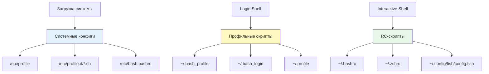
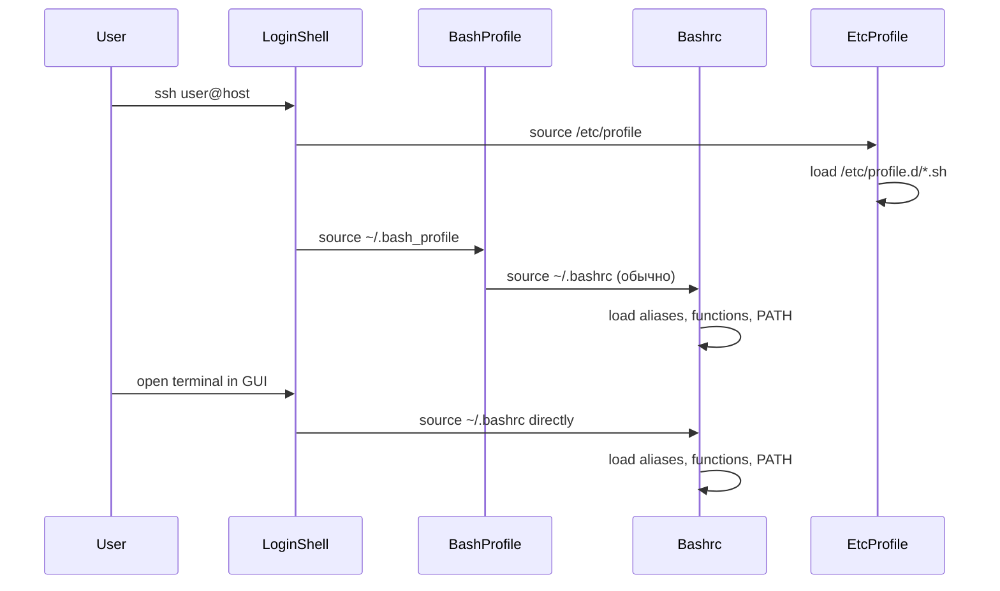

## Введение

Shell окружение — это совокупность настроек, переменных, функций и инструментов, которые определяют поведение интерактивной оболочки (bash, zsh, fish) при входе пользователя в систему. Для DevOps-инженера грамотная настройка shell окружения — это не просто вопрос удобства, а **инструмент продуктивности**: правильно настроенное окружение ускоряет рутинные операции, предотвращает ошибки и обеспечивает переносимость рабочих процессов между разными системами.

>[!INFO] Связь с предыдущими темами
>Shell окружение строится на фундаменте [[Synced/DevOps/Сетевое и системное администрирование/1. Операционные системы/1. Linux/1. Основы работы в терминале и навигация по ФС.md | основ работы в терминале]], использует [[Synced/DevOps/Сетевое и системное администрирование/1. Операционные системы/1. Linux/2. Stdin, Stdout, Stderr, пайплайны, перенаправления.md | потоки ввода-вывода]] и является средой выполнения для [[Synced/DevOps/Сетевое и системное администрирование/1. Операционные системы/1. Linux/4. Bash скрипты.md | bash-скриптов]]. Понимание структуры конфигурационных файлов требует знания [[Synced/DevOps/Сетевое и системное администрирование/1. Операционные системы/1. Linux/8. Пользователи, группы, аутентификация/1. etc структуры.md | структуры /etc]].

## 1. Архитектура shell окружения

### Уровни конфигурации



### Типы shell-сессий

| Тип                       | Когда создается                    | Какие файлы загружаются                             | Пример                         |
| ------------------------- | ---------------------------------- | --------------------------------------------------- | ------------------------------ |
| **Login shell**           | При входе в систему (SSH, консоль) | `/etc/profile` → `~/.bash_profile` или `~/.profile` | `ssh user@host`, `su - user`   |
| **Interactive non-login** | При запуске терминала в GUI        | `/etc/bash.bashrc` → `~/.bashrc`                    | Открытие нового окна терминала |
| **Non-interactive**       | При выполнении скрипта             | Только `$BASH_ENV` если установлен                  | `./script.sh`, cron-задачи     |

>[!WARNING] Частая проблема
>Переменные, экспортируемые в `~/.bashrc`, не будут доступны в login shell, если `~/.bash_profile` не загружает `~/.bashrc` явно. Это частая причина «переменная не найдена» после SSH-входа.

### Порядок загрузки bash



### Best practices для конфигурационных файлов

```bash
# ~/.bash_profile (или ~/.profile)
# Загружается только при login shell

# Загрузить ~/.bashrc для интерактивных настроек
if [ -f ~/.bashrc ]; then
    source ~/.bashrc
fi

# Экспортировать переменные окружения (доступны всем дочерним процессам)
export EDITOR=nvim
export VISUAL=nvim
export PAGER=less

# Добавить пользовательские бинарники в PATH
export PATH="$HOME/bin:$HOME/.local/bin:$PATH"

# Настройки для конкретных инструментов
export AWS_PROFILE=production
export KUBECONFIG="$HOME/.kube/config:$HOME/.kube/additional-config"
```

```bash
# ~/.bashrc
# Загружается при каждом интерактивном запуске bash

# Проверка на интерактивность (защита от выполнения в non-interactive shell)
[ -z "$PS1" ] && return

# === Алиасы ===
alias ll='ls -alF'
alias la='ls -A'
alias l='ls -CF'
alias ..='cd ..'
alias ...='cd ../..'
alias grep='grep --color=auto'

# === Функции ===
mkcd() {
    mkdir -p "$1" && cd "$1"
}

extract() {
    if [ -f "$1" ]; then
        case "$1" in
            *.tar.bz2)   tar xjf "$1"    ;;
            *.tar.gz)    tar xzf "$1"    ;;
            *.tar.xz)    tar xJf "$1"    ;;
            *.bz2)       bunzip2 "$1"    ;;
            *.gz)        gunzip "$1"     ;;
            *.tar)       tar xf "$1"     ;;
            *.tbz2)      tar xjf "$1"    ;;
            *.tgz)       tar xzf "$1"    ;;
            *.zip)       unzip "$1"      ;;
            *.Z)         uncompress "$1" ;;
            *.7z)        7z x "$1"       ;;
            *)           echo "Неизвестный формат: $1" ;;
        esac
    else
        echo "'$1' не является файлом"
    fi
}

# === Prompt ===
# Простой кастомный prompt
PS1='\[\033[01;32m\]\u@\h\[\033[00m\]:\[\033[01;34m\]\w\[\033[00m\]\$ '

# === История ===
HISTSIZE=10000
HISTFILESIZE=20000
HISTCONTROL=ignoreboth:erasedups
shopt -s histappend

# === Автодополнение ===
if ! shopt -oq posix; then
    if [ -f /usr/share/bash-completion/bash_completion ]; then
        source /usr/share/bash-completion/bash_completion
    elif [ -f /etc/bash_completion ]; then
        source /etc/bash_completion
    fi
fi
```

>[!TIP] Разделение конфигурации
>Для сложных настроек разбивайте `~/.bashrc` на модули:
>```bash
># ~/.bashrc
>for config in ~/.bashrc.d/*.sh; do
 >   [ -r "$config" ] && source "$config"
>done
>```
>Структура:
>```
>~/.bashrc.d/
>├── 00-variables.sh
>├── 10-aliases.sh
>├── 20-functions.sh
>├── 30-prompt.sh
└── 40-completions.sh
>```

## 2. Переменные окружения: глубокое понимание

### Типы переменных

```mermaid
graph TD
    Vars[Переменные в shell] --> Shell[Shell variables]
    Vars --> Env[Environment variables]
    Vars --> Positional[Positional parameters]
    Vars --> Special[Special parameters]
    
    Shell --> Local[Локальные: не экспортируются]
    Shell --> Exported[Экспортируемые: export VAR=value]
    
    Env --> PATH[PATH: поиск бинарников]
    Env --> HOME[HOME: домашняя директория]
    Env --> USER[USER: имя пользователя]
    Env --> SHELL[SHELL: текущий shell]
    
    Positional --> Args[$1, $2, ...: аргументы скрипта]
    
    Special --> At[$@: все аргументы]
    Special --> Hash[$#: количество аргументов]
    Special --> Question[$?: код выхода последней команды]
    
    style Env fill:#e8f5e9
    style Shell fill:#e3f2fd
```

### Ключевые переменные для DevOps

|Переменная|Назначение|Типичное значение|DevOps use-case|
|---|---|---|---|
|`PATH`|Директории для поиска исполняемых файлов|`/usr/local/bin:/usr/bin:/bin`|Добавление кастомных бинарников: `export PATH="$HOME/bin:$PATH"`|
|`HOME`|Домашняя директория пользователя|`/home/user`|Ссылки на конфиги: `$HOME/.kube/config`|
|`USER` / `LOGNAME`|Имя текущего пользователя|`deploy`|Условная логика в скриптах|
|`SHELL`|Путь к текущему shell|`/bin/bash`|Проверка совместимости скриптов|
|`PWD`|Текущая рабочая директория|`/var/log/nginx`|Относительные пути в скриптах|
|`OLDPWD`|Предыдущая директория|`/etc/nginx`|`cd -` для возврата|
|`TERM`|Тип терминала|`xterm-256color`|Корректное отображение цветов, ncurses|
|`LANG` / `LC_*`|Локаль (кодировка, формат дат)|`en_US.UTF-8`|Корректная обработка UTF-8 в логах|
|`EDITOR` / `VISUAL`|Редактор по умолчанию|`vim`, `nano`|`crontab -e`, `git commit`|
|`PAGER`|Программа для постраничного вывода|`less`|`man`, `git log`|
|`HISTSIZE` / `HISTFILESIZE`|Размер истории команд|`10000` / `20000`|Сохранение истории между сессиями|
|`TMPDIR`|Директория для временных файлов|`/tmp`|`mktemp` использует эту переменную|

### Управление PATH: критично для DevOps

```bash
# Просмотр текущего PATH
echo "$PATH" | tr ':' '\n'

# Добавить директорию в начало PATH (приоритет выше)
export PATH="$HOME/bin:$PATH"

# Добавить директорию в конец PATH
export PATH="$PATH:/opt/custom/bin"

# Удалить директорию из PATH (bash-specific)
PATH="${PATH//\/opt\/old\/bin:/}"
export PATH

# Проверить, где находится команда
which kubectl
type -a kubectl  # Показать все вхождения

# Найти все исполняемые файлы с именем 'python'
type -a python
```

> [!WARNING] Порядок в PATH
> Команды ищутся слева направо. Если в `$HOME/bin` есть `python`, а в `/usr/bin` — системный `python`, будет использован `$HOME/bin/python`. Это может привести к неочевидным проблемам, если версии несовместимы.

### Экспорт переменных: область видимости

```bash
# Локальная переменная (только текущий shell)
MY_VAR="local_value"
bash -c 'echo $MY_VAR'  # Пусто, не экспортирована

# Экспортированная переменная (доступна дочерним процессам)
export MY_VAR="exported_value"
bash -c 'echo $MY_VAR'  # "exported_value"

# Переменная только для одной команды
MY_VAR="temporary" some_command

# Удалить переменную
unset MY_VAR

# Сделать переменную read-only
readonly CONFIG_PATH="/etc/app/config"
CONFIG_PATH="/new/path"  # Ошибка: readonly variable
```

### Переменные и подстановки в скриптах

```bash
# Дефолтные значения
DB_HOST="${DB_HOST:-localhost}"      # Если DB_HOST не задан или пуст
DB_PORT="${DB_PORT:=5432}"           # Если DB_PORT не задан, присвоить и использовать
API_KEY="${API_KEY:?API_KEY required}"  # Если не задан, вывести ошибку и выйти
BACKUP_DIR="${BACKUP_DIR:-/tmp}"     # Дефолтное значение

# Подстановка команд
CURRENT_DATE=$(date +%F)
KERNEL_VERSION=$(uname -r)

# Арифметические операции
COUNT=5
((COUNT++))
RESULT=$((COUNT * 2))

# Длина строки
NAME="hello"
echo "${#NAME}"  # 5

# Подстрока
STRING="hello world"
echo "${STRING:0:5}"  # "hello"
echo "${STRING:6}"    # "world"
```

## 3. Алиасы и функции: ускорение работы

### Алиасы: быстрые сокращения

```bash
# Базовые алиасы для продуктивности
alias ll='ls -alF'
alias la='ls -A'
alias l='ls -CF'
alias ..='cd ..'
alias ...='cd ../..'
alias ....='cd ../../..'

# Алиасы с sudo
alias apt-update='sudo apt update && sudo apt upgrade'
alias systemctl-reload='sudo systemctl daemon-reload'

# Алиасы для DevOps инструментов
alias k='kubectl'
alias kgp='kubectl get pods'
alias kgs='kubectl get svc'
alias kgd='kubectl get deployments'
alias klf='kubectl logs -f'
alias ke='kubectl exec -it'

alias tf='terraform'
alias tfp='terraform plan'
alias tfa='terraform apply'
alias tfd='terraform destroy'

alias dk='docker'
alias dkc='docker compose'
alias dkps='docker ps'
alias dkimg='docker images'

# Алиасы для навигации
alias proj='cd ~/projects'
alias conf='cd /etc'
alias logs='cd /var/log'

# Алиасы для безопасности
alias rm='rm -i'           # Спрашивать подтверждение
alias cp='cp -i'
alias mv='mv -i'

# Алиасы с аргументами (через функции)
# Нельзя передать аргументы в алиас напрямую, используйте функции:
mkcd() { mkdir -p "$1" && cd "$1"; }
greplog() { grep -r --include="*.log" "$1" /var/log; }
```

### Функции: мощь и гибкость

```bash
# Функция для быстрого создания бэкапа
backup() {
    if [ -z "$1" ]; then
        echo "Usage: backup <file_or_directory>"
        return 1
    fi
    
    local source="$1"
    local timestamp=$(date +%Y%m%d_%H%M%S)
    local backup_name="${source}_backup_${timestamp}"
    
    if [ -d "$source" ]; then
        tar -czf "${backup_name}.tar.gz" "$source"
    elif [ -f "$source" ]; then
        cp "$source" "${backup_name}"
    else
        echo "Error: $source does not exist"
        return 1
    fi
    
    echo "Backup created: ${backup_name}"
}

# Функция для быстрого деплоя
deploy() {
    local env="${1:-staging}"
    local service="${2:-all}"
    
    echo "Deploying $service to $env..."
    
    case "$env" in
        staging)
            kubectl set image deployment/$service $service=myapp:latest -n staging
            ;;
        production)
            echo "⚠️  Production deployment requires confirmation"
            read -p "Are you sure? (yes/no): " confirm
            if [ "$confirm" = "yes" ]; then
                kubectl set image deployment/$service $service=myapp:latest -n production
            else
                echo "Deployment cancelled"
                return 1
            fi
            ;;
        *)
            echo "Unknown environment: $env"
            return 1
            ;;
    esac
    
    echo "✅ Deployment initiated"
    kubectl rollout status deployment/$service -n "$env"
}

# Функция для анализа использования диска
disk_usage() {
    local dir="${1:-.}"
    echo "Top 10 largest directories in $dir:"
    du -h "$dir" 2>/dev/null | sort -rh | head -10
}

# Функция для быстрого поиска процессов
psgrep() {
    if [ -z "$1" ]; then
        echo "Usage: psgrep <pattern>"
        return 1
    fi
    ps aux | grep -i "$1" | grep -v grep
}

# Функция для быстрого просмотра логов с фильтрацией
taillog() {
    local log_file="${1:-/var/log/syslog}"
    local pattern="${2:-}"
    
    if [ -n "$pattern" ]; then
        tail -f "$log_file" | grep --line-buffered -i "$pattern"
    else
        tail -f "$log_file"
    fi
}
```

### Практические алиасы для DevOps

```bash
# === Kubernetes ===
alias kctx='kubectl config use-context'
alias kns='kubectl config set-context --current --namespace'
alias kget='kubectl get'
alias kdesc='kubectl describe'
alias kdel='kubectl delete'
alias klogs='kubectl logs -f --tail=100'
alias kexec='kubectl exec -it'
alias kport='kubectl port-forward'
alias ktop='kubectl top'

# Быстрый доступ к подам с ошибками
alias kerr='kubectl get pods --field-selector=status.phase!=Running'

# === Docker ===
alias dkps='docker ps --format "table {{.Names}}\t{{.Status}}\t{{.Ports}}"'
alias dklogs='docker logs -f --tail=100'
alias dkexec='docker exec -it'
alias dkrm='docker rm -f $(docker ps -aq)'  # Осторожно!
alias dkrmi='docker rmi $(docker images -q)'  # Осторожно!

# === Terraform ===
alias tfi='terraform init'
alias tfp='terraform plan'
alias tfa='terraform apply'
alias tfd='terraform destroy'
alias tfo='terraform output'
alias tfs='terraform state list'
alias tfv='terraform validate'

# === Git ===
alias gs='git status'
alias ga='git add'
alias gc='git commit'
alias gp='git push'
alias gl='git log --oneline --graph --decorate'
alias gd='git diff'
alias gco='git checkout'
alias gb='git branch'

# === Системные утилиты ===
alias ports='sudo ss -tulnp'
alias mem='free -h'
alias cpu='top -bn1 | head -20'
alias disk='df -h'
alias inode='df -i'
alias myip='curl -s ifconfig.me'
alias weather='curl wttr.in'

# === Безопасность ===
alias mypubkey='cat ~/.ssh/id_rsa.pub'
alias sshlist='ls -la ~/.ssh/'
```

>[!TIP] Управление алиасами
>Для организации алиасов создайте отдельный файл:
>```bash
># ~/.bash_aliases
>source ~/.bash_aliases.d/devops.sh
>source ~/.bash_aliases.d/kubernetes.sh
>source ~/.bash_aliases.d/docker.sh
>```

## 4. История команд: эффективность и безопасность

### Настройка истории

```bash
# ~/.bashrc

# Размер истории в памяти и в файле
HISTSIZE=10000
HISTFILESIZE=20000

# Контроль дубликатов и пробелов
HISTCONTROL=ignoreboth  # Игнорировать дубликаты и команды с пробелом в начале

# Или более строгий контроль
HISTCONTROL=ignoredups:ignorespace:erasedups

# Добавлять в историю сразу, не ждать выхода из shell
shopt -s histappend

# Формат времени в истории
HISTTIMEFORMAT="%F %T  "

# Игнорировать определенные команды
HISTIGNORE="ls:ll:cd:pwd:exit:clear:history"

# Записывать историю после каждой команды (а не при выходе)
PROMPT_COMMAND="history -a; $PROMPT_COMMAND"
```

### Управление историей

```bash
# Просмотр истории
history
history 20  # Последние 20 команд

# Поиск в истории
history | grep terraform

# Выполнить команду по номеру
!123

# Выполнить последнюю команду
!!

# Выполнить последнюю команду с sudo
sudo !!

# Выполнить последнюю команду, начинающуюся с 'git'
!git

# Повторить команду с заменой аргумента
^old^new  # Заменить 'old' на 'new' в последней команде

# Поиск в реальном времени: Ctrl+R
# Начать ввод, история будет фильтроваться
# Ctrl+R снова — следующее совпадение
# Ctrl+G — отменить поиск
```

### Безопасность истории

```bash
# Не записывать команды с паролями в историю
# Способ 1: пробел в начале команды (если HISTCONTROL=ignorespace)
 export API_KEY="secret123"  # Не попадет в историю

# Способ 2: отключить историю временно
set +o history
export API_KEY="secret123"
set -o history

# Способ 3: очистить историю
history -c  # Очистить текущую сессию
history -d 123  # Удалить конкретную запись
> ~/.bash_history  # Очистить файл истории

# Избегать записи определенных команд
HISTIGNORE="*password*:*secret*:*token*:*key*"
```

> [!WARNING] Утечка секретов Даже если команда не попала в историю, она может остаться в:
> 
> - `/proc/<PID>/cmdline` (пока процесс запущен)
> - Логах shell (`/var/log/auth.log` для sudo)
> - Скриншотах и логах терминала Всегда используйте менеджеры секретов ([[Synced/DevOps/CI-CD, артефакты, тестирование и DevSecOps/5. DevSecOps и безопасность цепочки поставок/1. Управление идентификацией и доступом (IAM)/2. HashiCorp Vault/2. Динамические секреты.md | Vault]]) вместо передачи секретов в командной строке.

## 5. Автодополнение (Completion)

### Bash completion

```bash
# Проверка установки
dpkg -l | grep bash-completion

# Установка (Debian/Ubuntu)
sudo apt install bash-completion

# Включение в ~/.bashrc
if ! shopt -oq posix; then
    if [ -f /usr/share/bash-completion/bash_completion ]; then
        source /usr/share/bash-completion/bash_completion
    elif [ -f /etc/bash_completion ]; then
        source /etc/bash_completion
    fi
fi

# Использование
# kubectl get <TAB>           # Показать ресурсы
# kubectl get pods -n <TAB>   # Показать namespaces
# systemctl <TAB>             # Показать команды
# systemctl restart <TAB>     # Показать сервисы
# ssh user@<TAB>              # Показать хосты из ~/.ssh/config
```

### Programmable completion

```bash
# Создание кастомного completion для скрипта

# ~/.bash_completion.d/deploy
_deploy_completion() {
    local cur prev opts
    COMPREPLY=()
    cur="${COMP_WORDS[COMP_CWORD]}"
    prev="${COMP_WORDS[COMP_CWORD-1]}"
    opts="staging production rollback status"
    
    case "$prev" in
        deploy)
            COMPREPLY=( $(compgen -W "$opts" -- "$cur") )
            return 0
            ;;
        staging|production)
            local services="api web worker scheduler"
            COMPREPLY=( $(compgen -W "$services" -- "$cur") )
            return 0
            ;;
    esac
}
complete -F _deploy_completion deploy

# Использование:
# deploy <TAB>              # staging production rollback status
# deploy staging <TAB>      # api web worker scheduler
```

### Zsh completion (если используется zsh)

```zsh
# ~/.zshrc

# Включение автодополнения
autoload -Uz compinit
compinit

# Кэширование для ускорения
zstyle ':completion:*' use-cache on
zstyle ':completion:*' cache-path ~/.zsh/cache

# Нечеткое соответствие
zstyle ':completion:*' matcher-list 'm:{a-zA-Z}={A-Za-z}'

# Цветной вывод
zstyle ':completion:*' list-colors "${(s.:.)LS_COLORS}"

# Меню выбора при множественных вариантах
zstyle ':completion:*' menu select

# Описание опций
zstyle ':completion:*' descriptions format '%F{blue}-- %d --%f'
```

## 6. Prompt customization

### Базовая настройка PS1

```bash
# Простой цветной prompt
PS1='\[\033[01;32m\]\u@\h\[\033[00m\]:\[\033[01;34m\]\w\[\033[00m\]\$ '

# Разбор escape-последовательностей:
# \u - имя пользователя
# \h - имя хоста
# \w - текущая директория (полный путь)
# \W - basename текущей директории
# \$ - $ для обычного пользователя, # для root
# \[\033[XX;YYm\] - цвет (XX: стиль, YY: цвет)
# \[\033[00m\] - сброс цвета

# Цвета:
# 30-37: черный, красный, зеленый, желтый, синий, пурпурный, циан, белый
# 01;XX: жирный
# 00: сброс
```

### Информативный prompt для DevOps

```bash
# Prompt с git-веткой и статусом
parse_git_branch() {
    git branch 2>/dev/null | sed -e '/^[^*]/d' -e 's/* \(.*\)/ (\1)/'
}

git_status() {
    local status=$(git status --porcelain 2>/dev/null)
    if [ -n "$status" ]; then
        if echo "$status" | grep -q "^ M\|^M"; then
            echo " ✗"  # Есть изменения
        elif echo "$status" | grep -q "^??"; then
            echo " ?"  # Есть untracked файлы
        else
            echo " ✓"  # Чисто
        fi
    fi
}

PS1='\[\033[01;32m\]\u@\h\[\033[00m\]:\[\033[01;34m\]\w\[\033[33m\]$(parse_git_branch)$(git_status)\[\033[00m\]\$ '

# Результат:
# user@host:~/project (main ✗)$
```

### Prompt с контекстом (окружение, кластер)

```bash
# Prompt для Kubernetes-контекста
k8s_context() {
    if command -v kubectl &>/dev/null; then
        local ctx=$(kubectl config current-context 2>/dev/null)
        local ns=$(kubectl config view --minify --output 'jsonpath={..namespace}' 2>/dev/null)
        if [ -n "$ctx" ]; then
            echo " ⎈ ${ctx}"
            [ -n "$ns" ] && [ "$ns" != "default" ] && echo "/${ns}"
        fi
    fi
}

# Prompt для облачного провайдера
cloud_context() {
    if [ -n "$AWS_PROFILE" ]; then
        echo " ☁️ $AWS_PROFILE"
    elif [ -n "$GOOGLE_CLOUD_PROJECT" ]; then
        echo " ☁️ $GOOGLE_CLOUD_PROJECT"
    fi
}

PS1='\[\033[01;32m\]\u@\h\[\033[00m\]:\[\033[01;34m\]\w\[\033[35m\]$(k8s_context)$(cloud_context)\[\033[00m\]\$ '

# Результат:
# user@host:~/project ⎈ production/default ☁️ prod-profile$
```

### Starship: кросс-shell prompt

```bash
# Установка
# Debian/Ubuntu
curl -sS https://starship.rs/install.sh | sh

# Или через пакетный менеджер
apt install starship

# Добавление в ~/.bashrc или ~/.zshrc
eval "$(starship init bash)"  # Для bash
eval "$(starship init zsh)"   # Для zsh

# Конфигурация: ~/.config/starship.toml
cat > ~/.config/starship.toml <<'EOF'
# Минимальный prompt
format = """
$username\
$hostname\
$directory\
$git_branch\
$git_status\
$kubernetes\
$aws\
$docker_context\
$cmd_duration\
$line_break\
$character"""

[directory]
truncation_length = 3
truncate_to_repo = true

[git_branch]
format = "[$symbol$branch]($style) "
symbol = " "

[kubernetes]
disabled = false
format = '[$symbol$context( \($namespace\))]($style) '
symbol = "⎈ "

[aws]
format = '[$symbol($profile)(\($region\))]($style) '
symbol = "☁️ "

[cmd_duration]
min_time = 2_000
format = '[$duration]($style) '
EOF
```

> [!TIP] Преимущества Starship
> 
> - Работает в bash, zsh, fish, PowerShell
> - Быстрый (написан на Rust)
> - Богатая конфигурация через TOML
> - Показывает контекст: git, k8s, aws, docker, python version, etc.

## 7. Фреймворки для shell: oh-my-zsh и альтернативы

### Oh My Zsh

```bash
# Установка
sh -c "$(curl -fsSL https://raw.githubusercontent.com/ohmyzsh/ohmyzsh/master/tools/install.sh)"

# Конфигурация: ~/.zshrc
ZSH_THEME="agnoster"  # Или "robbyrussell", "dst", "refined"

plugins=(
    git
    docker
    kubectl
    terraform
    aws
    helm
    extract
    zsh-autosuggestions
    zsh-syntax-highlighting
)

# Полезные плагины для DevOps
# kubectl: алиасы и автодополнение для Kubernetes
# docker: алиасы и автодополнение для Docker
# terraform: автодополнение для Terraform
# aws: автодополнение для AWS CLI
# extract: функция extract() для всех архивов
# z: быстрые переходы по часто используемым директориям
# zsh-autosuggestions: предложения команд на основе истории
# zsh-syntax-highlighting: подсветка синтаксиса в командной строке
```

### Альтернативы Oh My Zsh

```bash
# Prezto (более быстрый, меньше overhead)
git clone --recursive https://github.com/sorin-ionescu/prezto.git ~/.zprezto

# Zinit (минималистичный, очень быстрый)
# https://github.com/zdharma-continuum/zinit

# Fisher (для fish shell)
curl -sL https://git.io/fisher | source && fisher install jorgebucaran/fisher
```

### Сравнение фреймворков

|Фреймворк|Shell|Скорость|Размер|Use-case|
|---|---|---|---|---|
|**Oh My Zsh**|zsh|Средняя|Большой|Богатая экосистема плагинов, простота|
|**Prezto**|zsh|Быстрый|Средний|Модульность, производительность|
|**Zinit**|zsh|Очень быстрый|Минимальный|Максимальная производительность|
|**Fish**|fish|Быстрый|Средний|Out-of-the-box опыт, autosuggestions|
|**Starship**|Любой|Очень быстрый|Минимальный|Только prompt, кросс-shell|

> [!WARNING] Производительность Oh My Zsh с множеством плагинов может замедлить запуск shell на 100-500ms. Для SSH-сессий это критично. Рассмотрите:
> 
> - Минимальный набор плагинов
> - Ленивую загрузку (lazy loading)
> - Альтернативы: Prezto, Starship + минимальная конфигурация

## 8. Практические сценарии для DevOps

### Сценарий 1: Перенос окружения между серверами

```bash
#!/usr/bin/env bash
# export-shell-env.sh

# Экспорт текущего окружения
export_env() {
    local output_file="${1:-shell-env-$(date +%F).sh}"
    
    {
        echo "# Shell environment export"
        echo "# Generated: $(date)"
        echo "# Host: $(hostname)"
        echo ""
        
        # Экспорт переменных окружения (исключая системные)
        echo "# === Environment variables ==="
        env | grep -E '^(PATH|HOME|USER|EDITOR|PAGER|AWS_|KUBE|TF_)' | \
            while IFS='=' read -r key value; do
                echo "export $key=\"$value\""
            done
        
        echo ""
        echo "# === Aliases ==="
        alias | while IFS='=' read -r key value; do
            # Убрать одинарные кавычки вокруг значения
            value="${value#\'}"
            value="${value%\'}"
            echo "alias $key='$value'"
        done
        
        echo ""
        echo "# === Functions ==="
        declare -f | grep -E '^(mkcd|extract|backup|deploy|psgrep|taillog)'
        
    } > "$output_file"
    
    chmod 600 "$output_file"
    echo "Environment exported to $output_file"
}

# Импорт окружения
import_env() {
    local input_file="$1"
    
    if [ ! -f "$input_file" ]; then
        echo "Error: File not found: $input_file"
        return 1
    fi
    
    source "$input_file"
    echo "Environment imported from $input_file"
}

# Использование
export_env my-env.sh
# Скопировать my-env.sh на другой сервер
scp my-env.sh user@host:~/
# На другом сервере:
source ~/my-env.sh
```

### Сценарий 2: Контекстно-зависимое окружение для Kubernetes

```bash
# ~/.bashrc.d/k8s-context.sh

# Функция для быстрого переключения контекста
kctx() {
    local context="$1"
    
    if [ -z "$context" ]; then
        echo "Available contexts:"
        kubectl config get-contexts -o name | nl
        echo ""
        read -p "Select context number: " num
        context=$(kubectl config get-contexts -o name | sed -n "${num}p")
    fi
    
    kubectl config use-context "$context"
    echo "Switched to context: $context"
    
    # Показать текущий namespace
    local ns=$(kubectl config view --minify --output 'jsonpath={..namespace}')
    echo "Namespace: ${ns:-default}"
}

# Функция для переключения namespace
kns() {
    local namespace="$1"
    
    if [ -z "$namespace" ]; then
        echo "Available namespaces:"
        kubectl get namespaces -o name | sed 's/namespace\///' | nl
        echo ""
        read -p "Select namespace number: " num
        namespace=$(kubectl get namespaces -o name | sed -n "${num}p" | sed 's/namespace\///')
    fi
    
    kubectl config set-context --current --namespace="$namespace"
    echo "Switched to namespace: $namespace"
}

# Алиасы для быстрого доступа
alias kprod='kctx production && kns default'
alias kstage='kctx staging && kns default'
alias kdev='kctx development && kns default'

# Автоматическая установка namespace при переключении контекста
export KUBECONFIG="$HOME/.kube/config"
```

### Сценарий 3: Динамический prompt с информацией о окружении

```bash
# ~/.bashrc.d/dynamic-prompt.sh

# Цвета
RED='\[\033[0;31m\]'
GREEN='\[\033[0;32m\]'
YELLOW='\[\033[0;33m\]'
BLUE='\[\033[0;34m\]'
PURPLE='\[\033[0;35m\]'
CYAN='\[\033[0;36m\]'
NC='\[\033[0m\]' # No Color

# Функция для определения окружения по hostname
detect_env() {
    local hostname=$(hostname -s)
    
    case "$hostname" in
        prod-*|production-*)
            echo "${RED}PROD${NC}"
            ;;
        stage-*|staging-*)
            echo "${YELLOW}STAGE${NC}"
            ;;
        dev-*|development-*)
            echo "${GREEN}DEV${NC}"
            ;;
        test-*)
            echo "${PURPLE}TEST${NC}"
            ;;
        *)
            echo "${CYAN}LOCAL${NC}"
            ;;
    esac
}

# Функция для Git-информации
git_info() {
    local branch=$(git branch 2>/dev/null | sed -e '/^[^*]/d' -e 's/* \(.*\)/\1/')
    
    if [ -n "$branch" ]; then
        local status=$(git status --porcelain 2>/dev/null)
        local symbol=" "
        
        if [ -n "$status" ]; then
            if echo "$status" | grep -q "^ M\|^M"; then
                symbol=" ✗"
            elif echo "$status" | grep -q "^??"; then
                symbol=" ?"
            else
                symbol=" ✓"
            fi
        fi
        
        echo " ${PURPLE}($branch${symbol})${NC}"
    fi
}

# Функция для Kubernetes-контекста
k8s_info() {
    if command -v kubectl &>/dev/null; then
        local ctx=$(kubectl config current-context 2>/dev/null)
        if [ -n "$ctx" ]; then
            local ns=$(kubectl config view --minify --output 'jsonpath={..namespace}' 2>/dev/null)
            ns="${ns:-default}"
            echo " ${BLUE}⎈ $ctx/$ns${NC}"
        fi
    fi
}

# Функция для времени выполнения последней команды
last_cmd_duration() {
    local duration=$SECONDS
    if [ $duration -ge 2 ]; then
        local mins=$((duration / 60))
        local secs=$((duration % 60))
        if [ $mins -gt 0 ]; then
            echo " ${YELLOW}[$mins:${secs}m]${NC}"
        else
            echo " ${YELLOW}[${secs}s]${NC}"
        fi
    fi
}

# Сборка prompt
build_prompt() {
    local exit_code=$?
    local env_color
    
    # Цвет для символа $ в зависимости от кода выхода
    if [ $exit_code -eq 0 ]; then
        exit_symbol="${GREEN}$${NC}"
    else
        exit_symbol="${RED}$${NC}"
    fi
    
    PS1="$(detect_env) ${GREEN}\u@\h${NC}:${BLUE}\w${NC}$(git_info)$(k8s_info)$(last_cmd_duration)\n${exit_symbol} "
    
    # Сбросить счетчик времени
    SECONDS=0
}

# Установить PROMPT_COMMAND
PROMPT_COMMAND="build_prompt; $PROMPT_COMMAND"
```

### Сценарий 4: Управление несколькими окружениями через direnv

```bash
# Установка direnv
apt install direnv

# Интеграция с bash
# ~/.bashrc
eval "$(direnv hook bash)"

# Создание .envrc для проекта
cd ~/projects/myapp
cat > .envrc <<'EOF'
# .envrc - direnv configuration

# Загрузить .env файл
dotenv

# Установить переменные окружения
export APP_ENV=development
export DATABASE_URL=postgresql://localhost/myapp_dev

# Добавить локальные бинарники в PATH
PATH_add ./bin

# Предупреждение при активации
log_status "Development environment loaded"
EOF

# Разрешить .envrc
direnv allow

# Теперь при входе в директорию автоматически загружается окружение
# При выходе — выгружается

# Использование с Kubernetes
cat > .envrc <<'EOF'
# Переключение контекста при входе в директорию
layout python3
export KUBECONFIG="$PWD/kube-config.yaml"
export KUBECTL_NAMESPACE=development

# Автоматическое переключение контекста
kubectl config use-context development 2>/dev/null || true
EOF
```

> [!TIP] Преимущества direnv
> 
> - Автоматическая загрузка/выгрузка окружения при входе/выходе из директории
> - Поддержка множества форматов: `.env`, `.envrc`, `toml`, `yaml`
> - Интеграция с bash, zsh, fish, vim, emacs
> - Безопасность: требуется явное разрешение (`direnv allow`)

### Сценарий 5: Безопасное управление секретами в shell

```bash
# Интеграция с HashiCorp Vault

# Функция для получения секрета
vault_get() {
    local path="$1"
    local field="${2:-value}"
    
    if ! command -v vault &>/dev/null; then
        echo "ERROR: vault CLI not installed" >&2
        return 1
    fi
    
    vault kv get -field="$field" "$path" 2>/dev/null
}

# Функция для загрузки секретов в окружение
load_secrets() {
    local prefix="${1:-secret/app}"
    
    # Получить все секреты из пути
    local secrets=$(vault kv get -format=json "$prefix" 2>/dev/null | jq -r '.data.data | to_entries[] | "\(.key)=\(.value)"')
    
    # Экспортировать каждую переменную
    while IFS='=' read -r key value; do
        if [ -n "$key" ] && [ -n "$value" ]; then
            export "$key=$value"
            echo "Loaded: $key"
        fi
    done <<< "$secrets"
}

# Использование
# load_secrets "secret/myapp/production"
# Теперь $DB_PASSWORD, $API_KEY и другие секреты доступны в окружении

# Автоматическая загрузка при входе в директорию
# .envrc (для direnv)
layout python3
eval "$(vault kv get -format=json secret/myapp/development | jq -r '.data.data | to_entries[] | "export \(.key)=\(.value)"')"
```

---

## Контрольные вопросы для самопроверки

1. В чем разница между login shell и interactive non-login shell? Какие конфигурационные файлы загружаются в каждом случае? Почему это важно для SSH-сессий?
2. Как добавить директорию в PATH так, чтобы она имела приоритет над системными путями? Какие риски это несет?
3. Почему переменная, экспортируемая в `~/.bashrc`, может быть недоступна после SSH-входа? Как исправить эту проблему?
4. Как настроить историю команд так, чтобы команды с паролями не сохранялись? Какие еще места могут содержать следы выполнения команд с секретами?
5. В чем разница между алиасом и функцией в bash? Когда следует использовать каждый из них?
6. Как создать кастомное автодополнение для собственного скрипта? Какие переменные используются для доступа к текущему слову и предыдущему контексту?
7. Почему Oh My Zsh может замедлять запуск shell? Какие альтернативы существуют для более производительной настройки?
8. Как реализовать динамический prompt, который показывает текущий Kubernetes-контекст и namespace? Почему это полезно в multi-cluster окружениях?

---

#devops #linux #shell #bash #zsh #environment-variables #aliases #functions #history #completion #prompt #oh-my-zsh #starship #direnv #productivity #configuration #security #kubernetes #vault #automation #sysadmin #fundamentals