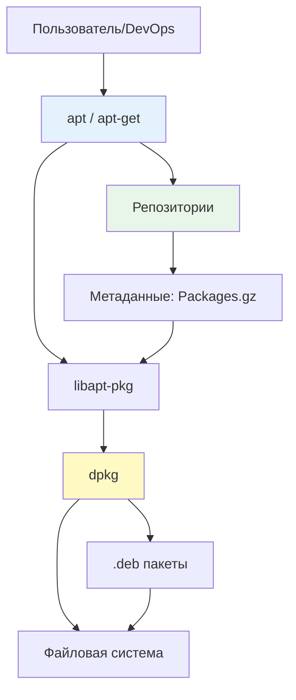

## Введение

**apt** (Advanced Package Tool) — это высокоуровневый менеджер пакетов для Debian-based дистрибутивов (Debian, Ubuntu, Linux Mint и др.). Он предоставляет удобный интерфейс для установки, обновления, удаления программного обеспечения и управления зависимостями, автоматизируя работу с низкоуровневыми инструментами вроде `dpkg`.

Для DevOps-инженера понимание `apt` критично: от настройки серверов и управления конфигурациями до создания Docker-образов и автоматизации через Ansible.

> [!INFO] Связь с другими темами
> 
> - `apt` работает поверх [[Synced/DevOps/Сетевое и системное администрирование/1. Операционные системы/1. Linux/7. Управление пакетами/1. Debian, Ubuntu/2. dpkg.md | dpkg]] — низкоуровневого менеджера пакетов
> - Источники пакетов настраиваются через [[Synced/DevOps/Сетевое и системное администрирование/1. Операционные системы/1. Linux/7. Управление пакетами/1. Debian, Ubuntu/3. Репозитории.md | репозитории]]
> - Для продвинутого управления версиями используется [[Synced/DevOps/Сетевое и системное администрирование/1. Операционные системы/1. Linux/7. Управление пакетами/1. Debian, Ubuntu/4. pinning.md | apt pinning]]
> - Автоматические обновления настраиваются через [[Synced/DevOps/Сетевое и системное администрирование/1. Операционные системы/1. Linux/7. Управление пакетами/1. Debian, Ubuntu/5. unattended-upgrades.md | unattended-upgrades]]

## 1. Архитектура системы управления пакетами  Debian

### Иерархия инструментов



| Уровень     | Инструмент       | Назначение                                            | Когда использовать                         |
| ----------- | ---------------- | ----------------------------------------------------- | ------------------------------------------ |
| **Высокий** | `apt`, `apt-get` | Управление репозиториями, зависимостями, обновлениями | Повседневная работа, скрипты автоматизации |
| **Средний** | `apt-cache`      | Поиск, информация о пакетах                           | Анализ зависимостей, отладка               |
| **Низкий**  | `dpkg`           | Установка .deb файлов, управление состоянием пакетов  | Ручная установка, диагностика проблем      |

### Ключевые директории

```bash
/etc/apt/
├── sources.list              # Основные репозитории
├── sources.list.d/           # Дополнительные репозитории (.list файлы)
├── apt.conf                  # Основная конфигурация apt
├── apt.conf.d/               # Фрагменты конфигурации
├── preferences               # Настройки pinning
├── preferences.d/            # Фрагменты pinning
├── trusted.gpg               # Доверенные GPG ключи
└── trusted.gpg.d/            # Дополнительные ключи

/var/lib/apt/lists/           # Кэш метаданных репозиториев
/var/cache/apt/archives/      # Кэш загруженных .deb пакетов
/var/log/apt/                 # Логи операций apt
```

## 2. Основные команды apt

### Обновление индексов пакетов

```bash
# Обновление списков пакетов из репозиториев
apt update

# Что происходит "под капотом":
# 1. Читаются /etc/apt/sources.list и sources.list.d/*
# 2. Загружаются Packages.gz файлы с репозиториев
# 3. Сохраняются в /var/lib/apt/lists/
# 4. Проверяются подписи GPG

# Всегда выполняйте apt update перед установкой/обновлением!
```

>[!WARNING] Частая ошибка
>`apt install` без предварительного `apt update` может установить устаревшую версию пакета или завершиться ошибкой "package not found".

### Установка пакетов

```bash
# Установка одного пакета
apt install nginx

# Установка нескольких пакетов
apt install nginx php-fpm php-pgsql

# Установка с автоматическим подтверждением (для скриптов)
apt install -y docker-ce

# Установка конкретной версии
apt install nginx=1.18.0-0ubuntu1.4

# Установка без рекомендаций (экономия места)
apt install --no-install-recommends postgresql-client

# Переустановка пакета
apt install --reinstall nginx
```

### Удаление пакетов

```bash
# Удаление пакета (конфиги остаются)
apt remove nginx

# Удаление пакета с конфигурационными файлами
apt purge nginx

# Удаление пакета и неиспользуемых зависимостей
apt autoremove --purge

# Очистка кэша загруженных .deb файлов
apt clean           # удалить все
apt autoclean       # удалить только устаревшие
```

### Обновление пакетов

```bash
# Обновление всех пакетов до новых версий
apt upgrade

# Обновление с удалением/установкой пакетов при необходимости
apt full-upgrade    # или apt dist-upgrade

# Обновление конкретного пакета
apt install nginx   # если есть новая версия, она установится

# Проверка, какие пакеты можно обновить
apt list --upgradable
```

## 3. Поиск и информация о пакетах

### Поиск пакетов

```bash
# Поиск по названию и описанию
apt search nginx

# Поиск с регулярным выражением
apt search '^php[0-9.]+-fpm$'

# Список всех установленных пакетов
apt list --installed

# Список пакетов с доступными обновлениями
apt list --upgradable

# Список всех доступных пакетов
apt list | grep postgresql
```

### Детальная информация о пакете

```bash
# Полная информация о пакете
apt show nginx

# Ключевые поля:
# - Package: имя пакета
# - Version: текущая версия
# - Priority: приоритет (optional, required)
# - Section: категория (web, databases)
# - Maintainer: сопровождающий
# - Depends: зависимости
# - Recommends: рекомендуемые пакеты
# - Description: описание

# Показать зависимости пакета
apt depends nginx

# Показать обратные зависимости (кто зависит от пакета)
apt rdepends nginx

# Показать файлы, установленные пакетом
dpkg -L nginx    # dpkg, так как apt не имеет такой команды

# Показать, какому пакету принадлежит файл
apt file /etc/nginx/nginx.conf    # требует apt-file
# или
dpkg -S /etc/nginx/nginx.conf
```

## 4. Управление версиями и pinning

### Просмотр доступных версий

```bash
# Показать все доступные версии пакета
apt policy nginx

# Вывод:
# nginx:
#   Installed: 1.18.0-0ubuntu1.4
#   Candidate: 1.18.0-0ubuntu1.4
#   Version table:
#  *** 1.18.0-0ubuntu1.4 500
#         500 http://archive.ubuntu.com/ubuntu focal-updates/main amd64 Packages
#         100 /var/lib/dpkg/status
#      1.17.10-0ubuntu1 500
#         500 http://archive.ubuntu.com/ubuntu focal/main amd64 Packages
```

### Фиксация версии пакета (hold)

```bash
# Зафиксировать пакет (запретить обновления)
apt mark hold nginx

# Снять фиксацию
apt mark unhold nginx

# Показать статус всех пакетов
apt mark showhold

# Альтернатива через dpkg
dpkg --get-selections | grep hold
echo "nginx hold" | dpkg --set-selections
```

> [!TIP] Когда использовать hold
> 
> - Пакет критичен для работы системы, и вы хотите контролировать обновления вручную
> - Тестирование совместимости с новой версией
> - Избегание breaking changes в production

### Установка конкретной версии

```bash
# Показать доступные версии
apt policy postgresql-13

# Установить конкретную версию
apt install postgresql-13=13.4-1.pgdg20.04+1

# Понизить версию (downgrade)
apt install postgresql-13=13.3-1.pgdg20.04+1
```

> [!WARNING] Риски downgrade
> Понижение версии может привести к несовместимости конфигураций, баз данных или форматов данных. Всегда делайте бэкап перед downgrade.

## 5. Работа с репозиториями

### Добавление репозитория

```bash
# Способ 1: через add-apt-repository (требует software-properties-common)
apt install software-properties-common
add-apt-repository ppa:nginx/stable
apt update

# Способ 2: вручную создать .list файл
echo "deb http://ppa.launchpad.net/nginx/stable/ubuntu focal main" > \
  /etc/apt/sources.list.d/nginx-stable.list

# Способ 3: для репозиториев с GPG ключом
wget -qO - https://packages.example.com/gpg.key | gpg --dearmor > \
  /etc/apt/trusted.gpg.d/example.gpg

echo "deb [signed-by=/etc/apt/trusted.gpg.d/example.gpg] https://packages.example.com/ubuntu focal main" > \
  /etc/apt/sources.list.d/example.list

apt update
```

### Удаление репозитория

```bash
# Через add-apt-repository
add-apt-repository --remove ppa:nginx/stable

# Вручную
rm /etc/apt/sources.list.d/nginx-stable.list
apt update
```

### Типы репозиториев

```bash
# Пример /etc/apt/sources.list
deb http://archive.ubuntu.com/ubuntu/ focal main restricted
deb http://archive.ubuntu.com/ubuntu/ focal-updates main restricted
deb http://security.ubuntu.com/ubuntu/ focal-security main restricted

# Формат:
# deb [опции] URI дистрибутив компонент1 компонент2 ...
# 
# deb     - бинарные пакеты
# deb-src - исходные коды (для сборки)
# 
# Компоненты Ubuntu:
# main        - официальная поддержка, свободное ПО
# restricted  - официальная поддержка, несвободное ПО (драйверы)
# universe    - сообщество, свободное ПО
# multiverse  - сообщество, несвободное ПО
```

>[!LINK] Детали настройки
>Подробная работа с репозиториями, включая создание локальных зеркал и прокси — в [[Synced/DevOps/Сетевое и системное администрирование/1. Операционные системы/1. Linux/7. Управление пакетами/1. Debian, Ubuntu/3. Репозитории.md | управлении репозиториями]].

## 6. Решение проблем с зависимостями

### Диагностика broken packages

```bash
# Проверка зависимостей
apt check

# Показать сломанные пакеты
dpkg --audit
apt list --installed | grep -i "^iF\|^iU\|^iH"

# Попытка автоматического исправления
apt --fix-broken install
# или
apt -f install
```

### Ручное разрешение конфликтов

```bash
# Сценарий: конфликт версий
apt install package-a
# Ошибка: package-a зависит от package-b (>= 2.0), но будет установлен 1.5

# Решение 1: установить нужную версию зависимости явно
apt install package-b=2.0.1
apt install package-a

# Решение 2: использовать pinning для приоритета версии
# /etc/apt/preferences.d/package-b
# Package: package-b
# Pin: version 2.0.*
# Pin-Priority: 1000

# Решение 3: удалить конфликтующий пакет
apt remove conflicting-package
apt install package-a
```

### Очистка кэша и пересоздание списков

```bash
# Очистка кэша пакетов
apt clean
apt autoclean

# Удаление и пересоздание списков репозиториев
rm -rf /var/lib/apt/lists/*
apt update

# Пересоздание базы данных dpkg
dpkg --configure -a
```

## 7. Конфигурация apt

### Основные параметры в /etc/apt/apt.conf

```bash
# Создать файл конфигурации
cat > /etc/apt/apt.conf.d/99custom <<EOF
// Отключить установку рекомендуемых пакетов по умолчанию
APT::Install-Recommends "false";

// Автоматически удалять неиспользуемые зависимости
APT::Get::AutomaticRemove "true";

// Показывать прогресс-бар при загрузке
Dpkg::Progress-Fancy "1";

// Таймаут для HTTP соединений
Acquire::http::Timeout "30";

// Количество попыток загрузки
Acquire::Retries "3";

// Кэшировать пакеты в /var/cache/apt/archives
Dir::Cache "/var/cache/apt";
Dir::Cache::archives "archives/";
EOF
```

### Отключение рекомендаций в Docker-образах

```Dockerfile
# Dockerfile для минимального образа
FROM ubuntu:20.04

# Отключить рекомендации для всех apt install в этом образе
RUN echo 'APT::Install-Recommends "false";' > /etc/apt/apt.conf.d/99-docker && \
    echo 'APT::Install-Suggests "false";' >> /etc/apt/apt.conf.d/99-docker

RUN apt update && apt install -y nginx postgresql-client
# Размер образа будет значительно меньше
```

> [!TIP] Оптимизация Docker-образов
> Отключение `Recommends` и `Suggests` может уменьшить размер образа на 30-50%. Используйте `apt clean && rm -rf /var/lib/apt/lists/*` в конце RUN для удаления кэша.

## 8. Автоматизация и скрипты

### Непрерывная установка в скриптах

```bash
#!/bin/bash
set -euo pipefail

# Функция для безопасной установки пакетов
install_packages() {
    local packages=("$@")
    
    # Обновление индексов
    apt update -qq
    
    # Установка с подавлением интерактивных вопросов
    DEBIAN_FRONTEND=noninteractive apt install -y --no-install-recommends "${packages[@]}"
    
    # Очистка кэша
    apt clean
    rm -rf /var/lib/apt/lists/*
}

# Использование
install_packages nginx php-fpm php-pgsql curl wget
```

### Проверка установленных пакетов

```bash
#!/bin/bash

REQUIRED_PACKAGES=(nginx postgresql-client curl)

check_packages() {
    local missing=()
    
    for pkg in "${REQUIRED_PACKAGES[@]}"; do
        if ! dpkg -l "$pkg" &>/dev/null; then
            missing+=("$pkg")
        fi
    done
    
    if (( ${#missing[@]} > 0 )); then
        echo "Отсутствуют пакеты: ${missing[*]}" >&2
        return 1
    fi
    
    echo "Все необходимые пакеты установлены"
    return 0
}

check_packages || exit 1
```

### Интеграция с Ansible

```yml
# Ansible playbook для установки пакетов
- name: Install web server packages
  hosts: webservers
  become: yes
  tasks:
    - name: Update apt cache
      apt:
        update_cache: yes
        cache_valid_time: 3600  # не обновлять чаще раза в час
    
    - name: Install nginx
      apt:
        name: nginx
        state: present
    
    - name: Install specific version
      apt:
        name: postgresql-client=13.4-1.pgdg20.04+1
        state: present
    
    - name: Remove unnecessary packages
      apt:
        autoremove: yes
        purge: yes
```
  

> [!LINK] Связь с IaC
> Детальная работа с Ansible и управление пакетами через роли — в [[Synced/DevOps/IaC/6. Ansible (Продвинутые практики)/1. Роли и Коллекции.md | ролях Ansible]].

## 9. Практические сценарии для DevOps

### Сценарий 1: Подготовка сервера для веб-приложения

```bash
#!/bin/bash
set -euo pipefail

echo "=== Подготовка сервера ==="

# Обновление системы
apt update && apt upgrade -y

# Установка базовых утилит
apt install -y --no-install-recommends \
  curl wget git vim htop net-tools \
  software-properties-common apt-transport-https

# Добавление репозиториев
add-apt-repository -y ppa:nginx/stable
add-apt-repository -y ppa:ondrej/php

# Установка стека LEMP
apt install -y --no-install-recommends \
  nginx \
  php8.1-fpm php8.1-pgsql php8.1-curl php8.1-mbstring \
  postgresql-client

# Настройка автозапуска
systemctl enable nginx php8.1-fpm

# Очистка
apt autoremove -y
apt clean

echo "=== Сервер готов ==="
```

### Сценарий 2: Создание минимального Docker-образа

```Dockerfile
FROM ubuntu:22.04

# Метки для идентификации
LABEL maintainer="devops@example.com"
LABEL description="Minimal web server image"

# Переменные окружения для неинтерактивной установки
ENV DEBIAN_FRONTEND=noninteractive

# Оптимизация apt
RUN echo 'APT::Install-Recommends "false";' > /etc/apt/apt.conf.d/99-docker && \
    echo 'APT::Install-Suggests "false";' >> /etc/apt/apt.conf.d/99-docker

# Установка пакетов в одном слое для уменьшения размера
RUN apt update && \
    apt install -y --no-install-recommends \
      nginx \
      curl \
      ca-certificates && \
    apt clean && \
    rm -rf /var/lib/apt/lists/*

# Настройка nginx
RUN ln -sf /dev/stdout /var/log/nginx/access.log && \
    ln -sf /dev/stderr /var/log/nginx/error.log

EXPOSE 80

CMD ["nginx", "-g", "daemon off;"]
```

### Сценарий 3: Мониторинг уязвимостей пакетов

```bash
#!/bin/bash
set -euo pipefail

# Проверка пакетов с известными уязвимостями (требует aptitude)
if ! command -v aptitude &>/dev/null; then
    apt install -y aptitude
fi

# Поиск пакетов с security updates
echo "=== Пакеты с доступными security updates ==="
apt list --upgradable 2>/dev/null | grep -i security || echo "Нет обновлений безопасности"

# Проверка устаревших пакетов
echo ""
echo "=== Устаревшие пакеты ==="
apt list --installed 2>/dev/null | while read -r pkg; do
    pkg_name=$(echo "$pkg" | cut -d'/' -f1)
    if apt show "$pkg_name" 2>/dev/null | grep -q "obsolete"; then
        echo "⚠️  $pkg_name"
    fi
done

# Генерация отчета
REPORT="/tmp/apt-security-report-$(date +%F).txt"
{
    echo "Отчет безопасности пакетов - $(date)"
    echo "======================================"
    echo ""
    echo "Установленные пакеты: $(dpkg -l | grep '^ii' | wc -l)"
    echo "Доступно обновлений: $(apt list --upgradable 2>/dev/null | wc -l)"
    echo ""
    apt list --upgradable 2>/dev/null
} > "$REPORT"

echo ""
echo "Отчет сохранен: $REPORT"
```

## 10. Troubleshooting и отладка

### Типичные проблемы и решения

|Проблема|Причина|Решение|
|---|---|---|
|`E: Unable to locate package`|Пакет не в репозиториях или устарел индекс|`apt update`, проверка `sources.list`|
|`E: Broken packages`|Конфликт зависимостей|`apt --fix-broken install`, `aptitude` для интерактивного решения|
|`E: dpkg was interrupted`|Прерванная установка|`dpkg --configure -a`|
|`E: Could not get lock /var/lib/dpkg/lock`|Другой apt процесс запущен|`ps aux|
|`GPG error: NO_PUBKEY`|Отсутствует GPG ключ репозитория|Импортировать ключ: `apt-key adv --keyserver ...`|
|`Hash Sum mismatch`|Поврежденный кэш|`rm -rf /var/lib/apt/lists/* && apt update`|

### Диагностика проблем с репозиториями

```bash
# Проверка доступности репозиториев
apt update --print-uris | head -20

# Тестирование конкретного репозитория
curl -I http://archive.ubuntu.com/ubuntu/dists/focal/Release

# Проверка GPG подписей
apt-key list

# Удаление устаревших ключей
apt-key del <KEY_ID>

# Анализ sources.list
grep -r "^deb" /etc/apt/sources.list /etc/apt/sources.list.d/
```

### Восстановление после сбоев

```bash
# Сценарий: прерванная установка привела к broken packages

# 1. Попытка автоматического исправления
dpkg --configure -a
apt --fix-broken install

# 2. Если не помогло, удаление проблемного пакета
dpkg --remove --force-remove-reinstreq broken-package

# 3. Пересоздание базы данных dpkg
mv /var/lib/dpkg/status /var/lib/dpkg/status.bak
touch /var/lib/dpkg/status
apt update
apt --fix-broken install

# 4. Крайний случай: переустановка dpkg
wget http://archive.ubuntu.com/ubuntu/pool/main/d/dpkg/dpkg_1.19.7ubuntu3_amd64.deb
dpkg -i dpkg_1.19.7ubuntu3_amd64.deb
```

> [!LINK] Связь с методологией
> Систематический подход к диагностике проблем с пакетами — часть [[Synced/DevOps/Сетевое и системное администрирование/0. Введение и методология/2. Методология Troubleshooting.md | методологии troubleshooting]].

---

## Контрольные вопросы для самопроверки

1. В чем разница между `apt remove` и `apt purge`? Когда нужно использовать каждый из них?
2. Почему важно выполнять `apt update` перед установкой пакетов? Что происходит при этой команде?
3. Как зафиксировать версию пакета, чтобы предотвратить его автоматическое обновление? В каких сценариях это необходимо?
4. Что означает флаг `--no-install-recommends` и почему его стоит использовать в Docker-образах?
5. Как добавить сторонний репозиторий с GPG-подписью? Почему проверка подписи критична для безопасности?
6. Что делать, если `apt install` завершается ошибкой "broken packages"? Как диагностировать и разрешить конфликт зависимостей?
7. Как очистить кэш apt и пересоздать списки репозиториев? Когда это необходимо?
8. В чем разница между `apt upgrade` и `apt full-upgrade`? Когда нужно использовать каждый из них?

---

#devops #linux #debian #ubuntu #apt #package-management #dpkg #repositories #automation #docker #ansible #sysadmin #infrastructure #security #troubleshooting