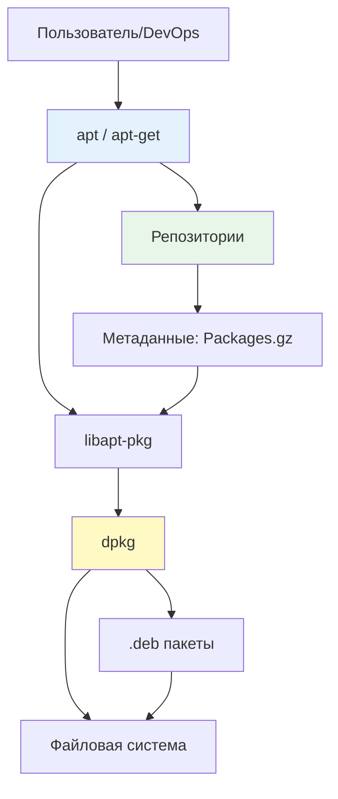

## Введение

**apt** (Advanced Package Tool) — это высокоуровневый менеджер пакетов для Debian-based дистрибутивов (Debian, Ubuntu, Linux Mint и др.). Он предоставляет удобный интерфейс для установки, обновления, удаления программного обеспечения и управления зависимостями, автоматизируя работу с низкоуровневыми инструментами вроде `dpkg`.

Для DevOps-инженера понимание `apt` критично: от настройки серверов и управления конфигурациями до создания Docker-образов и автоматизации через Ansible.

> [!INFO] Связь с другими темами
> 
> - `apt` работает поверх [[Synced/DevOps/Сетевое и системное администрирование/1. Операционные системы/1. Linux/7. Управление пакетами/1. Debian, Ubuntu/2. dpkg.md | dpkg]] — низкоуровневого менеджера пакетов
> - Источники пакетов настраиваются через [[Synced/DevOps/Сетевое и системное администрирование/1. Операционные системы/1. Linux/7. Управление пакетами/1. Debian, Ubuntu/3. Репозитории.md | репозитории]]
> - Для продвинутого управления версиями используется [[Synced/DevOps/Сетевое и системное администрирование/1. Операционные системы/1. Linux/7. Управление пакетами/1. Debian, Ubuntu/4. pinning.md | apt pinning]]
> - Автоматические обновления настраиваются через [[Synced/DevOps/Сетевое и системное администрирование/1. Операционные системы/1. Linux/7. Управление пакетами/1. Debian, Ubuntu/5. unattended-upgrades.md | unattended-upgrades]]

## 1. Архитектура системы управления пакетами  Debian

### Иерархия инструментов



| Уровень     | Инструмент       | Назначение                                            | Когда использовать                         |
| ----------- | ---------------- | ----------------------------------------------------- | ------------------------------------------ |
| **Высокий** | `apt`, `apt-get` | Управление репозиториями, зависимостями, обновлениями | Повседневная работа, скрипты автоматизации |
| **Средний** | `apt-cache`      | Поиск, информация о пакетах                           | Анализ зависимостей, отладка               |
| **Низкий**  | `dpkg`           | Установка .deb файлов, управление состоянием пакетов  | Ручная установка, диагностика проблем      |

### Ключевые директории

```bash
/etc/apt/
├── sources.list              # Основные репозитории
├── sources.list.d/           # Дополнительные репозитории (.list файлы)
├── apt.conf                  # Основная конфигурация apt
├── apt.conf.d/               # Фрагменты конфигурации
├── preferences               # Настройки pinning
├── preferences.d/            # Фрагменты pinning
├── trusted.gpg               # Доверенные GPG ключи
└── trusted.gpg.d/            # Дополнительные ключи

/var/lib/apt/lists/           # Кэш метаданных репозиториев
/var/cache/apt/archives/      # Кэш загруженных .deb пакетов
/var/log/apt/                 # Логи операций apt
```

## 2. Основные команды apt

### Обновление индексов пакетов

```bash
# Обновление списков пакетов из репозиториев
apt update

# Что происходит "под капотом":
# 1. Читаются /etc/apt/sources.list и sources.list.d/*
# 2. Загружаются Packages.gz файлы с репозиториев
# 3. Сохраняются в /var/lib/apt/lists/
# 4. Проверяются подписи GPG

# Всегда выполняйте apt update перед установкой/обновлением!
```

>[!WARNING] Частая ошибка
>`apt install` без предварительного `apt update` может установить устаревшую версию пакета или завершиться ошибкой "package not found".

### Установка пакетов

```bash
# Установка одного пакета
apt install nginx

# Установка нескольких пакетов
apt install nginx php-fpm php-pgsql

# Установка с автоматическим подтверждением (для скриптов)
apt install -y docker-ce

# Установка конкретной версии
apt install nginx=1.18.0-0ubuntu1.4

# Установка без рекомендаций (экономия места)
apt install --no-install-recommends postgresql-client

# Переустановка пакета
apt install --reinstall nginx
```

### Удаление пакетов

```bash
# Удаление пакета (конфиги остаются)
apt remove nginx

# Удаление пакета с конфигурационными файлами
apt purge nginx

# Удаление пакета и неиспользуемых зависимостей
apt autoremove --purge

# Очистка кэша загруженных .deb файлов
apt clean           # удалить все
apt autoclean       # удалить только устаревшие
```

### Обновление пакетов

```bash
# Обновление всех пакетов до новых версий
apt upgrade

# Обновление с удалением/установкой пакетов при необходимости
apt full-upgrade    # или apt dist-upgrade

# Обновление конкретного пакета
apt install nginx   # если есть новая версия, она установится

# Проверка, какие пакеты можно обновить
apt list --upgradable
```

## 3. Поиск и информация о пакетах

### Поиск пакетов

```bash
# Поиск по названию и описанию
apt search nginx

# Поиск с регулярным выражением
apt search '^php[0-9.]+-fpm$'

# Список всех установленных пакетов
apt list --installed

# Список пакетов с доступными обновлениями
apt list --upgradable

# Список всех доступных пакетов
apt list | grep postgresql
```

### Детальная информация о пакете

```bash
# Полная информация о пакете
apt show nginx

# Ключевые поля:
# - Package: имя пакета
# - Version: текущая версия
# - Priority: приоритет (optional, required)
# - Section: категория (web, databases)
# - Maintainer: сопровождающий
# - Depends: зависимости
# - Recommends: рекомендуемые пакеты
# - Description: описание

# Показать зависимости пакета
apt depends nginx

# Показать обратные зависимости (кто зависит от пакета)
apt rdepends nginx

# Показать файлы, установленные пакетом
dpkg -L nginx    # dpkg, так как apt не имеет такой команды

# Показать, какому пакету принадлежит файл
apt file /etc/nginx/nginx.conf    # требует apt-file
# или
dpkg -S /etc/nginx/nginx.conf
```