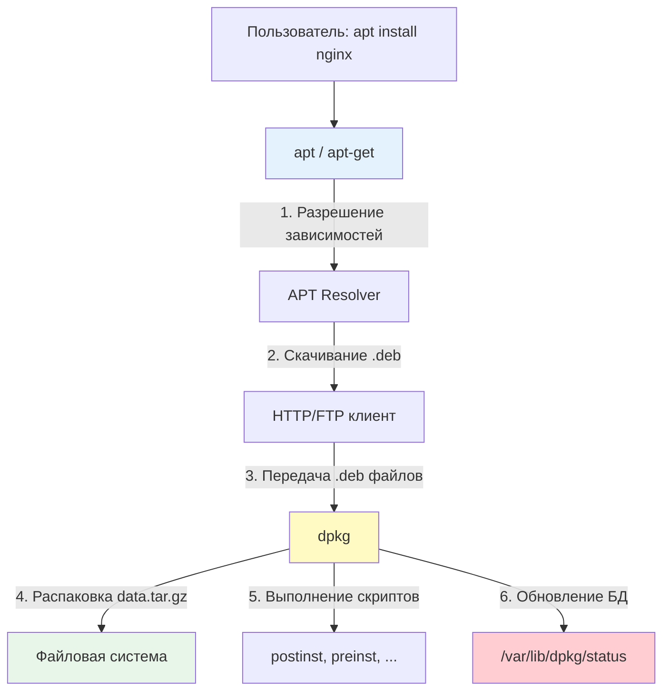
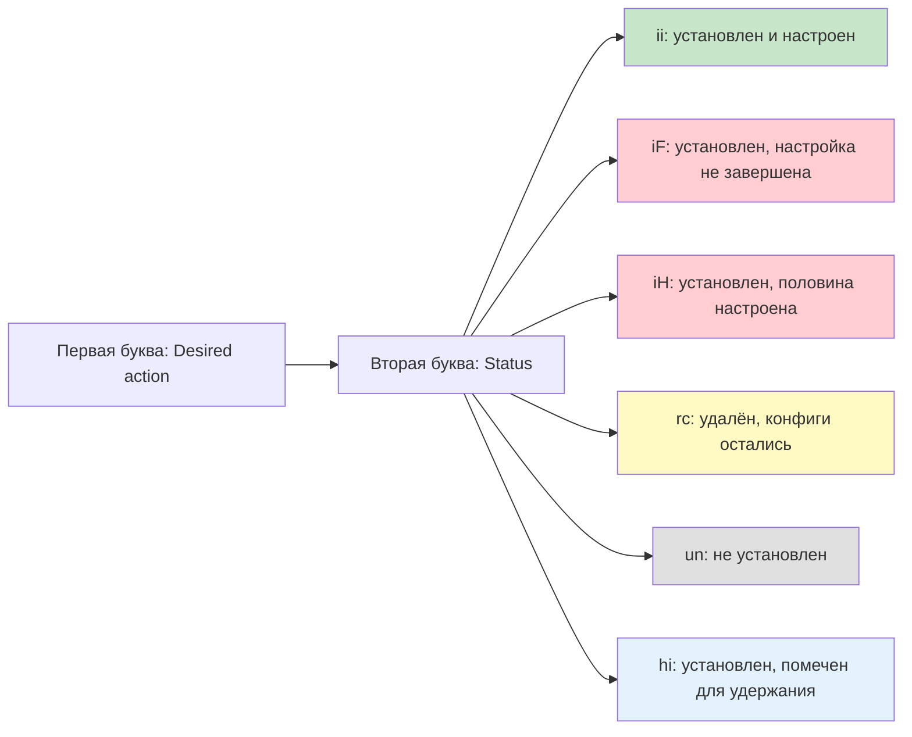
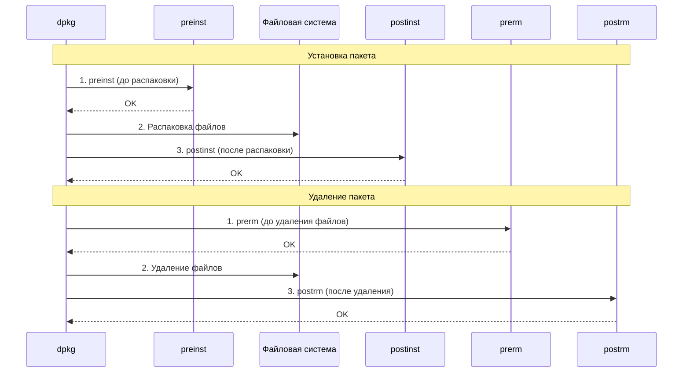

## Введение

**dpkg** — это низкоуровневый менеджер пакетов в Debian-подобных системах, который непосредственно работает с [[Глоссарий#.deb файл| `.deb` файлами]]. Если представить систему управления пакетами как магазин, то `apt` — это витрина с каталогом и корзиной, а `dpkg` — это кладовщик, который физически распаковывает коробки и раскладывает товары по полкам.

Для DevOps-инженера понимание `dpkg` критично: именно он выполняет реальную установку пакетов, а при возникновении проблем с `apt` диагностика почти всегда сводится к анализу состояния `dpkg`.

> [!INFO] Связь с другими темами
> 
> - `dpkg` работает в связке с [[1. apt| apt]], который управляет репозиториями и зависимостями
> - Источники `.deb` файлов — это [[3. Репозитории| репозитории]]
> - Скрипты сопровождения — это по сути [[4. Bash скрипты| bash-скрипты]], выполняемые в определённый момент установки
> - Понимание `dpkg` опирается на [[1. Принцип работы ОС| принципы работы ОС]]: файловые дескрипторы, права доступа, процессы

## 1. Архитектура dpkg и его место в системе

### Взаимодействие с apt



### Ключевые файлы и директории

```bash
/var/lib/dpkg/
├── status              # База данных установленных пакетов (главный файл!)
├── available           # Список всех доступных пакетов (устарел, используется apt)
├── info/               # Информация о каждом установленном пакете
│   ├── nginx.list      # Список файлов пакета nginx
│   ├── nginx.md5sums   # Контрольные суммы файлов
│   ├── nginx.postinst  # Скрипт, выполняемый после установки
│   ├── nginx.prerm     # Скрипт, выполняемый перед удалением
│   └── ...
└── updates/            # Временные файлы при установке

/usr/sbin/
├── dpkg                # Основной исполняемый файл
├── dpkg-query          # Инструмент для запросов к БД пакетов
├── dpkg-divert         # Управление "отвлечениями" файлов
└── dpkg-statoverride   # Переопределение прав на файлы

/etc/dpkg/
├── dpkg.cfg            # Основной конфигурационный файл
└── dpkg.cfg.d/         # Дополнительные конфигурации
```

>[!TIP] Главный файл — `/var/lib/dpkg/status`
>Это текстовый файл, содержащий информацию обо всех пакетах в системе. Именно его читает `dpkg`, чтобы определить, что установлено. Повреждение этого файла — серьёзная проблема, требующая восстановления из бэкапа.

## 2. Основные команды dpkg

### Установка пакетов из .deb файлов

```bash
# Установка локального .deb файла
dpkg -i package.deb

# Что происходит при установке:
# 1. Проверка .deb файла (валидность, архитектура)
# 2. Извлечение control.tar.gz → чтение метаданных
# 3. Проверка зависимостей (dpkg НЕ разрешает зависимости!)
# 4. Выполнение preinst скрипта (если есть)
# 5. Распаковка data.tar.gz в файловую систему
# 6. Выполнение postinst скрипта (если есть)
# 7. Обновление /var/lib/dpkg/status

# Пример: установка скачанного пакета
wget https://dl.google.com/linux/direct/google-chrome-stable_current_amd64.deb
dpkg -i google-chrome-stable_current_amd64.deb
# Если есть зависимости, будет ошибка — см. раздел "Решение проблем"
```

>[!WARNING] dpkg не разрешает зависимости!
>В отличие от `apt`, команда `dpkg -i` не скачивает недостающие пакеты. Если у устанавливаемого пакета есть зависимости, которых нет в системе, установка завершится ошибкой. Решение — использовать `apt install ./package.deb` или `apt --fix-broken install` после `dpkg -i`.

### Удаление пакетов

```bash
# Удаление пакета (конфигурационные файлы остаются)
dpkg -r nginx
# Аналог: apt remove nginx

# Полное удаление (с конфигурационными файлами)
dpkg -P nginx
# Аналог: apt purge nginx
# Также выполняются postrm скрипты для полной очистки
```

### Информация о пакетах

```bash
# Список всех установленных пакетов
dpkg -l
# Вывод:
# Desired=Unknown/Install/Remove/Purge/Hold
# | Status=Not/Inst/Conf-files/Unpacked/halF-conf/Half-inst/trig-aWait/Trig-pend
# |/ Err?=(none)/Reinst-required (Status,Err: uppercase=bad)
# ||/ Name           Version      Architecture Description
# +++-==============-============-============-=================================
# ii  nginx          1.18.0-0ubuntu1.4 amd64        small, powerful web server

# Поиск пакета по имени (поддерживает wildcards)
dpkg -l 'nginx*'
dpkg -l | grep postgres

# Детальная информация о пакете
dpkg -s nginx
# Вывод: Package, Status, Priority, Section, Maintainer, Architecture,
#        Version, Depends, Description и т.д.

# Список файлов, установленных пакетом
dpkg -L nginx
# Вывод:
# /etc/nginx
# /etc/nginx/nginx.conf
# /usr/sbin/nginx
# /var/log/nginx
# ...

# Узнать, какому пакету принадлежит файл
dpkg -S /etc/nginx/nginx.conf
# Вывод: nginx: /etc/nginx/nginx.conf

dpkg -S /usr/bin/python3
# Вывод: python3-minimal: /usr/bin/python3
```

## 3. Статусы пакетов: как читать вывод `dpkg -l`

### Двухбуквенный код статуса

Первые два символа в выводе `dpkg -l` — это код, описывающий состояние пакета:



### Расшифровка кодов

|Код|Desired|Status|Описание|Действие|
|---|---|---|---|---|
|**ii**|install|installed|Пакет установлен и настроен|Нормальное состояние ✅|
|**rc**|remove|config-files|Пакет удалён, но конфиги остались|Можно очистить: `dpkg -P`|
|**iF**|install|half-configured|Установка прервана, настройка не завершена|⚠️ Требует исправления|
|**iH**|install|half-installed|Установка прервана на середине|⚠️ Требует исправления|
|**un**|unknown|not-installed|Пакет не установлен, но известен|Можно установить|
|**hi**|hold|installed|Пакет установлен и зафиксирован (hold)|Не будет обновляться|
|**ri**|remove|installed|Помечен на удаление|Будет удалён при следующем `dpkg --configure -a`|

### Практические примеры

```bash
# Найти все "сломанные" пакеты
dpkg -l | grep -E "^i[FHUWt]"
# iF - half-configured
# iH - half-installed  
# iU - unpacked (распакован, но не настроен)
# iW - trigger-awaited (ожидает триггера)
# it - trigger-pending (триггер в ожидании)

# Найти пакеты с оставшимися конфигами
dpkg -l | grep '^rc'
# Очистить их все
dpkg -l | grep '^rc' | awk '{print $2}' | xargs dpkg -P

# Показать все зафиксированные (hold) пакеты
dpkg -l | grep '^hi'
```

>[!TIP] Быстрая диагностика
>Если `apt` жалуется на broken packages, выполните `dpkg -l | grep -v "^ii"` — это покажет все пакеты в нестандартном состоянии.

## 4. Скрипты сопровождения (Maintainer Scripts)

### Четыре ключевых скрипта



|Скрипт|Когда выполняется|Типичные задачи|
|---|---|---|
|**preinst**|До распаковки файлов|Остановка старых версий сервиса, создание пользователей|
|**postinst**|После распаковки файлов|Запуск сервиса, создание БД, генерация конфигов, `systemctl enable`|
|**prerm**|Перед удалением файлов|Остановка сервиса, удаление временных файлов|
|**postrm**|После удаления файлов|Очистка кэша, удаление пользователей, удаление данных|

### Пример: что делает `postinst` для nginx

```bash
# /var/lib/dpkg/info/nginx.postinst (упрощённо)
#!/bin/sh
set -e

case "$1" in
    configure)
        # Создание пользователя www-data, если его нет
        if ! getent passwd www-data >/dev/null; then
            adduser --system --group --no-create-home www-data
        fi
        
        # Создание директорий с правильными правами
        mkdir -p /var/log/nginx
        chown www-data:www-data /var/log/nginx
        
        # Генерация self-signed сертификата, если нужно
        if [ ! -f /etc/nginx/ssl/nginx.crt ]; then
            # ... генерация сертификата ...
        fi
        
        # Включение сервиса в автозагрузку
        systemctl enable nginx
        
        # Запуск сервиса (только при первой установке)
        if [ -z "$2" ]; then
            systemctl start nginx
        fi
        ;;
    
    abort-upgrade)
        # Откат при неудачном обновлении
        systemctl start nginx || true
        ;;
esac
```

### Отладка скриптов сопровождения

```bash
# Запустить postinst вручную (если установка прервалась)
dpkg --configure package_name

# Протрассировать выполнение скрипта
DPKG_DEBUG=1 dpkg --configure nginx
# или
bash -x /var/lib/dpkg/info/nginx.postinst configure

# Посмотреть содержимое скрипта
cat /var/lib/dpkg/info/nginx.postinst
less /var/lib/dpkg/info/nginx.postinst

# Список всех скриптов для пакета
ls -la /var/lib/dpkg/info/nginx.*
```

> [!LINK] Связь с bash
> Скрипты сопровождения — это обычные [[4. Bash скрипты| bash-скрипты]], которые можно читать, модифицировать (осторожно!) и отлаживать.

## 5. Продвинутые возможности dpkg

### Переопределение прав на файлы (statoverride)

Иногда нужно, чтобы конкретный файл принадлежал не тому пользователю, который указан в пакете. Например, лог-файл должен принадлежать приложению, а не root.

```bash
# Посмотреть текущие переопределения
dpkg-statoverride --list

# Создать переопределение
dpkg-statoverride --add --update redis redis 750 /var/log/redis/redis.log

# Удалить переопределение
dpkg-statoverride --remove /var/log/redis/redis.log

# Результат: при каждой установке/обновлении пакета dpkg
# будет автоматически выставлять указанные права
```

### Отвлечение файлов (diversions)

**Diversions** — это механизм, позволяющий "обмануть" dpkg, заставив его устанавливать файл в другое место. Полезно при модификации системных файлов.

```bash
# Пример: заменить /usr/bin/login своей версией

# 1. Создать отвлечение (сказать dpkg игнорировать оригинал)
dpkg-divert --divert /usr/bin/login.original --rename /usr/bin/login

# 2. Установить свою версию
cp my-login /usr/bin/login

# 3. Проверить список отвлечений
dpkg-divert --list

# 4. Удалить отвлечение (вернуть всё как было)
dpkg-divert --remove /usr/bin/login
mv /usr/bin/login.original /usr/bin/login
```

> [!WARNING] Используйте осторожно
> Diversions могут сломать обновления пакетов. Используйте только когда действительно необходимо (например, в кастомных образах или специфичных конфигурациях).

### Выбор архитектуры (multiarch)

```bash
# Показать текущую архитектуру
dpkg --print-architecture
# amd64

# Показать добавленные архитектуры
dpkg --print-foreign-architectures

# Добавить поддержку i386 (для установки 32-битных пакетов)
dpkg --add-architecture i386
apt update

# Установить 32-битную библиотеку на 64-битной системе
apt install libssl1.1:i386

# Удалить архитектуру
dpkg --remove-architecture i386
```

## 6. Решение проблем

### Сценарий 1: Прерванная установка (half-configured)

```bash
# Проблема: dpkg -i прервался (Ctrl+C, нехватка места, ошибка скрипта)
# Пакет в статусе iF или iH

# Решение 1: продолжить настройку
dpkg --configure -a
# Эта команда попытается завершить настройку ВСЕХ прерванных пакетов

# Решение 2: если configure не помогает, переустановить
apt install --reinstall package_name

# Решение 3: если пакет критично сломан, удалить принудительно
dpkg --remove --force-remove-reinstreq package_name
```

### Сценарий 2: Конфликт файлов

```bash
# Проблема: dpkg -i package.deb
# Ошибка: trying to overwrite '/etc/config.conf', which is also in package other-package

# Решение 1: удалить конфликтующий пакет
dpkg -r other-package
dpkg -i package.deb

# Решение 2: принудительно перезаписать (ОПАСНО!)
dpkg -i --force-overwrite package.deb
# Используйте только если уверены, что это безопасно

# Решение 3: использовать apt для автоматического разрешения
apt install ./package.deb
# apt попытается разрешить зависимости и конфликты
```

### Сценарий 3: Повреждённая база данных status

```bash
# Проблема: dpkg -l выдаёт ошибки или показывает не все пакеты
# Причина: повреждён /var/lib/dpkg/status

# Решение 1: восстановить из бэкапа
ls -la /var/backups/dpkg.status.*
cp /var/backups/dpkg.status.0 /var/lib/dpkg/status

# Решение 2: если бэкапа нет, восстановить из info/
cd /var/lib/dpkg
cp status status.broken
> status  # очистить файл

# Восстановить информацию о каждом пакете из .list файлов
for list in info/*.list; do
    pkg=$(basename "$list" .list)
    echo "Package: $pkg" >> status
    echo "Status: install ok installed" >> status
    # ... добавить остальные поля из info/*.md5sums и т.д.
done

# Решение 3: переустановить все пакеты (крайний случай)
apt update
apt install --reinstall $(dpkg -l | grep '^ii' | awk '{print $2}')
```

### Сценарий 4: Зависший dpkg (lock)

```bash
# Проблема: E: dpkg was interrupted, you must manually run 'dpkg --configure -a'
# или: E: Could not get lock /var/lib/dpkg/lock

# Проверить, запущен ли другой dpkg/apt
ps aux | grep -E 'dpkg|apt'

# Если процесс завис, убить его
kill <PID>
# или в крайнем случае
kill -9 <PID>

# Удалить lock-файлы (если процесс точно не работает)
rm -f /var/lib/dpkg/lock
rm -f /var/lib/dpkg/lock-frontend
rm -f /var/lib/apt/lists/lock
rm -f /var/cache/apt/archives/lock

# Завершить прерванные установки
dpkg --configure -a
```

> [!WARNING] Никогда не удаляйте lock-файлы наугад!
> Удаление lock-файлов при работающем `apt` или `dpkg` может привести к повреждению базы данных пакетов. Всегда сначала проверяйте `ps aux | grep dpkg`.

## 7. Практические сценарии для DevOps

### Сценарий 1: Создание отчёта об установленных пакетах

```bash
#!/bin/bash
# audit-packages.sh

REPORT="/tmp/packages-audit-$(hostname)-$(date +%F).txt"

{
    echo "=== Аудит пакетов ==="
    echo "Хост: $(hostname)"
    echo "Дата: $(date)"
    echo ""
    
    echo "=== Статистика ==="
    echo "Всего пакетов: $(dpkg -l | grep '^ii' | wc -l)"
    echo "Пакеты с конфигами: $(dpkg -l | grep '^rc' | wc -l)"
    echo "Сломанные пакеты: $(dpkg -l | grep -E '^i[FHUWt]' | wc -l)"
    echo ""
    
    echo "=== Установленные пакеты ==="
    dpkg -l | grep '^ii' | awk '{printf "%-40s %s\n", $2, $3}'
    echo ""
    
    echo "=== Пакеты с оставшимися конфигами ==="
    dpkg -l | grep '^rc' | awk '{print $2}'
    echo ""
    
    echo "=== Пакеты, установленные вручную (не зависимости) ==="
    apt-mark showmanual | sort
    echo ""
    
    echo "=== Размер установленных пакетов (топ-20) ==="
    dpkg-query -W --show='${Installed-Size}\t${Package}\n' | \
        sort -rn | head -20 | awk '{printf "%10d KB\t%s\n", $1, $2}'
} > "$REPORT"

echo "Отчёт сохранён: $REPORT"
```

### Сценарий 2: Сравнение пакетов на двух серверах

```bash
#!/bin/bash
# compare-packages.sh

SERVER1="web1.example.com"
SERVER2="web2.example.com"

# Получить списки пакетов
ssh "$SERVER1" dpkg-query -W --show='${Package}=${Version}' | sort > /tmp/pkg1.txt
ssh "$SERVER2" dpkg-query -W --show='${Package}=${Version}' | sort > /tmp/pkg2.txt

# Сравнить
echo "=== Пакеты, отличающиеся между серверами ==="
diff /tmp/pkg1.txt /tmp/pkg2.txt

echo ""
echo "=== Только на $SERVER1 ==="
comm -23 /tmp/pkg1.txt /tmp/pkg2.txt

echo ""
echo "=== Только на $SERVER2 ==="
comm -13 /tmp/pkg1.txt /tmp/pkg2.txt
```

### Сценарий 3: Восстановление состояния пакетов из списка

```bash
#!/bin/bash
# restore-packages.sh
# Восстановить состояние пакетов на новом сервере на основе списка

LIST_FILE="packages.list"

if [[ ! -f "$LIST_FILE" ]]; then
    echo "Файл $LIST_FILE не найден" >&2
    exit 1
fi

echo "=== Обновление индексов ==="
apt update

echo "=== Установка пакетов ==="
while IFS='=' read -r pkg version; do
    # Пропустить комментарии и пустые строки
    [[ -z "$pkg" || "$pkg" =~ ^# ]] && continue
    
    echo "Установка: $pkg=$version"
    apt install -y "${pkg}=${version}" || {
        echo "⚠️  Не удалось установить $pkg=$version, пробуем последнюю версию"
        apt install -y "$pkg"
    }
done < "$LIST_FILE"

echo "=== Очистка ==="
apt autoremove -y
apt clean

echo "=== Готово ==="
```

### Сценарий 4: Создание списка пакетов для бэкапа

```bash
#!/bin/bash
# backup-package-list.sh

BACKUP_DIR="/backup/packages"
mkdir -p "$BACKUP_DIR"

DATE=$(date +%F)

# Список установленных пакетов с версиями
dpkg-query -W --show='${Package}=${Version}' > "$BACKUP_DIR/packages-$DATE.list"

# Список пакетов, установленных вручную (не зависимости)
apt-mark showmanual > "$BACKUP_DIR/manual-packages-$DATE.list"

# Состояние пакетов (hold, install, deinstall)
dpkg --get-selections > "$BACKUP_DIR/selections-$DATE.txt"

# Скрипты для восстановления
cat > "$BACKUP_DIR/restore.sh" <<'EOF'
#!/bin/bash
# Скрипт восстановления состояния пакетов

# Импортировать список пакетов
dpkg --set-selections < selections-*.txt

# Установить пакеты
apt update
apt-get dselect-upgrade -y
EOF

chmod +x "$BACKUP_DIR/restore.sh"

echo "Бэкап создан в $BACKUP_DIR"
```

## 8. Интеграция с другими инструментами

### dpkg в Docker-образах

```Dockerfile
FROM ubuntu:22.04

# Установка локального .deb файла в образ
COPY myapp.deb /tmp/
RUN dpkg -i /tmp/myapp.deb || apt-get install -f -y && \
    rm /tmp/myapp.deb && \
    apt-get clean && \
    rm -rf /var/lib/apt/lists/*

# Альтернатива: использовать apt для автоматического разрешения зависимостей
COPY myapp.deb /tmp/
RUN apt-get update && \
    apt-get install -y /tmp/myapp.deb && \
    rm /tmp/myapp.deb && \
    apt-get clean && \
    rm -rf /var/lib/apt/lists/*
```

### dpkg в Ansible

```yml
- name: Install local .deb package
  apt:
    deb: /tmp/myapp.deb
    state: present

- name: Ensure package is in correct state
  dpkg_selections:
    name: nginx
    selection: hold

- name: Get list of installed packages
  command: dpkg-query -W --show='${Package}=${Version}'
  register: packages_list
  changed_when: false

- name: Show installed packages
  debug:
    var: packages_list.stdout_lines
```

> [!LINK] Связь с IaC
> Использование dpkg в Ansible — часть [[1. Роли и Коллекции| ролей Ansible]], где управление пакетами часто требуется для настройки серверов.

---

## Контрольные вопросы для самопроверки

1. В чем фундаментальная разница между `apt` и `dpkg`? Почему `dpkg` не может разрешать зависимости, а `apt` может?
2. Что означает код `iF` в выводе `dpkg -l`? Как диагностировать и исправить такую ситуацию?
3. Какие четыре скрипта сопровождения (maintainer scripts) существуют и в какой момент установки/удаления они выполняются? Приведите пример задачи для каждого.
4. Как узнать, какому пакету принадлежит конкретный файл в системе (например, `/usr/bin/python3`)? Какие команды для этого используются?
5. Что такое `dpkg-divert` и в каких сценариях его стоит применять? Почему это потенциально опасно?
6. Как восстановить систему, если `/var/lib/dpkg/status` повреждён? Какие бэкапы использует dpkg автоматически?
7. Почему `dpkg -i package.deb` может завершиться ошибкой, даже если сам `.deb` файл корректен? Как это исправить?
8. Как создать бэкап списка установленных пакетов и восстановить его на новом сервере? Какие команды для этого нужны?

---

#devops #linux #debian #ubuntu #dpkg #package-management #deb #maintainer-scripts #sysadmin #troubleshooting #automation #docker #ansible #infrastructure #fundamentals