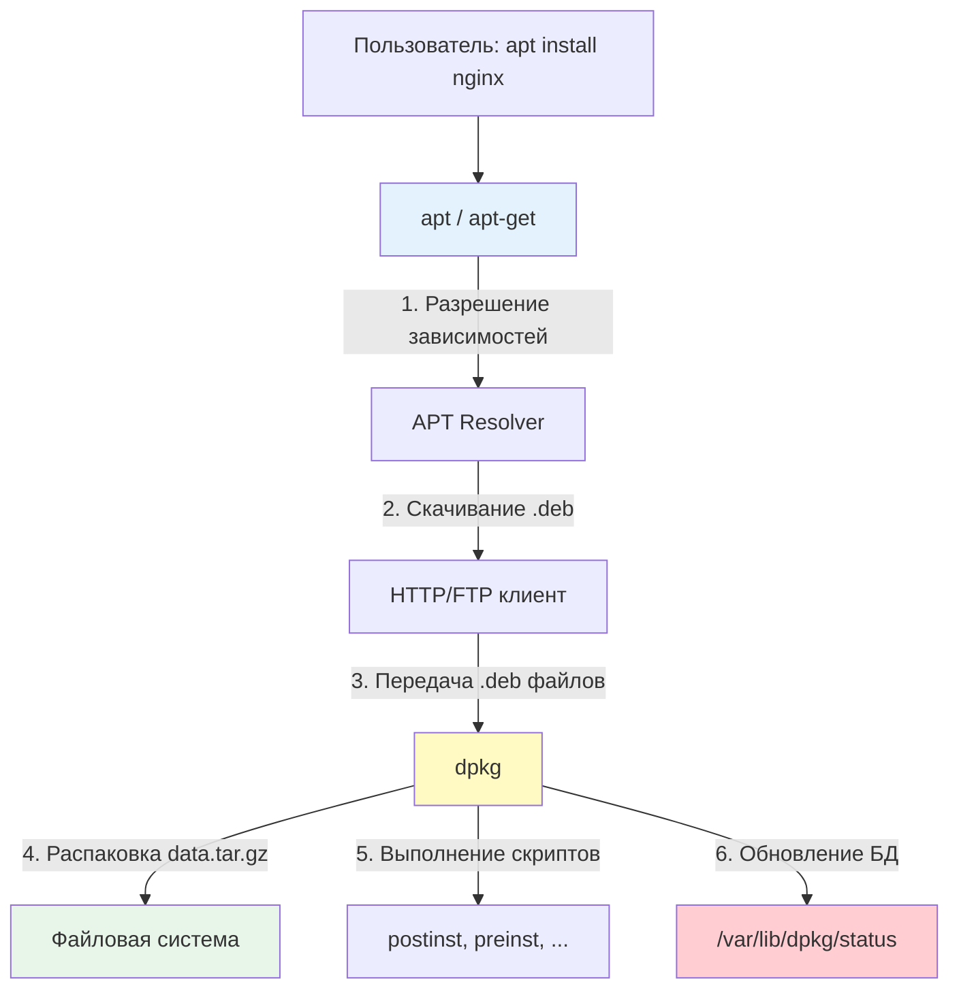

## Введение

**dpkg** — это низкоуровневый менеджер пакетов в Debian-подобных системах, который непосредственно работает с [[Synced/DevOps/Глоссарий.md#.deb файл| `.deb` файлами]]. Если представить систему управления пакетами как магазин, то `apt` — это витрина с каталогом и корзиной, а `dpkg` — это кладовщик, который физически распаковывает коробки и раскладывает товары по полкам.

Для DevOps-инженера понимание `dpkg` критично: именно он выполняет реальную установку пакетов, а при возникновении проблем с `apt` диагностика почти всегда сводится к анализу состояния `dpkg`.

> [!INFO] Связь с другими темами
> 
> - `dpkg` работает в связке с [[Synced/DevOps/Сетевое и системное администрирование/1. Операционные системы/1. Linux/7. Управление пакетами/1. Debian, Ubuntu/1. apt.md | apt]], который управляет репозиториями и зависимостями
> - Источники `.deb` файлов — это [[Synced/DevOps/Сетевое и системное администрирование/1. Операционные системы/1. Linux/7. Управление пакетами/1. Debian, Ubuntu/3. Репозитории.md | репозитории]]
> - Скрипты сопровождения — это по сути [[Synced/DevOps/Сетевое и системное администрирование/1. Операционные системы/1. Linux/4. Bash скрипты.md | bash-скрипты]], выполняемые в определённый момент установки
> - Понимание `dpkg` опирается на [[Synced/DevOps/Сетевое и системное администрирование/0. Введение и методология/1. Принцип работы ОС.md | принципы работы ОС]]: файловые дескрипторы, права доступа, процессы

## 1. Архитектура dpkg и его место в системе

### Взаимодействие с apt



### Ключевые файлы и директории

```bash
/var/lib/dpkg/
├── status              # База данных установленных пакетов (главный файл!)
├── available           # Список всех доступных пакетов (устарел, используется apt)
├── info/               # Информация о каждом установленном пакете
│   ├── nginx.list      # Список файлов пакета nginx
│   ├── nginx.md5sums   # Контрольные суммы файлов
│   ├── nginx.postinst  # Скрипт, выполняемый после установки
│   ├── nginx.prerm     # Скрипт, выполняемый перед удалением
│   └── ...
└── updates/            # Временные файлы при установке

/usr/sbin/
├── dpkg                # Основной исполняемый файл
├── dpkg-query          # Инструмент для запросов к БД пакетов
├── dpkg-divert         # Управление "отвлечениями" файлов
└── dpkg-statoverride   # Переопределение прав на файлы

/etc/dpkg/
├── dpkg.cfg            # Основной конфигурационный файл
└── dpkg.cfg.d/         # Дополнительные конфигурации
```

>[!TIP] Главный файл — `/var/lib/dpkg/status`
>Это текстовый файл, содержащий информацию обо всех пакетах в системе. Именно его читает `dpkg`, чтобы определить, что установлено. Повреждение этого файла — серьёзная проблема, требующая восстановления из бэкапа.

## 2. Основные команды dpkg

### Установка пакетов из .deb файлов

```bash
# Установка локального .deb файла
dpkg -i package.deb

# Что происходит при установке:
# 1. Проверка .deb файла (валидность, архитектура)
# 2. Извлечение control.tar.gz → чтение метаданных
# 3. Проверка зависимостей (dpkg НЕ разрешает зависимости!)
# 4. Выполнение preinst скрипта (если есть)
# 5. Распаковка data.tar.gz в файловую систему
# 6. Выполнение postinst скрипта (если есть)
# 7. Обновление /var/lib/dpkg/status

# Пример: установка скачанного пакета
wget https://dl.google.com/linux/direct/google-chrome-stable_current_amd64.deb
dpkg -i google-chrome-stable_current_amd64.deb
# Если есть зависимости, будет ошибка — см. раздел "Решение проблем"
```

>[!WARNING] dpkg не разрешает зависимости!
>В отличие от `apt`, команда `dpkg -i` не скачивает недостающие пакеты. Если у устанавливаемого пакета есть зависимости, которых нет в системе, установка завершится ошибкой. Решение — использовать `apt install ./package.deb` или `apt --fix-broken install` после `dpkg -i`.

### Удаление пакетов

```bash
# Удаление пакета (конфигурационные файлы остаются)
dpkg -r nginx
# Аналог: apt remove nginx

# Полное удаление (с конфигурационными файлами)
dpkg -P nginx
# Аналог: apt purge nginx
# Также выполняются postrm скрипты для полной очистки
```

### Информация о пакетах