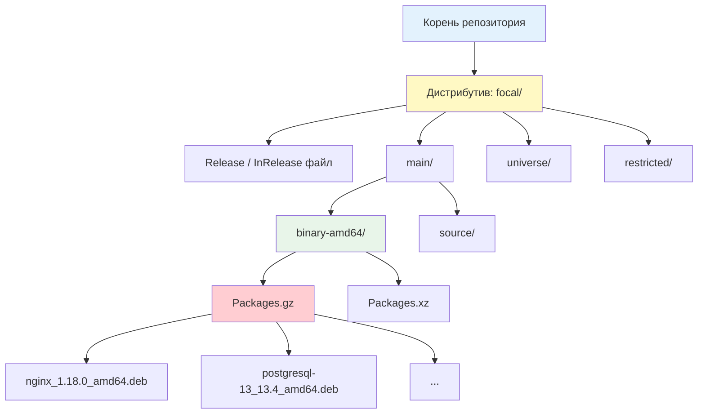
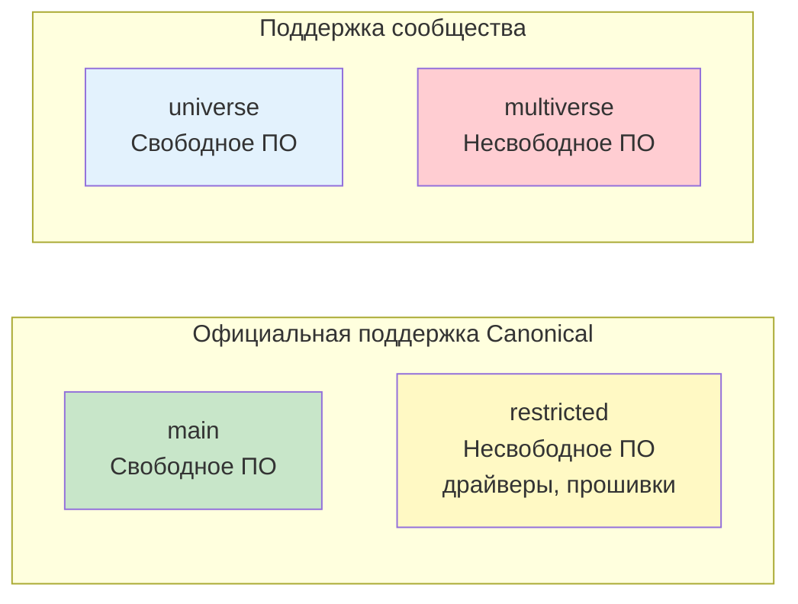
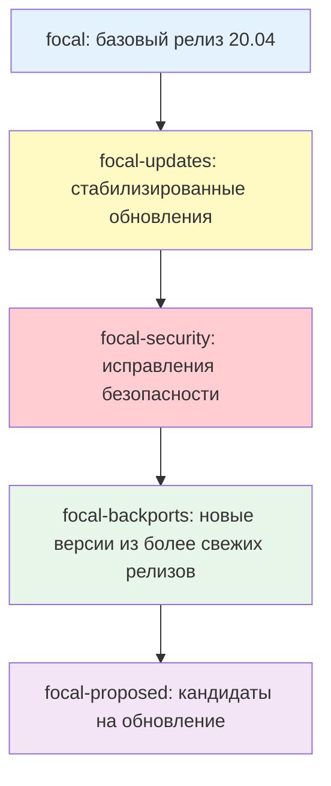
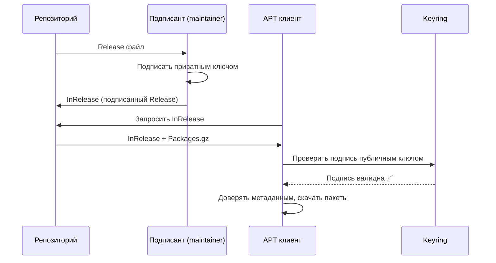

## Введение

**Репозиторий** — это централизованное хранилище пакетов с их метаданными и криптографическими подписями. Когда вы выполняете `apt install nginx`, система не "знает" о существовании nginx — она обращается к репозиториям, указанным в конфигурации, скачивает оттуда метаданные (список всех доступных пакетов), находит нужный пакет, проверяет его подлинность через GPG-подпись и только затем устанавливает.

Для DevOps-инженера понимание работы репозиториев критично: от настройки источников пакетов в production-среде до создания локальных зеркал для ускорения развёртывания и обеспечения безопасности цепочки поставок.

> [!INFO] Связь с другими темами
> 
> - Репозитории — это источники [[Synced/DevOps/Сетевое и системное администрирование/1. Операционные системы/1. Linux/7. Управление пакетами/1. Debian, Ubuntu/1. apt.md | apt]], который разрешает зависимости
> - Физическую установку пакетов из репозиториев выполняет [[Synced/DevOps/Сетевое и системное администрирование/1. Операционные системы/1. Linux/7. Управление пакетами/1. Debian, Ubuntu/2. dpkg.md | dpkg]]
> - Безопасность репозиториев через GPG-ключи связана с [[Synced/DevOps/CI-CD, артефакты, тестирование и DevSecOps/5. DevSecOps и безопасность цепочки поставок/9. PKI и криптография в инфраструктуре/2. Инфраструктура открытых ключей.md | PKI]]
> - Локальные прокси-репозитории для ускорения — в [[Synced/DevOps/CI-CD, артефакты, тестирование и DevSecOps/0. Фундаментальные концепции/11. Прокси-репозитории.md | Прокси-репозиториях]]

## 1. Анатомия APT-репозитория

### Структура на сервере



### Ключевые файлы

|Файл|Назначение|Аналогия|
|---|---|---|
|**`Release`** / **`InRelease`**|Метаданные репозитория: список компонентов, архитектур, контрольные суммы файлов `Packages`, GPG-подпись|"Паспорт" репозитория с печатью|
|**`Packages.gz`** / **`Packages.xz`**|Сжатый каталог всех пакетов в компоненте с их версиями, зависимостями, описаниями|"Каталог товаров" в магазине|
|**`.deb` файлы**|Сами пакеты, расположенные в пуле (`pool/`)|"Товары на складе"|
|**`Release.gpg`**|Отдельная GPG-подпись Release-файла (для старых клиентов)|"Отдельная печать" на паспорте|

### Формат `sources.list`

```bash
# Базовый синтаксис:
# deb [опции] URI дистрибутив компонент1 компонент2 ...

# Примеры:
deb http://archive.ubuntu.com/ubuntu/ focal main restricted
deb http://archive.ubuntu.com/ubuntu/ focal-updates main restricted
deb http://security.ubuntu.com/ubuntu/ focal-security main restricted
deb [arch=amd64] https://download.docker.com/linux/ubuntu focal stable

# Разбор строки:
# deb              - тип: бинарные пакеты (deb-src - исходники)
# [arch=amd64]     - опция: только для архитектуры amd64
# https://...      - URI репозитория
# focal            - дистрибутив (кодовое имя версии)
# stable           - компонент (или несколько через пробел)
```

> [!TIP] Типы записей
> 
> - **`deb`** — бинарные пакеты (то, что обычно нужно)
> - **`deb-src`** — исходные коды пакетов (для сборки из исходников, нужно редко)

## 2. Компоненты репозиториев Ubuntu/Debian

### Ubuntu: четыре компонента



| Компонент      | Лицензия         | Поддержка    | Примеры пакетов                   |
| -------------- | ---------------- | ------------ | --------------------------------- |
| **main**       | Свободная (DFSG) | ✅ Canonical  | `nginx`, `postgresql`, `python3`  |
| **restricted** | Несвободная      | ✅ Canonical  | `nvidia-driver`, `firmware-linux` |
| **universe**   | Свободная        | ❌ Сообщество | `redis`, `mongodb`, `htop`        |
| **multiverse** | Несвободная      | ❌ Сообщество | `unrar`, `libdvdcss`              |

### Debian: три компонента

|Компонент|Лицензия|Описание|
|---|---|---|
|**main**|Свободная (DFSG)|Основной репозиторий, полностью свободное ПО|
|**contrib**|Свободная, но зависит от несвободного|Свободное ПО, требующее несвободные зависимости|
|**non-free**|Несвободная|Проприетарное ПО: драйверы, прошивки|

### Включение компонентов

```bash
# /etc/apt/sources.list
# Было (только main):
deb http://archive.ubuntu.com/ubuntu/ focal main

# Стало (все компоненты):
deb http://archive.ubuntu.com/ubuntu/ focal main restricted universe multiverse

# После изменения:
apt update
```

## 3. Дистрибутивы и категории обновлений

### Ubuntu: codename + suites



| Suite               | Назначение                           | Когда использовать                      |
| ------------------- | ------------------------------------ | --------------------------------------- |
| **focal**           | Базовый релиз                        | Только для стабильных production-систем |
| **focal-updates**   | Стабилизированные баг-фиксы          | ✅ Включать всегда                       |
| **focal-security**  | Критические исправления безопасности | ✅ Включать всегда                       |
| **focal-backports** | Новые версии из более свежих релизов | ⚠️ Осторожно, для тестирования          |
| **focal-proposed**  | Кандидаты на обновление              | ❌ Только для тестирования               |

### Debian: codename + suites

| Suite                  | Назначение                        |
| ---------------------- | --------------------------------- |
| **bookworm**           | Текущий stable                    |
| **bookworm-updates**   | Минорные обновления               |
| **bookworm-security**  | Безопасность                      |
| **bookworm-backports** | Новые версии из testing           |
| **trixie**             | Следующий stable (testing сейчас) |
| **sid**                | Unstable (rolling release)        |

### Типичная конфигурация production-сервера

```bash
# /etc/apt/sources.list для Ubuntu 22.04 (jammy)
deb http://archive.ubuntu.com/ubuntu/ jammy main restricted universe multiverse
deb http://archive.ubuntu.com/ubuntu/ jammy-updates main restricted universe multiverse
deb http://security.ubuntu.com/ubuntu/ jammy-security main restricted universe multiverse
# deb http://archive.ubuntu.com/ubuntu/ jammy-backports main restricted universe multiverse  # закомментировано

# Для Debian 12 (bookworm):
deb http://deb.debian.org/debian bookworm main contrib non-free non-free-firmware
deb http://deb.debian.org/debian bookworm-updates main contrib non-free non-free-firmware
deb http://security.debian.org/debian-security bookworm-security main contrib non-free non-free-firmware
```

## 4. Файлы конфигурации: `sources.list` и `sources.list.d`

### Структура конфигурации

```bash
/etc/apt/
├── sources.list              # Основной файл (исторически)
└── sources.list.d/           # Дополнительные файлы (рекомендуется)
    ├── docker.list           # Docker репозиторий
    ├── nginx.list            # Nginx репозиторий
    └── postgresql.list       # PostgreSQL репозиторий
```

> [!TIP] Best practice Используйте `sources.list.d/` для сторонних репозиториев. Это позволяет:
> 
> - Добавлять/удалять репозитории отдельными файлами
> - Управлять ими через конфигурационные менеджеры (Ansible, Chef)
> - Избежать конфликтов при обновлении базового `sources.list`

### Формат записей

```bash
# Классический формат (устаревший для HTTPS)
deb http://archive.ubuntu.com/ubuntu focal main

# DEB822 формат (новый, рекомендуется с apt 1.1)
# /etc/apt/sources.list.d/docker.sources
Types: deb
URIs: https://download.docker.com/linux/ubuntu
Suites: jammy
Components: stable
Architectures: amd64
Signed-By: /etc/apt/keyrings/docker.gpg
```

### Добавление стороннего репозитория

```bash
# Способ 1: Через add-apt-repository (для PPA)
apt install software-properties-common
add-apt-repository ppa:nginx/stable
apt update

# Способ 2: Вручную с GPG-ключом (рекомендуется для production)
# 1. Создать директорию для ключей
mkdir -p /etc/apt/keyrings

# 2. Скачать и сохранить GPG-ключ
curl -fsSL https://download.docker.com/linux/ubuntu/gpg | \
    gpg --dearmor -o /etc/apt/keyrings/docker.gpg
chmod a+r /etc/apt/keyrings/docker.gpg

# 3. Создать файл репозитория
cat > /etc/apt/sources.list.d/docker.list <<EOF
deb [arch=amd64 signed-by=/etc/apt/keyrings/docker.gpg] \
    https://download.docker.com/linux/ubuntu jammy stable
EOF

# 4. Обновить индексы
apt update
```

> [!WARNING] Устаревший `apt-key`
> Команда `apt-key add` устарела и будет удалена в будущих версиях. Используйте подход с `signed-by` и отдельными файлами ключей в `/etc/apt/keyrings/` или `/etc/apt/trusted.gpg.d/`.

## 5. GPG-подписи и безопасность

### Зачем нужны подписи



### Управление ключами

```bash
# Посмотреть все доверенные ключи
apt-key list  # устаревший способ

# Современный способ: просмотр файлов в trusted.gpg.d
ls -la /etc/apt/trusted.gpg.d/
ls -la /etc/apt/keyrings/

# Импортировать ключ в конкретный файл (рекомендуется)
curl -fsSL https://packages.example.com/gpg.key | \
    gpg --dearmor -o /etc/apt/keyrings/example.gpg

# Удалить ключ
rm /etc/apt/keyrings/example.gpg
apt update

# Проверить подпись конкретного Release-файла
gpg --verify /var/lib/apt/lists/partial/InRelease
```

### Опция `signed-by` в sources.list

```bash
# Привязка конкретного ключа к репозиторию
deb [signed-by=/etc/apt/keyrings/docker.gpg] \
    https://download.docker.com/linux/ubuntu jammy stable

# Преимущества:
# 1. Ключ работает только для этого репозитория
# 2. Удаление ключа не затрагивает другие репозитории
# 3. Легче аудировать, какой ключ для чего используется
```

>[!LINK] Связь с PKI
>GPG-ключи для репозиториев — часть инфраструктуры открытых ключей. Детали работы с GPG, ключами и подписями — в [[Synced/DevOps/CI-CD, артефакты, тестирование и DevSecOps/5. DevSecOps и безопасность цепочки поставок/9. PKI и криптография в инфраструктуре/2. Инфраструктура открытых ключей.md | Инфраструктуре открытых ключей]].

## 6. Зеркала (mirrors) и оптимизация загрузки

### Зачем нужны зеркала

|Причина|Решение|
|---|---|
|Географическая удалённость от основного репозитория|Использование локального зеркала|
|Ограниченная пропускная способность|Локальный кэш/прокси|
|Отсутствие интернета у серверов|Локальное зеркало на USB/внутренней сети|
|Ускорение развёртывания в CI/CD|Прокси-репозиторий с кэшем|

### Выбор зеркала

```bash
# Ubuntu: использование mirror selector
# https://launchpad.net/ubuntu/+archivemirrors

# Пример для России:
deb http://mirror.yandex.ru/ubuntu/ focal main restricted universe multiverse
deb http://mirror.yandex.ru/ubuntu/ focal-updates main restricted universe multiverse
deb http://mirror.yandex.ru/ubuntu/ focal-security main restricted universe multiverse

# Debian: использование mirror selector
# https://www.debian.org/mirror/list

# Пример:
deb http://mirror.corbina.net/debian/ bookworm main contrib non-free
```