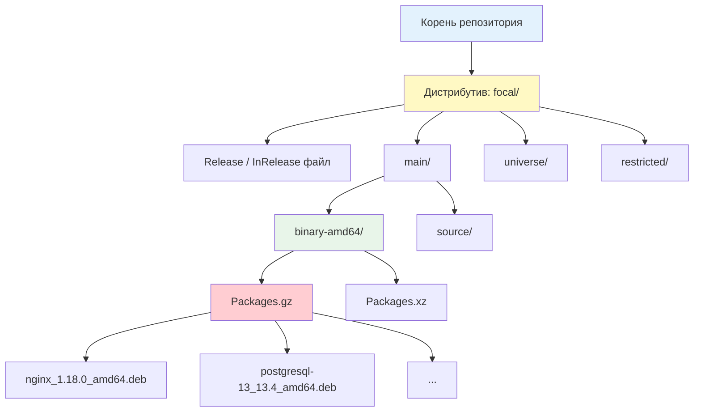
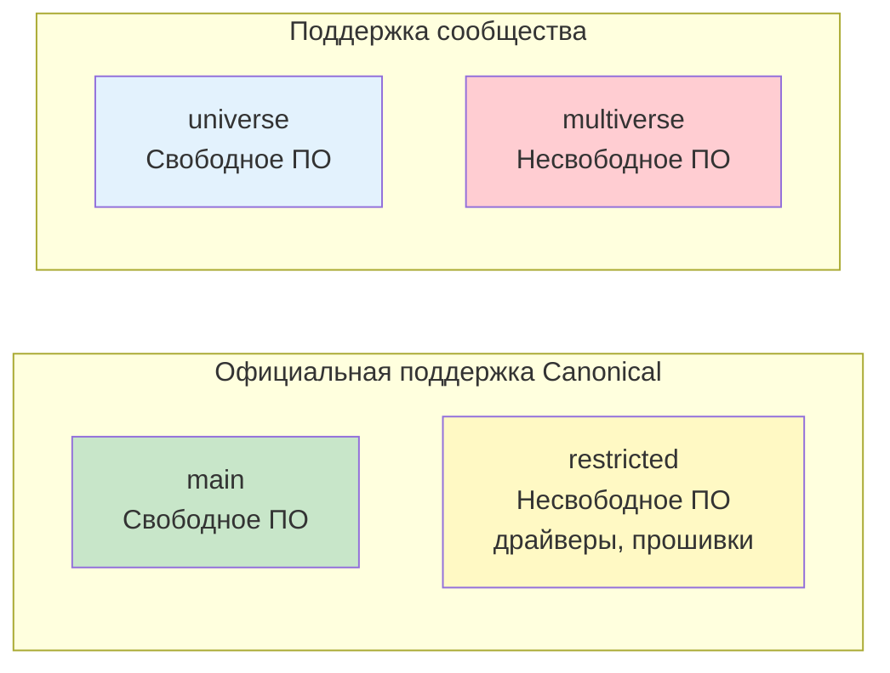
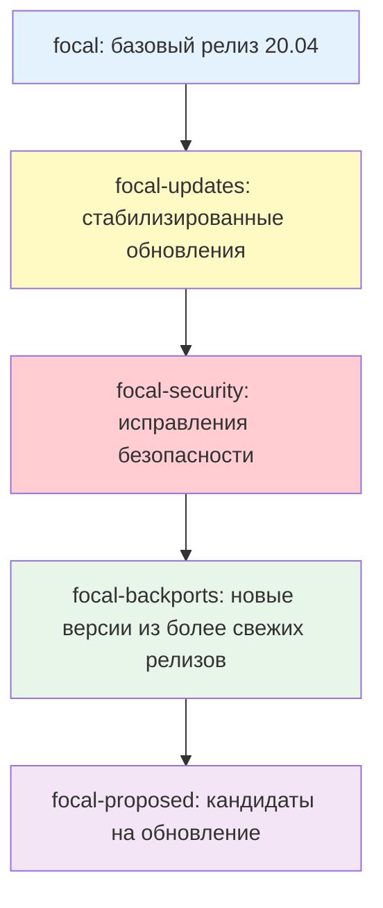
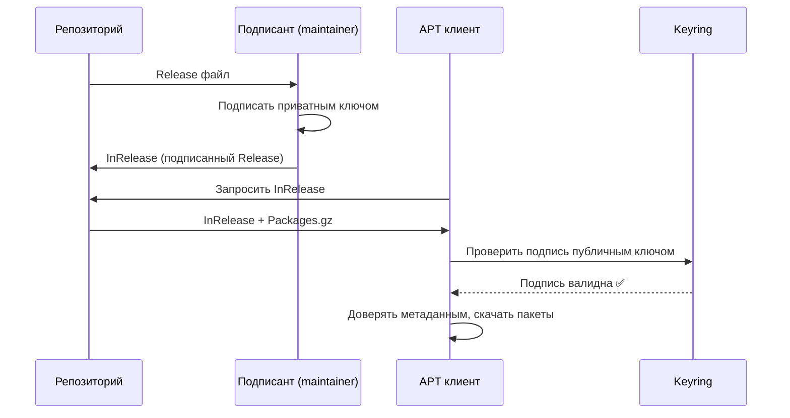

## Введение

**Репозиторий** — это централизованное хранилище пакетов с их метаданными и криптографическими подписями. Когда вы выполняете `apt install nginx`, система не "знает" о существовании nginx — она обращается к репозиториям, указанным в конфигурации, скачивает оттуда метаданные (список всех доступных пакетов), находит нужный пакет, проверяет его подлинность через GPG-подпись и только затем устанавливает.

Для DevOps-инженера понимание работы репозиториев критично: от настройки источников пакетов в production-среде до создания локальных зеркал для ускорения развёртывания и обеспечения безопасности цепочки поставок.

> [!INFO] Связь с другими темами
> 
> - Репозитории — это источники [[1. apt| apt]], который разрешает зависимости
> - Физическую установку пакетов из репозиториев выполняет [[2. dpkg| dpkg]]
> - Безопасность репозиториев через GPG-ключи связана с [[2. Инфраструктура открытых ключей| PKI]]
> - Локальные прокси-репозитории для ускорения — в [[11. Прокси-репозитории| Прокси-репозиториях]]

## 1. Анатомия APT-репозитория

### Структура на сервере



### Ключевые файлы

|Файл|Назначение|Аналогия|
|---|---|---|
|**`Release`** / **`InRelease`**|Метаданные репозитория: список компонентов, архитектур, контрольные суммы файлов `Packages`, GPG-подпись|"Паспорт" репозитория с печатью|
|**`Packages.gz`** / **`Packages.xz`**|Сжатый каталог всех пакетов в компоненте с их версиями, зависимостями, описаниями|"Каталог товаров" в магазине|
|**`.deb` файлы**|Сами пакеты, расположенные в пуле (`pool/`)|"Товары на складе"|
|**`Release.gpg`**|Отдельная GPG-подпись Release-файла (для старых клиентов)|"Отдельная печать" на паспорте|

### Формат `sources.list`

```bash
# Базовый синтаксис:
# deb [опции] URI дистрибутив компонент1 компонент2 ...

# Примеры:
deb http://archive.ubuntu.com/ubuntu/ focal main restricted
deb http://archive.ubuntu.com/ubuntu/ focal-updates main restricted
deb http://security.ubuntu.com/ubuntu/ focal-security main restricted
deb [arch=amd64] https://download.docker.com/linux/ubuntu focal stable

# Разбор строки:
# deb              - тип: бинарные пакеты (deb-src - исходники)
# [arch=amd64]     - опция: только для архитектуры amd64
# https://...      - URI репозитория
# focal            - дистрибутив (кодовое имя версии)
# stable           - компонент (или несколько через пробел)
```

> [!TIP] Типы записей
> 
> - **`deb`** — бинарные пакеты (то, что обычно нужно)
> - **`deb-src`** — исходные коды пакетов (для сборки из исходников, нужно редко)

## 2. Компоненты репозиториев Ubuntu/Debian

### Ubuntu: четыре компонента



| Компонент      | Лицензия         | Поддержка    | Примеры пакетов                   |
| -------------- | ---------------- | ------------ | --------------------------------- |
| **main**       | Свободная (DFSG) | ✅ Canonical  | `nginx`, `postgresql`, `python3`  |
| **restricted** | Несвободная      | ✅ Canonical  | `nvidia-driver`, `firmware-linux` |
| **universe**   | Свободная        | ❌ Сообщество | `redis`, `mongodb`, `htop`        |
| **multiverse** | Несвободная      | ❌ Сообщество | `unrar`, `libdvdcss`              |

### Debian: три компонента

|Компонент|Лицензия|Описание|
|---|---|---|
|**main**|Свободная (DFSG)|Основной репозиторий, полностью свободное ПО|
|**contrib**|Свободная, но зависит от несвободного|Свободное ПО, требующее несвободные зависимости|
|**non-free**|Несвободная|Проприетарное ПО: драйверы, прошивки|

### Включение компонентов

```bash
# /etc/apt/sources.list
# Было (только main):
deb http://archive.ubuntu.com/ubuntu/ focal main

# Стало (все компоненты):
deb http://archive.ubuntu.com/ubuntu/ focal main restricted universe multiverse

# После изменения:
apt update
```

## 3. Дистрибутивы и категории обновлений

### Ubuntu: codename + suites



| Suite               | Назначение                           | Когда использовать                      |
| ------------------- | ------------------------------------ | --------------------------------------- |
| **focal**           | Базовый релиз                        | Только для стабильных production-систем |
| **focal-updates**   | Стабилизированные баг-фиксы          | ✅ Включать всегда                       |
| **focal-security**  | Критические исправления безопасности | ✅ Включать всегда                       |
| **focal-backports** | Новые версии из более свежих релизов | ⚠️ Осторожно, для тестирования          |
| **focal-proposed**  | Кандидаты на обновление              | ❌ Только для тестирования               |

### Debian: codename + suites

| Suite                  | Назначение                        |
| ---------------------- | --------------------------------- |
| **bookworm**           | Текущий stable                    |
| **bookworm-updates**   | Минорные обновления               |
| **bookworm-security**  | Безопасность                      |
| **bookworm-backports** | Новые версии из testing           |
| **trixie**             | Следующий stable (testing сейчас) |
| **sid**                | Unstable (rolling release)        |

### Типичная конфигурация production-сервера

```bash
# /etc/apt/sources.list для Ubuntu 22.04 (jammy)
deb http://archive.ubuntu.com/ubuntu/ jammy main restricted universe multiverse
deb http://archive.ubuntu.com/ubuntu/ jammy-updates main restricted universe multiverse
deb http://security.ubuntu.com/ubuntu/ jammy-security main restricted universe multiverse
# deb http://archive.ubuntu.com/ubuntu/ jammy-backports main restricted universe multiverse  # закомментировано

# Для Debian 12 (bookworm):
deb http://deb.debian.org/debian bookworm main contrib non-free non-free-firmware
deb http://deb.debian.org/debian bookworm-updates main contrib non-free non-free-firmware
deb http://security.debian.org/debian-security bookworm-security main contrib non-free non-free-firmware
```

## 4. Файлы конфигурации: `sources.list` и `sources.list.d`

### Структура конфигурации

```bash
/etc/apt/
├── sources.list              # Основной файл (исторически)
└── sources.list.d/           # Дополнительные файлы (рекомендуется)
    ├── docker.list           # Docker репозиторий
    ├── nginx.list            # Nginx репозиторий
    └── postgresql.list       # PostgreSQL репозиторий
```

> [!TIP] Best practice Используйте `sources.list.d/` для сторонних репозиториев. Это позволяет:
> 
> - Добавлять/удалять репозитории отдельными файлами
> - Управлять ими через конфигурационные менеджеры (Ansible, Chef)
> - Избежать конфликтов при обновлении базового `sources.list`

### Формат записей

```bash
# Классический формат (устаревший для HTTPS)
deb http://archive.ubuntu.com/ubuntu focal main

# DEB822 формат (новый, рекомендуется с apt 1.1)
# /etc/apt/sources.list.d/docker.sources
Types: deb
URIs: https://download.docker.com/linux/ubuntu
Suites: jammy
Components: stable
Architectures: amd64
Signed-By: /etc/apt/keyrings/docker.gpg
```

### Добавление стороннего репозитория

```bash
# Способ 1: Через add-apt-repository (для PPA)
apt install software-properties-common
add-apt-repository ppa:nginx/stable
apt update

# Способ 2: Вручную с GPG-ключом (рекомендуется для production)
# 1. Создать директорию для ключей
mkdir -p /etc/apt/keyrings

# 2. Скачать и сохранить GPG-ключ
curl -fsSL https://download.docker.com/linux/ubuntu/gpg | \
    gpg --dearmor -o /etc/apt/keyrings/docker.gpg
chmod a+r /etc/apt/keyrings/docker.gpg

# 3. Создать файл репозитория
cat > /etc/apt/sources.list.d/docker.list <<EOF
deb [arch=amd64 signed-by=/etc/apt/keyrings/docker.gpg] \
    https://download.docker.com/linux/ubuntu jammy stable
EOF

# 4. Обновить индексы
apt update
```

> [!WARNING] Устаревший `apt-key`
> Команда `apt-key add` устарела и будет удалена в будущих версиях. Используйте подход с `signed-by` и отдельными файлами ключей в `/etc/apt/keyrings/` или `/etc/apt/trusted.gpg.d/`.

## 5. GPG-подписи и безопасность

### Зачем нужны подписи



### Управление ключами

```bash
# Посмотреть все доверенные ключи
apt-key list  # устаревший способ

# Современный способ: просмотр файлов в trusted.gpg.d
ls -la /etc/apt/trusted.gpg.d/
ls -la /etc/apt/keyrings/

# Импортировать ключ в конкретный файл (рекомендуется)
curl -fsSL https://packages.example.com/gpg.key | \
    gpg --dearmor -o /etc/apt/keyrings/example.gpg

# Удалить ключ
rm /etc/apt/keyrings/example.gpg
apt update

# Проверить подпись конкретного Release-файла
gpg --verify /var/lib/apt/lists/partial/InRelease
```

### Опция `signed-by` в sources.list

```bash
# Привязка конкретного ключа к репозиторию
deb [signed-by=/etc/apt/keyrings/docker.gpg] \
    https://download.docker.com/linux/ubuntu jammy stable

# Преимущества:
# 1. Ключ работает только для этого репозитория
# 2. Удаление ключа не затрагивает другие репозитории
# 3. Легче аудировать, какой ключ для чего используется
```

>[!LINK] Связь с PKI
>GPG-ключи для репозиториев — часть инфраструктуры открытых ключей. Детали работы с GPG, ключами и подписями — в [[2. Инфраструктура открытых ключей| Инфраструктуре открытых ключей]].

## 6. Зеркала (mirrors) и оптимизация загрузки

### Зачем нужны зеркала

|Причина|Решение|
|---|---|
|Географическая удалённость от основного репозитория|Использование локального зеркала|
|Ограниченная пропускная способность|Локальный кэш/прокси|
|Отсутствие интернета у серверов|Локальное зеркало на USB/внутренней сети|
|Ускорение развёртывания в CI/CD|Прокси-репозиторий с кэшем|

### Выбор зеркала

```bash
# Ubuntu: использование mirror selector
# https://launchpad.net/ubuntu/+archivemirrors

# Пример для России:
deb http://mirror.yandex.ru/ubuntu/ focal main restricted universe multiverse
deb http://mirror.yandex.ru/ubuntu/ focal-updates main restricted universe multiverse
deb http://mirror.yandex.ru/ubuntu/ focal-security main restricted universe multiverse

# Debian: использование mirror selector
# https://www.debian.org/mirror/list

# Пример:
deb http://mirror.corbina.net/debian/ bookworm main contrib non-free
```

### Автоматический выбор зеркала: `apt-select` и `netselect`

```bash
# Установка утилиты apt-select
pip3 install apt-select

# Поиск самого быстрого зеркала
apt-select --country Russia --list-only

# Применение (создаёт sources.list с лучшим зеркалом)
apt-select --country Russia

# Альтернатива: netselect-apt
apt install netselect-apt
netselect-apt -c Russia  # создаст /etc/apt/sources.list с лучшим зеркалом
```

### Локальный кэш: `apt-cacher-ng`

```bash
# Установка на сервере в локальной сети
apt install apt-cacher-ng

# Конфигурация: /etc/apt-cacher-ng/acng.conf
# Port:3142
# CacheDir:/var/cache/apt-cacher-ng
# VerboseLog:1

# На клиентах: создать /etc/apt/apt.conf.d/01proxy
echo 'Acquire::http::Proxy "http://cache-server:3142";' > /etc/apt/apt.conf.d/01proxy

# Теперь все apt install проходят через кэш
# Первые загрузки — из интернета, последующие — из кэша
```

>[!LINK] Связь с прокси-репозиториями
>`apt-cacher-ng` — это простой прокси-репозиторий. Более мощные решения (Artifactory, Nexus) рассмотрены в [[11. Прокси-репозитории| Прокси-репозиториях]].

## 7. PPA (Personal Package Archive)

### Что такое PPA

**PPA** — это публичный репозиторий на Launchpad, где разработчики публикуют пакеты для Ubuntu. Позволяет устанавливать свежее ПО, чем в официальных репозиториях.

```bash
# Добавление PPA
add-apt-repository ppa:nginx/stable
# Создаёт файл /etc/apt/sources.list.d/nginx-ubuntu-stable-focal.list

# Удаление PPA
add-apt-repository --remove ppa:nginx/stable

# Очистка (вернуться к официальным версиям)
apt install ppa-purge
ppa-purge ppa:nginx/stable
```

> [!WARNING] Риски PPA
> 
> - Не все PPA поддерживаются и обновляются
> - Могут конфликтовать с официальными пакетами
> - Не рекомендуются для production без тщательной проверки
> - В Debian PPA не работают (только для Ubuntu)

## 8. Создание собственного репозитория

### Простой локальный репозиторий

```bash
# 1. Установить инструменты
apt install dpkg-dev

# 2. Создать структуру
mkdir -p /opt/myrepo/pool
mkdir -p /opt/myrepo/dists/stable/main/binary-amd64

# 3. Скопировать .deb файлы в pool
cp myapp.deb /opt/myrepo/pool/

# 4. Сгенерировать Packages
cd /opt/myrepo
dpkg-scanpackages pool /dev/null | gzip -9c > dists/stable/main/binary-amd64/Packages.gz

# 5. Создать Release-файл
cat > dists/stable/Release <<EOF
Archive: stable
Component: main
Origin: My Local Repo
Label: My Local Repo
Architecture: amd64
EOF

# 6. Подписать (опционально)
cd dists/stable
gpg --armor --detach-sign --output Release.gpg Release
gpg --armor --clearsign --output InRelease Release

# 7. Настроить веб-сервер (nginx/apache) для раздачи
# 8. Добавить на клиентах:
# deb [trusted=yes] http://myserver/myrepo stable main
```

### Использование `reprepro` для продвинутого репозитория

```bash
# Установка
apt install reprepro

# Создание конфига: /opt/repo/conf/distributions
cat > /opt/repo/conf/distributions <<EOF
Origin: My Company
Label: My Company Repository
Codename: focal
Architectures: amd64 i386 source
Components: main
Description: Internal packages repository
SignWith: yes
EOF

# Добавить пакет
reprepro -b /opt/repo includedeb focal myapp.deb

# Удалить пакет
reprepro -b /opt/repo remove focal myapp

# Список пакетов
reprepro -b /opt/repo list focal
```

> [!LINK] Связь с CI/CD
> Автоматическая публикация пакетов в репозиторий из CI-пайплайнов — часть [[5. Бинарные релизы| сборки и публикации артефактов]].

## 9. Troubleshooting репозиториев

### Типичные проблемы

| Проблема                                               | Причина                                    | Решение                                                                  |
| ------------------------------------------------------ | ------------------------------------------ | ------------------------------------------------------------------------ |
| `W: GPG error: NO_PUBKEY`                              | Отсутствует GPG-ключ репозитория           | Импортировать ключ через `signed-by`                                     |
| `E: Failed to fetch ... 404 Not Found`                 | Репозиторий недоступен или неверный URL    | Проверить URL, `ping`, `curl`                                            |
| `E: The repository '...' does not have a Release file` | Репозиторий не подписан или неверный suite | Проверить `sources.list`, использовать `[trusted=yes]` только для тестов |
| `W: Target Packages ... configured multiple times`     | Дублирующиеся записи в sources.list        | Удалить дубликаты                                                        |
| `Hash Sum mismatch`                                    | Повреждённый кэш                           | `rm -rf /var/lib/apt/lists/* && apt update`                              |

### Диагностика

```bash
# Проверить доступность репозитория
curl -I http://archive.ubuntu.com/ubuntu/dists/focal/Release

# Посмотреть, откуда скачиваются пакеты
apt policy nginx
# Вывод покажет все репозитории, где есть этот пакет

# Проверить подписи
apt-key list
# или
ls -la /etc/apt/trusted.gpg.d/

# Включить отладку apt
apt -o Debug::Acquire::http=true update

# Посмотреть загруженные метаданные
ls -la /var/lib/apt/lists/
zcat /var/lib/apt/lists/archive.ubuntu.com_ubuntu_dists_focal_main_binary-amd64_Packages.gz | head -50
```

## 10. Практические сценарии для DevOps

### Сценарий 1: Ansible-роль для управления репозиториями

```yml
# roles/apt_repos/tasks/main.yml
- name: Install prerequisites
  apt:
    name:
      - apt-transport-https
      - ca-certificates
      - curl
      - gnupg
    state: present
    update_cache: yes

- name: Create keyrings directory
  file:
    path: /etc/apt/keyrings
    state: directory
    mode: '0755'

- name: Add Docker GPG key
  get_url:
    url: https://download.docker.com/linux/ubuntu/gpg
    dest: /etc/apt/keyrings/docker.gpg
    mode: '0644'

- name: Add Docker repository
  apt_repository:
    repo: "deb [arch=amd64 signed-by=/etc/apt/keyrings/docker.gpg] https://download.docker.com/linux/ubuntu {{ ansible_distribution_release }} stable"
    state: present
    filename: docker
    update_cache: yes

- name: Add PostgreSQL repository
  block:
    - name: PostgreSQL GPG key
      get_url:
        url: https://www.postgresql.org/media/keys/ACCC4CF8.asc
        dest: /etc/apt/keyrings/postgresql.gpg
        mode: '0644'
    
    - name: PostgreSQL repo
      apt_repository:
        repo: "deb [signed-by=/etc/apt/keyrings/postgresql.gpg] http://apt.postgresql.org/pub/repos/apt {{ ansible_distribution_release }}-pgdg main"
        state: present
        filename: postgresql
        update_cache: yes
```

### Сценарий 2: Аудит репозиториев на серверах

```bash
#!/bin/bash
# audit-repos.sh

REPORT="/tmp/repos-audit-$(hostname)-$(date +%F).txt"

{
    echo "=== Аудит репозиториев ==="
    echo "Хост: $(hostname)"
    echo "Дата: $(date)"
    echo ""
    
    echo "=== Основной sources.list ==="
    cat /etc/apt/sources.list
    echo ""
    
    echo "=== Дополнительные репозитории ==="
    for f in /etc/apt/sources.list.d/*; do
        echo "--- $f ---"
        cat "$f"
        echo ""
    done
    
    echo "=== Доверенные GPG-ключи ==="
    ls -la /etc/apt/trusted.gpg.d/ 2>/dev/null
    ls -la /etc/apt/keyrings/ 2>/dev/null
    echo ""
    
    echo "=== Статистика пакетов по репозиториям ==="
    apt-cache policy | grep -E "^[a-z]" | awk '{print $1}' | sort | uniq -c | sort -rn
    
    echo ""
    echo "=== Пакеты с наибольшим количеством источников ==="
    apt-cache policy | grep -B1 " 500 " | grep -E "^[a-z]" | sort | uniq -c | sort -rn | head -10
} > "$REPORT"

echo "Отчёт сохранён: $REPORT"
```

### Сценарий 3: Создание локального зеркала для offline-серверов

```bash
#!/bin/bash
# create-offline-mirror.sh
# Создать offline-зеркало для серверов без интернета

PACKAGES_FILE="packages.list"
MIRROR_DIR="/opt/offline-mirror"

mkdir -p "$MIRROR_DIR/pool"

# 1. Скачать все пакеты
while read -r pkg; do
    [[ -z "$pkg" || "$pkg" =~ ^# ]] && continue
    echo "Скачивание: $pkg"
    apt-get download "$pkg" 2>/dev/null || echo "⚠️  Не удалось скачать $pkg"
done < "$PACKAGES_FILE"

# 2. Переместить .deb в mirror
mv *.deb "$MIRROR_DIR/pool/" 2>/dev/null

# 3. Создать метаданные
cd "$MIRROR_DIR"
dpkg-scanpackages pool /dev/null | gzip -9c > Packages.gz

# 4. Создать архив для переноса
tar -czf offline-mirror-$(date +%F).tar.gz -C /opt offline-mirror

echo "Готово. Перенесите offline-mirror-*.tar.gz на целевые серверы."
```

### Сценарий 4: Docker-образ с кастомными репозиториями


```Dockerfile
FROM ubuntu:22.04

# Установка prerequisites
RUN apt-get update && apt-get install -y \
    apt-transport-https \
    ca-certificates \
    curl \
    gnupg \
    && rm -rf /var/lib/apt/lists/*

# Добавление Docker репозитория
RUN mkdir -p /etc/apt/keyrings && \
    curl -fsSL https://download.docker.com/linux/ubuntu/gpg | \
    gpg --dearmor -o /etc/apt/keyrings/docker.gpg && \
    echo "deb [arch=amd64 signed-by=/etc/apt/keyrings/docker.gpg] \
    https://download.docker.com/linux/ubuntu jammy stable" > \
    /etc/apt/sources.list.d/docker.list

# Установка пакетов
RUN apt-get update && apt-get install -y \
    docker-ce \
    docker-ce-cli \
    containerd.io \
    && rm -rf /var/lib/apt/lists/*
```

---

## Контрольные вопросы для самопроверки

1. В чем разница между `deb` и `deb-src` в `sources.list`? Когда нужен каждый из них?
2. Что такое Release-файл и зачем он нужен? Почему без него apt отказывается работать с репозиторием?
3. В чем разница между компонентами `main`, `universe`, `restricted`, `multiverse` в Ubuntu? Какие из них включены по умолчанию?
4. Почему устарела команда `apt-key add`? Какой современный подход к управлению GPG-ключами репозиториев?
5. Что делает опция `signed-by` в `sources.list`? Почему она безопаснее, чем глобальный keyring?
6. Как создать локальный offline-репозиторий для серверов без доступа в интернет? Какие команды для этого нужны?
7. В чем разница между `focal`, `focal-updates`, `focal-security` и `focal-backports`? Какие из них стоит включать в production?
8. Как Ansible-модуль `apt_repository` упрощает управление репозиториями на множестве серверов? Какие параметры у него критичны?

---

#devops #linux #debian #ubuntu #apt #repositories #sources-list #gpg #mirrors #ppa #package-management #security #offline-mirror #apt-cacher-ng #reprepro #sysadmin #infrastructure #automation #ansible