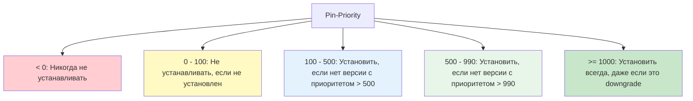

## Введение

**Apt Pinning** — это мощный механизм управления приоритетами пакетов в Debian-подобных системах. По умолчанию `apt` всегда стремится установить самую новую версию пакета из доступных репозиториев. Однако в production-среде такое поведение не всегда желательно: критическое обновление может сломать совместимость, или вам может потребоваться использовать пакет из стороннего репозитория вместо официального.

Pinning позволяет тонко настраивать правила: "всегда использовать версию X", "никогда не обновлять пакет Y" или "предпочитать пакеты из репозитория Z".

> [!INFO] Связь с предыдущими темами
> 
> - Pinning управляет поведением [[Synced/DevOps/Сетевое и системное администрирование/1. Операционные системы/1. Linux/7. Управление пакетами/1. Debian, Ubuntu/1. apt.md | apt]] при разрешении зависимостей.
> - Физическую установку выбранной версии всё так же выполняет [[Synced/DevOps/Сетевое и системное администрирование/1. Операционные системы/1. Linux/7. Управление пакетами/1. Debian, Ubuntu/2. dpkg.md | dpkg]].
> - Правила pinning часто опираются на метаданные из [[Synced/DevOps/Сетевое и системное администрирование/1. Операционные системы/1. Linux/7. Управление пакетами/1. Debian, Ubuntu/3. Репозитории.md | репозиториев]] (например, `o=Ubuntu`, `a=security`).

## 1. Как работает Pin-Priority

В основе pinning лежит числовой приоритет (`Pin-Priority`). Когда `apt` ищет пакет, он присваивает каждой доступной версии оценку на основе правил в файлах `preferences`. Версия с наивысшим приоритетом (при условии, что он > 0) будет выбрана для установки.

### Таблица значений Pin-Priority



| Диапазон      | Поведение APT                                                                                    | Типичное использование                                                                     |
| ------------- | ------------------------------------------------------------------------------------------------ | ------------------------------------------------------------------------------------------ |
| **< 0**       | Пакет никогда не будет установлен или обновлён.                                                  | Жёсткий запрет на установку конкретного пакета.                                            |
| **0 – 100**   | Пакет не будет установлен, если он ещё не установлен. Если уже установлен, он не будет обновлён. | Мягкая фиксация (аналог `apt-mark hold`, но гибче).                                        |
| **100 – 500** | Пакет будет установлен, если нет версии с приоритетом выше 500.                                  | Стандартный приоритет для установленных пакетов.                                           |
| **500 – 990** | Пакет будет установлен, если нет версии с приоритетом выше 990.                                  | Стандартный приоритет для доступных для установки пакетов (по умолчанию для репозиториев). |
| **>= 1000**   | Пакет будет установлен **всегда**, даже если текущая версия новее (downgrade).                   | Принудительная фиксация конкретной версии или репозитория.                                 |

>[!WARNING] Опасность приоритета >= 1000
>Использование приоритета 1000 или выше может привести к непреднамеренному понижению версий (downgrade) зависимостей, что способно сломать систему. Используйте такие значения только для конкретных пакетов и с полным пониманием последствий.

## 2. Конфигурационные файлы

Правила pinning хранятся в двух местах:

1. `/etc/apt/preferences` — основной файл (исторический).
2. `/etc/apt/preferences.d/*.pref` — директория для фрагментов конфигурации (рекомендуемый способ).

### Синтаксис файла preferences

Каждое правило состоит из трёх обязательных блоков:

```
Package: <имя_пакета или шаблон>
Pin: <критерий выбора>
Pin-Priority: <число>
```

#### Поле `Package`

- Конкретное имя: `nginx`
- Шаблон с подстановочными знаками: `nginx*`, `php*`
- Все пакеты: `*`

#### Поле `Pin` (критерии)

Можно комбинировать несколько условий через пробел (логическое И):

- `release a=jammy` (архив/дистрибутив)
- `release o=Ubuntu` (origin/происхождение)
- `release c=main` (компонент)
- `release l=Ubuntu` (label/метка)
- `version 1.18.0*` (конкретная версия)

> [!TIP] Как узнать значения для Pin?
> Используйте команду `apt-cache policy`, чтобы увидеть метаданные доступных версий пакета.

## 3. Практические сценарии Pinning

### Сценарий 1: Фиксация версии пакета (запрет обновления)

Задача: Запретить обновление `nginx`, чтобы сохранить стабильную конфигурацию.

```
# /etc/apt/preferences.d/nginx-hold.pref
Package: nginx nginx-core nginx-common
Pin: version *
Pin-Priority: -1
```

_Объяснение:_ Приоритет `-1` запрещает установку любой версии. Если пакет уже установлен, `apt upgrade` его проигнорирует. Чтобы установить его вручную, потребуется временно удалить правило или использовать `apt install nginx=версия`.

Более мягкий вариант (аналог `hold`):

```
# /etc/apt/preferences.d/nginx-hold-soft.pref
Package: nginx nginx-core nginx-common
Pin: release *
Pin-Priority: 1
```

_Объяснение:_ Приоритет `1` означает, что пакет не будет обновлён, но его можно установить, если его нет в системе.

### Сценарий 2: Предпочтение стороннего репозитория

Задача: Установить `docker-ce` из официального репозитория Docker, а не из репозитория Ubuntu, даже если версии совпадают.

```
# /etc/apt/preferences.d/docker.pref
Package: docker-ce docker-ce-cli containerd.io
Pin: origin download.docker.com
Pin-Priority: 1000
```

_Объяснение:_ `origin` проверяет поле `Origin` в Release-файле репозитория. Приоритет `1000` гарантирует, что пакеты с `download.docker.com` всегда будут выбраны, даже если в Ubuntu появится более новая версия.

### Сценарий 3: Разрешение обновлений только из security-репозитория

Задача: Зафиксировать базовую версию ОС, но разрешить получение критических обновлений безопасности.

```
# /etc/apt/preferences.d/security-only.pref
Package: *
Pin: release a=jammy-security
Pin-Priority: 900

Package: *
Pin: release a=jammy
Pin-Priority: 1
```

_Объяснение:_ Пакеты из `jammy-security` имеют высокий приоритет (900) и будут обновляться. Пакеты из базового `jammy` имеют приоритет 1 и не будут обновляться, если уже установлены.

## 4. Диагностика и отладка Pinning

### Проверка политик для конкретного пакета

Команда `apt-cache policy` — главный инструмент для понимания того, почему `apt` выбирает ту или иную версию.

```bash
# Просмотр политик для nginx
apt-cache policy nginx

# Пример вывода:
nginx:
  Installed: 1.18.0-0ubuntu1.4
  Candidate: 1.18.0-0ubuntu1.4
  Version table:
 *** 1.18.0-0ubuntu1.4 1
        1 /var/lib/dpkg/status
     1.18.0-0ubuntu1 500
        500 http://archive.ubuntu.com/ubuntu jammy/main amd64 Packages
```

_Разбор:_

- `Installed`: текущая версия.
- `Candidate`: версия, которая будет установлена при `apt install`.
- `Version table`: список всех доступных версий с их приоритетами. `***` указывает на установленную версию. Число перед URL — это вычисленный Pin-Priority.

### Поиск всех доступных версий (Madison)

```bash
# Упрощённый вывод доступных версий и их источников
apt-cache madison nginx

# Пример вывода:
    nginx | 1.18.0-0ubuntu1.4 | http://archive.ubuntu.com/ubuntu jammy-updates/main amd64 Packages
    nginx | 1.18.0-0ubuntu1   | http://archive.ubuntu.com/ubuntu jammy/main amd64 Packages
```

### Проверка применённых правил

```bash
# Просмотр всех активных правил pinning
apt-cache policy

# Вывод покажет глобальные приоритеты и список всех настроенных правил из /etc/apt/preferences.d/
```

## 5. Интеграция с автоматизацией (Ansible)

Управление pinning вручную на десятках серверов — антипаттерн. Используйте Ansible для централизованного управления.

```yml
# roles/apt_pinning/tasks/main.yml

- name: Создать правило pinning для фиксации версии PostgreSQL
  copy:
    dest: /etc/apt/preferences.d/postgresql-hold.pref
    content: |
      Package: postgresql-14 postgresql-client-14
      Pin: version *
      Pin-Priority: -1
    mode: '0644'
  notify: Update apt cache

- name: Предпочитать пакеты Docker из официального репозитория
  copy:
    dest: /etc/apt/preferences.d/docker.pref
    content: |
      Package: docker-ce docker-ce-cli containerd.io docker-compose-plugin
      Pin: origin download.docker.com
      Pin-Priority: 1000
    mode: '0644'
  notify: Update apt cache

- name: Удалить устаревшее правило pinning
  file:
    path: /etc/apt/preferences.d/old-rule.pref
    state: absent
  notify: Update apt cache

- name: Обновить кэш apt после изменений
  apt:
    update_cache: yes
  listen: Update apt cache
```

>[!LINK] Связь с IaC
>Этот подход является частью [[Synced/DevOps/IaC/6. Ansible (Продвинутые практики)/1. Роли и Коллекции.md | создания ролей Ansible]] для стандартизации конфигурации серверов.

## 6. Troubleshooting и типичные ошибки

| Проблема                                                       | Причина                                                                                                 | Решение                                                                                                                           |
| -------------------------------------------------------------- | ------------------------------------------------------------------------------------------------------- | --------------------------------------------------------------------------------------------------------------------------------- |
| Пакет не обновляется, хотя есть новая версия                   | Приоритет установленной версии выше, чем у новой (например, из-за правила `Pin-Priority: 1` или `hold`) | Проверить через `apt-cache policy <pkg>`. Удалить или изменить правило в `/etc/apt/preferences.d/`.                               |
| `apt` предлагает понизить версию (downgrade) множества пакетов | Слишком агрессивное правило с `Pin-Priority >= 1000` для `Package: *`                                   | Проверить `apt-cache policy`. Удалить правило, выполнить `apt update`, затем `apt upgrade` для возврата к актуальным версиям.     |
| Конфликт зависимостей при установке                            | Pinning запретил обновление зависимости, которая требуется новой версии основного пакета                | Ослабить pinning для зависимостей или явно указать версию зависимости в правиле.                                                  |
| Правило игнорируется                                           | Опечатка в имени файла (должно заканчиваться на `.pref`) или в синтаксисе                               | Проверить имя файла: `ls /etc/apt/preferences.d/`. Убедиться, что ключевые слова `Package`, `Pin`, `Pin-Priority` написаны верно. |
### Сброс Pinning

Если конфигурация запутана, безопасный способ начать с чистого листа:

```
# 1. Удалить все кастомные правила
rm -f /etc/apt/preferences.d/*.pref
rm -f /etc/apt/preferences

# 2. Очистить списки пакетов
rm -rf /var/lib/apt/lists/*

# 3. Обновить индексы
apt update

# 4. Вернуть все пакеты к стандартным версиям (осторожно!)
apt upgrade
```

---

## Контрольные вопросы для самопроверки

1. Какой диапазон `Pin-Priority` гарантирует, что пакет будет установлен или обновлён, даже если это приведёт к понижению версии (downgrade)?
2. В чём разница между установкой `Pin-Priority: -1` и `Pin-Priority: 1` для уже установленного пакета?
3. Как с помощью `apt-cache policy` определить, какое именно правило pinning влияет на выбор версии пакета?
4. Почему использование `Package: *` с `Pin-Priority: 1000` считается опасной практикой?
5. Как с помощью Ansible обеспечить одинаковые правила pinning на группе из 50 серверов?
6. Какое поле в метаданных репозитория (`release o=...`, `release a=...`) лучше всего использовать для привязки к конкретному поставщику пакетов, и почему?

---

#devops #linux #debian #ubuntu #apt #pinning #package-management #version-control #sysadmin #automation #ansible #troubleshooting #infrastructure #stability