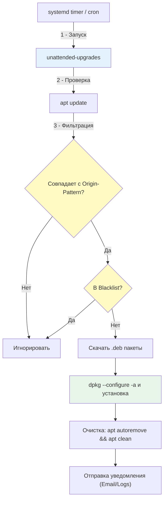

## Введение

**Unattended Upgrades** — это стандартный механизм в Debian и Ubuntu для автоматической установки обновлений без участия администратора. В современной DevOps-практике ручное обновление каждого сервера не масштабируется, а игнорирование обновлений безопасности создаёт критические уязвимости. `unattended-upgrades` решает эту дилемму, позволяя автоматически применять только проверенные патчи безопасности, минимизируя риски поломок.

> [!INFO] Связь с предыдущими темами
> 
> - Механизм работает поверх [[Synced/DevOps/Сетевое и системное администрирование/1. Операционные системы/1. Linux/7. Управление пакетами/1. Debian, Ubuntu/1. apt.md | apt]], используя его для загрузки и установки.
> - Физическую распаковку и настройку выполняет [[Synced/DevOps/Сетевое и системное администрирование/1. Операционные системы/1. Linux/7. Управление пакетами/1. Debian, Ubuntu/2. dpkg.md | dpkg]].
> - Для выбора репозиториев используются те же метаданные, что и в [[Synced/DevOps/Сетевое и системное администрирование/1. Операционные системы/1. Linux/7. Управление пакетами/1. Debian, Ubuntu/3. Репозитории.md | репозиториях]].
> - Если пакет добавлен в blacklist, это работает аналогично [[Synced/DevOps/Сетевое и системное администрирование/1. Операционные системы/1. Linux/7. Управление пакетами/1. Debian, Ubuntu/4. pinning.md | apt pinning]] с приоритетом, запрещающим обновление.

## 1. Архитектура и рабочий процесс

### Как работает unattended-upgrades



### Ключевые компоненты

1. **`unattended-upgrades`**: Основной исполняемый скрипт (Python), выполняющий логику обновления.
2. **`apt.periodic`**: Конфигурация частоты запусков (ежедневно, еженедельно).
3. **`50unattended-upgrades`**: Основной файл с правилами: какие пакеты обновлять, какие игнорировать, перезагружать ли систему при обновлении ядра.

## 2. Базовая настройка

### Установка и активация

```bash
# Установка пакета
apt install unattended-upgrades

# Включение автоматических обновлений (создаёт /etc/apt/apt.conf.d/20auto-upgrades)
dpkg-reconfigure --priority=low unattended-upgrades
# В интерактивном меню выбрать "Yes"

# Проверка статуса systemd-таймера (в современных Ubuntu/Debian)
systemctl status apt-daily-upgrade.timer
systemctl status unattended-upgrades.service
```

### Конфигурация частоты: `20auto-upgrades`

Этот файл управляет тем, _как часто_ система проверяет обновления.

```
# /etc/apt/apt.conf.d/20auto-upgrades
APT::Periodic::Update-Package-Lists "1";        # Выполнять apt update ежедневно (1 день)
APT::Periodic::Download-Upgradeable-Packages "1"; # Скачивать обновления ежедневно
APT::Periodic::AutocleanInterval "7";           # Очищать кэш apt раз в 7 дней
APT::Periodic::Unattended-Upgrade "1";          # Запускать unattended-upgrades ежедневно
```

## 3. Правила обновлений: `50unattended-upgrades`

Это главный конфигурационный файл. Он хорошо закомментирован, но требует понимания синтаксиса.

### Настройка Origin-Patterns

Определяет, откуда можно брать обновления. По умолчанию включены только security-репозитории.

```
# /etc/apt/apt.conf.d/50unattended-upgrades
Unattended-Upgrade::Allowed-Origins {
    // Стандартный синтаксис с переменными:
    "${distro_id}:${distro_codename}";
    "${distro_id}:${distro_codename}-security";
    "${distro_id}ESMApps:${distro_codename}-apps-security";
    "${distro_id}ESM:${distro_codename}-infra-security";

    // Пример для Ubuntu:
    // "Ubuntu:jammy-security";
    
    // Пример для Debian:
    // "Debian:bookworm-security";

    // Можно добавить сторонние репозитории (с осторожностью!):
    // "docker:jammy";
};
```

>[!TIP] Как узнать правильные строки для Allowed-Origins?
>Выполните команду: `apt-cache policy` или посмотрите файл `/var/lib/apt/lists/*Release`. Ищите поля `Origin:` и `Suite:` или `Codename:`.

### Blacklist пакетов

Пакеты, которые никогда не должны обновляться автоматически (например, ядро, специфичные версии баз данных или кастомные приложения).

```
Unattended-Upgrade::Package-Blacklist {
    // "vim";
    // "libc6";
    // "libc6-dev";
    // "libc6-i686";
    "postgresql-14";      // Пример: не обновлять PostgreSQL автоматически
    "nginx";              // Пример: контролировать обновление веб-сервера вручную
};
```

### Автоматическая перезагрузка

Если обновляется ядро или критичная библиотека (например, `glibc`), для вступления изменений в силу требуется перезагрузка.

```
// Автоматически перезагружать машину, если это необходимо
Unattended-Upgrade::Automatic-Reboot "false";

// Если "true", можно указать время перезагрузки (по умолчанию "now")
Unattended-Upgrade::Automatic-Reboot-Time "02:00";

// Перезагружать только если есть пользователи (или нет)
Unattended-Upgrade::Automatic-Reboot-WithUsers "true";
```

>[!WARNING] Риски автоматической перезагрузки
>В production-среде с stateful-приложениями или кластерами без правильной оркестрации автоматическая перезагрузка может привести к простою. Лучше полагаться на [[Synced/DevOps/Контейнеризация и оркестрация/4. Kubernetes (Базовые объекты и рабочие нагрузки)/3. Deployment.md | Rolling Updates]] или инструменты управления конфигурацией, а `Automatic-Reboot` оставлять в `"false"`.

## 4. Уведомления и логирование

### Настройка Email-уведомлений

Чтобы получать отчёты об обновлениях (особенно об ошибках), настройте отправку почты.

```
Unattended-Upgrade::Mail "devops-team@example.com";

// Отправлять письмо только при возникновении ошибок или обновлении пакетов
Unattended-Upgrade::MailReport "on-change"; 
// Варианты: "always", "on-change", "only-on-error"
```

>[!INFO] Требования для Email
>На сервере должен быть настроен локальный MTA (Mail Transfer Agent), например, `postfix` или `msmtp`, иначе письма не будут отправлены. В облачных средах часто используют `nullmailer` или интеграцию с внешними SMTP через скрипты-хуки.

### Логирование

Все действия записываются в специализированные логи, которые легко парсить.

```bash
# Основной лог unattended-upgrades
cat /var/log/unattended-upgrades/unattended-upgrades.log

# Лог dpkg, используемый в процессе
cat /var/log/unattended-upgrades/unattended-upgrades-dpkg.log

# Проверка последних действий
tail -n 20 /var/log/unattended-upgrades/unattended-upgrades.log
```

## 5. Интеграция с автоматизацией (Ansible)

Ручная настройка `unattended-upgrades` на множестве серверов — антипаттерн. Используйте Ansible для гарантированной конфигурации.

```yml
# roles/unattended_upgrades/tasks/main.yml

- name: Установить пакет unattended-upgrades
  apt:
    name: unattended-upgrades
    state: present
    update_cache: yes

- name: Настроить периодичность обновлений (20auto-upgrades)
  copy:
    dest: /etc/apt/apt.conf.d/20auto-upgrades
    content: |
      APT::Periodic::Update-Package-Lists "1";
      APT::Periodic::Download-Upgradeable-Packages "1";
      APT::Periodic::AutocleanInterval "7";
      APT::Periodic::Unattended-Upgrade "1";
    mode: '0644'

- name: Настроить правила unattended-upgrades (50unattended-upgrades)
  template:
    src: 50unattended-upgrades.j2
    dest: /etc/apt/apt.conf.d/50unattended-upgrades
    mode: '0644'
    backup: yes
  notify: Restart unattended-upgrades service

- name: Убедиться, что сервис unattended-upgrades включен и запущен
  systemd:
    name: unattended-upgrades
    state: started
    enabled: yes

# handlers/main.yml
- name: Restart unattended-upgrades service
  systemd:
    name: unattended-upgrades
    state: restarted
```

>[!LINK] Связь с IaC
>Этот подход является частью [[Synced/DevOps/IaC/6. Ansible (Продвинутые практики)/1. Роли и Коллекции.md | создания ролей Ansible]] для обеспечения конфигурационной целостности (Configuration Drift prevention).

## 6. Troubleshooting и диагностика

### Проверка статуса и сухой прогон

Прежде чем полагаться на автоматизацию, всегда проверяйте её работу вручную в режиме dry-run.

```bash
# Сухой прогон: покажет, что БЫЛО БЫ обновлено, без реальных изменений
unattended-upgrades --dry-run --debug

# Проверка статуса последних запусков
cat /run/unattended-upgrades/unattended-upgrades.status
# или
unattended-upgrades-status
```

### Типичные проблемы и решения

| Проблема                              | Причина                                                                                          | Решение                                                                       |
| ------------------------------------- | ------------------------------------------------------------------------------------------------ | ----------------------------------------------------------------------------- |
| Обновления не устанавливаются         | Пакет находится в `Package-Blacklist` или имеет статус `hold`                                    | Проверить blacklist в `50unattended-upgrades` и выполнить `apt-mark showhold` |
| Ошибка "Lock could not be acquired"   | Другой процесс `apt` или `dpkg` заблокировал базу данных                                         | Проверить `ps aux                                                             |
| Письма не приходят                    | Не настроен локальный MTA или неверный адрес                                                     | Установить `msmtp` или `postfix`, проверить `/var/log/mail.log`               |
| Конфликты зависимостей при обновлении | Новая версия пакета требует изменения, которое unattended-upgrades не может решить автоматически | Добавить пакет в `Package-Blacklist` и обновить вручную через `apt install`   |
| Обновляется не то, что ожидалось      | Неправильно указан `Origin-Pattern`                                                              | Выполнить `apt-cache policy <pkg>` и сверить поля `o=` и `a=` с конфигурацией |

### Очистка и сброс

Если конфигурация сломалась или нужно временно отключить механизм:

```bash
# Временная остановка таймера
systemctl stop apt-daily-upgrade.timer
systemctl disable apt-daily-upgrade.timer

# Удаление конфигурации
apt purge unattended-upgrades
rm -f /etc/apt/apt.conf.d/20auto-upgrades
rm -f /etc/apt/apt.conf.d/50unattended-upgrades
```

## 7. Практические сценарии для DevOps

### Сценарий 1: Безопасное обновление ядра с отложенной перезагрузкой

В production-среде мы хотим получать патчи безопасности ядра, но перезагружать сервер только в окно обслуживания.

```
# /etc/apt/apt.conf.d/50unattended-upgrades
Unattended-Upgrade::Allowed-Origins {
    "${distro_id}:${distro_codename}-security";
};

// Разрешить обновление ядра
Unattended-Upgrade::Package-Blacklist {
    // Ядро НЕ в черном списке, оно будет обновлено
};

// НЕ перезагружать автоматически
Unattended-Upgrade::Automatic-Reboot "false";

// Но создать файл-маркер, если требуется перезагрузка
Unattended-Upgrade::Automatic-Reboot-WithUsers "false";
Unattended-Upgrade::InstallOnShutdown "false";
```

Затем в CI/CD или через систему мониторинга (например, Zabbix/Prometheus) можно настроить алерт на наличие файла `/var/run/reboot-required`.

```bash
# Скрипт для проверки (может использоваться как Custom Prometheus Exporter или Zabbix UserParameter)
if [ -f /var/run/reboot-required ]; then
    echo "REBOOT_REQUIRED: $(cat /var/run/reboot-required.pkgs)"
    exit 1
else
    echo "OK: No reboot required"
    exit 0
fi
```

### Сценарий 2: Исключение кастомных приложений из обновлений

Если вы развернули кастомный билд приложения через `.deb` пакет, вы не хотите, чтобы `unattended-upgrades` попытался заменить его версией из репозитория (или наоборот).

```
Unattended-Upgrade::Package-Blacklist {
    "my-custom-app";
    "nginx"; // Если вы используете кастомный репозиторий с патчами, а не стандартный
};
```

---

## Контрольные вопросы для самопроверки

1. В чем ключевое различие между файлами `20auto-upgrades` и `50unattended-upgrades`?
2. Как с помощью `apt-cache policy` определить правильную строку `Origin-Pattern` для добавления в `Allowed-Origins`?
3. Почему автоматическая перезагрузка (`Automatic-Reboot "true"`) считается рискованной практикой в кластерных production-средах?
4. Как проверить, какие пакеты будут обновлены, не внося реальных изменений в систему?
5. Каким образом `Package-Blacklist` в unattended-upgrades взаимодействует с механизмом [[Synced/DevOps/Сетевое и системное администрирование/1. Операционные системы/1. Linux/7. Управление пакетами/1. Debian, Ubuntu/4. pinning.md | apt pinning]], если для пакета задан приоритет?
6. Что нужно настроить на сервере дополнительно, чтобы параметр `Unattended-Upgrade::Mail` действительно отправлял уведомления?

---

#devops #linux #debian #ubuntu #unattended-upgrades #security #patch-management #automation #ansible #sysadmin #infrastructure #maintenance #apt