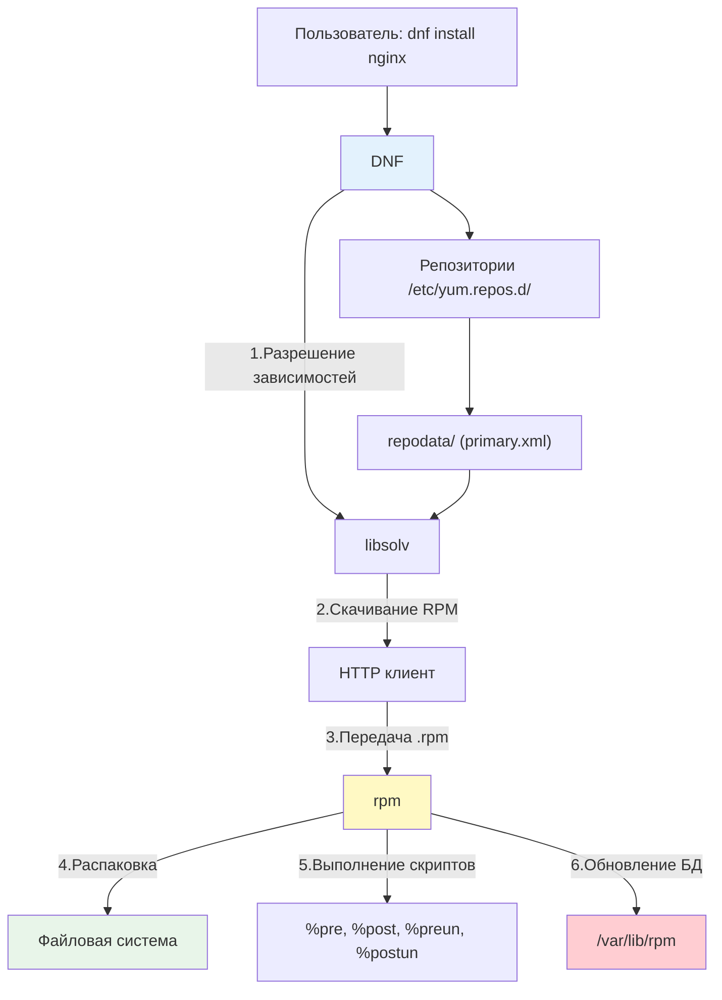

**DNF (Dandified YUM)** — это современный высокоуровневый менеджер пакетов, используемый по умолчанию в дистрибутивах семейства Red Hat (RHEL 8+, CentOS Stream, Rocky Linux, AlmaLinux, Fedora). Он пришел на смену классическому YUM, предложив значительные улучшения в скорости разрешения зависимостей (благодаря библиотеке `libsolv`), потреблении памяти и поддержке модульности.

Для DevOps-инженера понимание `dnf` критично, так как корпоративный сектор и энтерпрайз-инфраструктура часто базируются именно на RPM-дистрибутивах. Знание `dnf` позволяет автоматизировать настройку серверов, управлять жизненным циклом ПО и эффективно устранять неполадки.

> [!INFO] Связь с предыдущими темами
> 
> - `dnf` является аналогом [[Synced/DevOps/Сетевое и системное администрирование/1. Операционные системы/1. Linux/7. Управление пакетами/1. Debian, Ubuntu/1. apt.md | apt]] в мире Red Hat.
> - Низкоуровневую установку `.rpm` файлов выполняет `rpm` (аналог [[Synced/DevOps/Сетевое и системное администрирование/1. Операционные системы/1. Linux/7. Управление пакетами/1. Debian, Ubuntu/2. dpkg.md | dpkg]]).
> - Управление источниками пакетов осуществляется через файлы `.repo`, что концептуально схоже с [[Synced/DevOps/Сетевое и системное администрирование/1. Операционные системы/1. Linux/7. Управление пакетами/1. Debian, Ubuntu/3. Репозитории.md | репозиториями APT]].
> - Скрипты сопровождения в RPM также являются [[Synced/DevOps/Сетевое и системное администрирование/1. Операционные системы/1. Linux/4. Bash скрипты.md | bash-скриптами]].

## 1. Архитектура и взаимодействие компонентов

### Иерархия инструментов



### Ключевые директории

```bash
/etc/yum.repos.d/         # Конфигурационные файлы репозиториев (.repo)
/etc/dnf/dnf.conf         # Основной конфигурационный файл DNF
/etc/dnf/modules.d/       # Конфигурация включенных/отключенных модулей
/var/lib/rpm/             # База данных установленных RPM-пакетов (SQLite в RHEL 9+)
/var/cache/dnf/           # Кэш метаданных репозиториев и загруженных RPM-пакетов
/var/log/dnf.log          # Основной лог операций DNF
/var/log/dnf.librepo.log  # Лог операций загрузки
```

## 2. Основные команды DNF

### Управление индексами и кэшем

```bash
# Обновление метаданных репозиториев (аналог apt update)
dnf check-update
# или просто dnf, который автоматически проверит обновления

# Очистка всего кэша (метаданные и загруженные пакеты)
dnf clean all

# Перестройка кэша метаданных (полезно при рассинхронизации)
rm -rf /var/cache/dnf
dnf makecache
```

### Установка и удаление пакетов

```bash
# Установка пакета
dnf install nginx

# Установка нескольких пакетов
dnf install nginx php-fpm php-pgsql

# Установка без подтверждения (для скриптов)
dnf install -y docker-ce

# Установка конкретной версии
dnf install postgresql-13.4

# Удаление пакета (аналог apt remove)
dnf remove nginx

# Удаление пакета и неиспользуемых зависимостей (аналог apt autoremove)
dnf autoremove
```

### Обновление системы

```bash
# Обновление всех пакетов
dnf update
# или dnf upgrade (синонимы в DNF)

# Обновление конкретного пакета
dnf update nginx

# Исключение пакета из обновления (временное)
dnf update --exclude=kernel*
```

## 3. Поиск и информация о пакетах

### Поиск пакетов

```bash
# Поиск по имени и описанию
dnf search nginx

# Поиск пакета, предоставляющего конкретный файл (аналог apt-file)
dnf provides /etc/nginx/nginx.conf
# или
dnf whatprovides /usr/bin/python3

# Список установленных пакетов
dnf list installed

# Список доступных для обновления пакетов
dnf list upgrades
```

### Детальная информация

```bash
# Полная информация о пакете
dnf info nginx

# Показать зависимости пакета
dnf deplist nginx

# Показать историю изменений пакета (changelog)
dnf changelog nginx

# Список файлов, установленных пакетом
rpm -ql nginx
# (DNF не имеет прямой команды для этого, используется низкоуровневый rpm)

# Узнать, какому пакету принадлежит файл
rpm -qf /etc/nginx/nginx.conf
```

## 4. Модули DNF (Modularity)

Это ключевое отличие от `apt`. Модули позволяют выбирать разные версии (streams) одного приложения и наборы компонентов (profiles).

### Концепция Stream и Profile

- **Stream**: Версия программного обеспечения (например, `postgresql:13` или `postgresql:15`).
- **Profile**: Набор пакетов для конкретной роли (например, `client`, `server`).

### Работа с модулями

```bash
# Список доступных модулей
dnf module list

# Список модулей по имени
dnf module list postgresql

# Включение конкретного stream (например, PostgreSQL 15)
dnf module enable postgresql:15

# Установка модуля с профилем (установит сервер и зависимости)
dnf module install postgresql:15/server

# Сброс состояния модуля (возврат к состоянию по умолчанию)
dnf module reset postgresql

# Отключение модуля
dnf module disable postgresql
```

> [!WARNING] Конфликты модулей
> В одном окружении можно включить только один `stream` для конкретного модуля. Попытка включить `postgresql:13`, когда активен `postgresql:15`, вызовет ошибку. Сначала выполните `dnf module reset`.

---

## 5. История и откат изменений (History)

DNF ведет подробный журнал всех транзакций, что позволяет легко откатывать изменения.

> [!TIP] Безопасность откатов
> `dnf history undo` — мощный инструмент для восстановления системы после неудачного обновления или случайной установки ненужных пакетов.

## 6. Управление репозиториями

### Просмотр и управление

```bash
# Список всех репозиториев
dnf repolist
dnf repolist all  # включая отключенные

# Включение репозитория
dnf config-manager --enable epel

# Отключение репозитория
dnf config-manager --disable epel
```

### Добавление стороннего репозитория

```bash
# Способ 1: Использование dnf config-manager (требует dnf-plugins-core)
dnf install -y dnf-plugins-core
dnf config-manager --add-repo https://download.docker.com/linux/centos/docker-ce.repo

# Способ 2: Ручное создание файла .repo
cat > /etc/yum.repos.d/docker-ce.repo <<EOF
[docker-ce-stable]
name=Docker CE Stable
baseurl=https://download.docker.com/linux/centos/9/\$basearch/stable
enabled=1
gpgcheck=1
gpgkey=https://download.docker.com/linux/centos/gpg
EOF

# Способ 3: Установка RPM-пакета с настройками репозитория
rpm -ivh https://dl.fedoraproject.org/pub/epel/epel-release-latest-9.noarch.rpm
```

> [!LINK] Связь с безопасностью
> Проверка GPG-подписей (`gpgcheck=1`) критична для предотвращения установки модифицированных пакетов. Это часть [[Synced/DevOps/CI-CD, артефакты, тестирование и DevSecOps/5. DevSecOps и безопасность цепочки поставок/9. PKI и криптография в инфраструктуре/2. Инфраструктура открытых ключей.md | PKI]].

## 7. Решение проблем (Troubleshooting)

### Типичные проблемы и решения

| Проблема                                  | Причина                                    | Решение                                                                          |
| ----------------------------------------- | ------------------------------------------ | -------------------------------------------------------------------------------- |
| `Error: Failed to download metadata`      | Сетевая проблема или недоступность зеркала | Проверить сеть, выполнить `dnf clean all`, попробовать другое зеркало            |
| `Problem: problem with installed package` | Конфликт зависимостей или версий           | Использовать `dnf repoquery --requires <pkg>` для анализа, или `dnf distro-sync` |
| `RPMDB error`                             | Повреждение базы данных RPM                | Выполнить `rpm --rebuilddb`                                                      |
| `Transaction check error: file conflicts` | Два пакета пытаются установить один файл   | Удалить конфликтующий пакет или использовать `--allowerasing` (с осторожностью)  |
| `GPG check FAILED`                        | Отсутствует или не совпадает GPG-ключ      | Импортировать ключ: `rpm --import <URL>` или проверить `gpgkey` в `.repo`        |
### Диагностика

```bash
# Проверка целостности базы данных RPM
rpm -Va  # Верификация всех установленных пакетов (может занять время)

# Поиск "осиротевших" пакетов (установленных как зависимости, но более не нужных)
dnf repoquery --unneeded

# Проверка дубликатов пакетов
dnf repoquery --duplicates
```

## 8. Практические сценарии для DevOps

### Сценарий 1: Подготовка сервера через bash-скрипт

```bash
#!/bin/bash
set -euo pipefail

echo "=== Инициализация сервера ==="

# Обновление системы
dnf update -y

# Установка базовых утилит
dnf install -y epel-release
dnf install -y curl wget git vim htop net-tools bash-completion

# Установка стека (с использованием модулей, если применимо)
dnf module enable -y postgresql:15
dnf install -y postgresql-server nginx

# Инициализация БД (пример для PostgreSQL)
postgresql-setup --initdb

# Включение сервисов
systemctl enable --now nginx postgresql

# Очистка кэша для экономии места
dnf clean all

echo "=== Сервер готов ==="
```

### Сценарий 2: Интеграция с Ansible

```yml
# roles/rhel_setup/tasks/main.yml
- name: Установить EPEL репозиторий
  dnf:
    name: epel-release
    state: present

- name: Включить модуль PostgreSQL 15
  command: dnf module enable -y postgresql:15
  args:
    warn: false  # Подавить предупреждение о использовании command вместо модуля

- name: Установить пакеты
  dnf:
    name:
      - nginx
      - postgresql-server
      - python3-pip
    state: present
    update_cache: yes

- name: Удалить ненужные зависимости
  dnf:
    autoremove: yes
```

### Сценарий 3: Аудит установленных пакетов

```bash
#!/bin/bash
# audit-rpm.sh

REPORT="/tmp/rpm-audit-$(hostname)-$(date +%F).txt"

{
    echo "=== Аудит RPM пакетов ==="
    echo "Хост: $(hostname)"
    echo "Дата: $(date)"
    echo ""
    
    echo "=== Статистика ==="
    echo "Всего пакетов: $(rpm -qa | wc -l)"
    echo ""
    
    echo "=== Последние установленные пакеты ==="
    rpm -qa --last | head -20
    echo ""
    
    echo "=== Пакеты из сторонних репозиториев (не baseos/appstream) ==="
    dnf repoquery --installed --qf "%{name} %{from_repo}" | grep -v -E "baseos|appstream|@System"
    echo ""
    
    echo "=== Размеры установленных пакетов (топ-10) ==="
    rpm -qa --qf '%{size} %{name}\n' | sort -rn | head -10 | awk '{printf "%10d KB\t%s\n", $1/1024, $2}'
} > "$REPORT"

echo "Отчёт сохранён: $REPORT"
```

---
## Контрольные вопросы для самопроверки

1. В чем ключевое архитектурное отличие `dnf` от его предшественника `yum`, влияющее на скорость работы?
2. Как с помощью `dnf` узнать, какой пакет предоставляет конкретный файл в системе (например, `/usr/bin/htop`)?
3. Что такое "модуль" (module) в DNF и как концепции `stream` и `profile` помогают в управлении версиями ПО?
4. Как откатить последнюю транзакцию установки, если она привела к конфликтам в системе?
5. В чем разница между командами `dnf remove` и `dnf autoremove`?
6. Почему команда `rpm -qa --last` полезна при расследовании инцидентов, связанных с внезапными изменениями в системе?
7. Как безопасно добавить сторонний репозиторий (например, Docker или EPEL) и убедиться, что GPG-проверка активна?

---

#devops #linux #rhel #centos #rocky #almalinux #dnf #rpm #package-management #sysadmin #automation #ansible #troubleshooting #infrastructure #fundamentals