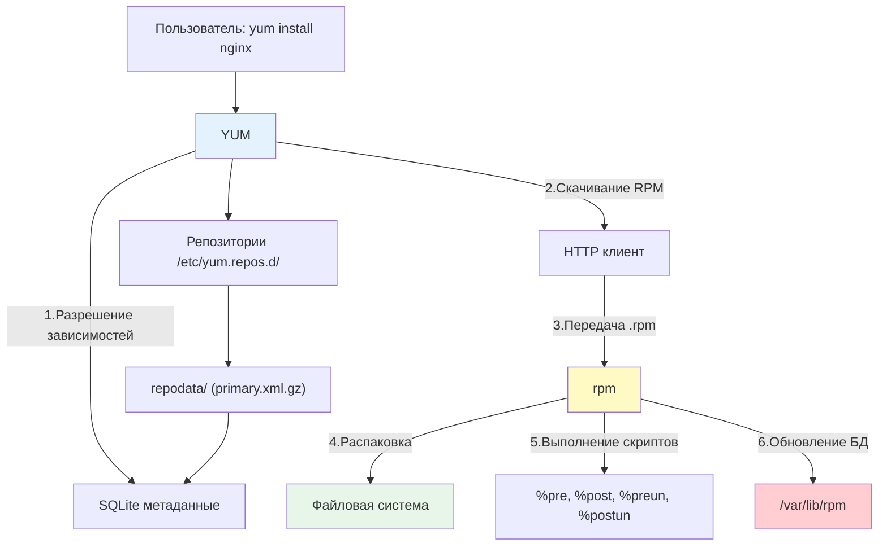

**YUM (Yellowdog Updater, Modified)** — это классический высокоуровневый менеджер пакетов, который был стандартом де-факто для дистрибутивов семейства Red Hat (RHEL, CentOS, Oracle Linux, Amazon Linux) до выхода RHEL 8. Хотя в современных системах его заменил [[1. dnf| DNF]], огромное количество production-серверов до сих пор работает на CentOS 7 (поддержка которого продлена до 2024-2029 годов в зависимости от вендора) и RHEL 7.

Для DevOps-инженера знание `yum` критично для поддержки унаследованной (legacy) инфраструктуры, написания универсальных скриптов и понимания эволюции управления пакетами в Linux.

> [!INFO] Связь с другими темами
> 
> - `yum` является прямым предшественником [[1. dnf| dnf]] и имеет почти идентичный синтаксис команд.
> - Низкоуровневую установку выполняет тот же [[3. rpm| rpm]], что и в DNF.
> - Конфигурация репозиториев хранится в тех же файлах `.repo` в `/etc/yum.repos.d/`, что описано в [[3. Репозитории| принципах работы репозиториев]].

## 1. Архитектура и отличия от DNF

### Иерархия инструментов YUM



### Ключевые отличия YUM от DNF

|Характеристика|YUM (CentOS 7 / RHEL 7)|DNF (CentOS 8+ / RHEL 8+)|
|---|---|---|
|**Язык реализации**|Python 2|Python 3|
|**Разрешение зависимостей**|Собственный алгоритм (медленный, высокое потребление RAM)|Библиотека `libsolv` (быстрый, эффективный)|
|**Формат метаданных**|Сжатый XML (`primary.xml.gz`)|Сжатый XML или более эффективные форматы|
|**Поддержка модулей**|Ограниченная (через плагины)|Нативная (Modularity)|
|**Статус**|Устаревший (Legacy), но поддерживаемый|Современный стандарт|

> [!TIP] Совместимость команд
> В RHEL 8+ и современных дистрибутивах команда `yum` является символической ссылкой на `dnf`. Поэтому `yum install` и `dnf install` выполняют один и тот же код. Однако в CentOS 7 это разные исполняемые файлы.

## 2. Основные команды YUM

### Управление кэшем и метаданными

```bash
# Обновление кэша метаданных (аналог apt update)
yum makecache

# Очистка всего кэша (метаданные и загруженные пакеты)
yum clean all

# Очистка только заголовков (headers)
yum clean headers

# Очистка только загруженных пакетов (освобождение места)
yum clean packages
```

### Установка и удаление

```bash
# Установка пакета
yum install nginx

# Установка без интерактивного подтверждения (для скриптов)
yum install -y docker-ce

# Установка конкретной версии
yum install postgresql95-9.5.20

# Удаление пакета
yum remove nginx

# Удаление пакета и неиспользуемых зависимостей
yum autoremove
```

### Обновление системы

```bash
# Проверка доступных обновлений
yum check-update

# Обновление всех пакетов
yum update

# Обновление конкретного пакета
yum update kernel

# Исключение пакета из обновления
yum update --exclude=kernel*
```

## 3. Поиск и анализ пакетов

```bash
# Поиск пакета по имени или описанию
yum search nginx

# Поиск пакета, предоставляющего конкретный файл
yum provides /etc/nginx/nginx.conf
# или
yum whatprovides /usr/bin/python

# Просмотр информации о пакете
yum info nginx

# Просмотр зависимостей пакета
yum deplist nginx

# Просмотр истории изменений (changelog) пакета
yum changelog nginx

# Список установленных пакетов
yum list installed

# Список доступных обновлений
yum list updates
```

## 4. Полезные плагины YUM

В CentOS 7 функциональность YUM расширяется через плагины. Некоторые из них критически важны для DevOps.

### Установка плагинов
`
```bash
yum install -y yum-plugin-versionlock yum-plugin-changelog yum-utils
```

### versionlock (Фиксация версий)

Аналог [[4. pinning| apt pinning]] или `apt-mark hold`. Позволяет запретить обновление конкретных пакетов.

```bash
# Зафиксировать текущую версию nginx
yum versionlock add nginx

# Просмотр зафиксированных пакетов
yum versionlock list

# Очистка всех блокировок
yum versionlock clear
```

_Конфигурация хранится в `/etc/yum/pluginconf.d/versionlock.list`._

### changelog (История изменений)

Позволяет быстро узнать, что изменилось в новой версии пакета, не устанавливая его.

```bash
# Просмотр changelog для обновлений nginx
yum changelog nginx
```

### yum-utils (Набор утилит)

Пакет `yum-utils` содержит множество полезных инструментов:

- `repoquery`: запросы к репозиториям (аналог `dnf repoquery`).
- `yumdownloader`: загрузка RPM-пакета без его установки (полезно для создания локальных репозиториев).
- `package-cleanup`: поиск "осиротевших" пакетов и дубликатов.


```bash
# Скачать RPM-файл без установки
yumdownloader --resolve nginx

# Найти пакеты, не являющиеся зависимостями других пакетов
package-cleanup --leaves

# Найти дубликаты пакетов (разные версии одного пакета)
package-cleanup --dupes
```

## 5. Управление репозиториями

### Просмотр и управление

```bash
# Список включенных репозиториев
yum repolist

# Список всех репозиториев (включая отключенные)
yum repolist all

# Включение репозитория
yum-config-manager --enable epel

# Отключение репозитория
yum-config-manager --disable epel
```

_Примечание: `yum-config-manager` входит в состав пакета `yum-utils`._

### Добавление репозитория EPEL

EPEL (Extra Packages for Enterprise Linux) — самый популярный сторонний репозиторий для RHEL/CentOS.

```bash
# Установка релиз-пакета EPEL
yum install -y epel-release

# Проверка появления репозитория
yum repolist | grep epel
```

## 6. Troubleshooting и отладка

### Типичные проблемы и решения

|Проблема|Причина|Решение|
|---|---|---|
|`Cannot retrieve metalink for repository`|Проблемы с SSL-сертификатами или сетью|Обновить `ca-certificates`, проверить DNS, временно отключить проверку SSL (не рекомендуется)|
|`Error: Package conflicts`|Конфликт версий или зависимостей|Использовать `yum history` для отката, или `package-cleanup --dupes`|
|`RPMDB open failed`|Повреждение базы данных RPM|Выполнить `rm -f /var/lib/rpm/__db*` затем `rpm --rebuilddb`|
|`No package ... available`|Пакет отсутствует в подключенных репозиториях|Подключить EPEL или сторонний репозиторий, проверить опечатки|

### Диагностика состояния YUM

```bash
# Проверка истории транзакций
yum history

# Детальная информация о транзакции (например, ID 25)
yum history info 25

# Откат транзакции
yum history undo 25

# Полная очистка и перестройка кэша (универсальное решение многих проблем)
yum clean all
rm -rf /var/cache/yum
yum makecache
```

## 7. Практические сценарии для DevOps

### Сценарий 1: Инициализация сервера CentOS 7 (Bash-скрипт)

```bash
#!/bin/bash
set -euo pipefail

echo "=== Инициализация CentOS 7 ==="

# Обновление системы и установка базовых утилит
yum update -y
yum install -y epel-release
yum install -y curl wget git vim htop net-tools bash-completion yum-utils

# Блокировка обновления ядра (частая практика для стабильности)
yum versionlock add kernel kernel-devel kernel-headers

# Установка стека LEMP
yum install -y nginx php-fpm php-pgsql

# Включение сервисов
systemctl enable --now nginx php-fpm

# Очистка кэша для экономии места на диске
yum clean all

echo "=== Сервер готов ==="
```

### Сценарий 2: Интеграция с Ansible (универсальная роль)

Эта роль работает как на CentOS 7 (`yum`), так и на CentOS 8+ (`dnf`), так как модуль `yum` в Ansible автоматически использует правильный бэкенд.

```bash
# roles/legacy_rhel_setup/tasks/main.yml
- name: Установить EPEL репозиторий
  yum:
    name: epel-release
    state: present

- name: Установить базовые пакеты
  yum:
    name:
      - curl
      - wget
      - git
      - htop
      - yum-plugin-versionlock
    state: present
    update_cache: yes

- name: Зафиксировать версию OpenSSL (пример безопасности)
  command: yum versionlock add openssl
  args:
    warn: false
  changed_when: false

- name: Очистить кэш yum для экономии места
  command: yum clean all
  args:
    warn: false
  changed_when: false
```

> [!LINK] Связь с IaC
> Использование универсальных модулей управления пакетами — часть [[1. Роли и Коллекции| создания ролей Ansible]], поддерживающих несколько версий ОС.

### Сценарий 3: Создание локального оффлайн-репозитория

```bash
#!/bin/bash
# create-local-repo.sh

REPO_DIR="/opt/localrepo"
PACKAGES="nginx postgresql95 htop"

mkdir -p "$REPO_DIR"

# Скачивание пакетов и их зависимостей без установки
yumdownloader --resolve --destdir="$REPO_DIR" $PACKAGES

# Установка инструмента для создания метаданных
yum install -y createrepo

# Генерация метаданных репозитория
createrepo "$REPO_DIR"

echo "Локальный репозиторий создан в $REPO_DIR"
echo "Для использования добавьте файл /etc/yum.repos.d/local.repo:"
cat <<EOF
[localrepo]
name=Local Repository
baseurl=file://$REPO_DIR
enabled=1
gpgcheck=0
EOF
```

---

## Контрольные вопросы для самопроверки

1. В чем заключаются главные архитектурные отличия `yum` от `dnf`, влияющие на производительность?
2. Как с помощью `yum` узнать, какой пакет предоставляет файл `/usr/sbin/ntpd`?
3. Для чего используется плагин `yum-plugin-versionlock` и в каких DevOps-сценариях он наиболее полезен?
4. Как безопасно очистить кэш `yum`, если на сервере закончилось дисковое пространство в `/var`?
5. Что делает команда `yum history undo <ID>` и в каких ситуациях её следует применять?
6. Как создать локальный репозиторий из скачанных RPM-пакетов для серверов без доступа к интернету?
7. Почему в Ansible-модуле `yum` можно безопасно использовать задачу для установки пакетов, не беспокоясь о том, работает ли на сервере CentOS 7 или CentOS 8?

---

#devops #linux #rhel #centos #yum #package-management #rpm #sysadmin #automation #ansible #troubleshooting #infrastructure #legacy-systems