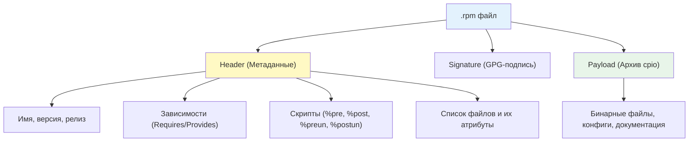
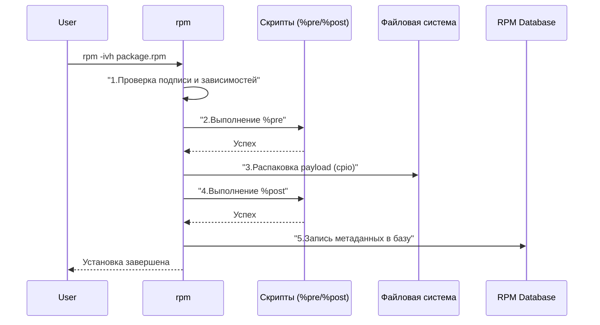

**RPM (Red Hat Package Manager)** — это низкоуровневый менеджер пакетов, являющийся фундаментом системы управления программным обеспечением в дистрибутивах семейства Red Hat (RHEL, CentOS, Rocky Linux, AlmaLinux, Fedora, openSUSE).

Если [[Synced/DevOps/Сетевое и системное администрирование/1. Операционные системы/1. Linux/7. Управление пакетами/2. RHEL, CentOS, Rocky, AlmaLinux/1. dnf.md | dnf]] и [[Synced/DevOps/Сетевое и системное администрирование/1. Операционные системы/1. Linux/7. Управление пакетами/2. RHEL, CentOS, Rocky, AlmaLinux/2. yum.md | yum]] — это «умные» менеджеры, которые умеют скачивать пакеты и разрешать зависимости, то `rpm` — это «рабочая лошадка», которая физически распаковывает `.rpm` архивы, выполняет скрипты и регистрирует файлы в [[Synced/DevOps/Глоссарий.md#rpm database | RPM Database]]. Его аналогом в мире Debian является [[Synced/DevOps/Сетевое и системное администрирование/1. Операционные системы/1. Linux/7. Управление пакетами/1. Debian, Ubuntu/2. dpkg.md | dpkg]].

Для DevOps-инженера знание `rpm` критично для аудита безопасности, верификации целостности файлов, извлечения данных из пакетов без их установки и восстановления поврежденной базы данных пакетов.

> [!INFO] Связь с другими темами
> 
> - `rpm` выполняет физическую установку, которую инициирует [[Synced/DevOps/Сетевое и системное администрирование/1. Операционные системы/1. Linux/7. Управление пакетами/2. RHEL, CentOS, Rocky, AlmaLinux/1. dnf.md | dnf]].
> - Скрипты внутри RPM-пакетов (%pre, %post) — это обычные [[Synced/DevOps/Сетевое и системное администрирование/1. Операционные системы/1. Linux/4. Bash скрипты.md | bash-скрипты]].
> - Сборка собственных пакетов требует написания [[Synced/DevOps/Глоссарий.md#spec-файл | spec-файлов]], что является частью практик CI/CD.

## 1. Архитектура RPM-пакета

### Структура .rpm файла

RPM-пакет состоит из трех основных частей: заголовка (header), подписи (signature) и полезной нагрузки (payload).



### Жизненный цикл установки через rpm



## 2. Основные операции: установка, обновление, удаление

> [!WARNING] Ограничения rpm
> Команда `rpm` **не разрешает зависимости** и **не скачивает пакеты** из репозиториев. Для установки пакета с разрешением зависимостей всегда предпочтительнее использовать `dnf install` или `yum install`. Используйте `rpm` для работы с уже скачанными локальными `.rpm` файлами или для аудита.

### Установка и обновление

```bash
# Установка нового пакета (v=verbose, h=hash progress)
rpm -ivh package.rpm

# Обновление существующего пакета (или установка, если не установлен)
rpm -Uvh package.rpm

# Понижение версии (downgrade) пакета
rpm -Uvh --oldpackage package.rpm

# Принудительная установка (игнорирование зависимостей и конфликтов)
# ОПАСНО: может сломать систему!
rpm -ivh --nodeps --force package.rpm
```

### Удаление

```bash
# Удаление пакета по имени (без расширения .rpm)
rpm -e nginx

# Удаление без выполнения скриптов %preun и %postun
rpm -e --noscripts nginx

# Удаление с сохранением конфигурационных файлов (помеченных как %config(noreplace))
rpm -e --keepconfig nginx
```

## 3. Запросы к базе данных (Querying)

Режим запросов (`-q`) — самый мощный и часто используемый аспект `rpm` для DevOps-инженеров.

```bash
# Проверить, установлен ли конкретный пакет
rpm -q nginx

# Получить полную информацию о пакете (версия, описание, группа, размер)
rpm -qi nginx

# Получить список всех файлов, установленных пакетом
rpm -ql nginx

# Получить список только конфигурационных файлов пакета
rpm -qc nginx

# Получить список только документационных файлов пакета
rpm -qd nginx

# Узнать, какому пакету принадлежит конкретный файл в системе
rpm -qf /etc/nginx/nginx.conf

# Получить информацию о пакете из локального .rpm файла (без установки)
rpm -qip package.rpm

# Получить список файлов внутри локального .rpm файла
rpm -qlp package.rpm
```

### Продвинутые запросы с форматированием (queryformat)

```bash
# Вывести имя и версию всех установленных пакетов
rpm -qa --qf "%{NAME} %{VERSION}\n"

# Найти все пакеты, установленные из конкретного репозитория (если доступно)
rpm -qa --qf "%{NAME} %{VENDOR}\n" | grep "Rocky Linux"

# Вывести размер, установленный каждым пакетом (в байтах)
rpm -qa --qf "%{SIZE} %{NAME}\n" | sort -rn | head -10
```

## 4. Верификация пакетов (RPM Verify)

Команда `rpm -V` (или `rpm --verify`) сравнивает установленные файлы с метаданными в [[Synced/DevOps/Глоссарий.md#rpm database | RPM Database]]. Это критически важный инструмент для обнаружения взлома, случайных изменений или повреждения файлов.

### Расшифровка вывода rpm -V

Каждый символ в выводе означает несоответствие определенного атрибута:

|Символ|Атрибут|Описание|
|---|---|---|
|`S`|Size|Размер файла изменился|
|`M`|Mode|Права доступа или тип файла изменились|
|`5`|MD5|Контрольная сумма (хэш) файла изменилась|
|`D`|Device|Major/minor номера устройства не совпадают|
|`L`|readLink|Путь символической ссылки изменился|
|`U`|User|Владелец файла изменился|
|`G`|Group|Группа владельца файла изменилась|
|`T`|mTime|Время модификации файла изменилось|
|`P`|caPabilities|Возможности (capabilities) файла изменились|

_Точка (`.`) означает, что атрибут совпадает._

### Примеры использования

```bash
# Проверить конкретный пакет
rpm -V nginx
# Вывод: S.5....T.  c /etc/nginx/nginx.conf
# (Изменились размер, MD5 и время модификации конфигурационного файла 'c')

# Проверить все пакеты в системе (может занять время)
rpm -Va

# Проверить все пакеты, исключая файлы конфигурации (c) и документации (d), 
# чтобы отсеять ожидаемые изменения
rpm -Va | grep -v '^[.]*[c|d]'

# Проверить пакет, которому принадлежит конкретный файл
rpm -Vf /usr/sbin/nginx
```

> [!TIP] Безопасность
> Регулярный запуск `rpm -Va` и анализ изменений в критичных бинарных файлах (например, `/usr/bin/sudo`, `/usr/sbin/sshd`) является базовой практикой обнаружения вторжений (FIM - File Integrity Monitoring).

---

## 5. Управление базой данных RPM

База данных RPM находится в `/var/lib/rpm`. В редких случаях (сбой питания, принудительное завершение процесса `rpm` или `dnf`) она может быть повреждена.

### Диагностика и восстановление

```bash
# Проверка целостности базы данных (только для старых версий с Berkeley DB)
rpm -vv --rebuilddb

# Полная перестройка базы данных (универсальный способ лечения)
# 1. Создать резервную копию текущей базы
cp -a /var/lib/rpm /var/lib/rpm.backup

# 2. Удалить временные файлы блокировки и индексы
rm -f /var/lib/rpm/__db.*

# 3. Перестроить базу из заголовков пакетов
rpm --rebuilddb

# 4. Очистить кэш dnf/yum и пересоздать метаданные
dnf clean all
dnf makecache
```

>[!WARNING] Опасность rebuilddb
>Никогда не выполняйте `rpm --rebuilddb`, если в системе активно работает процесс `dnf` или `yum`. Это гарантированно приведет к необратимому повреждению базы данных. Всегда проверяйте `ps aux | grep -E 'dnf|yum|rpm'`.

## 6. Практические сценарии для DevOps

### Сценарий 1: Извлечение файла из RPM без установки

Иногда нужно получить один конфигурационный файл или бинарник из пакета, не устанавливая его (например, для сравнения или восстановления).

```bash
# 1. Скачать RPM-пакет без установки
dnf download --downloadonly --downloaddir=/tmp nginx

# 2. Извлечь содержимое RPM в текущую директорию
rpm2cpio /tmp/nginx-1.20.1-9.el8.x86_64.rpm | cpio -idmv

# 3. Найти нужный файл в извлеченной структуре
find . -name "nginx.conf"
# Результат: ./etc/nginx/nginx.conf
```

_Примечание: утилита `rpm2cpio` преобразует RPM-архив в формат cpio, который затем распаковывается стандартной утилитой `cpio`._

### Сценарий 2: Аудит изменений в критичных бинарных файлах

Скрипт для проверки целостности ключевых системных утилит.

```bash
#!/bin/bash
# audit-binaries.sh

CRITICAL_BINARIES=(
    "/usr/bin/sudo"
    "/usr/bin/ssh"
    "/usr/sbin/sshd"
    "/usr/bin/systemctl"
)

echo "=== Аудит целостности критичных бинарных файлов ==="
for bin in "${CRITICAL_BINARIES[@]}"; do
    if [[ -f "$bin" ]]; then
        # Находим пакет, которому принадлежит файл
        pkg=$(rpm -qf "$bin")
        
        # Верифицируем этот конкретный файл
        result=$(rpm -Vf "$bin")
        
        if [[ -z "$result" ]]; then
            echo "[OK] $bin ($pkg)"
        else
            echo "[WARNING] $bin ($pkg) изменен!"
            echo "Детали: $result"
        fi
    else
        echo "[MISSING] $bin не найден"
    fi
done
```

### Сценарий 3: Поиск "осиротевших" файлов после ручного удаления

Если пакет был удален некорректно (например, через `rm -rf`), его файлы исчезли, но запись в базе данных осталась.

```bash
# Найти все файлы, которые числятся в базе RPM, но отсутствуют на диске
rpm -Va | grep '^missing'

# Или более читаемый формат:
rpm -qa | while read pkg; do
    rpm -ql "$pkg" 2>/dev/null | while read file; do
        if [[ ! -e "$file" ]]; then
            echo "Missing: $file (from $pkg)"
        fi
    done
done
```

## 7. Troubleshooting и типичные ошибки

|Проблема|Причина|Решение|
|---|---|---|
|`error: Failed dependencies`|Попытка установить пакет через `rpm -i` без предварительной установки зависимостей|Использовать `dnf install ./package.rpm` вместо `rpm -i`|
|`error: can't create transaction lock`|Другой процесс (`dnf`, `yum`, `rpm`) заблокировал базу данных|Дождаться завершения процесса или корректно завершить его (`kill`), затем удалить `/var/lib/rpm/__db.*`|
|`error: rpmdb open failed`|Повреждение базы данных RPM|Выполнить `rm -f /var/lib/rpm/__db.*` и `rpm --rebuilddb`|
|`package is already installed`|Попытка установить пакет, который уже есть, через `rpm -i`|Использовать `rpm -Uvh` (upgrade) или `rpm -Fvh` (freshen)|
|`digest: BAD`|Поврежден загруженный .rpm файл или не совпадает подпись|Перезагрузить файл, проверить GPG-ключи репозитория|

---

## Контрольные вопросы для самопроверки

1. В чем фундаментальная разница между `rpm -i` и `dnf install`? Почему в production-скриптах почти всегда используется `dnf`?
2. Как с помощью `rpm` узнать, какому пакету принадлежит файл `/etc/ssh/sshd_config`, и как проверить, не был ли этот файл изменен с момента установки?
3. Что означают символы `S.5....T. c` в выводе команды `rpm -V`?
4. Как извлечь один конкретный файл из `.rpm` пакета, не устанавливая этот пакет в систему?
5. Какие действия необходимо предпринять для безопасного восстановления поврежденной базы данных RPM?
6. Почему использование флага `--nodeps` при установке пакета считается опасной практикой?
7. Как с помощью `rpm` вывести список всех конфигурационных файлов, установленных пакетом `nginx`?

---

#devops #linux #rhel #centos #rocky #almalinux #rpm #package-management #sysadmin #security #auditing #troubleshooting #infrastructure #fundamentals