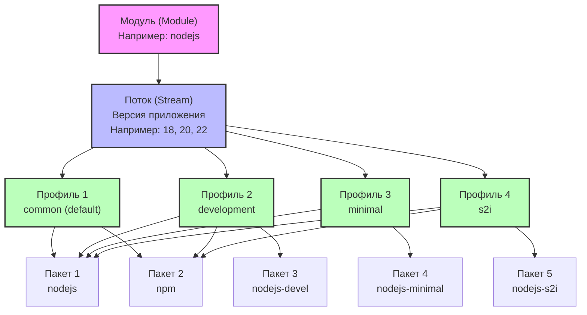

## Введение

**Модули DNF (Modularity)** — это одна из ключевых архитектурных инноваций, появившихся в RHEL 8 и перенесенных во все современные совместимые дистрибутивы (CentOS Stream, Rocky Linux, AlmaLinux).

Традиционно дистрибутивы Linux сталкивались с дилеммой: либо поставлять очень старые, но стабильные версии приложений (чтобы гарантировать стабильность на протяжении 10 лет поддержки), либо рисковать стабильностью, обновляя мажорные версии ПО. Модули решают эту проблему, разделяя ОС на две части:

1. **BaseOS**: Ядро системы, библиотеки C, системные утилиты. Обновляются только минорно, гарантируя стабильность ABI/API.
2. **AppStream**: Пользовательские приложения и среды выполнения (PostgreSQL, Node.js, Python, Nginx), поставляемые в виде модулей с разными версиями (streams).

Для DevOps-инженера понимание модулей критично, так как попытка установить пакет через обычный `dnf install` может привести к установке устаревшей версии по умолчанию, если не активирован нужный стрим.

> [!INFO] Связь с другими темами
> 
> - Модули являются расширением функциональности менеджера [[Synced/DevOps/Сетевое и системное администрирование/1. Операционные системы/1. Linux/7. Управление пакетами/2. RHEL, CentOS, Rocky, AlmaLinux/1. dnf.md | dnf]].
> - В старых системах (CentOS 7) аналогичные задачи решались через сторонние репозитории (SCL, IUS) или ручную сборку, так как [[Synced/DevOps/Сетевое и системное администрирование/1. Операционные системы/1. Linux/7. Управление пакетами/2. RHEL, CentOS, Rocky, AlmaLinux/2. yum.md | yum]] имел лишь ограниченную поддержку модулей через плагины.
> - Концепция разделения BaseOS и AppStream похожа на разделение ядра и пользовательского пространства, описанное в [[Synced/DevOps/Сетевое и системное администрирование/0. Введение и методология/1. Принцип работы ОС.md | принципах работы ОС]].

## 1. Архитектура модулей

### Иерархия: Модуль → Stream → Profile → Пакеты




**Пояснение к схеме:**

1. **Модуль** — это верхнеуровневая логическая единица, содержащая одно приложение или набор связанных инструментов (например, `nodejs`, `postgresql`, `nginx`).
2. **Поток (Stream)** — это отдельная версия внутри модуля. Например, для модуля `nodejs` могут существовать потоки `18`, `20` и `22`. Потоки позволяют одновременно иметь в системе разные версии одного приложения, выбирая нужную через DNF.
3. **Профиль** — это набор пакетов внутри конкретного потока, собранный под определенную задачу:
    - `common` — базовая установка для продакшена (обычно стоит по умолчанию)
    - `development` — включает заголовочные файлы и утилиты для разработки
    - `minimal` — только самое необходимое для запуска
    - `s2i` — для работы с Source-to-Image в контейнерах
4. **Пакет (RPM)** — конечный устанавливаемый артефакт. Разные профили могут содержать одни и те же пакеты (например, `nodejs` есть во всех профилях), но также могут добавлять уникальные пакеты под конкретную специализацию.

### Ключевые правила работы модулей

1. **Взаимоисключаемость стримов**: В один момент времени для одного модуля может быть активен (`enabled`) только **один** стрим. Нельзя одновременно установить PostgreSQL 13 и PostgreSQL 15 из модулей.
2. **Наследование зависимостей**: При установке профиля автоматически разрешаются и устанавливаются все пакеты, входящие в этот профиль, а также их зависимости.
3. **Приоритет**: Если стрим включен (`enabled`), пакеты из него получают высший приоритет при разрешении зависимостей по сравнению с немодульными пакетами.

## 2. Основные команды управления модулями

### Просмотр доступных модулей

```bash
# Получить список всех доступных модулей
dnf module list

# Получить информацию о конкретном модуле
dnf module list postgresql

# Пример вывода:
# Name        Stream   Profiles        Summary
# postgresql  10 [d]   client, server  PostgreSQL server and client module
# postgresql  13       client, server  PostgreSQL server and client module
# postgresql  15       client, server  PostgreSQL server and client module
# Подсказки: [d] = default (по умолчанию), [e] = enabled (включен), [i] = installed (установлен)
```

### Активация и установка

```bash
# Включить конкретный стрим (например, PostgreSQL 15)
dnf module enable postgresql:15

# Установить модуль с профилем по умолчанию (обычно 'server' или 'default')
dnf module install postgresql:15

# Установить модуль с конкретным профилем
dnf module install postgresql:15/server

# Установить модуль с несколькими профилями
dnf module install postgresql:15/server,devel
```

> [!TIP] Сокращенный синтаксис
> Команда `dnf module install postgresql:15/server` автоматически выполняет два действия: сначала `enable postgresql:15`, затем `install` пакетов профиля `server`.

### Сброс и отключение

```bash
# Сбросить состояние модуля (убрать флаг enabled, вернуть к default)
dnf module reset postgresql

# Полностью отключить модуль (пакеты из него не будут видны и не будут установлены)
dnf module disable postgresql
```

## 3. Практические сценарии для DevOps

### Сценарий 1: Установка современной версии Node.js вместо устаревшей

По умолчанию в Rocky Linux 9 может быть доступна старая версия Node.js. Нам требуется версия 20.

```bash
# 1. Смотрим доступные стримы
dnf module list nodejs
# Вывод покажет: 18 [d], 20

# 2. Сбрасываем состояние, если ранее был включен другой стрим
dnf module reset nodejs

# 3. Включаем нужный стрим
dnf module enable nodejs:20

# 4. Устанавливаем профиль (например, development или minimal)
dnf module install nodejs:20/minimal

# 5. Проверяем версию
node --version
# v20.x.x
```

### Сценарий 2: Миграция с одной мажорной версии на другую

Задача: обновить PostgreSQL с 13 до 15 на сервере разработки.

```bash
# 1. Останавливаем текущий сервис
systemctl stop postgresql

# 2. Делаем бэкап данных (критически важно перед сменой мажорной версии!)
# (Здесь подразумевается использование pg_dump или rsync, см. темы по БД)

# 3. Удаляем старые пакеты (опционально, но рекомендуется для чистоты)
dnf remove postgresql-server postgresql-contrib

# 4. Сбрасываем модуль
dnf module reset postgresql

# 5. Включаем новый стрим
dnf module enable postgresql:15

# 6. Устанавливаем новые пакеты
dnf module install postgresql:15/server

# 7. Инициализируем новую базу данных и мигрируем данные
# postgresql-setup --initdb
# (далее следует процесс восстановления из бэкапа)
```

## 4. Интеграция с автоматизацией (Ansible)

Управление модулями через Ansible требует использования модуля `dnf` с указанием параметра `state` и, при необходимости, предварительного включения стрима через модуль `command` (так как нативная поддержка модулей в старых версиях Ansible была ограничена, но в современных есть параметр `enablerepo` и работа с модулями).

```yml
# roles/modular_apps/tasks/main.yml

- name: Сбросить состояние модуля PHP (на случай предыдущих настроек)
  command: dnf module reset php -y
  args:
    warn: false
  changed_when: false

- name: Включить стрим PHP 8.2
  command: dnf module enable php:8.2 -y
  args:
    warn: false
  changed_when: false

- name: Установить PHP с профилем fpm и дополнительными расширениями
  dnf:
    name:
      - "@php:8.2/fpm"  # Символ @ указывает dnf, что это модуль с профилем
      - php-pgsql
      - php-redis
    state: present
    update_cache: yes

- name: Убедиться, что php-fpm запущен и включен
  systemd:
    name: php-fpm
    state: started
    enabled: yes
```

> [!LINK] Связь с IaC
> Использование символа `@` для установки модулей — это стандартная практика в [[Synced/DevOps/IaC/6. Ansible (Продвинутые практики)/1. Роли и Коллекции.md | ролях Ansible]] для управления RHEL-подобными системами.

## 5. Troubleshooting и типичные ошибки

### Ошибка: "Cannot install more than one stream"

**Причина**: Вы пытаетесь включить или установить стрим модуля, когда другой стрим этого же модуля уже находится в состоянии `enabled`. **Решение**:

```bash
# Проверить текущее состояние
dnf module list <имя_модуля>

# Сбросить модуль
dnf module reset <имя_модуля>

# Включить нужный стрим
dnf module enable <имя_модуля>:<версия>
```

### Ошибка: "Problem: conflicting requests" при установке пакета

**Причина**: Пакет, который вы пытаетесь установить, зависит от стрима модуля, который конфликтует с уже установленным или включенным стримом. **Решение**: Проверить зависимости через `dnf repoquery --requires <пакет>`. Возможно, потребуется удалить пакеты старого стрима перед включением нового.

### Проверка того, какие пакеты входят в профиль

Прежде чем устанавливать модуль, полезно знать, что именно будет установлено.

```bash
# Просмотреть пакеты, входящие в конкретный профиль
dnf module info postgresql:15/server
# или
dnf repoquery --installed --qf "%{name}" "@postgresql:15/server"
```

## 6. Ограничения и лучшие практики

1. **Не смешивайте модульные и немодульные установки**: Если вы включили стрим `nodejs:20`, не пытайтесь устанавливать пакеты `nodejs` из сторонних репозиториев (например, NodeSource) без предварительного `dnf module disable nodejs`. Это приведет к конфликтам зависимостей.
2. **Документируйте выбранные стримы**: В [[Synced/DevOps/Сетевое и системное администрирование/0. Введение и методология/3. Документирование.md | документации]] к серверу или в Ansible-переменных всегда явно указывайте, какой стрим используется, чтобы избежать неожиданного поведения при развертывании на новых хостах.
3. **Осторожно с `reset` на production**: Сброс модуля и смена стрима на работающем production-сервере без тщательного тестирования совместимости данных и конфигураций может привести к простою.

---
## Контрольные вопросы для самопроверки

1. В чем заключается главная проблема, которую решают модули DNF по сравнению с традиционным подходом к управлению пакетами в RHEL?
2. Что произойдет, если выполнить команду `dnf module install postgresql:15`, не указывая профиль? Какой профиль будет использован?
3. Почему команда `dnf module enable` является необходимым шагом перед установкой альтернативной версии приложения?
4. Как с помощью одной команды Ansible установить модуль с конкретным профилем, и какой специальный символ для этого используется?
5. Какую команду необходимо выполнить в первую очередь, если при попытке включить новый стрим вы получаете ошибку о конфликте с уже включенным стримом?
6. В чем разница между репозиториями BaseOS и AppStream в архитектуре RHEL 8+?

---

#devops #linux #rhel #centos #rocky #almalinux #dnf #modularity #appstream #package-management #sysadmin #automation #ansible #infrastructure #troubleshooting