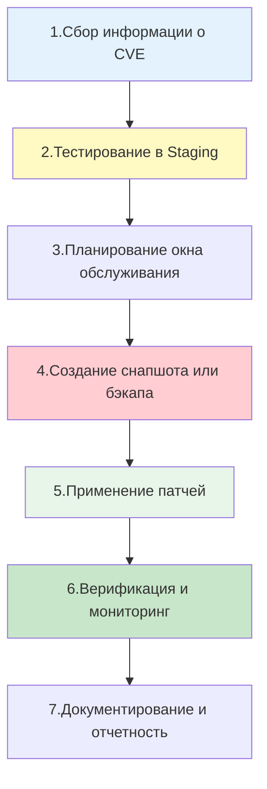

## Введение

**Patch Management (Управление патчами)** — это критически важный процесс в жизненном цикле эксплуатации инфраструктуры, направленный на своевременное применение обновлений безопасности и исправлений ошибок. В мире RHEL, CentOS, Rocky и AlmaLinux этот процесс строится вокруг экосистемы `dnf`/`yum`, но выходит далеко за рамки простой команды `dnf update`.

Для DevOps-инженера грамотное управление патчами — это баланс между безопасностью (скорейшее закрытие [[Synced/DevOps/Глоссарий.md#CVE | CVE]]) и стабильностью (избегание поломок из-за несовместимых обновлений).


> [!INFO] Связь с другими темами
> 
> - Физическую установку патчей выполняет менеджер [[Synced/DevOps/Сетевое и системное администрирование/1. Операционные системы/1. Linux/7. Управление пакетами/2. RHEL, CentOS, Rocky, AlmaLinux/1. dnf.md | dnf]].
> - Концепция автоматических фоновых обновлений аналогична подходу в [[Synced/DevOps/Сетевое и системное администрирование/1. Операционные системы/1. Linux/7. Управление пакетами/1. Debian, Ubuntu/5. unattended-upgrades.md | unattended-upgrades]].
> - Масштабирование процесса на сотни серверов осуществляется через [[Synced/DevOps/IaC/6. Ansible (Продвинутые практики)/1. Роли и Коллекции.md | роли Ansible]].
> - Выявление необходимости патчей часто инициируется процессами из [[Synced/DevOps/CI-CD, артефакты, тестирование и DevSecOps/5. DevSecOps и безопасность цепочки поставок/10. Аудит, соответствие/3. Сканирование уязвимостей инфраструктуры.md | сканирования уязвимостей инфраструктуры]].

## 1. Стратегии управления патчами

Хаотичное выполнение `dnf update -y` на всех серверах одновременно — прямой путь к катастрофе. Зрелый процесс управления патчами следует четкому жизненному циклу.



### Ключевые принципы

1. **Сегментация**: Сначала патчи применяются к тестовым (dev/staging) средам, затем к некритичным production-серверам, и только потом — к критичным узлам.
2. **Окна обслуживания (Maintenance Windows)**: Обновление production-систем должно происходить в заранее согласованное время с минимальной нагрузкой.
3. **Возможность отката**: Перед обновлением всегда должен быть создан снапшот ВМ, бэкап конфигураций или точка восстановления LVM.
4. **Исключения (Blacklisting)**: Критичные для бизнеса приложения, требующие ручного тестирования, должны быть исключены из автоматических обновлений.

## 2. Автоматизация обновлений: dnf-automatic

Для серверов, где допустимы автоматические обновления (например, только security-патчи), в RHEL-подобных системах используется `dnf-automatic`.

### Установка и базовая настройка

```bash
# Установка пакета
dnf install -y dnf-automatic

# Основной конфигурационный файл
# /etc/dnf/automatic.conf
```

### Ключевые параметры конфигурации

```bash
[commands]
# Тип обновлений: default (все), security (только безопасность), minimal (минимальные)
upgrade_type = security

# Действия: download (только скачать), download-upgrade (скачать и обновить), none
upgrade_type = security
download_updates = yes
apply_updates = yes

[emitters]
# Способ уведомления: motd (сообщение при входе), stdio, email, command
emit_via = email

[email]
email_from = root@localhost
email_to = devops-team@example.com
email_host = localhost
```

### Активация таймеров systemd

`dnf-automatic` не является демоном, он запускается по расписанию через systemd timers.

```bash
# Просмотр доступных таймеров
systemctl list-timers dnf-automatic*

# Включение ежедневной проверки и установки обновлений
systemctl enable --now dnf-automatic-install.timer

# Проверка статуса
systemctl status dnf-automatic-install.timer
```

> [!WARNING] Риски apply_updates = yes
> Включение автоматического применения обновлений (`apply_updates = yes`) удобно, но может привести к неожиданной перезагрузке сервисов или конфликтам. В строгом production-окружении часто используют `download_updates = yes` и `apply_updates = no`, а само применение триггерится вручную или через Ansible в окно обслуживания.

## 3. Обновление ядра без перезагрузки (Live Kernel Patching)

Обновление ядра Linux традиционно требует перезагрузки сервера, что означает простой. Для высоконагруженных или критичных систем, где простой недопустим (SLA 99.999%), применяется технология Live Patching.

### Kpatch (официальное решение Red Hat)

Kpatch позволяет применять патчи к работающему ядру.

```bash
# 1. Установка утилит kpatch
dnf install -y kpatch kpatch-dnf

# 2. Включение плагина kpatch-dnf (автоматизирует загрузку и применение патчей)
kpatch-dnf install

# 3. Проверка загруженных live-патчей
kpatch list
```

### Сторонние решения (TuxCare / KernelCare)

Если у вас нет подписки Red Hat, поддерживающей Kpatch, существуют коммерческие альтернативы, такие как TuxCare (ранее CloudLinux KernelCare), которые предоставляют аналогичный функционал для Rocky Linux, AlmaLinux и других.

> [!TIP] Ограничения Live Patching
> Live-патчи исправляют только определенные классы уязвимостей (в основном в коде ядра). Они не могут изменить структуру ABI, добавить новые драйверы или обновить пользовательские библиотеки (glibc). Полноценное обновление ядра все равно потребуется при следующей плановой перезагрузке.

## 4. Управление патчами через Ansible

Ручное управление патчами на парке из 50+ серверов неэффективно. Ansible предоставляет идемпотентный и контролируемый способ обновления.

### Базовая роль для обновления безопасности

```yml
# roles/patch_management/tasks/main.yml

- name: Проверка доступных обновлений безопасности
  command: dnf check-update --security --quiet
  register: security_updates
  changed_when: false
  ignore_errors: true

- name: Вывод информации о доступных обновлениях
  debug:
    msg: "Доступны обновления безопасности для: {{ security_updates.stdout_lines }}"
  when: security_updates.rc == 100

- name: Применение обновлений безопасности
  dnf:
    name: '*'
    state: latest
    security: yes  # Ключевой параметр: обновлять только пакеты с security-адвайзори
    exclude: kernel*  # Исключаем ядро для контроля перезагрузки
  register: update_result
  when: security_updates.rc == 100

- name: Проверка необходимости перезагрузки
  stat:
    path: /var/run/reboot-required
  register: reboot_required

- name: Уведомление о необходимости перезагрузки
  debug:
    msg: "Сервер {{ inventory_hostname }} требует перезагрузки после обновления."
  when: reboot_required.stat.exists
```

> [!LINK] Связь с IaC
> Параметр `security: yes` в модуле `dnf` является мощным инструментом для соответствия требованиям compliance, что детально разбирается в [[Synced/DevOps/IaC/6. Ansible (Продвинутые практики)/1. Роли и Коллекции.md | продвинутых практиках Ansible]].

## 5. Стратегии отката и безопасности

Что делать, если после применения патчей система перестала работать корректно?

### 1. Откат транзакции DNF

Если проблема вызвана обновлением конкретного пакета, можно откатить транзакцию.

```bash
# Просмотр истории
dnf history

# Откат последней транзакции
dnf history undo last

# Или откат к конкретному ID
dnf history undo <ID>
```

### 2. Использование снапшотов ВМ или LVM

Перед массовым обновлением рекомендуется создать снапшот виртуальной машины (если инфраструктура позволяет, например, в [[Synced/DevOps/Облачные сервисы и модели (XaaS)/6. Private cloud платформы/4. Proxmox VE/3. Эксплуатация и повседневное использование/2. Управление виртуальными машинами (KVM)/4. Snapshots.md | Proxmox VE]]) или снапшот тома LVM.

### 3. Фиксация версий (Versionlock)

Если определенный пакет ломает приложение при обновлении, его нужно зафиксировать.

```bash
# Установка плагина
dnf install -y python3-dnf-plugin-versionlock

# Блокировка пакета
dnf versionlock add nginx

# Просмотр заблокированных пакетов
dnf versionlock list
```

_Это аналог [[Synced/DevOps/Сетевое и системное администрирование/1. Операционные системы/1. Linux/7. Управление пакетами/1. Debian, Ubuntu/4. pinning.md | apt pinning]] в мире RHEL._

## 6. Troubleshooting и типичные проблемы

|Проблема|Причина|Решение|
|---|---|---|
|`dnf update` зависает или работает очень медленно|Поврежден кэш метаданных или проблемы с зеркалом|Выполнить `dnf clean all`, затем `dnf makecache`|
|Конфликт зависимостей при обновлении|Сторонний репозиторий предлагает несовместимую версию|Использовать `dnf repoquery --conflicts <пакет>`, временно отключить репозиторий (`--disablerepo`)|
|Сервис не запускается после обновления|Изменился формат конфигурационного файла (`.rpmnew`)|Проверить наличие файлов `.rpmnew` или `.rpmsave` в `/etc`, вручную перенести настройки|
|`dnf history undo` не работает|Были установлены новые пакеты, которых не было в момент транзакции|Использовать `dnf history rollback <ID>` для возврата ко всему состоянию системы на тот момент|

### Проверка файлов конфигурации после обновления

При обновлении пакетов, содержащих конфигурационные файлы, `rpm` может не перезаписать измененные администратором файлы, а создать новые с суффиксами.

```bash
# Найти все файлы .rpmnew и .rpmsave в системе
find /etc -name "*.rpmnew" -o -name "*.rpmsave"

# Сравнить оригинальный и новый конфиг
diff /etc/nginx/nginx.conf /etc/nginx/nginx.conf.rpmnew
```

## 7. Практические сценарии для DevOps

### Сценарий 1: Скрипт безопасного обновления с уведомлением

```bash
#!/bin/bash
set -euo pipefail

LOG_FILE="/var/log/patch-management-$(date +%F).log"
EMAIL="ops@example.com"

exec > >(tee -a "$LOG_FILE") 2>&1

echo "=== Начало процесса обновления: $(date) ==="

# 1. Проверка доступных security-обновлений
UPDATES=$(dnf check-update --security --quiet | wc -l)

if [ "$UPDATES" -eq 0 ]; then
    echo "Нет доступных обновлений безопасности."
    exit 0
fi

echo "Найдено $UPDATES пакетов для обновления."

# 2. Создание точки восстановления (пример для LVM, если корень на LVM)
# lvcreate --size 5G --snapshot --name root_snap /dev/vg0/root

# 3. Применение обновлений (исключая ядро для контролируемой перезагрузки)
dnf update --security -y --exclude=kernel*

# 4. Проверка необходимости перезагрузки
if needs-restarting -r > /dev/null; then
    echo "⚠️  Требуется перезагрузка для применения обновлений."
    echo "Subject: Требуется перезагрузка сервера $(hostname)" | sendmail "$EMAIL"
else
    echo "✅ Обновление завершено, перезагрузка не требуется."
fi

echo "=== Процесс завершен: $(date) ==="
```

_Примечание: утилита `needs-restarting` входит в пакет `yum-utils`._

### Сценарий 2: Аудит соответствия (Compliance Audit)

Проверка того, какие серверы в парке отстают по обновлениям безопасности.

```bash
#!/bin/bash
# audit-patches.sh (выполняется через Ansible ad-hoc или как часть inventory-скрипта)

echo "Хост: $(hostname)"
echo "Последнее обновление системы: $(rpm -qa --last | grep -m 1 '^kernel' | awk '{print $2, $3, $4, $5}')"

# Подсчет необновленных security-пакетов
SEC_UPDATES=$(dnf check-update --security --quiet | wc -l)
echo "Доступно security-обновлений: $SEC_UPDATES"

if [ "$SEC_UPDATES" -gt 0 ]; then
    echo "Список критичных обновлений:"
    dnf check-update --security --quiet | head -10
fi
```

---

## Контрольные вопросы для самопроверки

1. В чем заключается фундаментальный компромисс при выборе стратегии управления патчами (безопасность vs стабильность)?
2. Как настроить `dnf-automatic` так, чтобы он только скачивал обновления безопасности, но не устанавливал их автоматически?
3. Почему использование `dnf update -y` без исключений считается опасной практикой в production-среде?
4. Какую роль играет утилита `needs-restarting` в процессе управления патчами?
5. В чем разница между файлами с расширениями `.rpmnew` и `.rpmsave`, и как следует действовать при их обнаружении после обновления?
6. Как с помощью Ansible применить обновления только к пакетам, имеющим статус "security", и почему это важно для compliance?
7. Какие существуют альтернативы полной перезагрузке сервера при обновлении ядра Linux, и каковы их ограничения?

---

#devops #linux #rhel #centos #rocky #almalinux #patch-management #security #dnf-automatic #ansible #automation #sysadmin #compliance #live-patching #cve #troubleshooting