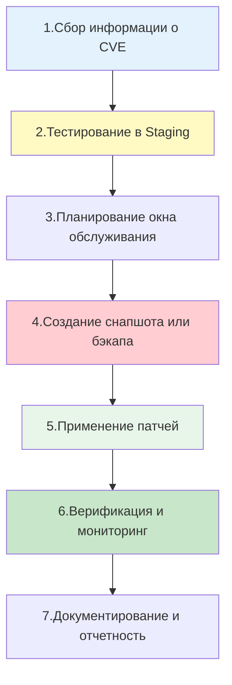

## Введение

**Patch Management (Управление патчами)** — это критически важный процесс в жизненном цикле эксплуатации инфраструктуры, направленный на своевременное применение обновлений безопасности и исправлений ошибок. В мире RHEL, CentOS, Rocky и AlmaLinux этот процесс строится вокруг экосистемы `dnf`/`yum`, но выходит далеко за рамки простой команды `dnf update`.

Для DevOps-инженера грамотное управление патчами — это баланс между безопасностью (скорейшее закрытие [[Synced/DevOps/Глоссарий.md#CVE | CVE]]) и стабильностью (избегание поломок из-за несовместимых обновлений).

> [!INFO] Связь с другими темами
> 
> - Физическую установку патчей выполняет менеджер [[Synced/DevOps/Сетевое и системное администрирование/1. Операционные системы/1. Linux/7. Управление пакетами/2. RHEL, CentOS, Rocky, AlmaLinux/1. dnf.md | dnf]].
> - Концепция автоматических фоновых обновлений аналогична подходу в [[Synced/DevOps/Сетевое и системное администрирование/1. Операционные системы/1. Linux/7. Управление пакетами/1. Debian, Ubuntu/5. unattended-upgrades.md | unattended-upgrades]].
> - Масштабирование процесса на сотни серверов осуществляется через [[Synced/DevOps/IaC/6. Ansible (Продвинутые практики)/1. Роли и Коллекции.md | роли Ansible]].
> - Выявление необходимости патчей часто инициируется процессами из [[Synced/DevOps/CI-CD, артефакты, тестирование и DevSecOps/5. DevSecOps и безопасность цепочки поставок/10. Аудит, соответствие/3. Сканирование уязвимостей инфраструктуры.md | сканирования уязвимостей инфраструктуры]].

## 1. Стратегии управления патчами

Хаотичное выполнение `dnf update -y` на всех серверах одновременно — прямой путь к катастрофе. Зрелый процесс управления патчами следует четкому жизненному циклу.

### Ключевые принципы

1. **Сегментация**: Сначала патчи применяются к тестовым (dev/staging) средам, затем к некритичным production-серверам, и только потом — к критичным узлам.
2. **Окна обслуживания (Maintenance Windows)**: Обновление production-систем должно происходить в заранее согласованное время с минимальной нагрузкой.
3. **Возможность отката**: Перед обновлением всегда должен быть создан снапшот ВМ, бэкап конфигураций или точка восстановления LVM.
4. **Исключения (Blacklisting)**: Критичные для бизнеса приложения, требующие ручного тестирования, должны быть исключены из автоматических обновлений.