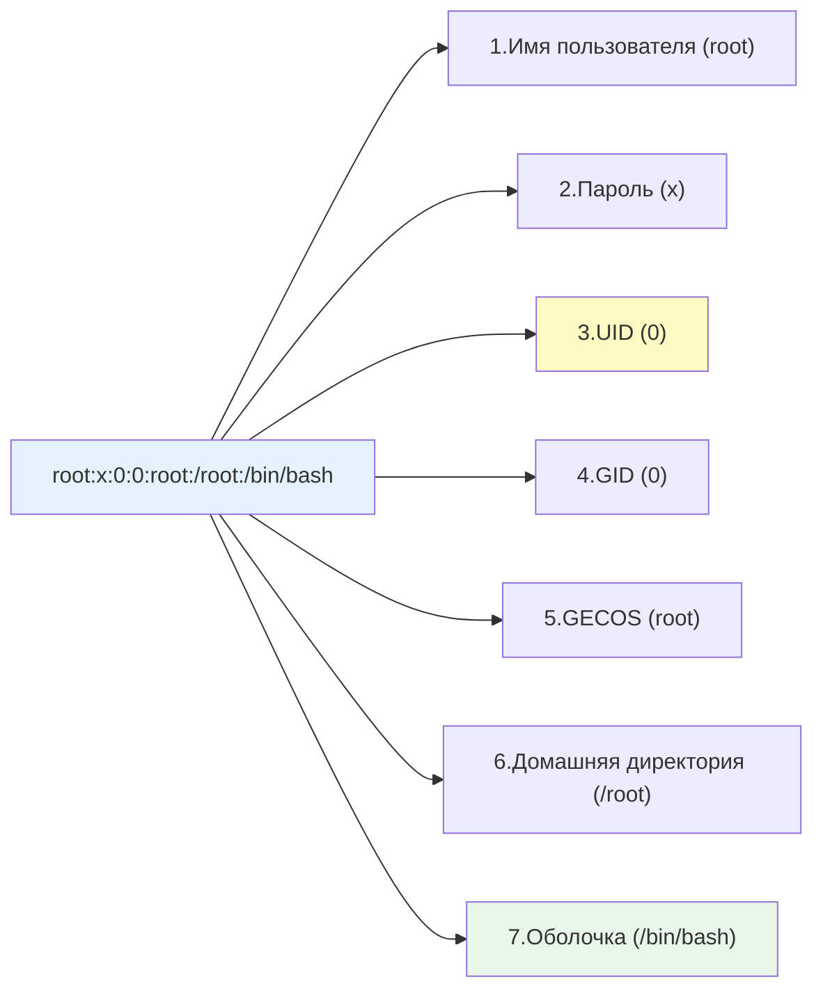

## Введение

В Linux управление пользователями и группами исторически и архитектурно построено на основе простых текстовых файлов, расположенных в директории `/etc`. Понимание структуры этих файлов является фундаментом для системного администрирования, настройки прав доступа, аудита безопасности и автоматизации управления учетными записями.

Хотя в современных корпоративных средах часто используются централизованные каталоги (например, [[Synced/DevOps/Сетевое и системное администрирование/1. Операционные системы/1. Linux/18. Домен контроллеры/2. FreeIPA.md | FreeIPA]] или Active Directory), локальные файлы `/etc` остаются конечной точкой разрешения имен и прав на каждом отдельном хосте.

> [!INFO] Связь с другими темами
> 
> - Эти файлы напрямую используются механизмами [[6. PAM| PAM]] для аутентификации.
> - Права, указанные через UID и GID, применяются к файловой системе, что описано в [[Synced/DevOps/Сетевое и системное администрирование/1. Операционные системы/1. Linux/1. Основы работы в терминале и навигация по ФС.md | основах работы с правами доступа]].
> - Для выполнения команд с повышенными привилегиями используется механизм, описанный в [[4. Sudo| Sudo]].

## 1. Файл `/etc/passwd`: база данных пользователей

Этот файл содержит одну строку на каждого пользователя. Поля разделены двоеточием (`:`).

### Структура строки

```
root:x:0:0:root:/root:/bin/bash
```

### Разбор полей



1. **Имя пользователя**: Уникальное строковое имя (login name).
2. **Пароль**: Символ `x` означает, что реальный хэш пароля хранится в `/etc/shadow`. Если здесь стоит `*` или `!`, учетная запись заблокирована для входа по паролю.
3. **UID**: Числовой идентификатор пользователя.
4. **GID**: Числовой идентификатор основной (primary) группы пользователя.
5. **GECOS (Comment)**: Дополнительная информация (полное имя, телефон, кабинет). Часто заполняется автоматически при создании пользователя.
6. **Домашняя директория**: Абсолютный путь к домашнему каталогу пользователя.
7. **Оболочка (Shell)**: Путь к командной оболочке, которая запускается при входе. Для системных пользователей, которым запрещен интерактивный вход, здесь указывается `/sbin/nologin` или `/bin/false`.

>[!WARNING] Права доступа
>Файл `/etc/passwd` должен быть доступен для чтения всем пользователям (`-rw-r--r--` или `644`), так как множество системных утилит (например, `ls -l` для отображения имен владельцев) обращаются к нему для преобразования UID в имена.

## 2. Файл `/etc/shadow`: безопасное хранение паролей

Этот файл содержит хэши паролей и параметры их жизненного цикла. Доступен для чтения **только** пользователю `root` (`-rw-r-----` или `640`, группа `shadow`).

### Структура строки

```
root:$6$xyz...abc:19000:0:99999:7:::
```

### Разбор полей

1. **Имя пользователя**: Должно точно соответствовать имени в `/etc/passwd`.
2. **Хэш пароля**:
    - Начинается с идентификатора алгоритма: `$1` (MD5), `$5` (SHA-256), `$6` (SHA-512), `$y$` или `$gy$` (yescrypt, современный стандарт в Debian/Ubuntu).
    - Если поле пустое, пароль не требуется (опасно!).
    - Если начинается с `!` или `*`, учетная запись заблокирована.
3. **Дата последнего изменения пароля**: Количество дней с 1 января 1970 года (Unix epoch).
4. **Минимальный возраст (min)**: Минимальное количество дней, которое должно пройти перед возможностью смены пароля (0 = без ограничений).
5. **Максимальный возраст (max)**: Количество дней, через которое пароль устареет и потребует смены (99999 = никогда).
6. **Период предупреждения (warn)**: За сколько дней до истечения срока пользователь начнет получать предупреждения.
7. **Период неактивности (inactive)**: Количество дней после истечения срока действия пароля, в течение которых учетная запись еще может быть активирована сменой пароля. После этого доступ блокируется.
8. **Дата истечения срока (expire)**: Абсолютная дата (в днях с 1970 года), когда учетная запись будет отключена независимо от пароля.
9. **Зарезервированное поле**: Не используется.

## 3. Файлы `/etc/group` и `/etc/gshadow`

### Структура `/etc/group`

Аналогичен `/etc/passwd`, но для групп.

```
sudo:x:27:user1,user2
```

1. **Имя группы**.
2. **Пароль группы**: Символ `x` (пароли групп используются крайне редко, обычно хранятся в `/etc/gshadow`).
3. **GID**: Числовой идентификатор группы.
4. **Список участников**: Пользователи, для которых эта группа является _дополнительной_ (secondary). Основная группа пользователя здесь не указывается (она определяется по GID в `/etc/passwd`).

### Структура `/etc/gshadow`

Хранит защищенную информацию о группах:

```
sudo:*::user1
```

1. **Имя группы**.
2. **Хэш пароля группы** (или `*`/`!`, если пароль не используется).
3. **Администраторы группы**: Пользователи, которые могут добавлять/удалять участников в эту группу без прав root (через `gpasswd`).
4. **Участники группы**: Дублирует список из `/etc/group`.

## 4. Конфигурационные файлы по умолчанию

При создании новых пользователей утилиты (`useradd`) обращаются к двум основным файлам для определения параметров по умолчанию.

### `/etc/login.defs`

Глобальный файл конфигурации, управляющий поведением утилит управления пользователями и парольной политикой.

```
# Пример ключевых параметров:
PASS_MAX_DAYS   90      # Максимальный срок действия пароля
PASS_MIN_DAYS   1       # Минимальный срок до следующей смены
PASS_WARN_AGE   7       # Дни предупреждения до истечения
UID_MIN         1000    # Начальный UID для обычных пользователей
UID_MAX         60000   # Конечный UID для обычных пользователей
SYS_UID_MIN     100     # Начальный UID для системных пользователей
SYS_UID_MAX     999     # Конечный UID для системных пользователей
CREATE_HOME     yes     # Создавать домашнюю директорию по умолчанию
UMASK           022     # Маска прав для создаваемых файлов
```

### `/etc/default/useradd`

Файл, задающий конкретные значения по умолчанию для утилиты `useradd`.

```
GROUP=100          # Основная группа по умолчанию (или поведение USERGROUPS_ENAB в login.defs)
HOME=/home         # Базовый путь для домашних директорий
INACTIVE=-1        # Значение неактивности по умолчанию
EXPIRE=            # Дата истечения по умолчанию (пусто = никогда)
SHELL=/bin/bash    # Оболочка по умолчанию
SKEL=/etc/skel     # Директория-шаблон, содержимое которой копируется в новую домашнюю директорию
CREATE_MAIL_SPOOL=yes # Создавать файл почтового ящика
```

>[!TIP] Директория `/etc/skel`
>При создании пользователя файлы из `/etc/skel` (например, `.bashrc`, `.profile`) автоматически копируются в его новую домашнюю директорию. Это стандартный способ предоставить пользователям базовые настройки окружения.

## 5. Практические сценарии для DevOps

### Сценарий 1: Аудит безопасности учетных записей

Поиск потенциальных угроз в файлах пользователей.

```bash
# 1. Поиск пользователей с UID 0 (кроме root)
awk -F: '$3 == 0 {print $1}' /etc/passwd

# 2. Поиск пользователей без пароля или с заблокированным входом, но с интерактивной оболочкой
awk -F: '($2 == "" || $2 == "!") && ($7 != "/sbin/nologin" && $7 != "/bin/false") {print $1}' /etc/passwd

# 3. Поиск пользователей с устаревшими паролями (истек срок действия)
# (Требует анализа /etc/shadow, проще использовать утилиту chage)
chage -l username

# 4. Проверка целостности файлов passwd и group
pwck
grpck
```

### Сценарий 2: Массовое изменение оболочки по умолчанию

Задача: изменить оболочку всем пользователям, у которых сейчас `/bin/sh`, на `/bin/bash`.

```bash
# 1. Находим таких пользователей
grep '/bin/sh$' /etc/passwd

# 2. Меняем оболочку с помощью usermod (в цикле или через xargs)
grep '/bin/sh$' /etc/passwd | cut -d: -f1 | xargs -I {} usermod -s /bin/bash {}

# 3. Проверяем результат
grep '/bin/bash$' /etc/passwd
```

## 6. Troubleshooting и типичные проблемы

|Проблема|Причина|Решение|
|---|---|---|
|`su: cannot set groups: Operation not permitted`|У утилиты `su` отсутствует бит setuid, или повреждены права `/etc/passwd`|Проверить права: `ls -l /bin/su`. Должен быть `rwsr-xr-x`. Восстановить через `chmod u+s /bin/su` (из root).|
|`useradd: cannot lock /etc/passwd`|Файл заблокирован другой утилитой (например, зависшим `usermod`) или поврежден|Удалить файлы блокировки: `rm -f /etc/passwd.lock /etc/shadow.lock /etc/group.lock`|
|Пользователь не может войти, хотя пароль верный|Оболочка пользователя установлена в `/sbin/nologin` или `/bin/false`|Изменить оболочку: `usermod -s /bin/bash username`|
|Ошибки синтаксиса в `/etc/passwd`|Ручное редактирование файла привело к неверному количеству разделителей `:`|Использовать утилиты `pwck` и `vipw` (безопасное редактирование с блокировкой) вместо прямого `nano`/`vim`.|

> [!WARNING] Ручное редактирование
> Никогда не редактируйте `/etc/passwd`, `/etc/shadow`, `/etc/group` или `/etc/gshadow` обычными текстовыми редакторами напрямую, если в этом нет крайней необходимости. Используйте специализированные утилиты: `vipw`, `vigr`, `usermod`, `gpasswd`. Они обеспечивают блокировку файлов и проверку синтаксиса перед сохранением.

---

## Контрольные вопросы для самопроверки

1. Почему в поле пароля файла `/etc/passwd` всегда находится символ `x`, и где хранится реальный хэш?
2. Какое значение UID зарезервировано для суперпользователя, и какой диапазон UID обычно выделяется для обычных пользователей в современных дистрибутивах?
3. В чем разница между основной (primary) и дополнительной (secondary) группой пользователя, и как это отражается в файлах `/etc/passwd` и `/etc/group`?
4. Какое поле в `/etc/shadow` отвечает за блокировку учетной записи после определенного количества дней неактивности после истечения срока действия пароля?
5. Какую роль играет директория `/etc/skel` при создании нового пользователя с помощью команды `useradd`?
6. Почему команда `pwck` является более безопасным способом проверки файла `/etc/passwd`, чем его открытие в текстовом редакторе?

---

#linux #sysadmin #users #groups #authentication #etc #security #devops #access-control #shadow #passwd