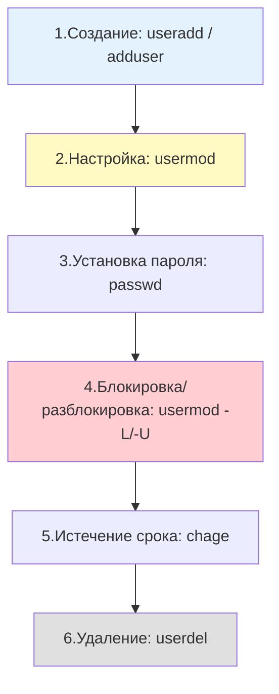
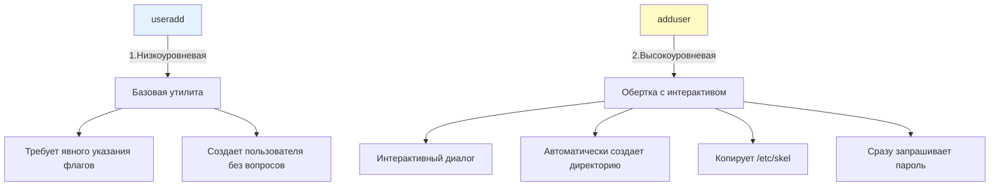
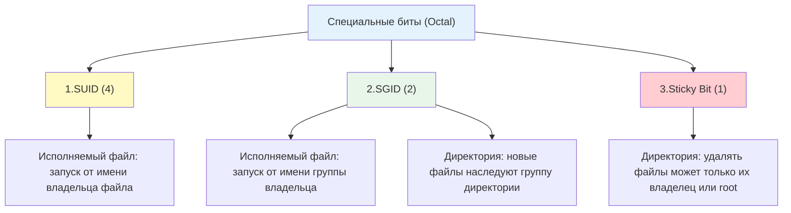

## Введение

Управление учетными записями пользователей и групп — одна из базовых задач системного администрирования. В Linux для этого используется набор стандартных утилит (`useradd`, `usermod`, `userdel`, `groupadd`, `usermod`, `passwd`, `chage`), которые работают напрямую с файлами, описанными в [[Synced/DevOps/Сетевое и системное администрирование/1. Операционные системы/1. Linux/8. Пользователи, группы, аутентификация/1. etc структуры.md | etc структурах]].

Для DevOps-инженера эти знания критичны:

- При создании сервисных аккаунтов для приложений.
- Настройке прав доступа в Docker-контейнерах.
- Подготовке серверов под конкретные роли (веб, БД, мониторинг).
- Автоматизации через Ansible, где эти утилиты используются «под капотом».

> [!INFO] Связь с другими темами
> 
> - Все команды опираются на понимание структуры [[Synced/DevOps/Сетевое и системное администрирование/1. Операционные системы/1. Linux/8. Пользователи, группы, аутентификация/1. etc структуры.md | файлов /etc/passwd, /etc/shadow, /etc/group]].
> - Права доступа, которые задаются при создании пользователей, работают в соответствии с моделью, описанной в [[Synced/DevOps/Сетевое и системное администрирование/1. Операционные системы/1. Linux/1. Основы работы в терминале и навигация по ФС.md | основах работы с ФС]].
> - Механизм получения повышенных привилегий описан в [[4. Sudo| Sudo]].

## 1. Жизненный цикл учетной записи



## 2. Создание пользователей: `useradd` и `adduser`

### Базовое использование `useradd`

```bash
# Создание пользователя с настройками по умолчанию
useradd john

# Создание пользователя с домашней директорией и bash-оболочкой
useradd -m -s /bin/bash john

# Создание системного пользователя (без домашней директории, UID из диапазона 100-999)
useradd -r -s /sbin/nologin app-service

# Полное указание всех параметров
useradd -m -s /bin/bash -c "John Smith, IT Department" -G developers,sudo -u 1500 john

# Проверка созданного пользователя
id john
grep "^john:" /etc/passwd
```

### Ключевые опции `useradd`

| Опция             | Описание                                                       |
| ----------------- | -------------------------------------------------------------- |
| `-m`              | Создать домашнюю директорию (`/home/username`)                 |
| `-M`              | Не создавать домашнюю директорию (даже если `CREATE_HOME=yes`) |
| `-s <shell>`      | Указать оболочку по умолчанию                                  |
| `-g <group>`      | Указать основную группу (GID)                                  |
| `-G <groups>`     | Список дополнительных групп через запятую                      |
| `-c "<comment>"`  | GECOS-поле (описание, полное имя)                              |
| `-u <UID>`        | Явно задать UID (редко, для совместимости)                     |
| `-r`              | Создать системного пользователя (без домашней директории)      |
| `-d <path>`       | Указать путь к домашней директории (вместо `/home/user`)       |
| `-e <YYYY-MM-DD>` | Дата истечения срока действия аккаунта                         |
| `-N`              | Не создавать одноимённую группу для пользователя               |

### Разница между `useradd` и `adduser`



> [!TIP] Что выбрать?
> 
> - **Debian/Ubuntu**: `adduser` удобнее для интерактивного использования.
> - **RHEL/CentOS/Rocky**: `adduser` — это просто символическая ссылка на `useradd`.
> - **Скрипты и автоматизация**: всегда используйте `useradd` для предсказуемости.

## 3. Модификация учетных записей: `usermod`

`usermod` позволяет изменить практически любой параметр существующего пользователя.

### Ключевые сценарии использования

```bash
# Смена оболочки пользователя
usermod -s /bin/zsh john

# Смена основной группы
usermod -g developers john

# Добавление пользователя в дополнительные группы (ВАЖНО: использовать -a!)
usermod -aG docker,wheel john

# Смена домашней директории с переносом содержимого
usermod -d /srv/john -m john

# Блокировка учетной записи (добавляет '!' в /etc/shadow)
usermod -L john

# Разблокировка учетной записи
usermod -U john

# Изменение GECOS-комментария
usermod -c "John Smith, Senior DevOps" john

# Установка даты истечения срока действия
usermod -e 2027-01-01 john

# Полное отключение учетной записи (блокировка + истечение пароля)
usermod -L -e 1 john
```

>[!WARNING] Критически важный флаг `-a` (append)
>При добавлении пользователя в дополнительные группы **всегда** используйте `usermod -aG <groups> <user>`. Без `-a` флаг `-G` **перезаписывает** все дополнительные группы указанными, удаляя пользователя из остальных групп. Это частая причина потери доступа.

```bash
# ❌ ОПАСНО: удалит пользователя из всех групп, кроме docker
usermod -G docker john

# ✅ ПРАВИЛЬНО: добавит в docker, сохранив остальные группы
usermod -aG docker john

# Проверить членство в группах
groups john
id john
```

## 4. Удаление учетных записей: `userdel`

```bash
# Базовое удаление (файлы пользователя остаются)
userdel john

# Полное удаление с домашней директорией и почтовым буфером
userdel -r john

# Удаление с принудительным удалением всех файлов, принадлежащих пользователю
userdel -r -f john
```

### Поиск «осиротевших» файлов после удаления

После `userdel` без `-r` в системе остаются файлы, принадлежащие удаленному UID. Их нужно найти и либо удалить, либо переназначить.

```bash
# Поиск всех файлов без владельца в системе
find / -nouser -o -nogroup 2>/dev/null | head -20

# Поиск файлов конкретного UID (например, 1500)
find / -uid 1500 2>/dev/null

# Переназначение прав на другого пользователя
find / -uid 1500 -exec chown root:root {} \; 2>/dev/null
```

> [!TIP] Best practice Перед удалением пользователя на production-сервере:
> 
> 1. Заблокируйте аккаунт: `usermod -L <user>`
> 2. Проверьте, что он не используется сервисами: `ps -u <user>`
> 3. Сделайте бэкап домашней директории
> 4. Только после проверки выполняйте `userdel -r`

## 5. Управление группами

### Создание групп: `groupadd`

```bash
# Создание обычной группы
groupadd developers

# Создание системной группы (GID из диапазона 1-999)
groupadd -r service-group

# Явное указание GID
groupadd -g 2000 devops-team

# Создание группы с паролем (редко используется)
groupadd -p '$6$xyz...hashed' restricted-group
```

### Модификация групп: `groupmod`

```bash
# Переименование группы
groupmod -n dev-team developers

# Изменение GID группы (осторожно: требует обновления прав на файлах!)
groupmod -g 3000 devops-team

# После изменения GID нужно обновить владельца файлов
find / -gid 2000 -exec chgrp -h devops-team {} \; 2>/dev/null
```

### Администрирование групп: `gpasswd`

```bash
# Добавить пользователя в группу
gpasswd -a john developers

# Удалить пользователя из группы
gpasswd -d john developers

# Назначить администратора группы (он сможет добавлять/удалять участников)
gpasswd -A john developers

# Установить пароль группы
gpasswd developers
# Ввести пароль дважды

# Заблокировать вход в группу по паролю
gpasswd -R developers

# Просмотреть информацию о группе
getent group developers
```

### Удаление групп: `groupdel`

```bash
# Удаление группы (нельзя удалить основную группу пользователя)
groupdel old-group

# Если группа является основной для какого-то пользователя, сначала измените её:
usermod -g new-primary-group affected-user
groupdel old-group
```

## 6. Управление паролями и политиками

### Установка и смена паролей: `passwd`

```bash
# Смена собственного пароля
passwd

# Смена пароля другого пользователя (требует прав root)
passwd john

# Блокировка пароля (добавляет '!' в /etc/shadow)
passwd -l john

# Разблокировка пароля
passwd -u john

# Принудительная смена пароля при следующем входе
passwd -e john

# Установка минимального срока действия пароля (в днях)
passwd -n 7 john

# Установка максимального срока действия пароля
passwd -x 90 john

# Статус пароля пользователя
passwd -S john
# Пример вывода: john L 09/15/2026 0 99999 7 -1
# (L = Locked, дата, min, max, warn, inactive)
```

### Управление политикой паролей: `chage`

`chage` — более удобная альтернатива флагам `passwd` для работы со сроком действия паролей.

```bash
# Просмотр текущей политики
chage -l john

# Установка максимальной продолжительности пароля (90 дней)
chage -M 90 john

# Установка минимального срока (нельзя менять чаще 7 дней)
chage -m 7 john

# Период предупреждения до истечения (14 дней)
chage -W 14 john

# Период неактивности после истечения (30 дней)
chage -I 30 john

# Дата истечения учетной записи (не пароля!)
chage -E 2027-12-31 john

# Принудительная смена пароля при следующем входе (через сброс даты)
chage -d 0 john

# Отключение истечения пароля (никогда не истекает)
chage -M -1 john
```

### Интерактивный режим `chage`

```bash
# Интерактивная настройка всех параметров политики
chage john
# Будут заданы вопросы о каждом параметре
```

## 7. Переключение между пользователями

### Команды `su` и `sudo -i`

```bash
# Переключение на пользователя john (остается текущая среда)
su john

# Переключение с полным окружением (как при новом логине)
su - john
# или
su -l john

# Выполнение одной команды от имени другого пользователя
su -c "systemctl restart nginx" john

# Переключение на root (если знаете пароль root)
su -

# Переключение через sudo (требует прав sudo)
sudo -i
sudo -u john bash
sudo -u john -i  # с полным окружением
```

> [!LINK] Связь с Sudo
> Детальный разбор механизма повышения привилегий, включая настройку `/etc/sudoers` — в [[4. Sudo| Sudo]].

## 8. Специальные биты прав

###  1. SUID, SGID, Sticky Bit

Помимо стандартных прав `rwx` (чтение, запись, выполнение), в Linux существуют три специальных бита, которые модифицируют поведение файлов и директорий.



#### SUID (Set User ID) — `4`

- **Как выглядит**: `rwsr-xr-x` (буква `s` на месте `x` у владельца).
- **Зачем нужен**: Позволяет обычному пользователю выполнить программу с привилегиями владельца (часто `root`).
- **Пример**: `/usr/bin/passwd`. Файл принадлежит `root:root`, но имеет SUID. Когда обычный пользователь меняет пароль, процесс временно получает права `root`, чтобы записать хэш в защищенный `/etc/shadow`.
- **Установка**: `chmod 4755 /path/to/file` или `chmod u+s /path/to/file`.

#### SGID (Set Group ID) — `2`

- **Как выглядит**: `rwxr-sr-x` (буква `s` на месте `x` у группы).
- **Зачем нужен**:
    1. _Для файлов_: аналогично SUID, но для группы.
    2. _Для директорий_: критически важен для совместной работы. Если на директории установлен SGID, любой файл, созданный внутри неё, будет принадлежать группе этой директории, а не личной группе создавшего пользователя.
- **Пример**: Общая папка для разработчиков `/var/www/shared`.
- **Установка**: `chmod 2775 /path/to/dir` или `chmod g+s /path/to/dir`.

#### Sticky Bit (Липкий бит) — `1`

- **Как выглядит**: `rwxrwxrwt` (буква `t` на месте `x` для остальных).
- **Зачем нужен**: Защита файлов в общих директориях. Без Sticky Bit любой пользователь с правами на запись в директорию мог бы удалить чужой файл. С ним — удалить файл может только его владелец или `root`.
- **Пример**: Директория `/tmp` (`drwxrwxrwt`).
- **Установка**: `chmod 1777 /tmp` или `chmod +t /tmp`.

>[!WARNING] Риски безопасности SUID
>Файлы с SUID, принадлежащие `root`, являются частой целью эксплойтов. Если такая программа содержит уязвимость (например, переполнение буфера или инъекцию команд), злоумышленник может выполнить код с правами `root`. Регулярный аудит таких файлов — обязательная практика.

### 2. Real UID vs Effective UID

Чтобы понять, как работает SUID, важно различать два типа идентификаторов процесса:

|Тип ID|Описание|
|---|---|
|**Real UID (RUID)**|Реальный идентификатор пользователя, который запустил процесс. Не меняется при использовании SUID. Определяет, кому «принадлежит» процесс.|
|**Effective UID (EUID)**|Эффективный идентификатор, который ядро использует для **проверки прав доступа** к файлам и ресурсам. При наличии SUID бита EUID становится равным UID владельца файла.|

**Пример**: Пользователь `john` (UID 1000) запускает `/usr/bin/passwd` (владелец `root`, UID 0, с битом SUID).

- RUID процесса = 1000 (`john`)
- EUID процесса = 0 (`root`)
- Результат: процесс может читать/писать `/etc/shadow`, но система знает, что инициатором был `john`.

### 3. Современная альтернатива SUID: File Capabilities

Использование SUID считается устаревшим и рискованным подходом, так как оно передает _все_ привилегии `root` процессу. В современных Linux-системах рекомендуется использовать **Capabilities** (возможности), которые предоставляют процессу только конкретные, необходимые ему права.

```bash
# Просмотр возможностей, назначенных исполняемому файлу
getcap /usr/bin/ping
# Вывод: /usr/bin/ping = cap_net_raw+ep

# Назначение возможности (например, разрешение биндить привилегированные порты без root)
setcap 'cap_net_bind_service=+ep' /opt/myapp/bin/server

# Удаление всех возможностей у файла
setcap -r /opt/myapp/bin/server
```

## 9. Информационные команды

```bash
# Информация о текущем пользователе
whoami
id

# Информация о конкретном пользователе
id john
# Пример вывода: uid=1000(john) gid=1000(john) groups=1000(john),27(sudo),999(docker)

# Основная и дополнительные группы
groups john
id -Gn john    # только имена групп
id -gn john    # только основная группа
id -u john     # только UID

# Подробная информация из /etc/passwd
getent passwd john
getent group developers

# Кто сейчас в системе
who
w
users

# История входов
last
lastb   # неудачные попытки входа (требует прав root)
```

## 10. Практические сценарии для DevOps

### Сценарий 1: Создание сервисного аккаунта для приложения

```bash
#!/bin/bash
# create-service-user.sh

SERVICE_NAME="myapp"
SERVICE_GROUP="myapp"

# 1. Создать системную группу
groupadd -r "$SERVICE_GROUP"

# 2. Создать системного пользователя
#    -r: системный
#    -g: основная группа
#    -d: домашняя директория
#    -s: без оболочки
#    -c: описание
useradd -r -g "$SERVICE_GROUP" \
    -d "/opt/$SERVICE_NAME" \
    -s /sbin/nologin \
    -c "MyApp service account" \
    "$SERVICE_NAME"

# 3. Создать необходимые директории с правильными правами
mkdir -p "/opt/$SERVICE_NAME"/{data,logs,config}
chown -R "$SERVICE_NAME:$SERVICE_GROUP" "/opt/$SERVICE_NAME"
chmod 750 "/opt/$SERVICE_NAME"
chmod 770 "/opt/$SERVICE_NAME/logs"

# 4. Заблокировать парольный вход (только через sudo/systemd)
passwd -l "$SERVICE_NAME"

echo "Сервисный аккаунт $SERVICE_NAME создан"
```

### Сценарий 2: Массовое создание пользователей из CSV

```bash
#!/bin/bash
# bulk-user-creation.sh
# Формат CSV: username,fullname,groups,shell

CSV_FILE="users.csv"

while IFS=',' read -r username fullname groups shell; do
    # Пропустить заголовок и пустые строки
    [[ "$username" == "username" ]] && continue
    [[ -z "$username" ]] && continue
    
    # Проверить, существует ли пользователь
    if id "$username" &>/dev/null; then
        echo "⚠️  Пользователь $username уже существует"
        continue
    fi
    
    # Создать пользователя
    useradd -m -s "$shell" -c "$fullname" -G "$groups" "$username"
    
    # Установить временный пароль и потребовать смену при первом входе
    TEMP_PASS=$(openssl rand -base64 12)
    echo "$username:$TEMP_PASS" | chpasswd
    chage -d 0 "$username"
    
    echo "✅ Создан: $username (временный пароль: $TEMP_PASS)"
    
done < "$CSV_FILE"
```

### Сценарий 3: Аудит устаревших учетных записей

```bash
#!/bin/bash
# audit-users.sh

echo "=== Аудит учетных записей ==="

echo ""
echo "1. Пользователи с интерактивной оболочкой, но без пароля:"
awk -F: '$7 !~ /nologin|false/ {print $1}' /etc/passwd | while read user; do
    status=$(passwd -S "$user" 2>/dev/null | awk '{print $2}')
    if [[ "$status" == "NP" ]]; then
        echo "   ⚠️  $user (No Password)"
    fi
done

echo ""
echo "2. Пользователи с UID 0 (кроме root):"
awk -F: '$3 == 0 && $1 != "root" {print "   ⚠️  " $1}' /etc/passwd

echo ""
echo "3. Пользователи с устаревшими паролями (>90 дней):"
for user in $(awk -F: '$7 !~ /nologin|false/ {print $1}' /etc/passwd); do
    last_change=$(chage -l "$user" 2>/dev/null | grep "Last password change" | cut -d: -f2 | xargs)
    if [[ -n "$last_change" && "$last_change" != "never" ]]; then
        last_epoch=$(date -d "$last_change" +%s 2>/dev/null)
        now_epoch=$(date +%s)
        days_ago=$(( (now_epoch - last_epoch) / 86400 ))
        if (( days_ago > 90 )); then
            echo "   ⚠️  $user (пароль менялся $days_ago дней назад)"
        fi
    fi
done

echo ""
echo "4. Неиспользуемые домашние директории (без соответствующего пользователя):"
for home in /home/*; do
    user=$(basename "$home")
    if ! id "$user" &>/dev/null; then
        echo "   📁 $home (пользователь $user не существует)"
    fi
done
```

### Сценарий 4: Интеграция с Ansible

```yml
# roles/manage_users/tasks/main.yml

- name: Создать группу разработчиков
  group:
    name: developers
    state: present
    gid: 2000

- name: Создать пользователя john
  user:
    name: john
    group: developers
    groups: docker,sudo
    shell: /bin/bash
    create_home: yes
    comment: "John Smith, DevOps Engineer"
    password: "{{ 'temporary_password' | password_hash('sha512') }}"
    update_password: on_create
    state: present

- name: Установить политику паролей для john
  user:
    name: john
    password_expire_min: 7
    password_expire_max: 90

- name: Скопировать SSH-ключи для пользователя
  authorized_key:
    user: john
    state: present
    key: "{{ lookup('file', 'pubkeys/john.pub') }}"
```

>[!LINK] Связь с IaC
>Использование модуля `user` в Ansible является частью [[Synced/DevOps/IaC/6. Ansible (Продвинутые практики)/1. Роли и Коллекции.md | ролей Ansible]] для управления серверами.

## 11. Troubleshooting и типичные проблемы

| Проблема                                          | Причина                                                         | Решение                                                                                   |
| ------------------------------------------------- | --------------------------------------------------------------- | ----------------------------------------------------------------------------------------- |
| `useradd: cannot create directory`                | Родительская директория не существует или нет прав              | Создать родительскую директорию или использовать существующий путь (`-d`)                 |
| `usermod: user is currently logged in`            | Пользователь активен в системе                                  | Дождаться выхода или использовать `pkill -u username` (осторожно)                         |
| Пользователь не входит после добавления в группу  | Членство в группе не подтянуто активной сессией                 | Перезайти в систему или выполнить `newgrp groupname`                                      |
| `passwd: Authentication token manipulation error` | Файл `/etc/shadow` повреждён или не имеет правильных прав       | Проверить: `ls -l /etc/shadow` (должно быть `rw-r-----`). Восстановить через `pwck`       |
| Команда `su -` не работает                        | Отсутствует `/bin/bash` или сломана оболочка                    | Проверить `/etc/passwd` для пользователя, исправить оболочку через `usermod -s /bin/bash` |
| `userdel: cannot remove entry`                    | Пользователь является основной группой для другого пользователя | Сначала изменить основную группу зависимого пользователя                                  |

### Безопасное редактирование файлов

Если нужно вручную отредактировать файлы пользователей, используйте безопасные утилиты:

```bash
# Безопасное редактирование /etc/passwd и /etc/shadow
vipw       # для passwd
vipw -s    # для shadow

# Безопасное редактирование /etc/group и /etc/gshadow
vigr       # для group
vigr -s    # для gshadow
```

Эти утилиты создают блокировку файлов и проверяют синтаксис перед сохранением.

---

## Контрольные вопросы для самопроверки

1. В чем разница между `useradd` и `adduser`? Когда следует использовать каждую из этих команд?
2. Почему при добавлении пользователя в дополнительные группы обязательно нужно использовать флаг `-a` с опцией `-G`?
3. Как заблокировать учетную запись так, чтобы пользователь не мог войти, но его файлы остались доступными для аудита?
4. Как принудить пользователя сменить пароль при следующем входе в систему? Какую команду и какие опции использовать?
5. В чем разница между `userdel john` и `userdel -r john`? Что происходит с файлами пользователя в каждом случае?
6. Как найти в системе все файлы, принадлежащие пользователю, который был удалён без флага `-r`?
7. Какую роль играет утилита `chage` и чем она отличается от команды `passwd`?
8. Почему нельзя удалить группу через `groupdel`, если она является основной для какого-то пользователя?

---

#devops #linux #sysadmin #user-management #useradd #usermod #userdel #groupadd #passwd #chage #authentication #automation #ansible #security #troubleshooting