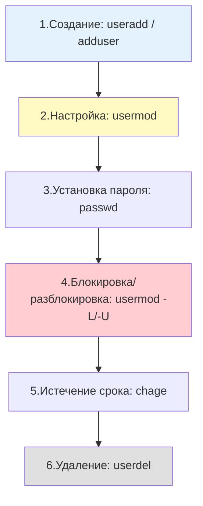
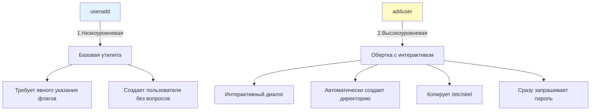

## Введение

Управление учетными записями пользователей и групп — одна из базовых задач системного администрирования. В Linux для этого используется набор стандартных утилит (`useradd`, `usermod`, `userdel`, `groupadd`, `usermod`, `passwd`, `chage`), которые работают напрямую с файлами, описанными в [[Synced/DevOps/Сетевое и системное администрирование/1. Операционные системы/1. Linux/8. Пользователи, группы, аутентификация/1. etc структуры.md | etc структурах]].

Для DevOps-инженера эти знания критичны:

- При создании сервисных аккаунтов для приложений.
- Настройке прав доступа в Docker-контейнерах.
- Подготовке серверов под конкретные роли (веб, БД, мониторинг).
- Автоматизации через Ansible, где эти утилиты используются «под капотом».

> [!INFO] Связь с другими темами
> 
> - Все команды опираются на понимание структуры [[Synced/DevOps/Сетевое и системное администрирование/1. Операционные системы/1. Linux/8. Пользователи, группы, аутентификация/1. etc структуры.md | файлов /etc/passwd, /etc/shadow, /etc/group]].
> - Права доступа, которые задаются при создании пользователей, работают в соответствии с моделью, описанной в [[Synced/DevOps/Сетевое и системное администрирование/1. Операционные системы/1. Linux/1. Основы работы в терминале и навигация по ФС.md | основах работы с ФС]].
> - Механизм получения повышенных привилегий описан в [[Synced/DevOps/Сетевое и системное администрирование/1. Операционные системы/1. Linux/8. Пользователи, группы, аутентификация/3. Sudo.md | Sudo]].

## 1. Жизненный цикл учетной записи



## 2. Создание пользователей: `useradd` и `adduser`

### Базовое использование `useradd`

```bash
# Создание пользователя с настройками по умолчанию
useradd john

# Создание пользователя с домашней директорией и bash-оболочкой
useradd -m -s /bin/bash john

# Создание системного пользователя (без домашней директории, UID из диапазона 100-999)
useradd -r -s /sbin/nologin app-service

# Полное указание всех параметров
useradd -m -s /bin/bash -c "John Smith, IT Department" -G developers,sudo -u 1500 john

# Проверка созданного пользователя
id john
grep "^john:" /etc/passwd
```

### Ключевые опции `useradd`

| Опция             | Описание                                                       |
| ----------------- | -------------------------------------------------------------- |
| `-m`              | Создать домашнюю директорию (`/home/username`)                 |
| `-M`              | Не создавать домашнюю директорию (даже если `CREATE_HOME=yes`) |
| `-s <shell>`      | Указать оболочку по умолчанию                                  |
| `-g <group>`      | Указать основную группу (GID)                                  |
| `-G <groups>`     | Список дополнительных групп через запятую                      |
| `-c "<comment>"`  | GECOS-поле (описание, полное имя)                              |
| `-u <UID>`        | Явно задать UID (редко, для совместимости)                     |
| `-r`              | Создать системного пользователя (без домашней директории)      |
| `-d <path>`       | Указать путь к домашней директории (вместо `/home/user`)       |
| `-e <YYYY-MM-DD>` | Дата истечения срока действия аккаунта                         |
| `-N`              | Не создавать одноимённую группу для пользователя               |

### Разница между `useradd` и `adduser`



> [!TIP] Что выбрать?
> 
> - **Debian/Ubuntu**: `adduser` удобнее для интерактивного использования.
> - **RHEL/CentOS/Rocky**: `adduser` — это просто символическая ссылка на `useradd`.
> - **Скрипты и автоматизация**: всегда используйте `useradd` для предсказуемости.

## 3. Модификация учетных записей: `usermod`

`usermod` позволяет изменить практически любой параметр существующего пользователя.

### Ключевые сценарии использования

```bash
# Смена оболочки пользователя
usermod -s /bin/zsh john

# Смена основной группы
usermod -g developers john

# Добавление пользователя в дополнительные группы (ВАЖНО: использовать -a!)
usermod -aG docker,wheel john

# Смена домашней директории с переносом содержимого
usermod -d /srv/john -m john

# Блокировка учетной записи (добавляет '!' в /etc/shadow)
usermod -L john

# Разблокировка учетной записи
usermod -U john

# Изменение GECOS-комментария
usermod -c "John Smith, Senior DevOps" john

# Установка даты истечения срока действия
usermod -e 2027-01-01 john

# Полное отключение учетной записи (блокировка + истечение пароля)
usermod -L -e 1 john
```

>[!WARNING] Критически важный флаг `-a` (append)
>При добавлении пользователя в дополнительные группы **всегда** используйте `usermod -aG <groups> <user>`. Без `-a` флаг `-G` **перезаписывает** все дополнительные группы указанными, удаляя пользователя из остальных групп. Это частая причина потери доступа.

```bash
# ❌ ОПАСНО: удалит пользователя из всех групп, кроме docker
usermod -G docker john

# ✅ ПРАВИЛЬНО: добавит в docker, сохранив остальные группы
usermod -aG docker john

# Проверить членство в группах
groups john
id john
```

## 4. Удаление учетных записей: `userdel`

```bash
# Базовое удаление (файлы пользователя остаются)
userdel john

# Полное удаление с домашней директорией и почтовым буфером
userdel -r john

# Удаление с принудительным удалением всех файлов, принадлежащих пользователю
userdel -r -f john
```

### Поиск «осиротевших» файлов после удаления

После `userdel` без `-r` в системе остаются файлы, принадлежащие удаленному UID. Их нужно найти и либо удалить, либо переназначить.

```bash
# Поиск всех файлов без владельца в системе
find / -nouser -o -nogroup 2>/dev/null | head -20

# Поиск файлов конкретного UID (например, 1500)
find / -uid 1500 2>/dev/null

# Переназначение прав на другого пользователя
find / -uid 1500 -exec chown root:root {} \; 2>/dev/null
```

> [!TIP] Best practice Перед удалением пользователя на production-сервере:
> 
> 1. Заблокируйте аккаунт: `usermod -L <user>`
> 2. Проверьте, что он не используется сервисами: `ps -u <user>`
> 3. Сделайте бэкап домашней директории
> 4. Только после проверки выполняйте `userdel -r`

## 5. Управление группами

### Создание групп: `groupadd`

```bash
# Создание обычной группы
groupadd developers

# Создание системной группы (GID из диапазона 1-999)
groupadd -r service-group

# Явное указание GID
groupadd -g 2000 devops-team

# Создание группы с паролем (редко используется)
groupadd -p '$6$xyz...hashed' restricted-group
```
