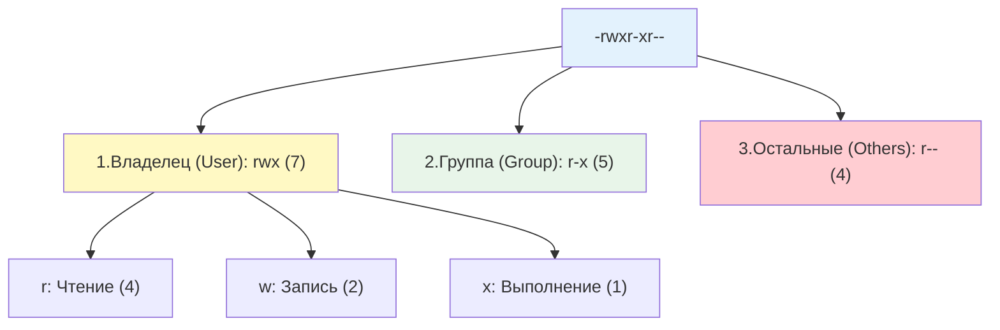

## Введение

Управление правами доступа к файлам и директориям — это краеугольный камень безопасности и стабильности любой Linux-системы. В отличие от Windows, где права часто наследуются сложными ACL-правилами, в Linux используется элегантная и предсказуемая модель, основанная на владельце, группе и специальных битах.

Для DevOps-инженера глубокое понимание этой модели критично: от настройки прав для веб-серверов и баз данных до обеспечения безопасности в Docker-контейнерах и предотвращения случайного удаления критичных конфигураций.

> [!INFO] Связь с другими темами
> 
> - Права применяются к UID и GID, которые управляются через [[Synced/DevOps/Сетевое и системное администрирование/1. Операционные системы/1. Linux/8. Пользователи, группы, аутентификация/1. etc структуры.md | etc структуры]] и [[Synced/DevOps/Сетевое и системное администрирование/1. Операционные системы/1. Linux/8. Пользователи, группы, аутентификация/2. Управление учетными записями.md | управление учетными записями]].
> - Для ситуаций, где стандартных прав недостаточно, используются [[Synced/DevOps/Сетевое и системное администрирование/1. Операционные системы/1. Linux/8. Пользователи, группы, аутентификация/5. ACL.md | списки контроля доступа (ACL)]].
> - Выполнение команд с повышенными привилегиями для изменения прав регулируется [[Synced/DevOps/Сетевое и системное администрирование/1. Операционные системы/1. Linux/8. Пользователи, группы, аутентификация/4. Sudo.md | Sudo]].

## 1. Стандартная модель прав (rwx)

Каждый файл и директория в Linux имеют владельца (User/Owner) и группу (Group). Права делятся на три категории по 3 бита каждая.



### Значение прав для файлов и директорий

|Право|Символ|Число|Для файла|Для директории|
|---|---|---|---|---|
|**Read**|`r`|4|Чтение содержимого файла|Просмотр списка файлов (`ls`)|
|**Write**|`w`|2|Изменение содержимого файла|Создание, удаление, переименование файлов внутри|
|**Execute**|`x`|1|Запуск файла как программы или скрипта|Вход в директорию (`cd`) и доступ к её inode|

> [!WARNING] Важный нюанс директорий
> Чтобы удалить файл в директории, пользователю нужно право `w` (запись) **и** `x` (выполнение) на саму директорию, а не на файл. Право `w` на файл не позволяет его удалить, если нет `w` на родительскую директорию.

## 2. Изменение прав и владельцев: chmod, chown, chgrp

### Символьный режим (chmod)

Удобно для точечных изменений без необходимости высчитывать числа.

```bash
# Добавить право на выполнение владельцу и группе
chmod ug+x script.sh

# Убрать право на запись для всех остальных
chmod o-w config.txt

# Установить точные права: владелец rwx, группа r-x, остальные ---
chmod u=rwx,g=rx,o=--- app.bin
# или сокращенно:
chmod 750 app.bin
```