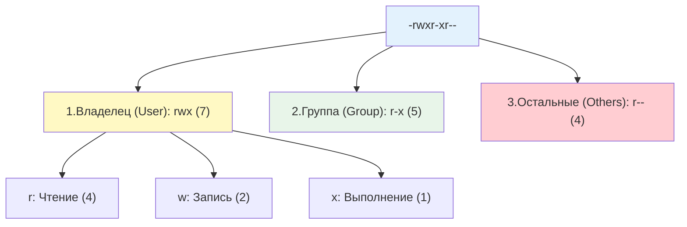

## Введение

Управление правами доступа к файлам и директориям — это краеугольный камень безопасности и стабильности любой Linux-системы. В отличие от Windows, где права часто наследуются сложными ACL-правилами, в Linux используется элегантная и предсказуемая модель, основанная на владельце, группе и специальных битах.

Для DevOps-инженера глубокое понимание этой модели критично: от настройки прав для веб-серверов и баз данных до обеспечения безопасности в Docker-контейнерах и предотвращения случайного удаления критичных конфигураций.

> [!INFO] Связь с другими темами
> 
> - Права применяются к UID и GID, которые управляются через [[Synced/DevOps/Сетевое и системное администрирование/1. Операционные системы/1. Linux/8. Пользователи, группы, аутентификация/1. etc структуры.md | etc структуры]] и [[Synced/DevOps/Сетевое и системное администрирование/1. Операционные системы/1. Linux/8. Пользователи, группы, аутентификация/2. Управление учетными записями.md | управление учетными записями]].
> - Для ситуаций, где стандартных прав недостаточно, используются [[Synced/DevOps/Сетевое и системное администрирование/1. Операционные системы/1. Linux/8. Пользователи, группы, аутентификация/5. ACL.md | списки контроля доступа (ACL)]].
> - Выполнение команд с повышенными привилегиями для изменения прав регулируется [[Synced/DevOps/Сетевое и системное администрирование/1. Операционные системы/1. Linux/8. Пользователи, группы, аутентификация/4. Sudo.md | Sudo]].

## 1. Стандартная модель прав (rwx)

Каждый файл и директория в Linux имеют владельца (User/Owner) и группу (Group). Права делятся на три категории по 3 бита каждая.



### Значение прав для файлов и директорий

|Право|Символ|Число|Для файла|Для директории|
|---|---|---|---|---|
|**Read**|`r`|4|Чтение содержимого файла|Просмотр списка файлов (`ls`)|
|**Write**|`w`|2|Изменение содержимого файла|Создание, удаление, переименование файлов внутри|
|**Execute**|`x`|1|Запуск файла как программы или скрипта|Вход в директорию (`cd`) и доступ к её inode|

> [!WARNING] Важный нюанс директорий
> Чтобы удалить файл в директории, пользователю нужно право `w` (запись) **и** `x` (выполнение) на саму директорию, а не на файл. Право `w` на файл не позволяет его удалить, если нет `w` на родительскую директорию.

## 2. Изменение прав и владельцев: chmod, chown, chgrp

### Символьный режим (chmod)

Удобно для точечных изменений без необходимости высчитывать числа.

```bash
# Добавить право на выполнение владельцу и группе
chmod ug+x script.sh

# Убрать право на запись для всех остальных
chmod o-w config.txt

# Установить точные права: владелец rwx, группа r-x, остальные ---
chmod u=rwx,g=rx,o=--- app.bin
# или сокращенно:
chmod 750 app.bin
```

### Числовой (восьмеричный) режим (chmod)

![[chmod-20231121161213435.webp]]

```bash
# 755: rwxr-xr-x (часто для скриптов и веб-директорий)
chmod 755 /var/www/html

# 644: rw-r--r-- (стандарт для обычных файлов, например, конфигов)
chmod 644 /etc/nginx/nginx.conf

# 600: rw------- (строгие права, например, для приватных SSH-ключей)
chmod 600 ~/.ssh/id_rsa
```

### Смена владельца и группы (chown, chgrp)

```bash
# Изменить только владельца
chown alice file.txt

# Изменить владельца и группу одновременно (через двоеточие или точку)
chown alice:developers file.txt

# Рекурсивное изменение для директории и всего её содержимого
chown -R www-data:www-data /var/www/html

# Изменить только группу (аналог chgrp)
chown :developers file.txt
```

## 3. Специальные биты прав (SUID, SGID, Sticky Bit)

Эти биты добавляют четвертую цифру к восьмеричному представлению прав (например, `4755`).

### SUID (4) — Set User ID

- **Применяется к**: Исполняемым файлам.
- **Эффект**: При запуске файла процесс получает эффективный UID (EUID) владельца файла, а не того, кто его запустил.
- **Пример**: `/usr/bin/passwd`. Файл принадлежит `root`. Обычный пользователь запускает его, чтобы изменить свой пароль. Благодаря SUID, процесс временно получает права `root` для записи в `/etc/shadow`.
- **Отображение**: `rwsr-xr-x` (строчная `s`, если есть `x`; заглавная `S`, если `x` нет).

```bash
chmod u+s file.txt
```

### SGID (2) — Set Group ID

- **Применяется к**: Исполняемым файлам и директориям.
- **Эффект для файлов**: Процесс запускается с правами группы владельца файла.
- **Эффект для директорий (КРИТИЧНО ВАЖНО)**: Все новые файлы и поддиректории, созданные внутри, автоматически наследуют группу этой директории, а не основную группу пользователя-создателя.
- **Пример**: Общая директория `/srv/shared` с группой `devops`. Любой участник группы создает там файл, и файл автоматически становится доступным для редактирования всей группе `devops`.
- **Отображение**: `rwxr-sr-x` (строчная `s` или заглавная `S`).

```bash
chmod g+s file.txt
```
### Sticky Bit (1) — Липкий бит

- **Применяется к**: Директориям (применение к файлам игнорируется современными ядрами).
- **Эффект**: Только владелец файла, владелец директории или `root` могут удалить или переименовать файл внутри этой директории, даже если у других пользователей есть права на запись в эту директорию.
- **Пример**: Директория `/tmp` (`drwxrwxrwt`). Пользователь `alice` не может удалить файл, созданный пользователем `bob`, несмотря на полные права `rwx` для всех.
- **Отображение**: `rwxrwxrwt` (строчная `t` или заглавная `T`).

```bash
chmod +t file.txt
# или на остальных пользователей
chmod o+t file.txt
```

## 4. Umask: формирование прав по умолчанию

Когда создается новый файл или директория, система назначает им права по умолчанию. Это значение рассчитывается как: `Базовые права - Umask`.

- Базовые права для директорий: `777` (rwxrwxrwx)
- Базовые права для файлов: `666` (rw-rw-rw-) — файлы не создаются исполняемыми по соображениям безопасности.

```bash
# Просмотр текущей umask
umask
# Вывод: 0022 (первый ноль относится к специальным битам)

# Расчет прав для новой директории: 777 - 022 = 755 (rwxr-xr-x)
# Расчет прав для нового файла: 666 - 022 = 644 (rw-r--r--)
```

### Изменение umask

```bash
# Временное изменение в текущей сессии
umask 027
# Теперь новые файлы будут создаваться с правами 640 (rw-r-----)

# Постоянное изменение для пользователя
echo "umask 027" >> ~/.bashrc

# Для системных сервисов (systemd)
# В файле .service добавить:
# UMask=0027
```

>[!TIP] Безопасная umask
>Значение `027` или `077` считается хорошей практикой для серверов, так как оно запрещает доступ к новым файлам и директориям для пользователей, не входящих в группу владельца.

## 5. Расширенные атрибуты файлов (chattr, lsattr)

Помимо стандартных прав, файловые системы (ext4, xfs) поддерживают флаги атрибутов, которые работают на уровне ядра и могут ограничивать даже пользователя `root`.

```bash
# Просмотр атрибутов файла
lsattr file.txt

# Установка атрибута "неизменяемый" (immutable)
# Запрещает удаление, переименование, запись и создание жестких ссылок
chattr +i /etc/resolv.conf

# Установка атрибута "только добавление" (append-only)
# Позволяет только дописывать данные в конец файла (идеально для логов)
chattr +a /var/log/secure

# Снятие атрибутов
chattr -i /etc/resolv.conf
chattr -a /var/log/secure
```

>[!WARNING] Использование в контейнерах
>Атрибут `+i` может вызвать проблемы при обновлении пакетов или работе некоторых приложений внутри Docker-контейнеров, так как они не смогут перезаписать защищенные файлы.

## 6. Практические сценарии для DevOps

### Сценарий 1: Настройка безопасной общей директории для CI/CD артефактов

Задача: создать директорию `/opt/artifacts`, где сервисы `jenkins` и `gitlab-runner` могут совместно работать с файлами, но посторонние пользователи не имеют доступа.

```bash
# 1. Создать общую группу
groupadd cicd-shared

# 2. Добавить пользователей в группу
usermod -aG cicd-shared jenkins
usermod -aG cicd-shared gitlab-runner

# 3. Создать директорию и назначить группу
mkdir -p /opt/artifacts
chown root:cicd-shared /opt/artifacts

# 4. Установить права: 2770
# 2 (SGID): новые файлы наследуют группу cicd-shared
# 7 (rwx): владелец (root) имеет полный доступ
# 7 (rwx): группа (cicd-shared) имеет полный доступ
# 0 (---): остальные не имеют доступа
chmod 2770 /opt/artifacts

# Проверка
ls -ld /opt/artifacts
# drwxrws--- 2 root cicd-shared 4096 ... /opt/artifacts
```