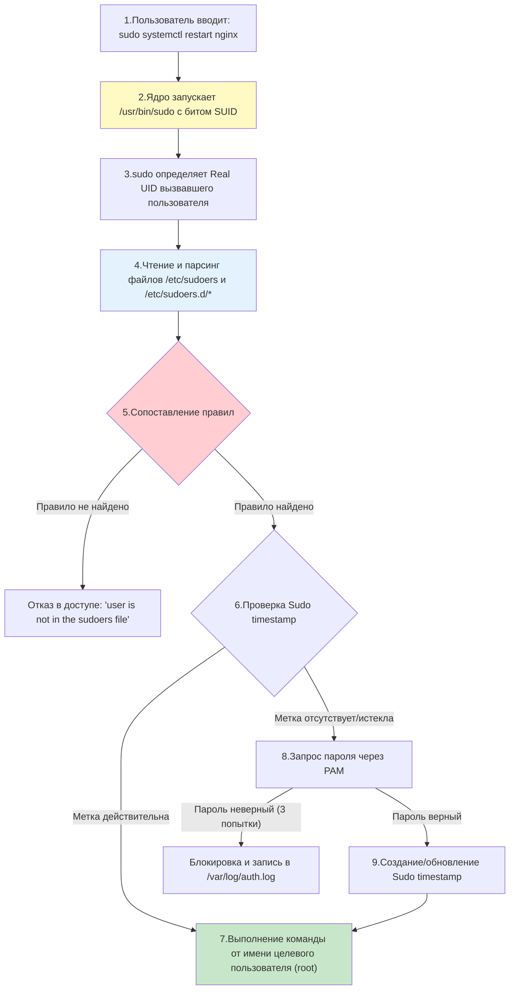

## Введение

**sudo** (Superuser Do) — это фундаментальный механизм делегирования привилегий в Linux. Вместо того чтобы давать пользователям пароль суперпользователя (`root`) или переключаться на него через `su`, `sudo` позволяет гибко и аудиторски контролируемо предоставлять права на выполнение конкретных команд от имени других пользователей.

Для DevOps-инженера понимание внутреннего устройства `sudo` критично для безопасной настройки серверов, автоматизации развертывания (где скрипты должны выполняться с повышенными правами) и расследования инцидентов безопасности.

> [!INFO] Связь с другими темами
> 
> - `sudo` проверяет [[Synced/DevOps/Глоссарий.md#UID (User Identifier) | UID]] и [[Synced/DevOps/Глоссарий.md#GID (Group Identifier) | GID]] вызывающего пользователя, которые определены в [[Synced/DevOps/Сетевое и системное администрирование/1. Операционные системы/1. Linux/8. Пользователи, группы, аутентификация/1. etc структуры.md | etc структурах]].
> - Процесс аутентификации при запросе пароля делегируется подсистеме [[Synced/DevOps/Сетевое и системное администрирование/1. Операционные системы/1. Linux/8. Пользователи, группы, аутентификация/6. PAM.md | PAM]].
> - Сам исполняемый файл `/usr/bin/sudo` имеет установленный бит [[Synced/DevOps/Глоссарий.md#SUID (Set User ID) | SUID]], что позволяет ему временно получать права [[Synced/DevOps/Глоссарий.md#UID (User Identifier) | UID]] 0 (root) для проверки правил и выполнения команд.

## 1. Теория работы: механизм выполнения sudo

Когда пользователь вводит команду с префиксом `sudo`, происходит сложный многоэтапный процесс, который можно разделить на следующие шаги:



### Ключевые теоретические нюансы:

1. **SUID-бит**: Файл `/usr/bin/sudo` принадлежит `root` и имеет бит [[Synced/DevOps/Глоссарий.md#SUID (Set User ID) | SUID]]. Это позволяет обычному пользователю запустить его с [[Synced/DevOps/Глоссарий.md#Effective UID (EUID) / Effective GID (EGID) | EUID]] = 0, чтобы программа могла прочитать защищенный файл `/etc/sudoers` и выполнить команду от имени root.
2. **Порядок обработки правил (Last Match Wins)**: `sudo` читает правила сверху вниз. Если пользователь входит в несколько групп, и для него подходят несколько правил, **применяется последнее совпавшее правило**. Это критически важно при проектировании иерархии прав.
3. **Сброс окружения**: По умолчанию `sudo` сбрасывает большинство переменных окружения вызывающего пользователя (например, `$PATH`, `$HOME`) в целях безопасности, заменяя их на безопасные значения целевого пользователя.

## 2. Синтаксис файла sudoers

Файл `/etc/sudoers` имеет строгий формат. Каждая строка правила описывается следующей схемой:

```
who where=(as_whom) [NOPASSWD:|PASSWD:] what
```

### Таблица компонентов правила sudoers

| Компонент   | Описание                                                                                                              | Примеры                                                           |
| ----------- | --------------------------------------------------------------------------------------------------------------------- | ----------------------------------------------------------------- |
| **who**     | Пользователь или группа (группы описываются с префиксом `%`), к которым применяется правило.                          | `alice`, `%developers`, `User_Alias ADMINS`                       |
| **where**   | Список хостов, с которых разрешено выполнение. `ALL` означает любой хост. Полезно для единого файла на всех серверах. | `ALL`, `webserver01`, `Host_Alias WEBS`                           |
| **as_whom** | Пользователь (или группа с префиксом `:`), от имени которого будет выполнена команда. По умолчанию `root`.            | `(root)`, `(www-data)`, `(:developers)`                           |
| **Теги**    | Модификаторы поведения. `NOPASSWD:` отменяет запрос пароля, `PASSWD:` (по умолчанию) требует его.                     | `NOPASSWD:`, `SETENV:` (разрешает сохранять переменные окружения) |
| **what**    | Абсолютный путь к разрешенным командам. `ALL` разрешает всё.                                                          | `/usr/bin/systemctl restart nginx`, `ALL`                         |
### Примеры правил

```
# 1. Пользователь alice может перезапускать nginx от имени root на любом хосте без пароля
alice ALL=(root) NOPASSWD: /usr/bin/systemctl restart nginx, /usr/bin/systemctl status nginx

# 2. Группа developers может выполнять любые команды от имени пользователя www-data
%developers ALL=(www-data) ALL

# 3. Запрет конкретной команды (использование !)
%admins ALL=(ALL) ALL
%admins ALL=(ALL) NOPASSWD: !/usr/bin/vim /etc/shadow
```

>[!WARNING] Правило запрета команды
>Правило должно идти ПОСЛЕ разрешающего правила, так как работает принцип "последнее совпадение"

> [!WARNING] Опасность отрицания (`!`)
> Использование `!` для запрета команд небезопасно. Например, запрет `/usr/bin/vim /etc/shadow` можно обойти, если пользователь запустит `sudo vim`, а затем внутри vim выполнит `:!/bin/bash`. Запрещать следует целые классы программ или использовать строгие списки разрешения (allowlist).

## 3. Управление файлом sudoers: visudo

Никогда не редактируйте `/etc/sudoers` обычными текстовыми редакторами (`nano`, `vim` напрямую). Используйте [[Synced/DevOps/Глоссарий.md#visudo | visudo]].

### Почему visudo критически важен:

1. **Блокировка (Locking)**: Предотвращает одновременное редактирование файла несколькими администраторами, создавая файл `.sudoers.tmp`.
2. **Проверка синтаксиса**: Перед сохранением `visudo` парсит файл. Если найдена ошибка, он показывает номер строки и не дает сохранить файл, предотвращая ситуацию, когда _ни один_ пользователь (включая root) не может использовать `sudo`.

```bash
# Открыть основной файл
visudo

# Открыть файл из директории sudoers.d (рекомендуемый способ для модульности)
visudo -f /etc/sudoers.d/99-custom-rules

# Проверка синтаксиса без открытия редактора
visudo -c
# Вывод: /etc/sudoers: parsed OK
```

### Директория `/etc/sudoers.d/`

Современная best practice — не трогать основной `/etc/sudoers`, а создавать отдельные файлы в `/etc/sudoers.d/`

- Имена файлов не должны содержать точки (кроме суффиксов, игнорируемых sudo, но лучше использовать просто буквы и цифры, например, `10-devops`).
- Файлы читаются в лексикографическом порядке. Файл `99-override` будет прочитан после `10-basics`, и его правила перезапишут предыдущие (принцип Last Match Wins).

## 4. Переменные окружения и sudo

По умолчанию `sudo` очищает окружение. Это контролируется директивой `Defaults` в файле `sudoers`.

### Таблица ключевых директив Defaults

|Директива|Описание|Пример использования|
|---|---|---|
|`env_reset`|(Включена по умолчанию) Сбрасывает окружение к минимальному безопасному набору.|`Defaults env_reset`|
|`env_keep`|Список переменных, которые **не** будут удалены при сбросе.|`Defaults env_keep += "HTTP_PROXY HTTPS_PROXY"`|
|`env_check`|Переменные, которые сохраняются, только если они не содержат опасные символы (например, `=` или `%`).|`Defaults env_check += "TERM"`|
|`secure_path`|Жестко задает безопасный `$PATH` для выполняемых команд, игнорируя `$PATH` пользователя.|`Defaults secure_path="/usr/local/sbin:/usr/local/bin:/usr/sbin:/usr/bin:/sbin:/bin"`|
|`!requiretty`|Разрешает выполнение sudo без наличия реального TTY (терминала). Критично для автоматизации (Ansible, CI/CD).|`Defaults:jenkins !requiretty`|

### Практический пример сохранения переменных

Если вашему приложению нужны специфические переменные окружения при запуске через sudo:

```
Defaults env_keep += "MY_APP_ENV MY_APP_CONFIG"
```

## 5. Механизм Sudo timestamp

Чтобы не запрашивать пароль при каждой команде, `sudo` использует механизм кэширования аутентификации.

- При успешном вводе пароля создается файл метки времени (обычно в `/run/sudo/ts/<UID>` или `/var/db/sudo/`).
- По умолчанию метка действительна **15 минут**.
- Если в течение 15 минут выполняется новая команда `sudo`, таймер сбрасывается, и пароль не запрашивается.
- Если прошло более 15 минут, пароль запрашивается снова.

### Управление timestamp

```bash
# Проверить, есть ли действующая метка для текущего пользователя
sudo -v
# Если метка есть, команда завершится молча (код 0). Если нет, запросит пароль.

# Принудительно аннулировать (удалить) метку времени
sudo -k
# Следующая команда sudo гарантированно запросит пароль.

# Удалить метки времени для всех пользователей (требует прав root)
sudo -K
```

### Изменение времени жизни метки

```
# В файле /etc/sudoers.d/timeout-settings:
# Установить время жизни метки в 5 минут (300 секунд)
Defaults timestamp_timeout=5

# Требовать пароль ВСЕГДА (отключить кэширование)
Defaults timestamp_timeout=0
```

## 6. Неочевидные сценарии и теория групп

### Сценарий: Пользователь в нескольких группах

Допустим, пользователь `alice` состоит в группах `developers` и `security`. В файлах `sudoers` есть два правила:

1. `%developers ALL=(ALL) ALL`
2. `%security ALL=(ALL) NOPASSWD: ALL`

**Как это работает:** `sudo` читает файлы в алфавитном порядке. Если правило для `%security` находится в файле `20-security`, а для `%developers` в `10-developers`, то правило `%security` будет прочитано **последним**. Поскольку `alice` состоит в обеих группах, к ней применяются оба правила, но побеждает **последнее совпавшее**. В данном случае она сможет выполнять команды без пароля.

> [!TIP] Best practice
> Всегда размещайте наиболее специфичные и разрешающие правила (например, для отдельных пользователей или привилегированных групп) в файлах с более высокими номерами (например, `99-exceptions`), чтобы они гарантированно переопределяли базовые ограничения.

### Сценарий: Выполнение команды от имени не-root пользователя

Часто веб-сервисам нужно выполнять команды от имени сервисного аккаунта (например, `www-data`), а не `root`.

```
# Разрешить пользователю deploy запускать скрипт от имени www-data
deploy ALL=(www-data) NOPASSWD: /opt/app/bin/migrate.sh
```

Выполнение: `sudo -u www-data /opt/app/bin/migrate.sh`

## 7. Практические сценарии для DevOps

### Сценарий 1: Настройка sudo для Ansible (без пароля, с сохранением PATH)

Ansible часто подключается к серверам под обычным пользователем и использует `become: yes` (что вызывает `sudo`). Для этого требуется корректная настройка.

```
# /etc/sudoers.d/10-ansible
# 1. Отключаем требование tty для пользователя ansible
Defaults:ansible !requiretty

# 2. Сохраняем переменные окружения, необходимые для работы (например, прокси или пути)
Defaults:ansible env_keep += "PATH HTTP_PROXY HTTPS_PROXY NO_PROXY"

# 3. Разрешаем пользователю ansible выполнять любые команды от любого пользователя без пароля
ansible ALL=(ALL) NOPASSWD: ALL
```

### Сценарий 2: Аудит использования sudo

Все успешные и неуспешные попытки использования `sudo` логируются. В Debian/Ubuntu это `/var/log/auth.log`, в RHEL/CentOS — `/var/log/secure`.

```bash
# Просмотр всех успешных выполнений sudo
grep "sudo:" /var/log/auth.log | grep "COMMAND="

# Поиск неудачных попыток (неверный пароль или отсутствие прав)
grep "sudo:" /var/log/auth.log | grep -i "incorrect password\|not in sudoers"

# Просмотр команд, выполненных конкретным пользователем
grep "sudo:" /var/log/auth.log | grep "user=alice"
```

## 8. Troubleshooting и типичные проблемы

|Проблема|Причина|Решение|
|---|---|---|
|`user is not in the sudoers file. This incident will be reported.`|Для пользователя или его групп нет разрешающего правила в `sudoers`, или правило написано с ошибкой в имени.|Проверить членство в группах (`groups user`). Проверить синтаксис и порядок правил через `sudo -l`.|
|`sudo: no tty present and no askpass program specified`|Скрипт или система автоматизации (Ansible, CI) пытается вызвать `sudo`, требующий пароль, но без интерактивного терминала.|Добавить `NOPASSWD:` в правило для этого пользователя или использовать `Defaults:username !requiretty`.|
|Команда выполняется, но не находит исполняемый файл (`command not found`)|Директива `secure_path` в `sudoers` переопределяет `$PATH`, и путь к команде в него не входит.|Добавить нужный путь в `secure_path` или использовать абсолютный путь к команде в правиле `sudoers` и при её вызове.|
|После редактирования `sudo` перестал работать у всех|Синтаксическая ошибка в `/etc/sudoers`, сохраненная обычным редактором без проверки.|Войти в recovery mode (или через консоль облачного провайдера) как root и исправить файл, либо использовать `pkexec visudo`.|

---

## Контрольные вопросы для самопроверки

1. Почему исполняемый файл `/usr/bin/sudo` должен иметь установленный бит [[Synced/DevOps/Глоссарий.md#SUID (Set User ID) | SUID]], и какую роль это играет в процессе проверки прав?
2. Объясните принцип "Last Match Wins" в файле `sudoers`. Как это влияет на пользователя, состоящего одновременно в группах `admins` и `developers`, если для этих групп заданы конфликтующие правила?
3. В чем заключается опасность использования оператора отрицания (`!`) в списке разрешенных команд (например, `! /bin/bash`)?
4. Какую функцию выполняет утилита [[Synced/DevOps/Глоссарий.md#visudo | visudo]], и почему её использование является обязательным, а не рекомендательным?
5. Как настроить `sudo` так, чтобы конкретный пользователь мог выполнять команды без ввода пароля, но при этом у него сохранялись определенные переменные окружения (например, `HTTP_PROXY`)?
6. Что произойдет, если пользователь введет команду `sudo -k`, и в каком сценарии автоматизации это может быть полезно?
7. Почему команда `sudo vim /etc/shadow` может быть опасной, даже если в `sudoers` разрешен только `vim`, но не указан конкретный файл?

---

#linux #sysadmin #sudo #sudoers #visudo #security #devops #access-control #privilege-escalation #automation #ansible #troubleshooting