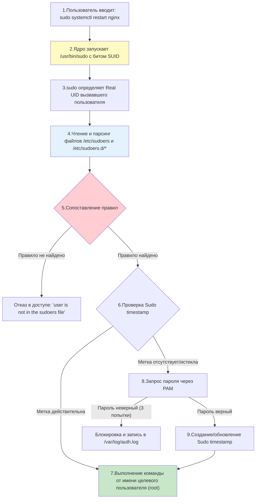

## Введение

**sudo** (Superuser Do) — это фундаментальный механизм делегирования привилегий в Linux. Вместо того чтобы давать пользователям пароль суперпользователя (`root`) или переключаться на него через `su`, `sudo` позволяет гибко и аудиторски контролируемо предоставлять права на выполнение конкретных команд от имени других пользователей.

Для DevOps-инженера понимание внутреннего устройства `sudo` критично для безопасной настройки серверов, автоматизации развертывания (где скрипты должны выполняться с повышенными правами) и расследования инцидентов безопасности.

> [!INFO] Связь с другими темами
> 
> - `sudo` проверяет [[Synced/DevOps/Глоссарий.md#UID (User Identifier) | UID]] и [[Synced/DevOps/Глоссарий.md#GID (Group Identifier) | GID]] вызывающего пользователя, которые определены в [[Synced/DevOps/Сетевое и системное администрирование/1. Операционные системы/1. Linux/8. Пользователи, группы, аутентификация/1. etc структуры.md | etc структурах]].
> - Процесс аутентификации при запросе пароля делегируется подсистеме [[Synced/DevOps/Сетевое и системное администрирование/1. Операционные системы/1. Linux/8. Пользователи, группы, аутентификация/6. PAM.md | PAM]].
> - Сам исполняемый файл `/usr/bin/sudo` имеет установленный бит [[Synced/DevOps/Глоссарий.md#SUID (Set User ID) | SUID]], что позволяет ему временно получать права [[Synced/DevOps/Глоссарий.md#UID (User Identifier) | UID]] 0 (root) для проверки правил и выполнения команд.

## 1. Теория работы: механизм выполнения sudo

Когда пользователь вводит команду с префиксом `sudo`, происходит сложный многоэтапный процесс, который можно разделить на следующие шаги:

### Ключевые теоретические нюансы:

1. **SUID-бит**: Файл `/usr/bin/sudo` принадлежит `root` и имеет бит [[Synced/DevOps/Глоссарий.md#SUID (Set User ID) | SUID]]. Это позволяет обычному пользователю запустить его с [[Synced/DevOps/Глоссарий.md#Effective UID (EUID) / Effective GID (EGID) | EUID]] = 0, чтобы программа могла прочитать защищенный файл `/etc/sudoers` и выполнить команду от имени root.
2. **Порядок обработки правил (Last Match Wins)**: `sudo` читает правила сверху вниз. Если пользователь входит в несколько групп, и для него подходят несколько правил, **применяется последнее совпавшее правило**. Это критически важно при проектировании иерархии прав.
3. **Сброс окружения**: По умолчанию `sudo` сбрасывает большинство переменных окружения вызывающего пользователя (например, `$PATH`, `$HOME`) в целях безопасности, заменяя их на безопасные значения целевого пользователя.