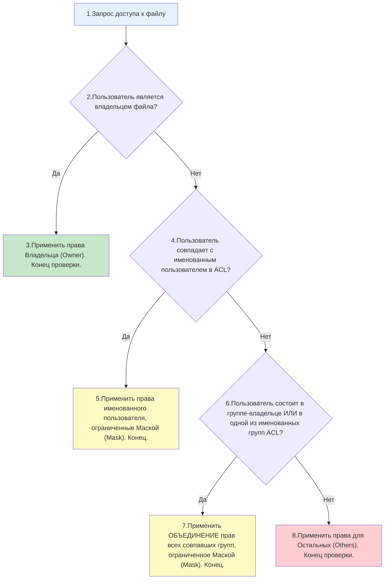

## Введение

Стандартная модель прав Linux (`rwx` для владельца, группы и остальных), подробно разобранная в теме [[Synced/DevOps/Сетевое и системное администрирование/1. Операционные системы/1. Linux/8. Пользователи, группы, аутентификация/3. Управление правами для файлов и директорий.md | Управление правами для файлов и директорий]], является простой и эффективной, но иногда её недостаточно.

Что делать, если нужно дать право на запись в файл конкретному пользователю `alice`, но при этом нельзя делать её владельцем файла и нежелательно добавлять её в основную группу этого файла? Именно для решения таких задач существуют **ACL (Access Control Lists)**. Они позволяют назначать права произвольному количеству конкретных пользователей и групп для одного объекта файловой системы.

> [!INFO] Связь с другими темами
> 
> - ACL расширяет стандартную модель, опираясь на [[Synced/DevOps/Глоссарий.md#UID (User Identifier) | UID]] и [[Synced/DevOps/Глоссарий.md#GID (Group Identifier) | GID]], управляемые через [[Synced/DevOps/Сетевое и системное администрирование/1. Операционные системы/1. Linux/8. Пользователи, группы, аутентификация/1. etc структуры.md | etc структуры]].
> - Для предоставления прав на выполнение команд с повышенными привилегиями используется [[Synced/DevOps/Сетевое и системное администрирование/1. Операционные системы/1. Linux/8. Пользователи, группы, аутентификация/4. Sudo.md | Sudo]], который работает независимо от ACL файлов.

## 1. Теория: Механизм оценки прав ядром Linux

Когда процесс пытается получить доступ к файлу, защищенному ACL, ядро Linux проверяет права в строго определенном порядке. **Проверка останавливается на первом совпадении.**



### Критически важная роль Маски (Mask)

Маска — это самая частая причина недопонимания при работе с ACL. Она **не является отдельным набором прав**, а действует как фильтр. Если пользователю выданы права `rwx`, но маска установлена в `r-x`, то **фактические права** этого пользователя будут `r-x`. Маска устанавливает максимальные права

> [!WARNING] Взаимодействие chmod и ACL
> При использовании стандартной команды `chmod` для изменения прав группы владельца файла, Linux автоматически изменяет **Маску ACL** на новое значение. И наоборот: изменение маски через `setfacl` меняет права группы владельца в стандартном выводе `ls -l`.

## 2. Просмотр ACL: утилита getfacl

Стандартная команда `ls -l` показывает наличие ACL только символом `+` в конце строки прав (например, `-rw-rw-r--+`). Для детального просмотра используется `getfacl`.

```bash
# Просмотр ACL файла
getfacl /etc/nginx/nginx.conf

# Пример вывода:
# file: etc/nginx/nginx.conf
# owner: root
# group: root
user::rw-
user:alice:rw-
group::r--
group:developers:r--
mask::rw-
other::r--
```

### Разбор полей вывода getfacl

| Поле         | Описание                                                         | Аналог в стандартных правах           |
| ------------ | ---------------------------------------------------------------- | ------------------------------------- |
| `user::`     | Права владельца файла                                            | Владелец (Owner)                      |
| `user:имя:`  | Права конкретного именованного пользователя                      | Нет аналога (специфика ACL)           |
| `group::`    | Права группы-владельца файла                                     | Группа (Group)                        |
| `group:имя:` | Права конкретной именованной группы                              | Нет аналога (специфика ACL)           |
| `mask::`     | Максимально допустимые права для user:имя:, group:: и group:имя: | Отражается как права группы в `ls -l` |
| `other::`    | Права для всех остальных                                         | Остальные (Others)                    |
## 3. Управление ACL: утилита setfacl

Синтаксис команды: `setfacl [опции] правила файл...`

### Таблица целевых объектов правил

|Префикс|Цель|Пример|Описание|
|---|---|---|---|
|`u`|Пользователь|`u:alice:rw-`|Задает права для пользователя `alice`|
|`g`|Группа|`g:devops:r-x`|Задает права для группы `devops`|
|`o`|Остальные|`o::r--`|Задает права для остальных (аналог `chmod o+r`)|
|`m`|Маска|`m::r-x`|Ограничивает максимальные эффективные права|
|`d`|Default|`d:u:bob:rwx`|Применяется только к директориям (наследование)|

### Основные сценарии использования

```bash
# 1. Предоставить пользователю alice права на чтение и запись
setfacl -m u:alice:rw /var/log/app.log

# 2. Предоставить группе developers полные права на директорию
setfacl -m g:developers:rwx /srv/shared

# 3. Изменить маску (ограничить максимальные права для всех именованных записей до r-x)
setfacl -m m::rx /srv/shared

# 4. Удалить конкретное правило ACL (например, для пользователя alice)
setfacl -x u:alice /var/log/app.log

# 5. Полностью очистить все расширенные ACL (оставить только стандартные rwx)
setfacl -b /var/log/app.log

# 6. Рекурсивное применение ACL к директории и всем существующим файлам внутри
setfacl -R -m g:devops:rwx /opt/project
```

## 4. Default ACL: Наследование прав в директориях

Это мощнейший инструмент для организации совместной работы. **Default ACL** не дает прав доступа к самой директории, но служит шаблоном для всего, что будет создано внутри неё.

```bash
# Задача: сделать так, чтобы все новые файлы в /srv/shared автоматически 
# получали права rwx для группы developers и rw для пользователя auditor.

# 1. Устанавливаем Default ACL (флаг -d)
setfacl -d -m g:developers:rwx /srv/shared
setfacl -d -m u:auditor:rw /srv/shared

# 2. Проверяем результат
getfacl /srv/shared

# Пример вывода:
# file: srv/shared
# owner: root
# group: root
user::rwx
group::r-x
other::r-x
default:user::rwx
default:user:auditor:rw-
default:group::r-x
default:group:developers:rwx
default:mask::rwx
default:other::r-x
```

>[!TIP] Важный нюанс
>При создании нового файла внутри такой директории, его права будут формироваться как: `(Права по умолчанию umask) И (Default ACL) И (Маска Default ACL)`.

