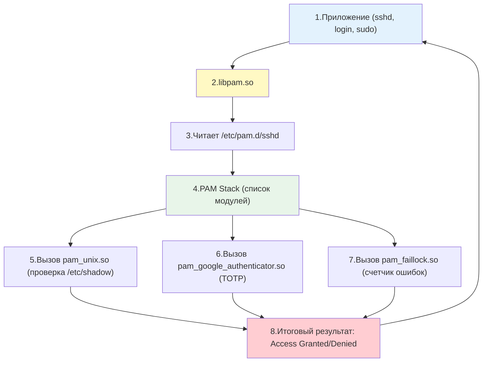

## Введение

**PAM (Pluggable Authentication Modules)** — это архитектура, которая решает фундаментальную проблему: как сделать так, чтобы приложениям (`login`, `sshd`, `sudo`, `passwd`) не нужно было "знать", как проверять пароли, работать с LDAP, двухфакторной аутентификацией или биометрией. PAM разделяет эти ответственности, предоставляя единый программный интерфейс (API), через который приложение запрашивает проверку подлинности, а конкретный механизм проверки определяется конфигурацией системы.

До появления PAM каждая программа (например, `login` или `sshd`) содержала в себе жестко зашитый код проверки паролей через `/etc/shadow`. С PAM приложения просто обращаются к библиотеке `libpam`, которая в свою очередь читает конфигурационные файлы и вызывает нужные модули. Это позволяет:

- Внедрить двухфакторную аутентификацию (TOTP, YubiKey) для SSH без изменения кода `sshd`.
- Ограничить вход по времени суток или IP-адресам.
- Автоматически блокировать аккаунты при брутфорс-атаках.
- Интегрироваться с LDAP, Active Directory или FreeIPA.

Для DevOps-инженера понимание PAM критически важно, потому что:

- Именно PAM управляет политикой блокировок после неудачных попыток входа (brute-force protection).
- PAM определяет, требуется ли двухфакторная аутентификация.
- Через PAM реализуется интеграция с корпоративными каталогами ([[Synced/DevOps/Сетевое и системное администрирование/1. Операционные системы/1. Linux/18. Домен контроллеры/2. FreeIPA.md | FreeIPA]], LDAP, Kerberos).
- Ошибки в конфигурации PAM могут заблокировать доступ к серверу для всех пользователей, включая `root`.

> [!INFO] Связь с другими темами
> 
> - PAM взаимодействует с хэшами паролей в [[Synced/DevOps/Сетевое и системное администрирование/1. Операционные системы/1. Linux/8. Пользователи, группы, аутентификация/1. etc структуры.md | etc структурах]] (`/etc/shadow`).
> - Команда [[Synced/DevOps/Сетевое и системное администрирование/1. Операционные системы/1. Linux/8. Пользователи, группы, аутентификация/4. Sudo.md | sudo]] использует PAM для запроса пароля и проверки прав.
> - SSH-сервер `sshd` полагается на PAM для дополнительной аутентификации, что описано в [[Synced/DevOps/Сетевое и системное администрирование/1. Операционные системы/1. Linux/8. Пользователи, группы, аутентификация/7. SSH на уровне ОС.md | SSH на уровне ОС]].
> - Интеграция с корпоративными каталогами (например, [[Synced/DevOps/Сетевое и системное администрирование/1. Операционные системы/1. Linux/18. Домен контроллеры/2. FreeIPA.md | FreeIPA]]) работает через PAM-модули.

## 1. Архитектура PAM: как это работает изнутри

### Общая схема работы

### Ключевые директории

|Путь|Назначение|
|---|---|
|`/etc/pam.d/`|Директория с конфигурациями для каждого сервиса (`sshd`, `su`, `sudo`, `login`, `common-*`)|
|`/etc/pam.conf`|Устаревший единый конфигурационный файл (не рекомендуется)|
|`/lib/x86_64-linux-gnu/security/` или `/usr/lib64/security/`|Сами модули PAM в виде `.so` библиотек|
|`/etc/security/`|Дополнительные конфигурационные файлы для модулей (`limits.conf`, `access.conf`, `time.conf`)|