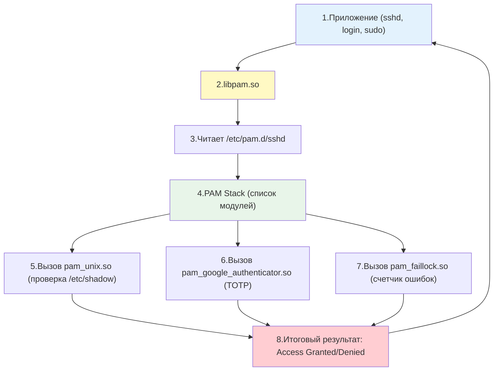
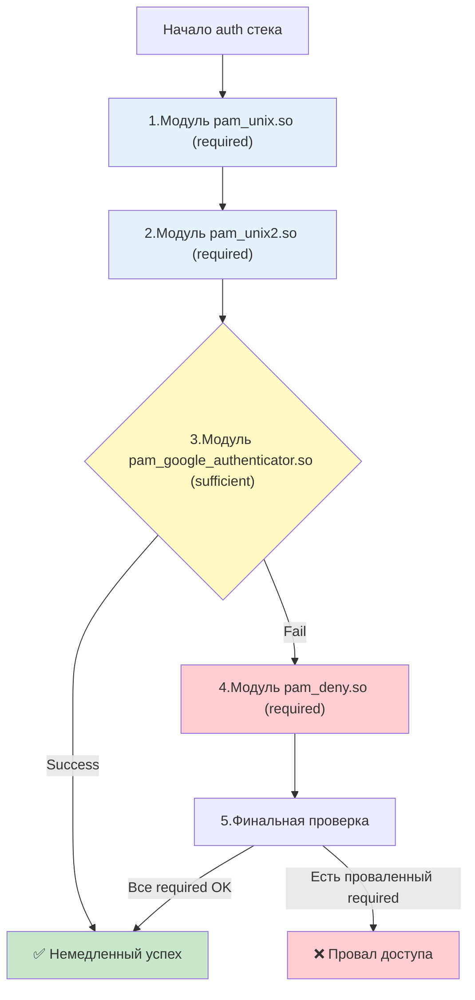

## Введение

**PAM (Pluggable Authentication Modules)** — это архитектура, которая решает фундаментальную проблему: как сделать так, чтобы приложениям (`login`, `sshd`, `sudo`, `passwd`) не нужно было "знать", как проверять пароли, работать с LDAP, двухфакторной аутентификацией или биометрией. PAM разделяет эти ответственности, предоставляя единый программный интерфейс (API), через который приложение запрашивает проверку подлинности, а конкретный механизм проверки определяется конфигурацией системы.

До появления PAM каждая программа (например, `login` или `sshd`) содержала в себе жестко зашитый код проверки паролей через `/etc/shadow`. С PAM приложения просто обращаются к библиотеке `libpam`, которая в свою очередь читает конфигурационные файлы и вызывает нужные модули. Это позволяет:

- Внедрить двухфакторную аутентификацию (TOTP, YubiKey) для SSH без изменения кода `sshd`.
- Ограничить вход по времени суток или IP-адресам.
- Автоматически блокировать аккаунты при брутфорс-атаках.
- Интегрироваться с LDAP, Active Directory или FreeIPA.

Для DevOps-инженера понимание PAM критически важно, потому что:

- Именно PAM управляет политикой блокировок после неудачных попыток входа (brute-force protection).
- PAM определяет, требуется ли двухфакторная аутентификация.
- Через PAM реализуется интеграция с корпоративными каталогами ([[Synced/DevOps/Сетевое и системное администрирование/1. Операционные системы/1. Linux/18. Домен контроллеры/2. FreeIPA.md | FreeIPA]], LDAP, Kerberos).
- Ошибки в конфигурации PAM могут заблокировать доступ к серверу для всех пользователей, включая `root`.

> [!INFO] Связь с другими темами
> 
> - PAM взаимодействует с хэшами паролей в [[Synced/DevOps/Сетевое и системное администрирование/1. Операционные системы/1. Linux/8. Пользователи, группы, аутентификация/1. etc структуры.md | etc структурах]] (`/etc/shadow`).
> - Команда [[Synced/DevOps/Сетевое и системное администрирование/1. Операционные системы/1. Linux/8. Пользователи, группы, аутентификация/4. Sudo.md | sudo]] использует PAM для запроса пароля и проверки прав.
> - SSH-сервер `sshd` полагается на PAM для дополнительной аутентификации, что описано в [[Synced/DevOps/Сетевое и системное администрирование/1. Операционные системы/1. Linux/8. Пользователи, группы, аутентификация/7. SSH на уровне ОС.md | SSH на уровне ОС]].
> - Интеграция с корпоративными каталогами (например, [[Synced/DevOps/Сетевое и системное администрирование/1. Операционные системы/1. Linux/18. Домен контроллеры/2. FreeIPA.md | FreeIPA]]) работает через PAM-модули.

## 1. Архитектура PAM: как это работает изнутри

### Общая схема работы



### Ключевые директории

| Путь                                                         | Назначение                                                                                    |
| ------------------------------------------------------------ | --------------------------------------------------------------------------------------------- |
| `/etc/pam.d/`                                                | Директория с конфигурациями для каждого сервиса (`sshd`, `su`, `sudo`, `login`, `common-*`)   |
| `/etc/pam.conf`                                              | Устаревший единый конфигурационный файл (не рекомендуется)                                    |
| `/lib/x86_64-linux-gnu/security/` или `/usr/lib64/security/` | Сами модули PAM в виде `.so` библиотек                                                        |
| `/etc/security/`                                             | Дополнительные конфигурационные файлы для модулей (`limits.conf`, `access.conf`, `time.conf`) |
## 2. Четыре группы управления (Management Groups)

Каждая строка в PAM-конфиге относится к одной из четырех групп, каждая из которых отвечает за свой этап жизненного цикла сессии пользователя.

### Таблица Management Groups

| Группа       | Назначение                                                                                                   | Когда вызывается                  | Пример модуля                                               |
| ------------ | ------------------------------------------------------------------------------------------------------------ | --------------------------------- | ----------------------------------------------------------- |
| **auth**     | Проверка подлинности пользователя (запрос и валидация пароля, токена)                                        | При попытке входа                 | `pam_unix.so`, `pam_unix.so`, `pam_google_authenticator.so` |
| **account**  | Проверка условий доступа (срок действия пароля, время суток, ограничение по хостам)                          | После успешного `auth`            | `pam_unix.so`, `pam_access.so`, `pam_time.so`               |
| **session**  | Настройка окружения при входе и очистка при выходе (монтирование домашних директорий, логирование, `ulimit`) | После успешных `auth` и `account` | `pam_limits.so`, `pam_systemd.so`, `pam_mkhomedir.so`       |
| **password** | Обновление пароля (при команде `passwd`)                                                                     | При смене пароля                  | `pam_unix.so`, `pam_pwquality.so`                           |
### Пример конфигурационного файла `/etc/pam.d/sshd`

```
# PAM configuration for SSH

# Включить общие настройки
@include common-auth
@include common-account
@include common-session
@include common-password

# Специфичные для SSH настройки
auth       required     pam_nologin.so
account    required     pam_nologin.so

# Ограничение доступа по группам
account    required     pam_access.so
```

## 3. Control Flags: логика обработки стека

Control flags определяют, как результат конкретного модуля влияет на итог всей цепочки. Это **самая сложная и важная часть понимания PAM**.

### Таблица Control Flags

| Флаг                         | Поведение при успехе                                                                            | Поведение при провале                                                                          | Использование                                                            |
| ---------------------------- | ----------------------------------------------------------------------------------------------- | ---------------------------------------------------------------------------------------------- | ------------------------------------------------------------------------ |
| **requisite**                | Продолжить выполнение                                                                           | **Немедленно вернуть провал**, не выполняя остальные модули                                    | Критические проверки (например, `pam_nologin.so`)                        |
| **required**                 | Продолжить выполнение                                                                           | Запомнить провал, но **продолжить** выполнение остальных модулей. Вернуть провал в самом конце | Обязательные проверки, где нужно выполнить все (например, `pam_unix.so`) |
| **sufficient**               | **Немедленно вернуть успех** (если предыдущие `required` не провалились), не выполняя остальные | Продолжить выполнение                                                                          | Альтернативные способы входа (например, вход по SSH-ключу или биометрии) |
| **optional**                 | Продолжить выполнение                                                                           | Продолжить выполнение                                                                          | Используется, только если это **единственный** модуль в группе           |
| **[success=ok default=die]** | Современный синтаксис (PAM v2). Позволяет точно задавать поведение через прыжки (jumps)         | Тонкая настройка логики                                                                        | Сложные конфигурации                                                     |

### Визуализация логики обработки



> [!TIP] Простое правило запоминания
> 
> - **required** = "должен пройти, но проверим всё"
> - **requisite** = "если провалится — стоп игра"
> - **sufficient** = "если пройдет — можно не проверять дальше"
> - **optional** = "запасной вариант, если больше ничего нет"

## 4. Популярные модули PAM и их применение

### `pam_unix.so` — классическая аутентификация

Стандартный модуль, проверяющий пароль по `/etc/shadow`.

```
auth       required     pam_unix.so nullok_secure
account    required     pam_unix.so
password   required     pam_unix.so sha512 shadow
```

### `pam_faillock.so` — защита от брутфорса

Современная замена устаревшему `pam_tally2`. Блокирует учетную запись после N неудачных попыток.

```
# Блокировка на 15 минут (900 секунд) после 5 неудачных попыток
auth       required     pam_faillock.so preauth silent deny=5 unlock_time=900
auth       [default=die] pam_faillock.so authfail deny=5 unlock_time=900
auth       sufficient   pam_unix.so nullok try_first_pass
auth       requisite    pam_deny.so
auth       required     pam_faillock.so authsucc deny=5 unlock_time=900
```