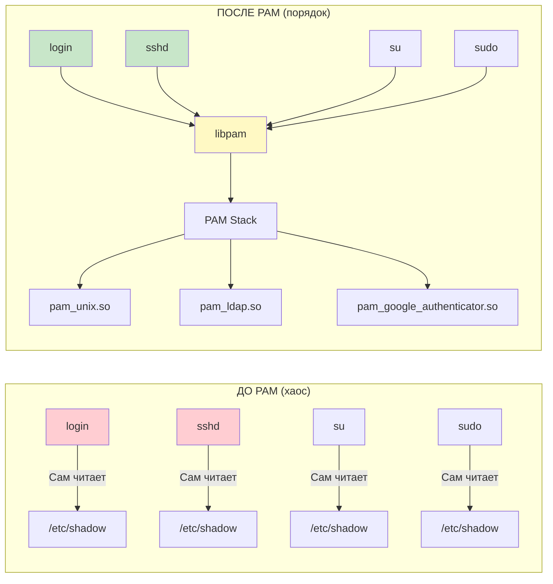
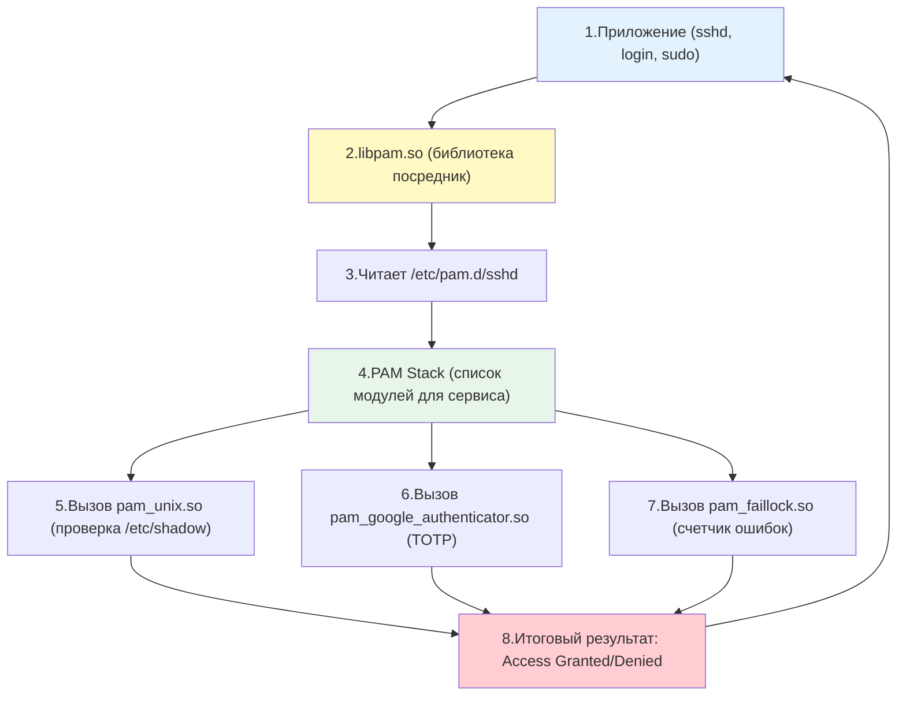
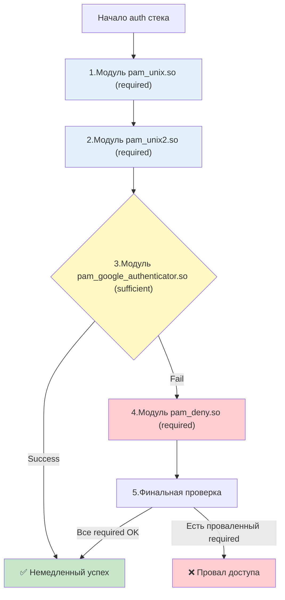

## Введение

**PAM (Pluggable Authentication Modules)** — это архитектура, которая решает фундаментальную проблему: как сделать так, чтобы приложениям (`login`, `sshd`, `sudo`, `passwd`) не нужно было "знать", как проверять пароли, работать с LDAP, двухфакторной аутентификацией или биометрией. PAM разделяет эти ответственности, предоставляя единый программный интерфейс (API), через который приложение запрашивает проверку подлинности, а конкретный механизм проверки определяется конфигурацией системы.

До появления PAM каждая программа (например, `login` или `sshd`) содержала в себе жестко зашитый код проверки паролей через `/etc/shadow`. Представьте Linux в 1990-х годах. У вас есть несколько программ, которым нужно проверять пароли:

- `login` — вход в консоль
- `sshd` — удаленный доступ по SSH
- `su` — переключение на другого пользователя
- `sudo` — выполнение команд с повышенными правами
- `passwd` — смена пароля

**Проблема**: каждая из этих программ **самостоятельно** читала файл `/etc/shadow`, сравнивала хэши паролей и принимала решение. Это означало:

1. Если вы хотели внедрить новую систему аутентификации (например, LDAP или смарт-карты), нужно было **переписать все программы** в системе.
2. Если вы хотели добавить двухфакторную аутентификацию — снова переписывать всё.
3. Если вы хотели ограничить вход по времени суток — опять переписывать.
4. Разные программы могли вести себя по-разному, создавая дыры в безопасности.

В 1995 году Sun Microsystems предложила PAM — идею **отделить логику аутентификации от приложений**. 



С PAM приложения просто обращаются к библиотеке `libpam`, которая в свою очередь читает конфигурационные файлы и вызывает нужные модули. Это позволяет:

- Внедрить двухфакторную аутентификацию (TOTP, YubiKey) для SSH без изменения кода `sshd`.
- Ограничить вход по времени суток или IP-адресам.
- Автоматически блокировать аккаунты при брутфорс-атаках.
- Интегрироваться с LDAP, Active Directory или FreeIPA.

**Ключевая идея**: программа (например, `sshd`) больше не знает, как проверять пароль. Она просто говорит библиотеке `libpam`: "Проверь пользователя alice". А `libpam` читает конфигурационный файл `/etc/pam.d/sshd`, где написано, какие модули и в каком порядке вызывать.

Для DevOps-инженера понимание PAM критически важно, потому что:

- Именно PAM управляет политикой блокировок после неудачных попыток входа (brute-force protection).
- PAM определяет, требуется ли двухфакторная аутентификация.
- Через PAM реализуется интеграция с корпоративными каталогами ([[Synced/DevOps/Сетевое и системное администрирование/1. Операционные системы/1. Linux/18. Домен контроллеры/2. FreeIPA.md | FreeIPA]], LDAP, Kerberos).
- Ошибки в конфигурации PAM могут заблокировать доступ к серверу для всех пользователей, включая `root`.


> [!INFO] Связь с другими темами
> 
> - PAM взаимодействует с хэшами паролей в [[Synced/DevOps/Сетевое и системное администрирование/1. Операционные системы/1. Linux/8. Пользователи, группы, аутентификация/1. etc структуры.md | etc структурах]] (`/etc/shadow`).
> - Команда [[Synced/DevOps/Сетевое и системное администрирование/1. Операционные системы/1. Linux/8. Пользователи, группы, аутентификация/4. Sudo.md | sudo]] использует PAM для запроса пароля и проверки прав.
> - SSH-сервер `sshd` полагается на PAM для дополнительной аутентификации, что описано в [[Synced/DevOps/Сетевое и системное администрирование/1. Операционные системы/1. Linux/8. Пользователи, группы, аутентификация/7. SSH на уровне ОС.md | SSH на уровне ОС]].
> - Интеграция с корпоративными каталогами (например, [[Synced/DevOps/Сетевое и системное администрирование/1. Операционные системы/1. Linux/18. Домен контроллеры/2. FreeIPA.md | FreeIPA]]) работает через PAM-модули.

## 1. Архитектура PAM: как это работает изнутри

### Общая схема работы



### Слой 1: Приложение

Программы, которые используют PAM. Они вызывают всего несколько функций:

- `pam_authenticate()` — "Проверь пароль"
- `pam_acct_mgmt()` — "Проверь, имеет ли право этот пользователь входить"
- `pam_open_session()` — "Подготовь окружение для входа"
- `pam_chauthtok()` — "Смени пароль"

Приложения **не знают**, как именно это делается. Они просто получают результат: `PAM_SUCCESS` или `PAM_AUTH_ERR`.

### Слой 2: Библиотека libpam

Это "мозг" системы. Она:

1. Читает конфигурационный файл для конкретного сервиса (например, `/etc/pam.d/sshd`).
2. Загружает нужные модули (`.so` файлы) в память.
3. Вызывает их в правильном порядке.
4. Обрабатывает результаты по правилам Control Flags.
5. Возвращает итоговый результат приложению.

### Слой 3: Модули PAM

Это маленькие библиотеки (`.so` файлы), каждая из которых решает **одну конкретную задачу**:

- `pam_unix.so` — проверка пароля через `/etc/shadow`
- `pam_faillock.so` — счетчик неудачных попыток
- `pam_google_authenticator.so` — проверка TOTP-кода
- `pam_ldap.so` — проверка через LDAP
- `pam_access.so` — проверка IP/времени доступа
- `pam_limits.so` — установка лимитов ресурсов (ulimit)
### Ключевые директории

| Путь                                                         | Назначение                                                                                    |
| ------------------------------------------------------------ | --------------------------------------------------------------------------------------------- |
| `/etc/pam.d/`                                                | Директория с конфигурациями для каждого сервиса (`sshd`, `su`, `sudo`, `login`, `common-*`)   |
| `/etc/pam.conf`                                              | Устаревший единый конфигурационный файл (не рекомендуется)                                    |
| `/lib/x86_64-linux-gnu/security/` или `/usr/lib64/security/` | Сами модули PAM в виде `.so` библиотек                                                        |
| `/etc/security/`                                             | Дополнительные конфигурационные файлы для модулей (`limits.conf`, `access.conf`, `time.conf`) |
## 2. Четыре группы управления (Management Groups)

Каждая строка в PAM-конфиге относится к одной из четырех групп, каждая из которых отвечает за свой этап жизненного цикла сессии пользователя.

### Таблица Management Groups

| Группа       | Назначение                                                                                                   | Когда вызывается                  | Пример модуля                                               |
| ------------ | ------------------------------------------------------------------------------------------------------------ | --------------------------------- | ----------------------------------------------------------- |
| **auth**     | Проверка подлинности пользователя (запрос и валидация пароля, токена)                                        | При попытке входа                 | `pam_unix.so`, `pam_unix.so`, `pam_google_authenticator.so` |
| **account**  | Проверка условий доступа (срок действия пароля, время суток, ограничение по хостам)                          | После успешного `auth`            | `pam_unix.so`, `pam_access.so`, `pam_time.so`               |
| **session**  | Настройка окружения при входе и очистка при выходе (монтирование домашних директорий, логирование, `ulimit`) | После успешных `auth` и `account` | `pam_limits.so`, `pam_systemd.so`, `pam_mkhomedir.so`       |
| **password** | Обновление пароля (при команде `passwd`)                                                                     | При смене пароля                  | `pam_unix.so`, `pam_pwquality.so`                           |
### Пример конфигурационного файла `/etc/pam.d/sshd`

```
# PAM configuration for SSH

# Включить общие настройки
@include common-auth
@include common-account
@include common-session
@include common-password

# Специфичные для SSH настройки
auth       required     pam_nologin.so
account    required     pam_nologin.so

# Ограничение доступа по группам
account    required     pam_access.so
```

## 3. Control Flags: логика обработки стека

Control flags определяют, как результат конкретного модуля влияет на итог всей цепочки. Это **самая сложная и важная часть понимания PAM**.

### Таблица Control Flags

| Флаг                         | Поведение при успехе                                                                            | Поведение при провале                                                                          | Использование                                                            |
| ---------------------------- | ----------------------------------------------------------------------------------------------- | ---------------------------------------------------------------------------------------------- | ------------------------------------------------------------------------ |
| **requisite**                | Продолжить выполнение                                                                           | **Немедленно вернуть провал**, не выполняя остальные модули                                    | Критические проверки (например, `pam_nologin.so`)                        |
| **required**                 | Продолжить выполнение                                                                           | Запомнить провал, но **продолжить** выполнение остальных модулей. Вернуть провал в самом конце | Обязательные проверки, где нужно выполнить все (например, `pam_unix.so`) |
| **sufficient**               | **Немедленно вернуть успех** (если предыдущие `required` не провалились), не выполняя остальные | Продолжить выполнение                                                                          | Альтернативные способы входа (например, вход по SSH-ключу или биометрии) |
| **optional**                 | Продолжить выполнение                                                                           | Продолжить выполнение                                                                          | Используется, только если это **единственный** модуль в группе           |
| **[success=ok default=die]** | Современный синтаксис (PAM v2). Позволяет точно задавать поведение через прыжки (jumps)         | Тонкая настройка логики                                                                        | Сложные конфигурации                                                     |

### Визуализация логики обработки



> [!TIP] Простое правило запоминания
> 
> - **required** = "должен пройти, но проверим всё"
> - **requisite** = "если провалится — стоп игра"
> - **sufficient** = "если пройдет — можно не проверять дальше"
> - **optional** = "запасной вариант, если больше ничего нет"

## 4. Структура файлов `/etc/pam.d/`: разбор построчно

### Общий синтаксис строки

```
<тип>    <control_flag>    <модуль>    [параметры_модуля]
```

Каждая строка описывает **один шаг** в конвейере проверок.

### Пример: файл `/etc/pam.d/sshd` в Ubuntu

Давайте разберем реальный файл, который есть почти в каждой системе:

```
# PAM configuration for the Secure Shell service

# Включаем общие настройки аутентификации
@include common-auth

# Проверяем, не заблокирован ли аккаунт
account    required     pam_nologin.so
account    required     pam_unix.so

# Настраиваем сессию
@include common-session

# Поддержка смены пароля
@include common-password
```

## 5. Популярные модули PAM и их применение

### `pam_unix.so` — классическая аутентификация

Стандартный модуль, проверяющий пароль по `/etc/shadow`.

```
auth       required     pam_unix.so nullok_secure
account    required     pam_unix.so
password   required     pam_unix.so sha512 shadow
```

### `pam_faillock.so` — защита от брутфорса

Современная замена устаревшему `pam_tally2`. Блокирует учетную запись после N неудачных попыток.

```
# Блокировка на 15 минут (900 секунд) после 5 неудачных попыток
auth       required     pam_faillock.so preauth silent deny=5 unlock_time=900
auth       [default=die] pam_faillock.so authfail deny=5 unlock_time=900
auth       sufficient   pam_unix.so nullok try_first_pass
auth       requisite    pam_deny.so
auth       required     pam_faillock.so authsucc deny=5 unlock_time=900
```

### `pam_access.so` — ограничение доступа по источникам

Позволяет разрешать или запрещать вход в зависимости от пользователя, группы, IP-адреса или хоста.

```
# В /etc/pam.d/sshd:
account    required     pam_access.so

# В /etc/security/access.conf:
+ : root : 192.168.1.0/24
+ : @admins : ALL
- : ALL : ALL
```

### `pam_mkhomedir.so` — автоcоздание домашней директории

Критически важен при интеграции с LDAP/AD, когда пользователи не существуют локально.

```
session    required     pam_mkhomedir.so skel=/etc/skel umask=0077
```

### `pam_limits.so` — управление ресурсами (ulimit)

Применяет лимиты из `/etc/security/limits.conf`.

```
session    required     pam_limits.so
```

### `pam_google_authenticator.so` — TOTP (двухфакторная аутентификация)

```
auth       required     pam_google_authenticator.so
```

| Модуль                         | Пакет в Debian/Ubuntu         | Пакет в RHEL/Rocky            | Входит в базовую систему? |
| ------------------------------ | ----------------------------- | ----------------------------- | ------------------------- |
| `pam_unix.so`                  | `libpam-modules`              | `pam`                         | ✅ Да, всегда              |
| `pam_permit.so`, `pam_deny.so` | `libpam-modules`              | `pam`                         | ✅ Да, всегда              |
| `pam_faillock.so`              | `libpam-modules`              | `pam`                         | ✅ Да, всегда              |
| `pam_access.so`, `pam_time.so` | `libpam-modules`              | `pam`                         | ✅ Да, всегда              |
| `pam_limits.so`                | `libpam-modules`              | `pam`                         | ✅ Да, всегда              |
| `pam_mkhomedir.so`             | `libpam-modules`              | `pam`                         | ✅ Да, всегда              |
| `pam_ldap.so`                  | `libpam-ldap`                 | `nss-pam-ldapd`               | ❌ Нет, нужно ставить      |
| `pam_sss.so`                   | `libpam-sss` (через `sssd`)   | `sssd`                        | ❌ Нет, нужно ставить      |
| `pam_krb5.so`                  | `libpam-krb5`                 | `pam_krb5`                    | ❌ Нет, нужно ставить      |
| `pam_google_authenticator.so`  | `libpam-google-authenticator` | `google-authenticator` (EPEL) | ❌ Нет, нужно ставить      |
| `pam_yubico.so`                | `libpam-yubico`               | `pam_yubico` (EPEL)           | ❌ Нет, нужно ставить      |
| `pam_fprintd.so` (отпечатки)   | `libpam-fprintd`              | `fprintd-pam`                 | ❌ Нет, нужно ставить      |

1. **Базовые модули** (работа с `/etc/shadow`, лимиты, счетчики попыток) **уже установлены** в системе. Пакет `libpam-modules` (Debian) или `pam` (RHEL) есть в любом дистрибутиве.
2. **Специализированные модули** (LDAP, Kerberos, TOTP, YubiKey) нужно **устанавливать отдельно**.
3. После установки пакета модуль **автоматически** появляется в директории `/lib/x86_64-linux-gnu/security/` (Debian) или `/usr/lib64/security/` (RHEL). Вам **не нужно** его регистрировать — достаточно добавить строку в `/etc/pam.d/`.

### Как узнать, какие модули сейчас установлены?

```bash
# Посмотреть все .so файлы модулей PAM в системе
ls /lib/x86_64-linux-gnu/security/ | grep pam_

# Или в RHEL-подобных системах
ls /usr/lib64/security/ | grep pam_

# Посмотреть, какому пакету принадлежит конкретный модуль
dpkg -S /lib/x86_64-linux-gnu/security/pam_unix.so    # Debian/Ubuntu
rpm -qf /usr/lib64/security/pam_unix.so               # RHEL
```

## 5. Директива `@include`: модульность конфигурации

В Debian/Ubuntu используются общие файлы `common-auth`, `common-account`, `common-session`, `common-password`, которые включаются во все сервисные конфигурации. Это позволяет изменить политику аутентификации **для всей системы** в одном месте.

```
# /etc/pam.d/sudo
@include common-auth

# Альтернатива в RHEL-подобных системах (system-auth):
auth       include      system-auth
account    include      system-auth
session    include      system-auth
```

## 6. Практические сценарии для DevOps

### Сценарий 1: Запрет входа root по SSH (только через sudo)

Это стандартная best practice безопасности.

```
# /etc/pam.d/sshd
# Добавить в начало секции auth:
auth       required     pam_listfile.so item=user sense=deny file=/etc/ssh/deniedusers onerr=succeed

# /etc/ssh/deniedusers
root
```

_Альтернативно_ через `sshd_config`:

```
PermitRootLogin no
```

### Сценарий 2: Настройка двухфакторной аутентификации для SSH (TOTP)

```bash
# 1. Установить пакет
apt install libpam-google-authenticator

# 2. Настроить для пользователя root
su - root
google-authenticator
# Следовать инструкциям, сохранить recovery-коды

# 3. Добавить в /etc/pam.d/sshd
auth       required     pam_google_authenticator.so nullok

# 4. В /etc/ssh/sshd_config:
# ChallengeResponseAuthentication yes
# AuthenticationMethods publickey,keyboard-interactive
```

### Сценарий 3: Блокировка учетных записей при брутфорсе (pam_faillock)

```
# /etc/pam.d/common-auth (или /etc/pam.d/system-auth для RHEL)
auth       required     pam_faillock.so preauth silent audit deny=5 unlock_time=600
auth       [default=die] pam_faillock.so authfail audit deny=5 unlock_time=600
auth       sufficient   pam_unix.so nullok try_first_pass
auth       requisite    pam_deny.so
auth       required     pam_faillock.so authsucc audit deny=5 unlock_time=600
```

Просмотр заблокированных аккаунтов:

```bash
faillock --user alice
```

Разблокировка:

```bash
faillock --user alice --reset
```

### Сценарий 4: Ограничение входа только для группы `ssh-users`

```
# /etc/pam.d/sshd
account    required     pam_access.so

# /etc/security/access.conf
+ : @ssh-users : ALL
- : ALL : ALL
```

### Сценарий 5: Автоматическое создание домашней директории для LDAP-пользователей

```
# /etc/pam.d/common-session
session    required     pam_mkhomedir.so skel=/etc/skel umask=0077
```

### Сценарий 6: Интеграция с Ansible

```yml
# roles/pam_hardening/tasks/main.yml

- name: Установить пакеты для защиты от брутфорса
  apt:
    name:
      - libpam-modules
      - faillock
    state: present

- name: Настроить pam_faillock в common-auth
  copy:
    dest: /etc/pam.d/common-auth
    content: |
      auth       required     pam_faillock.so preauth silent audit deny=5 unlock_time=600
      auth       [default=die] pam_faillock.so authfail audit deny=5 unlock_time=600
      auth       sufficient   pam_unix.so nullok try_first_pass
      auth       requisite    pam_deny.so
      auth       required     pam_faillock.so authsucc audit deny=5 unlock_time=600
    mode: '0644'

- name: Создать файл deniedusers для блокировки root по SSH
  copy:
    dest: /etc/ssh/deniedusers
    content: "root\n"
    mode: '0644'
  notify: Restart sshd
```

> [!LINK] Связь с IaC
> Автоматизация настройки PAM через Ansible является частью [[Synced/DevOps/IaC/6. Ansible (Продвинутые практики)/1. Роли и Коллекции.md | ролей Ansible]] для hardening серверов.

## 7. Диагностика и отладка PAM

### Проверка синтаксиса

```bash
# Проверка всех конфигураций PAM
pam-auth-update --package

# Ручная проверка конкретного файла (через запуск сервиса)
sshd -t  # для SSH
```

### Подробное логирование

Добавьте флаг `debug` к модулю для получения детальной информации в системных логах:

```
auth       required     pam_unix.so debug
```

Логи будут записаны в `/var/log/auth.log` (Debian/Ubuntu) или `/var/log/secure` (RHEL/CentOS).

### Утилита `pamtester`

Позволяет тестировать PAM-стек без запуска реального сервиса:

```bash
# Установка
apt install pamtester

# Тестирование аутентификации пользователя alice через стек sshd
pamtester sshd alice authenticate
```

## 8. Troubleshooting и типичные проблемы

|Проблема|Причина|Решение|
|---|---|---|
|`sudo` больше не запрашивает пароль или блокирует всех|Ошибка в `/etc/pam.d/sudo` или `common-auth`|Войти как root через консоль, исправить файл из бэкапа или использовать `pkexec`|
|Пользователь не может войти через SSH, хотя пароль верный|`pam_access.so` или `pam_nologin.so` блокируют доступ|Проверить `/etc/security/access.conf` и наличие файла `/var/run/nologin`|
|LDAP-пользователи входят, но домашняя директория не создается|Отсутствует `pam_mkhomedir.so` в `common-session`|Добавить `session required pam_mkhomedir.so skel=/etc/skel umask=0077`|
|`pam_faillock` не блокирует при брутфорсе|Неправильный порядок модулей (должен быть первым)|Переместить `pam_faillock.so preauth` в самое начало стека `auth`|
|После обновления системы вход не работает|Новые версии PAM изменили синтаксис или порядок `@include`|Проверить `/var/log/auth.log`, восстановить из `/etc/pam.d/*.dpkg-dist`|

> [!WARNING] Золотое правило безопасности
> **Всегда держите открытой одну сессию root** при изменении файлов PAM. Если вы допустили ошибку, вы сможете откатить изменения через эту сессию. Никогда не закрывайте её до полной проверки работоспособности входа с другого терминала.

---

## Контрольные вопросы для самопроверки

1. В чем главное архитектурное преимущество PAM перед жестко зашитой аутентификацией внутри каждого приложения?
2. Объясните разницу между Control Flags `required`, `requisite` и `sufficient` с примером из реального сценария.
3. Какие четыре Management Group существуют в PAM и в какой последовательности они обычно вызываются при входе пользователя?
4. Как настроить автоматическую блокировку учетной записи после 5 неудачных попыток ввода пароля на 10 минут?
5. Почему при интеграции с LDAP или Active Directory обязательно нужно добавлять `pam_mkhomedir.so` в сессионный стек?
6. Как протестировать изменение PAM-конфигурации, не рискуя заблокировать себе доступ к серверу?
7. В чем разница между `/etc/pam.d/common-auth` в Debian/Ubuntu и `system-auth` в RHEL, и почему важно понимать эту разницу?

---

#linux #sysadmin #pam #authentication #security #devops #bruteforce-protection #2fa #ldap #troubleshooting #automation #ansible #access-control