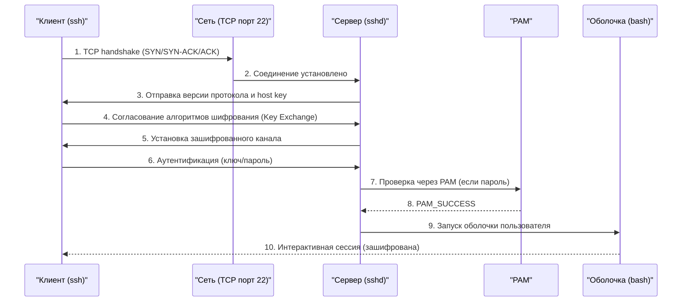

## Введение

**SSH (Secure Shell)** — это фундаментальный протокол удаленного администрирования Linux-систем. Практически каждое действие DevOps-инженера на удаленном сервере начинается с SSH-подключения: деплой кода, настройка сервисов, диагностика проблем, управление конфигурациями через Ansible.

Для DevOps-инженера глубокое понимание SSH критично по нескольким причинам:

- Это основной способ доступа к production-серверам
- Через SSH-туннели проксируются подключения к базам данных и внутренним сервисам
- SSH-ключи используются для аутентификации в Git, CI/CD, Ansible
- Неправильная настройка SSH — одна из самых частых причин компрометации серверов

> [!INFO] Связь с другими темами
> 
> - SSH-сервер (`sshd`) использует [[Synced/DevOps/Сетевое и системное администрирование/1. Операционные системы/1. Linux/8. Пользователи, группы, аутентификация/6. PAM.md | PAM]] для дополнительной аутентификации и управления сессиями.
> - Права на файлы SSH-ключей и конфигурации подчиняются стандартной модели [[Synced/DevOps/Сетевое и системное администрирование/1. Операционные системы/1. Linux/8. Пользователи, группы, аутентификация/3. Управление правами для файлов и директорий.md | прав доступа]].
> - Управление пользователями, которым разрешен вход по SSH, описано в [[Synced/DevOps/Сетевое и системное администрирование/1. Операционные системы/1. Linux/8. Пользователи, группы, аутентификация/2. Управление учетными записями.md | управлении учетными записями]].
> - SSH работает на транспортном уровне через TCP, что описано в [[Synced/DevOps/Сетевое и системное администрирование/2. Сети/4. Транспортный уровень (L4)/2. TCP (Transmission Control Protocol).md | TCP]].

## 1. Архитектура SSH: клиент-серверная модель

### Общая схема работы

