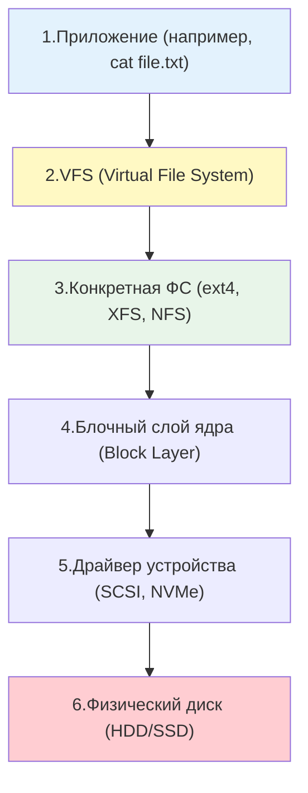
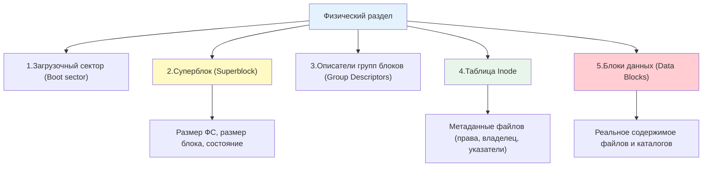

## Введение

Понимание того, как Linux работает с дисками и файловыми системами, является фундаментом для любого DevOps-инженера. От этого зависит производительность баз данных, надежность хранения логов, эффективность резервного копирования и способность диагностировать проблемы, когда на сервере "закончилось место", хотя `df` показывает обратное.

В Linux действует фундаментальный принцип: **"Всё есть файл"**. Это означает, что не только текстовые документы или исполняемые программы являются файлами, но и жесткие диски, разделы, сетевые сокеты и даже процессы в памяти представлены в виде файловых объектов.

> [!INFO] Связь с другими темами
> 
> - Абстракция файлов и прав доступа к ним базируется на принципах, разобранных в [[Synced/DevOps/Сетевое и системное администрирование/0. Введение и методология/1. Принцип работы ОС.md | Принципах работы ОС]].
> - Метаданные файлов, такие как [[Synced/DevOps/Глоссарий.md#Inode | Inode]], напрямую используются при управлении правами через [[Synced/DevOps/Сетевое и системное администрирование/1. Операционные системы/1. Linux/8. Пользователи, группы, аутентификация/3. Управление правами для файлов и директорий.md | Управление правами для файлов и директорий]].
> - Дальнейшее углубление в управление пространством будет рассмотрено в темах [[3. Разметка дисков| Разметка дисков]] и [[6. LVM| LVM]].

## 1. Архитектура хранения: от железа до файла

Чтобы понять, как читается файл, нужно проследить путь от физического носителя до пользовательского приложения.



## 2. VFS (Virtual File System)

VFS в Linux — это не просто "прослойка", это полноценная **объектно-ориентированная структура**, написанная на Си. Она оперирует четырьмя основными типами объектов (структурами данных), которые живут в памяти ядра.
- **`super_block` ([[Глоссарий#Суперблок (Superblock)|Суперблок]]):** Хранит метаданные _всей_ смонтированной файловой системы (размер, состояние, тип FS). Существует в единственном экземпляре для каждого смонтированного устройства.
- **`inode` ([[Глоссарий#Inode|Инод]]):** Хранит метаданные _конкретного файла_ или директории (размер, права доступа, временные метки, указатели на блоки данных на диске). В VFS этот объект универсален.
- **`dentry` (Directory Entry / D-кэш):** Это _кэшированное_ представление фрагмента пути. Например, в пути `/home/user/file.txt` будут объекты `dentry` для `/`, `home`, `user`, `file.txt`. Главная задача `dentry` — ускорить поиск и не парсить путь заново каждый раз.
- **`file` ([[Глоссарий#Файловый дескриптор (FD)|Файловый дескриптор]]):** Это объект, который создается при вызове `open()` для _конкретного процесса_. Он хранит текущую позицию чтения/записи (курсор), флаги открытия и ссылку на соответствующий `dentry`.

### Как VFS переводит запрос (Алгоритм)

Когда ты вызываешь `open("/home/file.txt", O_RDWR)`, внутри ядра происходит следующая цепочка:

1. **Разбор пути (Path Lookup)**
	Ядро начинает с корневого `dentry` (для глобального корня `/`). Далее оно проходит по элементам пути (`home`, `file.txt`). **Ключевой момент:** VFS сначала проверяет **D-кэш (dentry cache)**. Если запись есть в кэше, получение `inode` происходит мгновенно, без обращения к диску. Если записи нет — VFS вынуждена спросить драйвер ФС: "Дай мне инод для папки `home`".
	
2. **Определение файловой системы (Момент монтирования)**
	Как VFS определяет, что `/home` — это ext4, а, скажем, `/mnt/backup` — NFS?  
	Ответ: **В момент монтирования (`mount`)**. При монтировании создается структура `super_block`, которая жестко связывает префикс пути (точку монтирования) с конкретным драйвером.  
	Когда VFS "идет" по пути и натыкается на точку монтирования (`/mnt/backup`), она понимает: _"Стоп, здесь заканчивается одна FS (корневая) и начинается другая"_. Она переключает указатель на `super_block` новой ФС и передает управление ее драйверу.
	
3. **Получение "настоящего" inode**
	VFS не знает, как ext4 хранит иноды (где-то в таблице, в начале раздела). VFS просит драйвер: _"Загрузи мне в память объект `inode` для файла с таким-то номером (или путем)"_. Драйвер читает сырые байты с диска, парсит их, заполняет универсальную структуру `inode` и отдает назад VFS.
	
4. **"Перевод" операций (Таблицы функций)**
	Это самый главный пункт. Каждая структура `inode` и `file` внутри себя содержит **указатели на функции-обработчики** (т.н. `ops` — operations).
	- В `inode` лежит `inode_operations` (создание файлов, удаление, создание ссылок).
	- В `file` лежит `file_operations` (чтение, запись, `llseek`).

Когда драйвер регистрирует свою ФС в ядре, он заполняет эти таблицы своими функциями (например, `ext4_read` или `ntfs_write`).  
Когда приложение вызывает `read(fd, ...)`, VFS берет объект `file`, смотрит на его `file_operations.f_op->read` и вызывает функцию, на которую указывает указатель.

Благодаря VFS команды `ls`, `cp` или `cat` работают одинаково, независимо от того, находится ли файл на локальном SSD (ext4), на сетевом хранилище (NFS) или в виртуальной файловой системе ядра (procfs).

### "Виртуальность" и подмена FS (Пример procfs)

Как VFS "переводит" для `cat /proc/cpuinfo`?

1. `cat` вызывает `open()`.
2. VFS видит, что путь `/proc` — это точка монтирования типа `proc`.
3. VFS находит `super_block` для `procfs`.
4. **Важно:** В `procfs` нет диска. Драйвер `procfs` **не читает** байты с железа. Вместо этого, когда ядро просит этот драйвер заполнить `inode`, драйвер создает его на лету. А в `file_operations` для `/proc/cpuinfo` записана функция, которая опрашивает структуры ядра (список процессов) и формирует текстовую строку **прямо в памяти**.
5. При вызове `read()` VFS вызовет эту функцию-генератор, а не драйвер диска.

### Как именно VFS определяет ФС при монтировании

Когда вы выполняете `mount -t ext4 /dev/sda1 /mnt`, ядро не гадает. Процесс такой:

1. Вы читаете суперблок с начала раздела `/dev/sda1` (первые байты).
2. В этих байтах есть **магическое число (Magic number)**. Например, у ext4 это `0xEF53`, у XFS — другое.
3. Ядро перебирает зарегистрированные драйверы и спрашивает: _"Чей это магический номер?"_
4. Как только драйвер узнал свой номер, ядро говорит: _"Ага, значит для этой точки монтирования я буду использовать `file_operations` и `inode_operations` именно от этого драйвера"_.  
    _(Если указать `-t ext4` принудительно, ядро проверит только этот драйвер, не перебирая остальные)._

### Дополнительные особенности перевода VFS

- **Page Cache (Страничный кэш):** Когда VFS собирается вызвать драйвер для чтения диска, она сначала проверяет: "А нет ли этих данных уже в оперативной памяти (в [[8. Механизм Page Cache, Writeback и Dirty Pages|Page Cache]])?" Если есть, драйвер диска даже не дергается, VFS возвращает данные из кэша. Это делает перевод еще быстрее.

- **Запись (Write-back):** При вызове `write()` данные не всегда сразу уходят на диск. VFS помечает страницы в кэше как "грязные" и ставит их в очередь. Специальный процесс-демон (`pdflush` или `kworker`) через некоторое время будит драйвер ФС, чтобы тот _реально_ перевел данные в блоки на диске.

## 3. Типы устройств в Linux

В директории `/dev` находятся специальные файлы, представляющие устройства. Они делятся на два основных типа:

**Таблица: Блочные vs Символьные устройства**

|Характеристика|Блочные устройства (Block)|Символьные устройства (Character)|
|---|---|---|
|**Единица передачи**|Блоки фиксированного размера (512B, 4KB)|Поток отдельных байтов|
|**Доступ**|Произвольный (можно читать с любого места)|Последовательный|
|**Буферизация**|Кэшируются ядром (Page Cache)|Обычно не кэшируются (или кэшируются минимально)|
|**Примеры**|`/dev/sda`, `/dev/nvme0n1`, `/dev/sr0` (CD-ROM)|`/dev/tty`, `/dev/null`, `/dev/random`|
|**Обозначение в `ls -l`**|Начинается с `b` (например, `brw-rw----`)|Начинается с `c` (например, `crw-rw-rw-`)|

> [!TIP] Как проверить тип устройства
> ```bash
> ls -l /dev/sda /dev/tty
># brw-rw---- 1 root disk 8, 0 ... /dev/sda
># crw-rw-rw- 1 root tty  5, 0 ... /dev/tty
> ```
> 
> Первая буква `b` означает block, `c` означает character. Числа `8, 0` и `5, 0` — это старший и младший номера устройства (major/minor numbers), которые ядро использует для связи с правильным драйвером.

## 4. Внутренняя структура файловой системы (на примере ext4/XFS)

Когда диск размечен и отформатирован, на нем создается структура данных. Упрощенно её можно представить так:



### Ключевые компоненты:

1. **Суперблок ([[Synced/DevOps/Глоссарий.md#Суперблок (Superblock)|Superblock]])**: "Паспорт" файловой системы. Хранит критически важную информацию: общий размер, размер блока, количество свободных inode и блоков. Если основной суперблок поврежден, ФС не смонтируется. Поэтому создаются его резервные копии (backup superblocks) в разных группах блоков.
2. **Таблица Inode**: Массив структур [[Synced/DevOps/Глоссарий.md#Inode|Inode]]. Каждый файл или директория имеет ровно один inode. Inode содержит:
	- Тип файла (обычный, директория, ссылка, устройство)
	- Права доступа (rwx)
	- UID и GID владельца
	- Размер файла
	- Временные метки (atime, mtime, ctime)
	- Указатели на блоки данных, где хранится содержимое файла.
	- **Важно**: Inode **не содержит** имени файла.
3. **Блоки данных**: Область, где хранится реальное содержимое файлов. Для директорий содержимым является специальная таблица, связывающая **имена файлов** с их **номерами inode**.

### Почему имя файла не в Inode?

Потому что один и тот же inode может иметь несколько имен (жесткие ссылки, [[Synced/DevOps/Сетевое и системное администрирование/1. Операционные системы/1. Linux/3. Ссылочные файлы (hard, soft links).md | hard links]]). Имя файла хранится только в записи директории, которая ссылается на номер inode.

## 5. Базовые утилиты для анализа дисков и ФС

### Просмотр блочных устройств и структуры

```bash
# Иерархический список всех блочных устройств (диски, разделы, LVM, loop)
lsblk

# Пример вывода:
# NAME        MAJ:MIN RM   SIZE RO TYPE MOUNTPOINTS
# sda           8:0    0   100G  0 disk 
# ├─sda1        8:1    0     1G  0 part /boot
# └─sda2        8:2    0    99G  0 part 
#   ├─vg-root 253:0    0    50G  0 lvm  /
#   └─vg-swap 253:1    0     4G  0 lvm  [SWAP]

# Подробная информация о конкретных устройствах
lsblk -o NAME,SIZE,FSTYPE,MOUNTPOINT,UUID
```

### Идентификация файловых систем

```bash
# Показать UUID, TYPE и LABEL для всех блочных устройств
blkid

# Пример вывода:
# /dev/sda1: UUID="1234-5678" BLOCK_SIZE="512" TYPE="vfat" PARTUUID="abcd-1234"
# /dev/sda2: UUID="9876-wxyz" BLOCK_SIZE="4096" TYPE="ext4" PARTUUID="wxyz-5678"
```

> [!TIP] Почему UUID важнее имени устройства (`/dev/sda1`)?
> Имена `/dev/sdX` могут меняться при добавлении новых дисков или после перезагрузки. UUID остается неизменным, поэтому в `/etc/fstab` рекомендуется монтировать диски именно по UUID.

### Использование дискового пространства

```bash
# Сводка по смонтированным файловым системам (человекочитаемый формат)
df -h

# Информация об использовании inode (критично, если место есть, но файлы создать нельзя)
df -i

# Размер конкретной директории и её содержимого
du -sh /var/log
du -sh /var/log/* | sort -hr | head -10  # Топ-10 самых тяжелых файлов/папок
```

### Детальная информация о файле (включая Inode)

```bash
# Полная информация о файле (размер, блоки, тип ФС, inode, права)
stat /etc/nginx/nginx.conf

# Пример вывода:
#   File: /etc/nginx/nginx.conf
#   Size: 2400       Blocks: 8          IO Block: 4096   regular file
# Device: 802h/2050d Inode: 134567      Links: 1
# Access: (0644/-rw-r--r--)  Uid: (    0/    root)   Gid: (    0/    root)
# Access: 2026-08-17 10:00:00.000000000 +0000
# Modify: 2026-08-15 12:30:00.000000000 +0000
# Change: 2026-08-15 12:30:00.000000000 +0000
```

## 5. Типы файловых систем в Linux

Выбор ФС зависит от рабочей нагрузки. Вот основные игроки:

| Файловая система   | Особенности                                                                                                                                         | Типичное применение                                                                         |
| ------------------ | --------------------------------------------------------------------------------------------------------------------------------------------------- | ------------------------------------------------------------------------------------------- |
| **ext4**           | Стабильная, зрелая, хорошая производительность для общих задач. Максимальный размер файла 16 ТБ.                                                    | Корневые разделы, общие данные, стандартный выбор для многих дистрибутивов.                 |
| **XFS**            | Высокая производительность при работе с большими файлами и параллельном I/O. Отличная масштабируемость. Нельзя уменьшить размер (только увеличить). | Базы данных, файловые хранилища, системы виртуализации, стандарт в RHEL/CentOS.             |
| **Btrfs**          | Копирование при записи (CoW), встроенные снапшоты, прозрачное сжатие, программный RAID.                                                             | Десктопы, системы, требующие снапшотов (например, OpenSUSE, некоторые конфигурации Ubuntu). |
| **ZFS**            | Продвинутая CoW ФС с встроенным менеджментом томов, проверкой целостности данных (checksums), снапшотами. Требует много RAM.                        | Сетевые хранилища (NAS), высоконадежные серверы баз данных, архивирование.                  |
| **tmpfs**          | Файловая система в оперативной памяти (RAM). Данные исчезают при перезагрузке. Очень быстрая.                                                       | `/tmp`, `/run`, кэши в памяти.                                                              |
| **procfs / sysfs** | Виртуальные ФС, не занимающие место на диске. Предоставляют интерфейс к структурам данных ядра.                                                     | `/proc` (информация о процессах), `/sys` (информация об устройствах и драйверах).           |
## 6. Практические сценарии для DevOps

### Сценарий 1: Поиск "исчезнувшего" места на диске

Частая проблема: `df -h` показывает 100% использование, но `du -sh /*` не находит больших файлов.

**Причина 1**: Удаленные, но все еще открытые файлы.

```bash
# Найти удаленные файлы, которые удерживаются запущенными процессами
lsof +L1
# или
lsof | grep deleted

# Решение: перезапустить процесс (например, nginx или java), который удерживает файл, 
# или очистить файл через truncate: truncate -s 0 /proc/<PID>/fd/<FD_NUMBER>
```

**Причина 2**: Закончились inode, хотя есть свободные блоки.

```bash
# Проверить использование inode
df -i

# Если Use% близок к 100%, найти директории с огромным количеством мелких файлов
find / -xdev -type d -exec sh -c 'echo "$(ls -1 "{}" | wc -l) {}"' \; | sort -nr | head -10
```

### Сценарий 2: Определение типа файловой системы и её параметров

```bash
# Узнать тип ФС и размер блока для конкретного раздела
stat -f /
# или
tune2fs -l /dev/sda2   # только для ext2/3/4
xfs_info /             # для XFS
```

### Сценарий 3: Поиск самых "тяжелых" файлов, измененных за последние 7 дней

```bash
find /var/log -type f -mtime -7 -exec ls -lh {} + | awk '{ print $9 ": " $5 }' | sort -k2 -hr | head -10
```

## 7. Troubleshooting и типичные проблемы

| Проблема                                                         | Возможная причина                                                                                                         | Решение                                                                                     |
| ---------------------------------------------------------------- | ------------------------------------------------------------------------------------------------------------------------- | ------------------------------------------------------------------------------------------- |
| `No space left on device`, но `df -h` показывает свободное место | Закончились [[Synced/DevOps/Глоссарий.md#Inode \| Inode]]                                                                 | Inode]] из-за миллионов мелких файлов                                                       |
| `No space left on device`, но и место, и inode свободны          | Исчерпано резервное пространство для root (обычно 5% на ext4) или файловая система перешла в режим read-only из-за ошибок | Проверить `dmesg -T                                                                         |
| Устройство отображается как `loop` в `lsblk`                     | Это файл, смонтированный как устройство (часто используется snap-пакетами или Docker)                                     | Это нормальное поведение. Snap-пакеты монтируют свои squashfs-образы через loop-устройства. |
| `mount: wrong fs type, bad option, bad superblock`               | Повреждение суперблока или отсутствие драйвера ФС в ядре                                                                  | Проверить `dmesg`. Попытаться смонтировать с резервным суперблоком (`mount -o sb=...`).     |

---

## Контрольные вопросы для самопроверки

1. В чем фундаментальная разница между блочным и символьным устройством в Linux? Приведите по два примера каждого.
2. Какую роль играет VFS (Virtual File System) в архитектуре Linux и почему без неё работа с разными ФС была бы сложнее?
3. Почему имя файла не хранится в структуре [[Глоссарий#Inode|Inode]]? Где именно оно хранится?
4. Что такое суперблок и почему его повреждение может сделать файловую систему не монтируемой?
5. Как ситуация, когда `df -h` показывает свободное место, но система выдает ошибку "No space left on device", может быть связана с inode?
6. Почему при указании точек монтирования в `/etc/fstab` рекомендуется использовать UUID, а не имена устройств вида `/dev/sda1`?
7. В каких сценариях целесообразно выбирать XFS вместо ext4, и наоборот?

---

#linux #sysadmin #filesystem #storage #devops #ext4 #xfs #inode #vfs #block-device #troubleshooting #disk-management #fundamentals