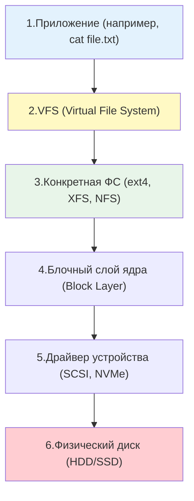

## Введение

Понимание того, как Linux работает с дисками и файловыми системами, является фундаментом для любого DevOps-инженера. От этого зависит производительность баз данных, надежность хранения логов, эффективность резервного копирования и способность диагностировать проблемы, когда на сервере "закончилось место", хотя `df` показывает обратное.

В Linux действует фундаментальный принцип: **"Всё есть файл"**. Это означает, что не только текстовые документы или исполняемые программы являются файлами, но и жесткие диски, разделы, сетевые сокеты и даже процессы в памяти представлены в виде файловых объектов.

> [!INFO] Связь с другими темами
> 
> - Абстракция файлов и прав доступа к ним базируется на принципах, разобранных в [[Synced/DevOps/Сетевое и системное администрирование/0. Введение и методология/1. Принцип работы ОС.md | Принципах работы ОС]].
> - Метаданные файлов, такие как [[Synced/DevOps/Глоссарий.md#Inode | Inode]], напрямую используются при управлении правами через [[Synced/DevOps/Сетевое и системное администрирование/1. Операционные системы/1. Linux/8. Пользователи, группы, аутентификация/3. Управление правами для файлов и директорий.md | Управление правами для файлов и директорий]].
> - Дальнейшее углубление в управление пространством будет рассмотрено в темах [[Synced/DevOps/Сетевое и системное администрирование/1. Операционные системы/1. Linux/9. Файловые системы и диски/2. Разметка дисков.md | Разметка дисков]] и [[Synced/DevOps/Сетевое и системное администрирование/1. Операционные системы/1. Linux/9. Файловые системы и диски/4. LVM.md | LVM]].

## 1. Архитектура хранения: от железа до файла

Чтобы понять, как читается файл, нужно проследить путь от физического носителя до пользовательского приложения.

### Роль VFS (Virtual File System)

VFS в Linux — это не просто "прослойка", это полноценная **объектно-ориентированная структура**, написанная на Си. Она оперирует четырьмя основными типами объектов (структурами данных), которые живут в памяти ядра.
- **`super_block` ([[Глоссарий#Суперблок (Superblock)|Суперблок]]):** Хранит метаданные _всей_ смонтированной файловой системы (размер, состояние, тип FS). Существует в единственном экземпляре для каждого смонтированного устройства.
- **`inode` ([[Глоссарий#Inode|Инод]]):** Хранит метаданные _конкретного файла_ или директории (размер, права доступа, временные метки, указатели на блоки данных на диске). В VFS этот объект универсален.
- **`dentry` (Directory Entry / D-кэш):** Это _кэшированное_ представление фрагмента пути. Например, в пути `/home/user/file.txt` будут объекты `dentry` для `/`, `home`, `user`, `file.txt`. Главная задача `dentry` — ускорить поиск и не парсить путь заново каждый раз.
- **`file` ([[Глоссарий#Файловый дескриптор (FD)|Файловый дескриптор]]):** Это объект, который создается при вызове `open()` для _конкретного процесса_. Он хранит текущую позицию чтения/записи (курсор), флаги открытия и ссылку на соответствующий `dentry`.

Когда ты вызываешь `open("/home/file.txt", O_RDWR)`, внутри ядра происходит следующая цепочка:

1. **Разбор пути (Path Lookup)**
	Ядро начинает с корневого `dentry` (для глобального корня `/`). Далее оно проходит по элементам пути (`home`, `file.txt`). **Ключевой момент:** VFS сначала проверяет **D-кэш (dentry cache)**. Если запись есть в кэше, получение `inode` происходит мгновенно, без обращения к диску. Если записи нет — VFS вынуждена спросить драйвер ФС: "Дай мне инод для папки `home`".

2. **Определение файловой системы (Момент монтирования)**
	Как VFS определяет, что `/home` — это ext4, а, скажем, `/mnt/backup` — NFS?  
	Ответ: **В момент монтирования (`mount`)**. При монтировании создается структура `super_block`, которая жестко связывает префикс пути (точку монтирования) с конкретным драйвером.  
	Когда VFS "идет" по пути и натыкается на точку монтирования (`/mnt/backup`), она понимает: _"Стоп, здесь заканчивается одна FS (корневая) и начинается другая"_. Она переключает указатель на `super_block` новой ФС и передает управление ее драйверу.

3. **Получение "настоящего" inode**
	VFS не знает, как ext4 хранит иноды (где-то в таблице, в начале раздела). VFS просит драйвер: _"Загрузи мне в память объект `inode` для файла с таким-то номером (или путем)"_. Драйвер читает сырые байты с диска, парсит их, заполняет универсальную структуру `inode` и отдает назад VFS.

4. **"Перевод" операций (Таблицы функций)**
	Это самый главный пункт. Каждая структура `inode` и `file` внутри себя содержит **указатели на функции-обработчики** (т.н. `ops` — operations).
	- В `inode` лежит `inode_operations` (создание файлов, удаление, создание ссылок).
	- В `file` лежит `file_operations` (чтение, запись, `llseek`).

Когда драйвер регистрирует свою ФС в ядре, он заполняет эти таблицы своими функциями (например, `ext4_read` или `ntfs_write`).  
Когда приложение вызывает `read(fd, ...)`, VFS берет объект `file`, смотрит на его `file_operations.f_op->read` и вызывает функцию, на которую указывает указатель.

Благодаря VFS команды `ls`, `cp` или `cat` работают одинаково, независимо от того, находится ли файл на локальном SSD (ext4), на сетевом хранилище (NFS) или в виртуальной файловой системе ядра (procfs).