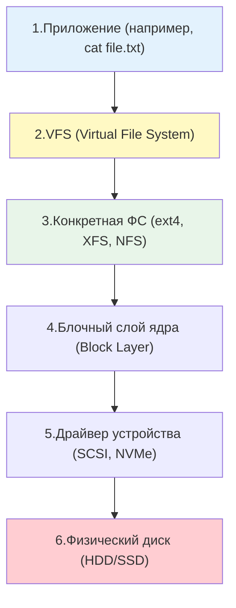

## Введение

Понимание того, как Linux работает с дисками и файловыми системами, является фундаментом для любого DevOps-инженера. От этого зависит производительность баз данных, надежность хранения логов, эффективность резервного копирования и способность диагностировать проблемы, когда на сервере "закончилось место", хотя `df` показывает обратное.

В Linux действует фундаментальный принцип: **"Всё есть файл"**. Это означает, что не только текстовые документы или исполняемые программы являются файлами, но и жесткие диски, разделы, сетевые сокеты и даже процессы в памяти представлены в виде файловых объектов.

> [!INFO] Связь с другими темами
> 
> - Абстракция файлов и прав доступа к ним базируется на принципах, разобранных в [[Synced/DevOps/Сетевое и системное администрирование/0. Введение и методология/1. Принцип работы ОС.md | Принципах работы ОС]].
> - Метаданные файлов, такие как [[Synced/DevOps/Глоссарий.md#Inode | Inode]], напрямую используются при управлении правами через [[Synced/DevOps/Сетевое и системное администрирование/1. Операционные системы/1. Linux/8. Пользователи, группы, аутентификация/3. Управление правами для файлов и директорий.md | Управление правами для файлов и директорий]].
> - Дальнейшее углубление в управление пространством будет рассмотрено в темах [[Synced/DevOps/Сетевое и системное администрирование/1. Операционные системы/1. Linux/9. Файловые системы и диски/2. Разметка дисков.md | Разметка дисков]] и [[Synced/DevOps/Сетевое и системное администрирование/1. Операционные системы/1. Linux/9. Файловые системы и диски/4. LVM.md | LVM]].

## 1. Архитектура хранения: от железа до файла

Чтобы понять, как читается файл, нужно проследить путь от физического носителя до пользовательского приложения.

### Роль VFS (Virtual File System)

VFS — это "переводчик" между приложениями и конкретными файловыми системами. Когда вы вызываете системный вызов `open()`, VFS:

1. Определяет, к какой файловой системе принадлежит путь.
2. Находит соответствующий драйвер файловой системы (например, `ext4`).
3. Передает запрос этому драйверу, который уже знает, как читать данные с конкретного диска.

Благодаря VFS команды `ls`, `cp` или `cat` работают одинаково, независимо от того, находится ли файл на локальном SSD (ext4), на сетевом хранилище (NFS) или в виртуальной файловой системе ядра (procfs).