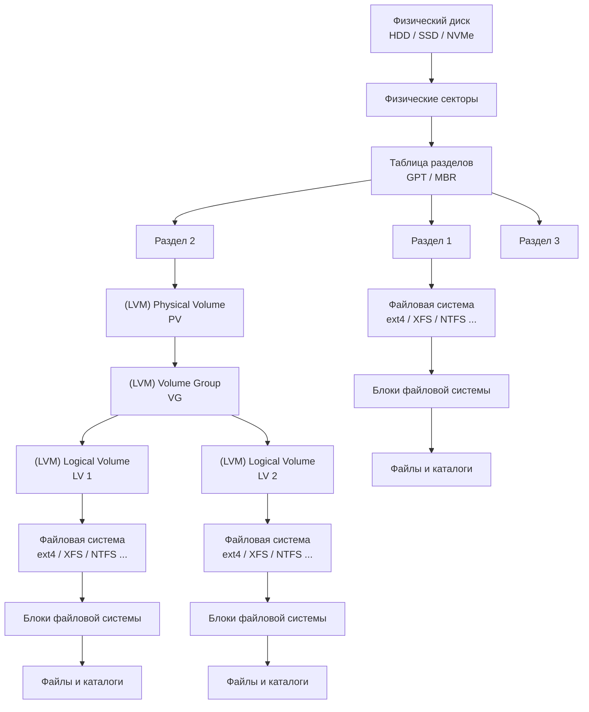
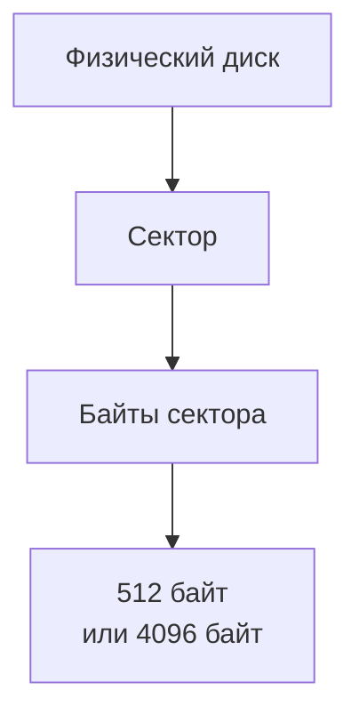
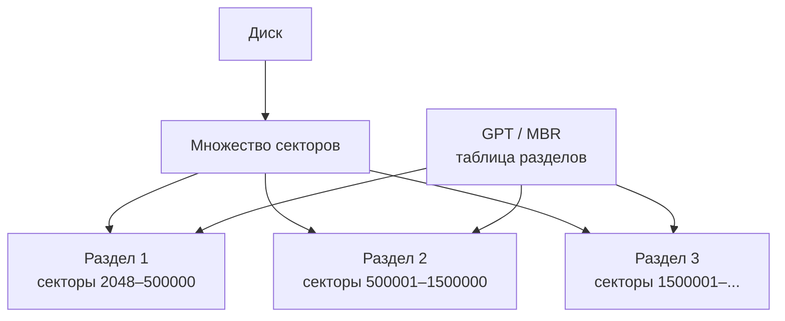
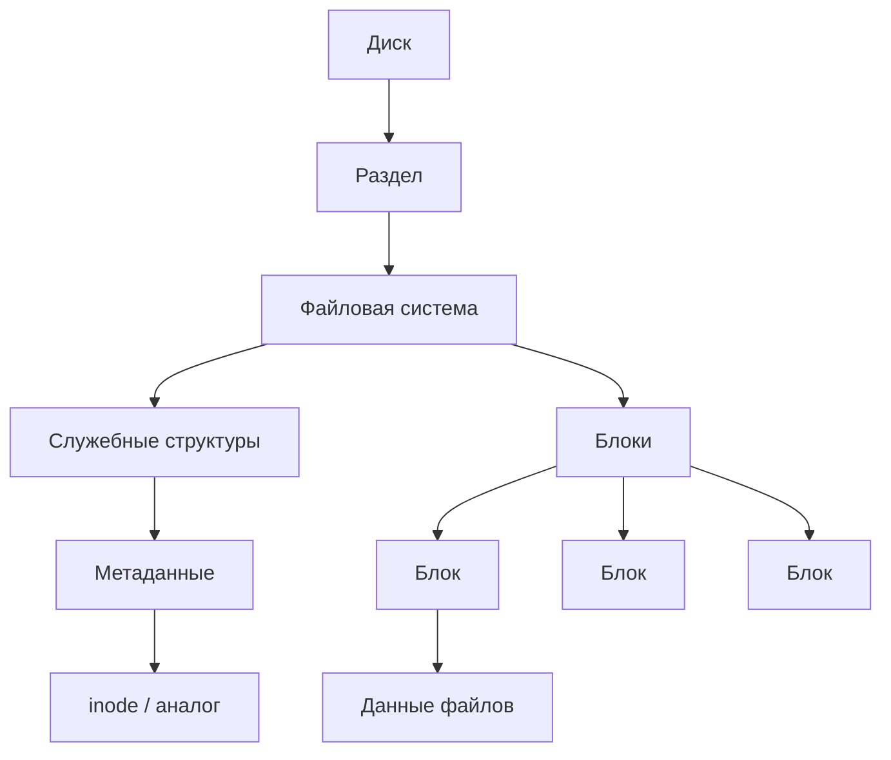
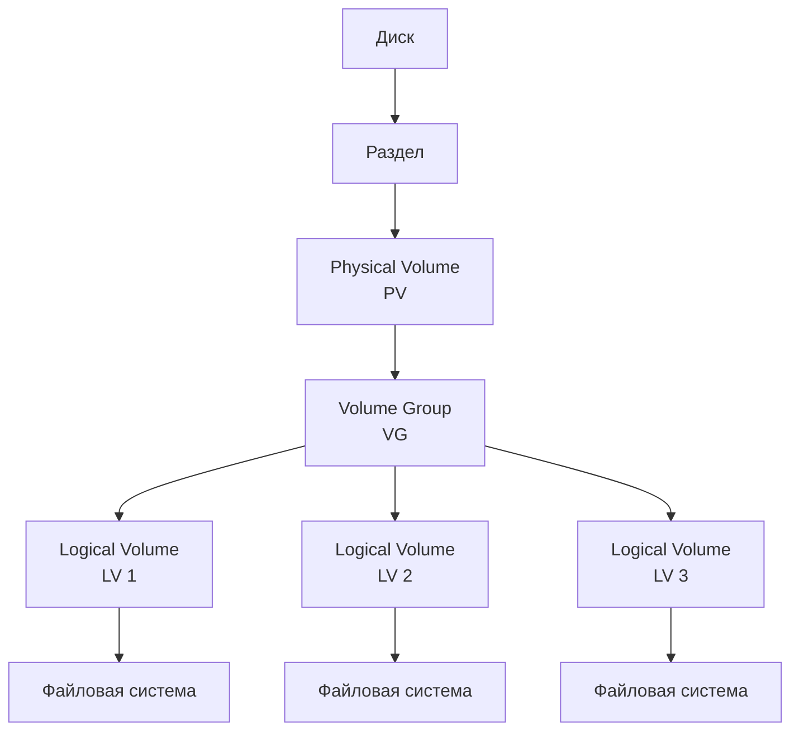
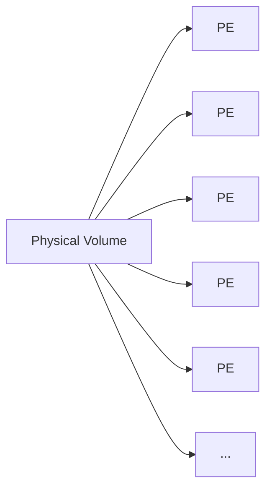
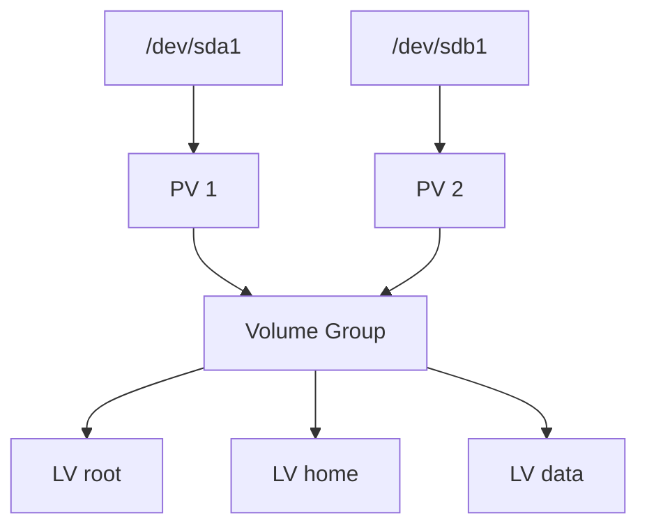
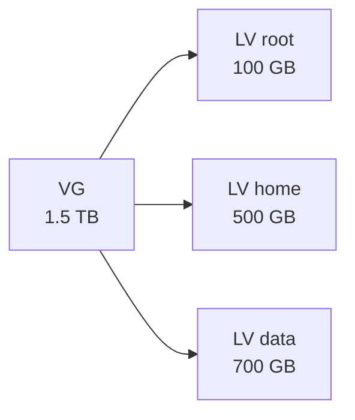

## 1. Общая Структура физических и логических элементов:



## 2. Физический уровень



**Сектор** — минимальная адресуемая порция данных на физическом устройстве хранения. Исторически распространён размер **512 байт**, современные диски используют физические секторы по **4096 байт**. Важно:

>[!TIP] Разница блок и сектор
>Сектор — понятие физического устройства.  
>Блок — обычно понятие более высокого уровня, например файловой системы.

## 3. Разделы диска



**Раздел** — это логически выделенный диапазон пространства диска.

```
Диск
│
├── сектор 0
├── сектор 1
├── ...
├── сектор 2048
│      ↓
│   ┌───────────────┐
│   │ Раздел 1      │
│   │ 100 GB        │
│   └───────────────┘
│
│   ┌───────────────┐
│   │ Раздел 2      │
│   │ 500 GB        │
│   └───────────────┘
│
└── свободное место
```

**GPT/MBR не создают сами разделы в смысле выделения данных.** Они хранят информацию о том, где эти разделы находятся.

## 4. Файловая система

Теперь представим, что у нас есть обычный раздел:



Например:

```
/dev/sda
    │
    └── /dev/sda1
           │
           └── ext4
                │
                ├── metadata
                ├── inode
                ├── block
                ├── block
                ├── block
                └── ...
```

**Блок** — единица хранения данных, используемая файловой системой. Например, ext4 может использовать блоки по 4096 байт. При этом один блок файловой системы может соответствовать нескольким физическим секторам:

```
Физический диск

┌─────────┬─────────┬─────────┬─────────┐
│ Sector  │ Sector  │ Sector  │ Sector  │
│ 512 B   │ 512 B   │ 512 B   │ 512 B   │
└─────────┴─────────┴─────────┴─────────┘
                  │
                  ▼
             1 блок FS
              2048 B
```

При 512-байтовых секторах и блоке 4096 байт:

```
1 block = 8 sectors
```

Но это **не универсальное правило** — размеры могут отличаться.

## 6. LVM — отдельный слой

Нельзя говорить:

> «LVM-том состоит из разделов».

Точнее:

> **Physical Volume (PV) создаётся поверх диска или раздела.**

А уже PV входит в **Volume Group**, из которой выделяются **Logical Volumes**.



## 7. Physical Volume (PV)

**PV** — область хранения, которую LVM использует как физическое хранилище. PV можно создать, например, поверх раздела `/dev/sda2`, или непосредственно поверх целого диска `/dev/sdb`/. PV не обязательно является разделом, он может быть создан поверх целого диска

## 8. Physical Extents

**Physical Extent (PE)** — фиксированный по размеру кусок пространства внутри PV

Именно этими кусками LVM управляет пространством.

LVM делит PV на одинаковые куски:



Например, условно:

```
PV = 100 GB

┌────┬────┬────┬────┬────┬────┬────┬─────┐
│ PE │ PE │ PE │ PE │ PE │ PE │ PE │ ... │
└────┴────┴────┴────┴────┴────┴────┴─────┘
```

## 9. Volume Group

**Volume Group (VG)** — общий пул пространства, объединяющий один или несколько PV.

Получается:

```
PV1 ─┐
     ├──> VG ───> LV
PV2 ─┘
```

Например:

```
/dev/sda1 = 500 GB
/dev/sdb1 = 1 TB  

PV1 = 500 GB
PV2 = 1 TB  

VG = 1.5 TB
```

VG предоставляет эти 1.5 TB как общий пул, из которого можно создавать LV.



## 10. Logical Volume

**Logical Volume (LV)** — логический диск, выделенный из Volume Group.



После создания LV операционная система видит его примерно как блочное устройство:

```
/dev/mapper/vg0-root
```

или:

```
/dev/vg0/root
```

На него можно создать файловую систему:

```
VG
 │
 └── LV
      │
      └── ext4
           │
           └── files
```

## Определения всех сущностей

| Сущность               | Что это                                                                               |
| ---------------------- | ------------------------------------------------------------------------------------- |
| **Диск**               | Физическое устройство хранения данных                                                 |
| **Сектор**             | Небольшая физическая адресуемая область устройства хранения                           |
| **GPT / MBR**          | Формат таблицы, описывающей разделы диска                                             |
| **Раздел (Partition)** | Диапазон пространства диска, заданный диапазоном секторов                             |
| **Файловая система**   | Структура, организующая хранение файлов и метаданных                                  |
| **Блок (Block)**       | Единица хранения, используемая файловой системой                                      |
| **inode**              | Структура файловой системы, описывающая файл и его метаданные                         |
| **PV**                 | Physical Volume — пространство, переданное под управление LVM                         |
| **PE**                 | Physical Extent — фиксированный кусок пространства PV                                 |
| **VG**                 | Volume Group — общий пул пространства одного или нескольких PV                        |
| **LE**                 | Logical Extent — логическая единица пространства LV                                   |
| **LV**                 | Logical Volume — логический блочный том, выделенный из VG                             |
| **swap**               | Специальное пространство для виртуальной памяти, не файловая система в обычном смысле |
| **Файл**               | Логический объект файловой системы, состоящий из данных и метаданных                  |
| **Каталог**            | Специальный объект файловой системы, связывающий имена с файлами/объектами            |