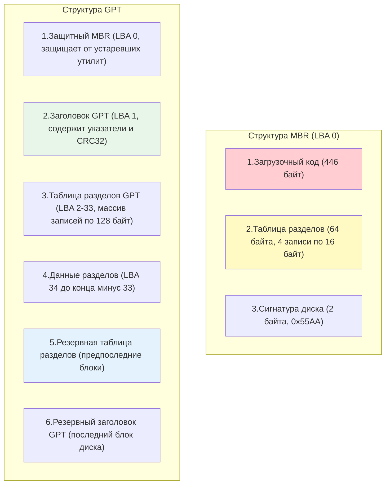

## Введение

Разметка диска (partitioning) — это процесс логического разделения физического блочного устройства на независимые области (разделы), которые операционная система воспринимает как отдельные диски. Это фундаментальный этап подготовки хранилища, предшествующий форматированию и монтированию, подробно описанным в [[Synced/DevOps/Сетевое и системное администрирование/1. Операционные системы/1. Linux/9. Файловые системы и диски/3. Форматирование и монтирование.md | Форматировании и монтировании]].

Для DevOps-инженера глубокое понимание механизмов разметки критично. Ошибки на этом этапе (например, выбор устаревшего MBR для диска объемом 3 ТБ или неправильное выравнивание разделов на SSD) могут привести к невозможности использования всего объема диска, потере данных или катастрофическому падению производительности.

> [!INFO] Связь с другими темами
> 
> - Разметка оперирует [[Synced/DevOps/Глоссарий.md#Блочное устройство (Block device) | блочными устройствами]], концепция которых была разобрана в [[Synced/DevOps/Сетевое и системное администрирование/1. Операционные системы/1. Linux/9. Файловые системы и диски/1. Основы работы с дисками и файловыми системами.md | Основах работы с дисками и файловыми системами]].
> - После создания разделов они часто объединяются в гибкие логические тома с помощью [[Synced/DevOps/Сетевое и системное администрирование/1. Операционные системы/1. Linux/9. Файловые системы и диски/4. LVM.md | LVM]].

## 1. Архитектура разметки: MBR vs GPT

Исторически в PC-мире доминировал стандарт MBR. С появлением дисков объемом более 2 ТБ и внедрением прошивки UEFI (Unified Extensible Firmware Interface) на смену ему пришел GPT.
### Таблица сравнения MBR и GPT

|Характеристика|MBR (Master Boot Record)|GPT (GUID Partition Table)|
|---|---|---|
|**Максимальный размер диска**|2 ТБ (при секторе 512 байт)|9.4 Зеттабайт (практически неограничен)|
|**Максимальное количество разделов**|4 первичных (или 3 первичных + 1 расширенный с логическими)|128 (в Windows), практически неограничено в Linux (зависит от размера таблицы)|
|**Расположение данных разметки**|Только в первом секторе диска (LBA 0)|Заголовок и таблица в начале (LBA 1-33) + резервные копии в конце диска|
|**Целостность данных**|Нет встроенной проверки (контрольные суммы отсутствуют)|Использует CRC32 для проверки целостности заголовка и таблицы разделов|
|**Совместимость с загрузкой**|BIOS (Legacy)|UEFI (требует раздела EFI System Partition, ESP)|
|**Защита от случайной порчи**|Отсутствует. Повреждение первого сектора фатально|Наличие защитного MBR (PMBR) и резервной таблицы в конце диска|

### Структура MBR и GPT на диске



> [!DANGER] Критическая уязвимость MBR
> Поскольку вся информация о разделах в MBR хранится в одном единственном секторе (LBA 0), его повреждение (например, случайной командой `dd if=/dev/zero of=/dev/sda bs=512 count=1`) делает все разделы невидимыми для ОС, хотя сами данные физически остаются на диске. В GPT такая ситуация частично компенсируется резервной копией в конце диска.

## 2. Именование блочных устройств в Linux

Ядро Linux присваивает имена устройствам на основе типа контроллера и порядка обнаружения. Понимание этой схемы необходимо для правильной разметки.

### Таблица именования устройств

|Префикс|Тип устройства|Пример|Расшифровка примера|
|---|---|---|---|
|`sd`|SCSI, SATA, SAS, USB-накопители|`/dev/sda`|Первый (a) SCSI/SATA диск|
|`nvme`|NVMe (Non-Volatile Memory Express) SSD|`/dev/nvme0n1`|Контроллер 0, пространство имен (namespace) 1|
|`vd`|Виртуальные диски (VirtIO в KVM/QEMU)|`/dev/vda`|Первый виртуальный диск|
|`xvd`|Виртуальные диски (Xen, старые версии AWS EC2)|`/dev/xvda`|Первый виртуальный диск Xen|
|`mmc`|Карты памяти eMMC, SD|`/dev/mmcblk0`|Первый контроллер eMMC/SD|
### Именование разделов

К имени базового устройства добавляется суффикс:

- Для `sd`, `vd`, `xvd`, `mmc`: цифра, начиная с 1. Пример: `/dev/sda1`, `/dev/nvme0n1p1`.
- Для `nvme`: буква `p` + цифра. Пример: `/dev/nvme0n1p1` (первый раздел на первом пространстве имен нулевого контроллера).

## 3. Инструменты для разметки дисков

Выбор инструмента зависит от типа таблицы разделов и сценария использования (интерактивный или скриптовый).

### `fdisk` (для MBR)

Классическая интерактивная утилита. В современных версиях (util-linux >= 2.23) поддерживает и GPT, но исторически и по умолчанию ассоциируется с MBR.

```bash
# Запуск интерактивного режима
fdisk /dev/sdb

# Основные команды внутри fdisk:
# m - помощь
# p - печать таблицы разделов
# n - создание нового раздела
# d - удаление раздела
# t - изменение типа раздела (например, 8e для Linux LVM)
# w - запись изменений на диск и выход
# q - выход без сохранения
```

### `gdisk` (для GPT)

Аналог `fdisk`, но разработанный специально для работы с таблицами GPT. Имеет идентичный `fdisk` интерактивный интерфейс, что облегчает переход.

```bash
gdisk /dev/nvme0n1
# Команды аналогичны fdisk, но тип раздела задается кодом (например, 8E00 для Linux LVM в GPT)
```

### `parted` (универсальный, скриптовый)

Поддерживает и MBR, и GPT. Главное преимущество — возможность работы в не интерактивном (командном) режиме, что делает его идеальным для Bash-скриптов и Ansible.

```bash
# Создание таблицы разделов GPT на диске
parted -s /dev/sdb mklabel gpt

# Создание первичного раздела ext4 от 1MiB до 100% диска (с выравниванием)
parted -s -a optimal /dev/sdb mkpart primary ext4 1MiB 100%

# Включение флага boot (для EFI раздела)
parted -s /dev/sdb set 1 boot on
```

> [!DANGER] Выравнивание разделов (Alignment)
> Ключ `-a optimal` в `parted` или выбор "2048" (начальный сектор) в `fdisk` критически важен для SSD и дисков Advanced Format (4K). Неправильное выравнивание приводит к тому, что один логический блок ОС пересекает два физических сектора диска, что удваивает операции записи и резко снижает производительность и ресурс SSD.

## 4. Механизм работы ядра с таблицей разделов

Когда вы создаете или изменяете раздел с помощью `fdisk` или `parted`, утилита записывает новые данные в таблицу разделов на диске. Однако **ядро Linux кэширует таблицу разделов в оперативной памяти** на момент загрузки или первого обнаружения диска.

Чтобы ядро узнало об изменениях, его нужно уведомить.

### Уведомление ядра об изменениях

```bash
# Современный и рекомендуемый способ (сканирует все диски или конкретный)
partprobe /dev/sdb

# Альтернативный способ через ioctl к конкретному устройству
blockdev --rereadpt /dev/sdb
```

### Что происходит "под капотом" при `partprobe`:

1. Утилита отправляет системный вызов `ioctl(BLKRRPART)` ядру.
2. Ядро проверяет, не используется ли диск или его разделы в данный момент (смонтированы, являются частью LVM или RAID).
3. Если диск свободен, ядро перечитывает таблицу разделов с диска, обновляет свои внутренние структуры данных и создает новые файлы устройств в `/dev/` (например, `/dev/sdb1`).
4. Если диск занят, `partprobe` вернет ошибку: `Warning: WARNING: the kernel failed to re-read the partition table on /dev/sdb (Device or resource busy)`.

> [!WARNING] Опасность принудительного перечитывания
> Если раздел уже смонтирован или используется, принудительное обновление таблицы разделов может привести к панике ядра (kernel panic) или повреждению данных. В таких случаях единственное безопасное решение — перезагрузка сервера.

