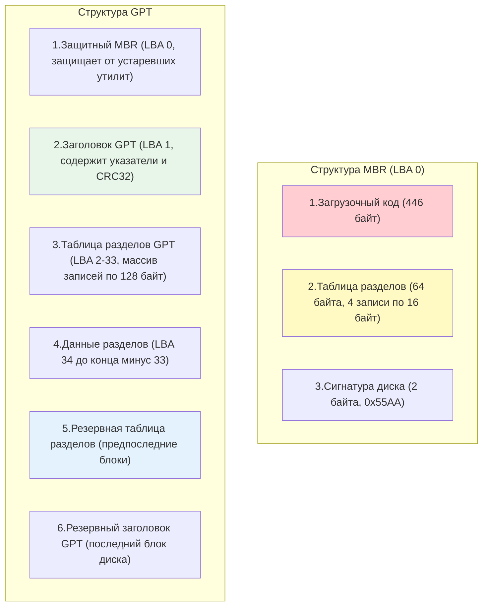

## Введение

Разметка диска (partitioning) — это процесс логического разделения физического блочного устройства на независимые области (разделы), которые операционная система воспринимает как отдельные диски. Это фундаментальный этап подготовки хранилища, предшествующий форматированию и монтированию, подробно описанным в [[Synced/DevOps/Сетевое и системное администрирование/1. Операционные системы/1. Linux/9. Файловые системы и диски/3. Форматирование и монтирование.md | Форматировании и монтировании]].

Для DevOps-инженера глубокое понимание механизмов разметки критично. Ошибки на этом этапе (например, выбор устаревшего MBR для диска объемом 3 ТБ или неправильное выравнивание разделов на SSD) могут привести к невозможности использования всего объема диска, потере данных или катастрофическому падению производительности.

> [!INFO] Связь с другими темами
> 
> - Разметка оперирует [[Synced/DevOps/Глоссарий.md#Блочное устройство (Block device) | блочными устройствами]], концепция которых была разобрана в [[Synced/DevOps/Сетевое и системное администрирование/1. Операционные системы/1. Linux/9. Файловые системы и диски/1. Основы работы с дисками и файловыми системами.md | Основах работы с дисками и файловыми системами]].
> - После создания разделов они часто объединяются в гибкие логические тома с помощью [[Synced/DevOps/Сетевое и системное администрирование/1. Операционные системы/1. Linux/9. Файловые системы и диски/4. LVM.md | LVM]].

## 1. Архитектура разметки: MBR vs GPT

Исторически в PC-мире доминировал стандарт MBR. С появлением дисков объемом более 2 ТБ и внедрением прошивки UEFI (Unified Extensible Firmware Interface) на смену ему пришел GPT.
### Таблица сравнения MBR и GPT

|Характеристика|MBR (Master Boot Record)|GPT (GUID Partition Table)|
|---|---|---|
|**Максимальный размер диска**|2 ТБ (при секторе 512 байт)|9.4 Зеттабайт (практически неограничен)|
|**Максимальное количество разделов**|4 первичных (или 3 первичных + 1 расширенный с логическими)|128 (в Windows), практически неограничено в Linux (зависит от размера таблицы)|
|**Расположение данных разметки**|Только в первом секторе диска (LBA 0)|Заголовок и таблица в начале (LBA 1-33) + резервные копии в конце диска|
|**Целостность данных**|Нет встроенной проверки (контрольные суммы отсутствуют)|Использует CRC32 для проверки целостности заголовка и таблицы разделов|
|**Совместимость с загрузкой**|BIOS (Legacy)|UEFI (требует раздела EFI System Partition, ESP)|
|**Защита от случайной порчи**|Отсутствует. Повреждение первого сектора фатально|Наличие защитного MBR (PMBR) и резервной таблицы в конце диска|

### Структура MBR и GPT на диске



> [!DANGER] Критическая уязвимость MBR
> Поскольку вся информация о разделах в MBR хранится в одном единственном секторе (LBA 0), его повреждение (например, случайной командой `dd if=/dev/zero of=/dev/sda bs=512 count=1`) делает все разделы невидимыми для ОС, хотя сами данные физически остаются на диске. В GPT такая ситуация частично компенсируется резервной копией в конце диска.

## 2. Именование блочных устройств в Linux

Ядро Linux присваивает имена устройствам на основе типа контроллера и порядка обнаружения. Понимание этой схемы необходимо для правильной разметки.

### Таблица именования устройств

|Префикс|Тип устройства|Пример|Расшифровка примера|
|---|---|---|---|
|`sd`|SCSI, SATA, SAS, USB-накопители|`/dev/sda`|Первый (a) SCSI/SATA диск|
|`nvme`|NVMe (Non-Volatile Memory Express) SSD|`/dev/nvme0n1`|Контроллер 0, пространство имен (namespace) 1|
|`vd`|Виртуальные диски (VirtIO в KVM/QEMU)|`/dev/vda`|Первый виртуальный диск|
|`xvd`|Виртуальные диски (Xen, старые версии AWS EC2)|`/dev/xvda`|Первый виртуальный диск Xen|
|`mmc`|Карты памяти eMMC, SD|`/dev/mmcblk0`|Первый контроллер eMMC/SD|
### Именование разделов

К имени базового устройства добавляется суффикс:

- Для `sd`, `vd`, `xvd`, `mmc`: цифра, начиная с 1. Пример: `/dev/sda1`, `/dev/nvme0n1p1`.
- Для `nvme`: буква `p` + цифра. Пример: `/dev/nvme0n1p1` (первый раздел на первом пространстве имен нулевого контроллера).

## 3. Инструменты для разметки дисков

Выбор инструмента зависит от типа таблицы разделов и сценария использования (интерактивный или скриптовый).

### `fdisk` (для MBR)

Классическая интерактивная утилита. В современных версиях (util-linux >= 2.23) поддерживает и GPT, но исторически и по умолчанию ассоциируется с MBR.

```bash
# Запуск интерактивного режима
fdisk /dev/sdb

# Основные команды внутри fdisk:
# m - помощь
# p - печать таблицы разделов
# n - создание нового раздела
# d - удаление раздела
# t - изменение типа раздела (например, 8e для Linux LVM)
# w - запись изменений на диск и выход
# q - выход без сохранения
```

### `gdisk` (для GPT)

Аналог `fdisk`, но разработанный специально для работы с таблицами GPT. Имеет идентичный `fdisk` интерактивный интерфейс, что облегчает переход.

```bash
gdisk /dev/nvme0n1
# Команды аналогичны fdisk, но тип раздела задается кодом (например, 8E00 для Linux LVM в GPT)
```

### `parted` (универсальный, скриптовый)

Поддерживает и MBR, и GPT. Главное преимущество — возможность работы в не интерактивном (командном) режиме, что делает его идеальным для Bash-скриптов и Ansible.

```bash
# Создание таблицы разделов GPT на диске
parted -s /dev/sdb mklabel gpt

# Создание первичного раздела ext4 от 1MiB до 100% диска (с выравниванием)
parted -s -a optimal /dev/sdb mkpart primary ext4 1MiB 100%

# Включение флага boot (для EFI раздела)
parted -s /dev/sdb set 1 boot on
```

> [!DANGER] Выравнивание разделов (Alignment)  
> **Суть проблемы:** Ключ `-a optimal` в `parted` или старт с 2048 сектора в `fdisk` критически важен для SSD и HDD Advanced Format (4K). Без этого один логический блок ОС (512b) накладывается на два физических сектора диска (4K), вызывая эффект _Read-Modify-Write_, что удваивает операции и убивает производительность/ресурс.
> 
> ##### Почему именно 1 МБ (2048 секторов)?
> 
> 1. **Физика 4K:** Современные диски эмулируют 512b сектор для совместимости с старыми ОС, но физически работают блоками по 4096 байт. Старт с 2048-го сектора дает смещение ровно в 1 МБ (2048 * 512 = 1,048,576 байт), что идеально кратно 4K.
>     
> 2. **SSD и Wear Leveling:** Внутренний блок стирания (Erase Block) у SSD часто равен 1-2 МБ. Смещение в 1 МБ гарантирует, что раздел не "режет" физическую страницу чипа пополам, снижая **Write Amplification** (коэффициент износа).
>     
> 3. **Универсальность:** 1 МБ — общее кратное для всех существующих стандартов (512n, 512e, 4Kn).
>
>##### Что такое "Выравнивание" (Alignment)?
>
>Представь, что физический блок (4К) — это кирпич. А логический блок (512 байт) — это 1/8 часть кирпича.
>
>ОС записывает файлы не абы как, а **блоками файловой системы** (в ext4 это обычно тоже 4 КБ). Драйвер файловой системы говорит контроллеру диска: "Запиши мне кусок данных размером ровно в кирпич".
>
>**Сценарий А (Правильное выравнивание, старт с 2048):**  
>Вы начинаете раздел с сектора №2048.  
>2048 * 512 байт = **1 048 576 байт (ровно 1 МБ)**.  
>1 МБ / 4096 = 256 физических секторов. Идеальное попадание!  
>Теперь, когда драйвер ext4 просит записать блок №1, он попадает строго в начало физического сектора №1. Чтение/запись = **1 операция**.
>
>**Сценарий Б (Неправильное выравнивание, старт с 63-го сектора):**  
>Вы начинаете раздел с сектора №63 (старый стандарт `fdisk`).  
>63 * 512 = 32 256 байт.  
>32 256 / 4096 = 7,875.
>
>##### Что происходит при записи при неправильном выравнивании?
>
>Допустим, приложение вызывает `write()` (через VFS, ext4 и драйвер). Драйвер говорит: "Мне нужно записать 4 КБ данных ровно в блок №1 моего раздела".
> 
>Вот что делает контроллер диска, увидев, что запрос пришел со смещением в 7/8 кирпича:
> 
>4. Он не может записать только 1/8 кирпича (физика не позволяет перезаписывать меньше 4К).
   >  
>5. Он вынужден прочитать **целых два физических блока** (Блок А и Блок Б) в свою внутреннюю кэш-память.
   >  
>6. В кэше он "сшивает" старые данные из блока А + твои новые данные, и старые данные из блока Б + твои новые данные.
>
>7. Он стирает оба физических блока и записывает их обратно на диск. 
> 
>**Итог:** Чтобы записать 4 КБ данных (один логический блок), диск совершил **4 операции чтения/записи** (Read-Modify-Write) вместо одной.
> 
>##### Проверка текущего состояния
> 
>```bash
> # Просмотр начала разделов в секторах (должно быть кратно 2048)
> parted /dev/sda unit s print
> # Альтернативный вариант через fdisk
> fdisk -l /dev/sda | grep "Start"
> ```
> 
> Если видите цифры вроде **63** или **224** — раздел создан по старым стандартам и требует пересоздания (придется переносить данные).
> 
> ##### Итоговое правило
> 
> - Всегда используйте `parted -a optimal /dev/sdX` или в `fdisk` просто нажимайте `Enter`, принимая значение по умолчанию (теперь оно выставляется автоматически с 2048).
>     
> - Игнорируйте советы из старых гайдов про старт с 63-го сектора — это стандарт эпохи DOS и флоппи-дисков.
>

## 4. Механизм работы ядра с таблицей разделов

Когда вы создаете или изменяете раздел с помощью `fdisk` или `parted`, утилита записывает новые данные в таблицу разделов на диске. Однако **ядро Linux кэширует таблицу разделов в оперативной памяти** на момент загрузки или первого обнаружения диска.

Чтобы ядро узнало об изменениях, его нужно уведомить.

### Уведомление ядра об изменениях

```bash
# Современный и рекомендуемый способ (сканирует все диски или конкретный)
partprobe /dev/sdb

# Альтернативный способ через ioctl к конкретному устройству
blockdev --rereadpt /dev/sdb
```

### Что происходит "под капотом" при `partprobe`:

1. Утилита отправляет системный вызов `ioctl(BLKRRPART)` ядру.
2. Ядро проверяет, не используется ли диск или его разделы в данный момент (смонтированы, являются частью LVM или RAID).
3. Если диск свободен, ядро перечитывает таблицу разделов с диска, обновляет свои внутренние структуры данных и создает новые файлы устройств в `/dev/` (например, `/dev/sdb1`).
4. Если диск занят, `partprobe` вернет ошибку: `Warning: WARNING: the kernel failed to re-read the partition table on /dev/sdb (Device or resource busy)`.

> [!DANGER] Опасность принудительного перечитывания
> Если раздел уже смонтирован или используется, принудительное обновление таблицы разделов может привести к панике ядра (kernel panic) или повреждению данных. В таких случаях единственное безопасное решение — перезагрузка сервера.

## 5. Практические сценарии для DevOps

### Сценарий 1: Подготовка нового диска для LVM (GPT)

Задача: Разметить новый диск `/dev/sdb` объемом 500 ГБ под LVM, используя современные стандарты.

```bash
# 1. Убедиться, что диск пуст и это именно он
lsblk
# NAME   MAJ:MIN RM SIZE RO TYPE MOUNTPOINTS
# sdb      8:16   0 500G  0 disk 

# 2. Создать таблицу разделов GPT
parted -s /dev/sdb mklabel gpt

# 3. Создать один раздел, занимающий все доступное пространство, с оптимальным выравниванием
# Тип '8E00' означает Linux LVM в спецификации GPT
parted -s -a optimal /dev/sdb mkpart primary 1MiB 100%
parted -s /dev/sdb set 1 lvm on

# 4. Уведомить ядро об изменениях
partprobe /dev/sdb

# 5. Проверить результат
lsblk /dev/sdb
# NAME   MAJ:MIN RM SIZE RO TYPE MOUNTPOINTS
# sdb      8:16   0 500G  0 disk 
# └─sdb1   8:17   0 500G  0 part 
```

### Сценарий 2: Создание EFI System Partition (ESP) для UEFI-загрузки

```bash
# 1. Создание GPT
parted -s /dev/sda mklabel gpt

# 2. Создание раздела размером 512 МБ с файловой системой fat32
parted -s -a optimal /dev/sda mkpart ESP fat32 1MiB 513MiB

# 3. Установка флага 'boot' и 'esp' (критично для UEFI)
parted -s /dev/sda set 1 boot on
parted -s /dev/sda set 1 esp on

# 4. Форматирование (будет рассмотрено в следующей теме, но важно упомянуть)
mkfs.fat -F32 /dev/sda1
```

## 6. Troubleshooting и типичные проблемы

|Проблема|Причина|Решение|
|---|---|---|
|`Device or resource busy` при `partprobe`|Раздел смонтирован, используется swap, или является частью активного LVM/MD-raid|Выполнить `umount`, `swapoff`, `vgchange -an` или `mdadm --stop`. Если не помогает — перезагрузка.|
|Видно только 2 ТБ из 4 ТБ диска|Диск инициализирован в MBR вместо GPT|Сохранить данные, пересоздать таблицу разделов как GPT (`parted mklabel gpt`), восстановить данные.|
|`Unaligned partition` предупреждение в `parted`|Начальный сектор раздела не выровнен по границе 1 МБ (или 2048 секторов)|Удалить и пересоздать раздел с указанием `1MiB` в качестве начальной точки.|
|Исчезновение раздела после перезагрузки|Изменения были сделаны только в памяти утилитой, но не записаны на диск (забыли нажать `w` в fdisk)|Повторить разметку и корректно сохранить изменения.|
|Ошибка `Partition(s) on /dev/sdb are being used`|Ядро все еще держит старые дескрипторы открытых файлов для удаленных разделов|Использовать `partx -u /dev/sdb` или `blockdev --rereadpt`. В крайнем случае `echo 1 > /sys/block/sdb/device/rescan`.|

---

## Контрольные вопросы для самопроверки

1. В чем заключаются фундаментальные ограничения стандарта MBR, из-за которых он был заменен на GPT?
2. Почему при разметке современных SSD и дисков Advanced Format критически важно начинать первый раздел с сектора 2048 (или 1MiB)?
3. Какую роль играет защитный MBR (PMBR) в структуре диска с разметкой GPT?
4. Почему после изменения таблицы разделов утилитой `fdisk` необходимо выполнять команду `partprobe` или `blockdev --rereadpt`? Что делает эта команда на уровне ядра?
5. В чем преимущество использования `parted` в неинтерактивном режиме (`-s`) при написании скриптов автоматизации по сравнению с `fdisk`?
6. Как система именует разделы на NVMe-накопителях и чем это отличается от классических SATA-дисков (`/dev/sdX`)?

---

## Вопросы со звездочкой (*) для глубокого понимания

1. **Внутреннее устройство GPT:** Объясните, почему заголовок и таблица разделов GPT дублируются в конце диска. Как именно утилита `gdisk` или ядро использует эту резервную копию при обнаружении несоответствия контрольных сумм (CRC32) в начале диска?
2. **Ядро и BLKRRPART:** Что именно делает системный вызов `ioctl(BLKRRPART)` внутри ядра Linux? Почему ядро отказывается выполнять его, если хотя бы один раздел диска имеет открытый файловый дескриптор (даже если он не смонтирован, а просто открыт процессом для чтения)?
3. **Граничные случаи MBR:** Как технически реализована поддержка более чем 4 разделов в MBR через концепцию "расширенного" (extended) и "логического" разделов? Какую роль играет связный список записей EBR (Extended Boot Record)?
4. **Смешанные среды:** Что произойдет, если попытаться загрузить систему в режиме Legacy BIOS с диска, размеченного исключительно как GPT (без гибридной разметки)? Какую роль в этом играет код защитного MBR?

---

#linux #sysadmin #disk-partitioning #mbr #gpt #fdisk #parted #gdisk #lba #uefi #storage #devops #troubleshooting #kernel #block-device